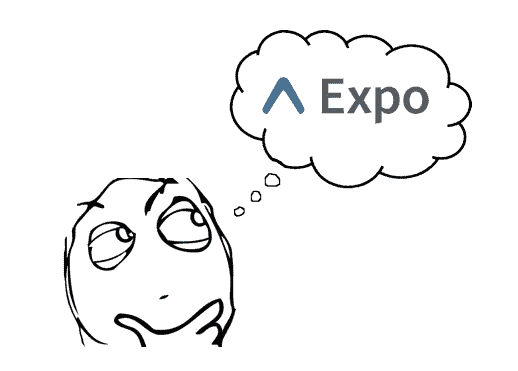
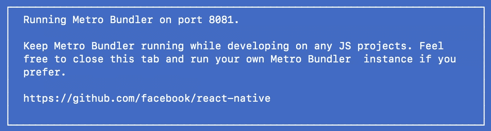

# 了解 React Native 世博会

> 原文：<https://medium.com/hackernoon/understanding-expo-for-react-native-7bf23054bbcd>



## 关于它的作用以及为什么它如此受欢迎的快速指南。

当创建一个新的 React 原生应用时，通常会考虑两种选择。利用博览会。或者不用 Expo。甚至官方反应本地[入门](https://facebook.github.io/react-native/docs/getting-started.html)文档也是这样描述的。

世博会变得异常受欢迎有几个原因:

1.  不需要苹果开发者账号(99 美元/年)也可以在真实设备上测试。这是通过他们在 Google Play 和应用商店中的免费 Expo 应用程序实现的。在世博 app 里面，你可以运行自己的 app。这不完全像在设备上安装应用程序，因为你实际上只是在 Expo 应用程序中。但还是挺酷的。
2.  Expo 处理一系列配置步骤来部署你的应用程序。许多学习 React Native 的人都不是来自移动开发背景，因此自己进行这种配置似乎令人生畏。
3.  Expo 有一个 SDK 来处理各种事情，如使用相机、加速度计、地图、位置跟踪、分析等。当然，这些特性中的大部分都可以使用开源包来实现，但是 Expo 在一个地方提供这么多这样的特性是很好的。

## 世博会如何运作

先别管世博会，让我们只讨论本土反应。

React 原生应用是运行一些 Javascript 的编译应用。每当您构建并运行 React 本地项目时，一个名为 [Metro](https://facebook.github.io/metro/) 的打包程序就会启动。您可能以前在您的终端中看到过这个输出，它让您知道打包程序正在运行。



打包者做一些事情:

1.  将您所有的 Javascript 代码合并到一个文件中，并翻译您的设备无法理解的任何 Javascript 代码(如 JSX 或一些较新的 JS 语法)。
2.  将资产(如 PNG 文件)转换成可由`Image`组件显示的对象。

当你不使用 Expo 时，你可以这样运行你的应用程序。

```
react-native start
```

但是对于 Expo，您可以像这样运行它(使用他们的 CLI 工具)。

```
exp start
```

这两个命令启动我们刚刚讨论过的同一个打包程序。不同的是`exp start`还启动了一个叫做 Expo 开发服务器的东西。该服务器运行一个进程，该进程获取由 React Native packager (Metro)创建的 Javascript 包，并在模拟器上的 Expo 应用程序中运行它。

## 通过 Expo 分发您的应用程序

有两种方法可以通过 Expo 分发您的应用程序。最简单的方法是让人们从 Google Play 或应用商店下载 Expo 应用程序。这个 Expo 应用程序可以在其中运行您的应用程序。它通过你提供的网址加载应用程序。您需要将您的 Javascript 代码推送到这个 URL 访问的远程位置。

```
exp publish
```

这样就可以了，还可以在终端中打印你的 URL。将该 URL 提供给其他人，以便他们可以将其输入 Expo 并运行您的应用程序。

在 Expo 应用程序中运行您的应用程序可以开始使用。但在某些时候，你会想把你的应用程序直接放到人们的设备上。比如放到 Hockeyapp 上分发给测试人员，或者放到 Google Play 或者 App Store 上。为此，你需要创建一个“独立的应用程序”。

独立应用是 Expo 对在 Expo 应用之外运行的应用的术语。这就像你从应用商店下载的应用程序一样。要创建 iOS 应用程序，您需要运行以下命令。

```
exp build:ios
```

最终产品是一个 IPA 文件，您可以提交给 Apple。对于 Android，你运行`exp build:android`并获得谷歌 Play 商店的 APK 文件。

创建独立应用程序时，Expo 将 Javascript 放在两个地方:

1.  IPA 或 APK 文件中包含一个本地副本。
2.  一份拷贝由亚马逊 Cloudfront(T4)远程托管，这是一个超快的 CDN。

当你的应用程序启动时，它会检查 CDN 中对你的 Javascript 的更改，如果有任何更改，就把它们删除。如果没有更改，它将使用本地副本。Expo SDK 26.0(2018 年 3 月发布)中发布了对该流程的大量[改进](https://docs.expo.io/versions/latest/guides/offline-support.html)。

## 更新你的应用

传统上，iOS 和 Android 应用在发布新版本时会重新提交到 Google Play 或 App Store。这包括创建一个新的 IPA 或 APK 文件，然后重新提交到相关商店。

然而，使用 Expo，您的 Javascript 代码是远程托管的，您的应用程序将下载对此远程 Javascript 的任何更改。因此，如果你的更新只是 Javascript 的变化，那么简单地重新发布它们。

```
exp publish
```

这通常被称为“空中”更新。请记住，并非所有更新都可以通过无线方式进行。例如，项目级别的设置(如应用程序的名称)并不存储在 Javascript 包中。所以如果你改变了它们，它们不会通过`exp publish`更新。要使用项目级别的更改更新您的应用程序，您需要生成一个新的 IPA/APK 文件，然后将您的应用程序重新提交到 Google Play 或 App Store。

## 世博会的缺点

当您通过 Expo 创建应用程序时，它会为您创建一个不包含 iOS 和 Android 项目文件的文件结构。但是有些特性要求你调整这些文件。一个例子是添加第三方推送通知库。为此，您必须在该项目文件中执行以下操作:

*   打开推送通知功能。
*   将推送通知库链接到你的应用包(这是`react-native link`可能会为你做的，取决于你正在实现的推送库)。

使用 Expo，您不能执行这些步骤，因为没有项目文件来执行它们。因此，这就是通向“脱离”世博会的道路。分离将产生这些项目文件，以便您可以配置它们。

从 Expo 分离时有两种选择。

1.  彻底清除 Expo。这给了你一个类似于用`react-native init`得到的项目。
2.  部分移除 Expo(通常称为 ExpoKit)。这允许你仍然使用 Expo SDK。您的 Javascript 继续通过`exp publish`远程托管和更新。

这两个选项都为您提供了 iOS 和 Android 项目文件，因此您可以自己配置它们。

## 概括起来

Expo 是快速入门 React Native 的一个很好的工具。然而，它并不总是能让你到达终点。在我看来，世博团队在产品路线图方面做出了很多重大决策。但是他们的快速发展经常导致新功能的缺陷。

我敢说许多有经验的 React 本地开发者并不使用 Expo。一旦您熟悉了自己配置项目和部署应用程序所需的所有步骤，Expo 的好处就会大打折扣。此外，如果你正在寻找一种方法来处理空中部署，微软的 CodePush 仍然是同类最佳的。

对于 React 本地开发人员来说，这是一个激动人心的时刻，Expo 无疑通过使其对新来者更加平易近人而增加了它的受欢迎程度。出于这个原因，我认为他们绝对应该得到他们所得到的赞誉。我期待着看到他们的产品随着时间的推移而发展。