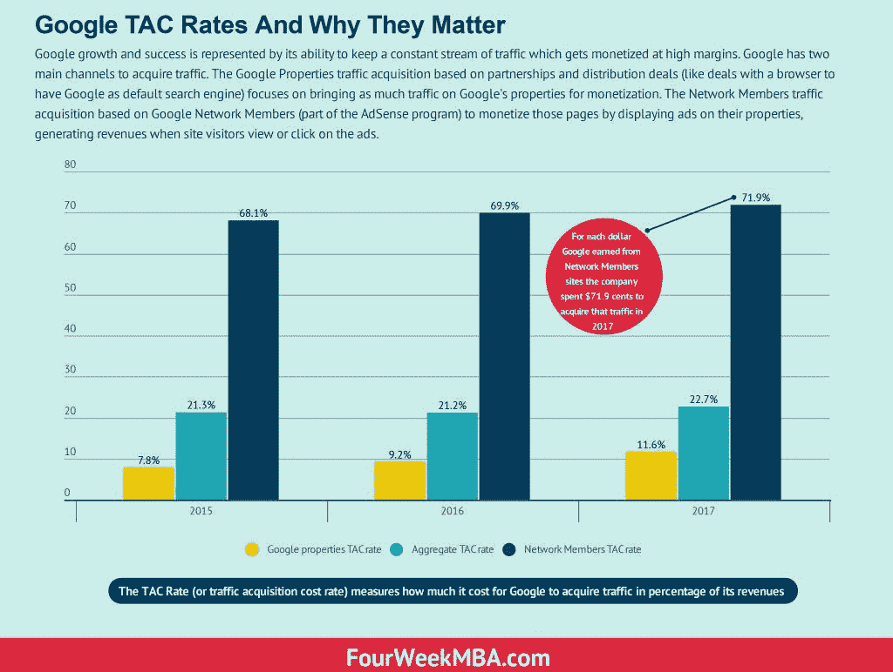
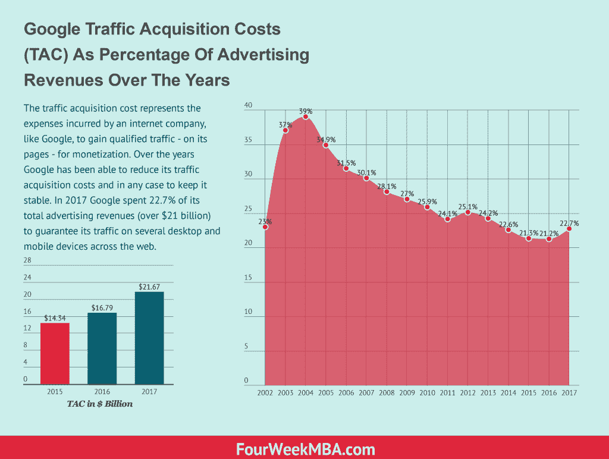

# 从谷歌的 TAC 率看其成本结构

> 原文：<https://medium.com/hackernoon/understanding-google-cost-structure-from-its-tac-rate-d79215f6f30e>

*TAC 代表流量获取成本，这是谷歌必须花费资源*在*上的比率，占其获取流量收入的百分比。事实上，TAC 比率显示了谷歌花费在获取页面流量上的收入百分比，并指出谷歌从其网络成员那里获得的流量。2017 年，谷歌对网络成员的 TAC 税率为 71.9%，而谷歌财产税率为 11.6%。*

# 为什么 TAC 费率对理解谷歌的成本结构很重要

谷歌的成长和成功体现在它保持持续流量的能力上，这种能力可以在高利润率下实现货币化。因此，它的成本结构——任何[商业模式](https://fourweekmba.com/what-is-a-business-model/)的关键要素——可以通过查看这个指标来理解。谷歌获取流量主要有两个渠道。

[基于合作和分销交易的谷歌地产流量获取](https://fourweekmba.com/google-business-strategy/)(类似于与浏览器的交易，将谷歌作为默认搜索引擎)专注于为谷歌地产带来尽可能多的流量以实现盈利。

网络成员流量获取基于[谷歌网络成员](https://fourweekmba.com/how-does-google-make-money/)(属于 [AdSense](https://fourweekmba.com/google-business-model/) 计划的一部分)通过在其属性上显示广告来赚钱，当网站访问者查看或点击广告时产生收入。

这些年来，谷歌在保持较低的流量获取成本方面做得很好，相比之下，它有能力从出售广告的页面中赚钱。TAC 率代表了谷歌为获得必要的流量以将其资产或网站网络部分(primis 中的 AdSense)货币化所花费的收入百分比。

2017 年谷歌总 TAC 率为 22.7%。虽然我们可以将总流量获取成本视为谷歌收入的一个百分比，但了解谷歌成本结构的更好方法是分别查看谷歌属性 TAC 费率和谷歌网络成员 TAC 费率。

# Google 属性 TAC 费率

谷歌成功的要素之一是其巨大的流量。谷歌也通过合作和分销协议获得了这一优势(比如与 Safari 的合作，让谷歌成为移动设备上的默认搜索引擎)。那交通可不便宜。谷歌为此支付了数十亿美元。

2017 年，谷歌房产 TAC 率为 11.6%。这意味着谷歌在交易和合作伙伴关系上花费了超过 90 亿美元，这使它能够以非常高的利润率和可持续的商业模式盈利。正如“[为什么谷歌的成功是其商业分销战略的成果](https://fourweekmba.com/google-business-strategy/)”中指出的，多年来，谷歌执行了一项积极而成功的分销战略，这使其能够控制搜索市场。谷歌成功的另一个方面是它的会员网络。

# 谷歌网络成员

> *屡获殊荣的谷歌搜索引擎的开发者谷歌今天宣布了一个新的谷歌 AdSense 自助服务选项，该计划使网站出版商能够提供精确针对其个人网页特定内容的广告。有了 Google AdSense，出版商在他们的网站上提供基于文本的 Google AdWords 广告，谷歌为这些广告的点击支付费用——用户从更相关的广告中受益，出版商可以最大限度地提高其网站的收入潜力。自助服务选项增强了谷歌在 2003 年 3 月宣布的现有内容定向服务，现在使这项服务可用于更广泛的高质量网站。*

2003 年 6 月，谷歌宣布推出 AdSense，这是一个网站网络，可以用最少的努力将其内容货币化，同时允许谷歌将用户在页面上的意图与广告匹配起来。正如谢尔盖·布林(Sergey Brin)当时指出的那样:“ *Google AdSense 通过将相关的、不显眼的文本广告引入网页，而不是破坏性的、不相关的广告，如弹出窗口和动画，改善了整体网络用户体验。*”他继续说道。*Google AdSense 为网站出版商提供了一种有效的方法来利用其网站上的内容页面赚钱，从而增强了网站内容创作的长期商业可行性。“这是谷歌可持续商业模式的另一个关键因素。*

来自谷歌网络成员(AdSense 的网站部分)的流量在 2017 年花费了谷歌超过 125 亿美元。这代表了 71.9%的 TAC 率。这意味着，谷歌在 2017 年通过网络会员网站赚取的每一美元，该公司必须向他们返还 71.9 美分。

与谷歌物业的成本结构相比，这种成本结构要昂贵得多。从长远来看，关注谷歌如何管理这一成本结构对于理解谷歌商业模式的可持续性至关重要。

# 关键外卖

理解谷歌[商业模式](https://fourweekmba.com/what-is-a-business-model/)可持续性的一个关键商业指标是其 TAC 率。这些代表了谷歌需要花费的收入百分比，以获得足够的流量来赚钱。谷歌利用合作伙伴关系和分销协议为其资产带来流量。这些合作伙伴关系和协议在 2017 年花费了谷歌超过 90 亿美元，或 11.6%的 TAC 率。

另一方面，谷歌花费了超过 125 亿美元(TAC 率为 71.9%)从其 AdSense 网络的部分站点获取流量，或作为与这些合作伙伴的收入分成，以将这些站点上显示的广告货币化。因此，2017 年每赚一美元，谷歌必须向这些合作伙伴返还 71.9 美分。总 TAC 率(包括谷歌资产和谷歌网络会员)为 22.7%。

密切关注谷歌的 TAC 率可以让你了解它的成本结构是如何演变的，以及它的商业模式是如何变化的。

*原载于 2018 年 11 月 1 日*[*fourweekmba.com*](https://fourweekmba.com/what-is-google-tac/)*。*