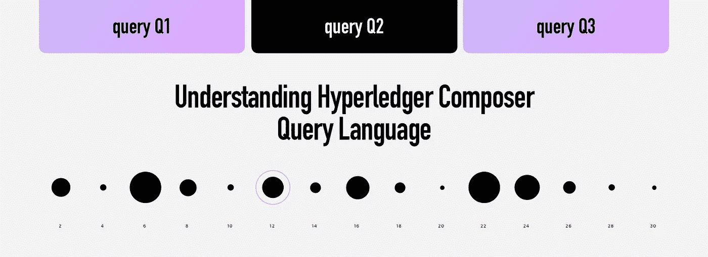

# 了解 Hyperledger Composer 查询语言

> 原文：<https://medium.com/hackernoon/understanding-hyperledger-composer-query-language-541bb1c48f95>

[Hyperledger Composer](https://hackernoon.com/tagged/hyperledger-composer) 是一款非常受欢迎的[区块链](https://hackernoon.com/tagged/blockchain)应用开发，受欢迎主要是因为它的易用性。了解更多。



其中一个关键组件是类似 SQL 语言的查询语言。在本文中，我将介绍如何为您的区块链应用程序构建查询。

> *在当前版本的 Hyperledger Fabric 中，不支持限制和跳过，在 Composer 中也是如此。*

# 数据模型

对于这个例子，我将考虑下面的数据模型作为我们的应用程序的数据模型。

```
enum UserRole {
  o ADMIN
  o MODERATOR
  o USER
}
participant User identified by id {
  o String id
  o String name
  o UserRole role
  o String[] hobbies
  --> Organization organization
}participant Organization identified by id {
  o String id
  o String name
}asset Product identified by id {
  o String id
  o String name
  o String description
  o Double quantity
  o DateTime createdAt
  --> Organization owner
}
```

# 问题

**根据角色获取用户。**为了获得基于角色的用户列表，我们可以使用 where 过滤器

```
query Q1 {
    description: "Select all users based on role"
    statement:
        SELECT org.acme.User
            WHERE (role == "ADMIN")
}
```

你也可以从下面的参数中给出数值

```
query Q1 {
    description: "Select all users based on role"
    statement:
        SELECT org.acme.User
            WHERE (role == _$role)
}
```

**根据组织获取用户**要根据相关或关联文件获取节点，您可以使用以下类型的 where

```
query Q2 {
    description: "Select all users of an organization"
    statement:
        SELECT org.acme.User
            WHERE (organization == "resource:org.acme.Organization#1")
}
```

**获取数量超过最小阈值的产品**我们可以在整数或双精度值中使用大于或小于运算符，如下所示。

```
query Q3 {
    description: "Select all products above the minimum quantity"
    statement:
        SELECT org.acme.Product
            WHERE (quantity > _$minimumThreshold)
}
```

**使用 AND 运算符**

```
query Q4 {
    description: "Select all products above the minimum quantity of an organization"
    statement:
        SELECT org.acme.Product
            WHERE ((quantity > _$minimumThreshold) AND (owner == _$organization))
}
```

**操作员使用订单**

```
query Q5 {
    description: "Select all products above the minimum quantity of an organization and order by quantity"
    statement:
        SELECT org.acme.Product
            WHERE ((quantity > _$minimumThreshold) AND (owner == _$organization))
                ORDER BY quantity
}
```

**使用包含运算符**

```
query Q6 {
    description: "Select all users based on givien hobbies"
    statement:
        SELECT org.acme.User
            WHERE (hobbies CONTAINS ['driving', 'swimming']
}
```

大多数情况下，你可以用上面提到的操作符完成所有的查询，而且我认为将来会有更复杂的查询。

[](https://www.skcript.com/blockchain/?hackernoon)