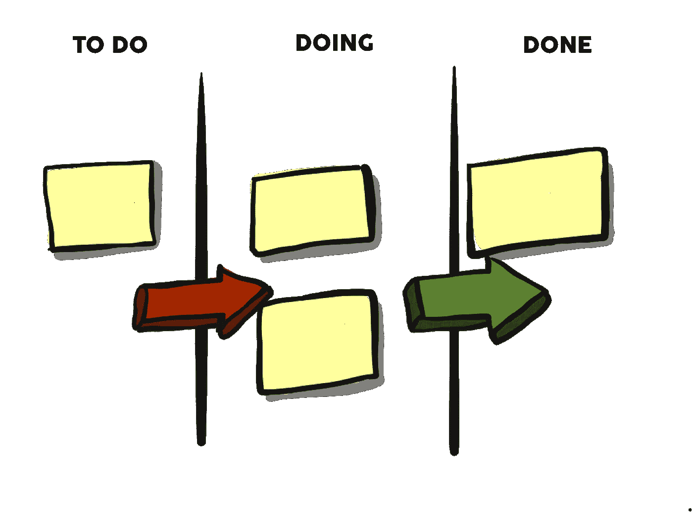
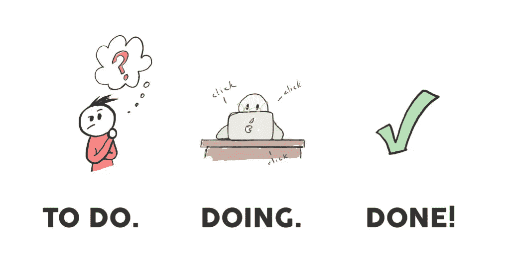
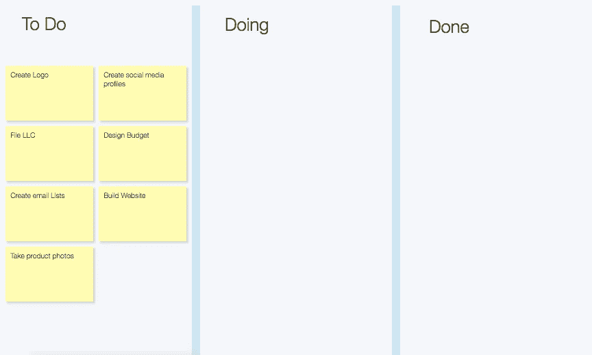
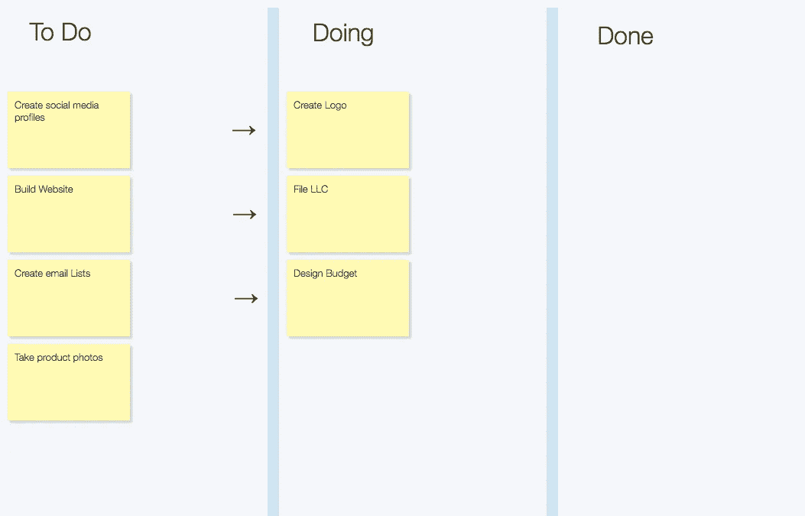
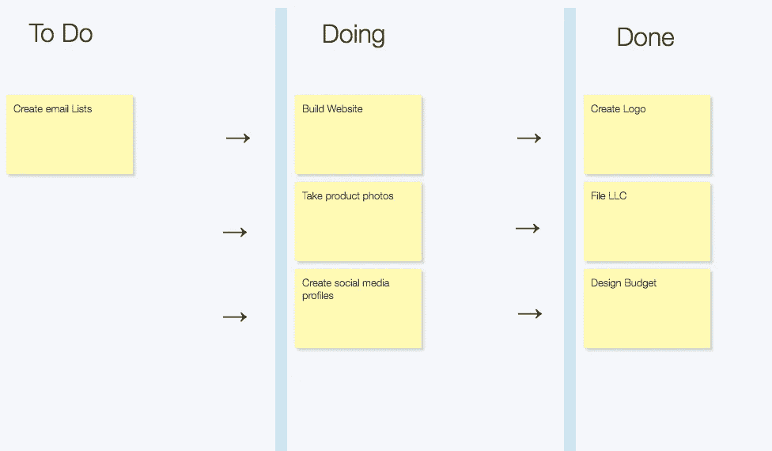

# 了解看板及其如何提高生产率

> 原文：<https://medium.com/hackernoon/understanding-kanban-and-how-it-can-increase-productivity-db8f66d427a3>

在日语中, **Kanban** 的意思是招牌，或者更容易辨认的——广告牌。

在生产力、商业和设计领域，它是一个由 3 部分组成的调度系统:

*那么重点是什么呢？*

看板是区分优先次序和跟踪手头任务的最简单的方法之一。它创建了两个结构:可视化手头的任务和控制工作进度。

多任务处理会降低生产率，看板可以防止你的“正在做的”任务过于拥挤，让你只专注于手头的任务。

它允许一个快速的视觉创造一个清晰和简洁的方式来管理您的任务。不仅仅是商业任务，还有个人任务。有这么多的任务，通常没有太多的时间，看板可以帮助你组织一切，希望让你更有效率。

# 不熟悉一个人长什么样？看看这个例子，看看初创企业如何打造品牌和扩大业务规模:

它就是这样工作的。从必须完成的头脑风暴任务开始。尽可能多地列出你需要完成的任务，并把它们放在**“待办事项”**部分。

如果你注意到，任务的数量和它们的区别可以是多种多样的。重要的是要有一种方法来管理任务，并能够在你履行发展业务的义务时将它们可视化。

当你列出你的**“待办事项”**时，清楚地了解需要最多时间的任务以及最紧急的任务是很重要的。挑选你想什么时候开始项目，并把它们推进到**“做”**部分。

## 见下文:

当你完成任务后，把卡片推到**“完成”**栏来奖励自己。完成任务后，您可以继续向**“待办事项”**中添加新的内容。您可以将任务更新到**“正在做”**部分，无论需要添加什么。随着时间的推移，**“完成”**部分和**“待办事项”**部分逐渐减少，允许**“完成”**部分提供清晰的思路。

看板时代已经一去不复返了。这样可以确保最重要的事情先完成，在减少压力的同时提高注意力。试用我们的新看板模板，重新掌控您的日程安排！

考虑用看板来提高生产力？看看 cardboardit.com，今天就报名参加 30 天免费试用！

在社交媒体上找到我们！

[脸书](https://www.facebook.com/cardboardit/)、[推特](https://twitter.com/CardBoardIt)、[领英](https://www.linkedin.com/company/cardboardit/)

*原载于 2018 年 10 月 31 日*[*cardboardit.com*](https://bit.ly/2PIWYlF)*。*