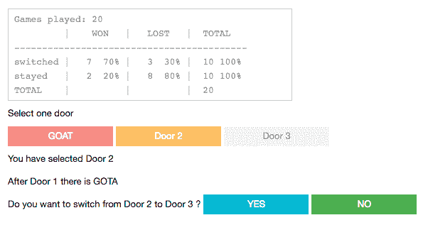

# 用黑客统计数据理解 Monty Hall 困境

> 原文：<https://medium.com/hackernoon/understanding-monty-hall-dilemma-with-hacker-statistics-b87afae85d2f>

**发布于:**2018 年 9 月 1 日

在[黑客](https://hackernoon.com/tagged/hacker)统计的帮助下，将提供证据证明**在《天魔厅》游戏中你应该总是换门**，因为你正在加倍(从 33%到 66%)你的成功率。

# 什么是黑客统计？

在黑客统计中，你**运行模拟来计算某个事件**的概率。

比如抛硬币游戏的**概率是 50%正面，50%反面**。

为了便于讨论，让我们假设你不相信它。

相信我，有些人不相信。

你**可以计算概率**，计算后你会得到 50%的正面和 50%的反面。

但是你仍然不相信或者你认为你的计算可能是错误的。

然后你可以**在实践中检验一下**。

掷硬币 100 次(甚至 100 万次),将正面数除以掷硬币的次数，计算出正面的概率。

如你所见，**这是非常耗时的**，尤其是如果你想再次运行实验的话。

手动抛硬币的另一种选择是[编写一个计算机程序](https://github.com/sasa-buklijas/coin_toss)，它将[运行模拟并计算概率](https://mybinder.org/v2/gh/sasa-buklijas/coin_toss/master?urlpath=apps%2Fcoin_toss_interactive.ipynb)。

这是一个更明智的方法，因为你可以多次运行它，而且速度更快(一台普通的计算机每秒可以进行数百万次抛硬币模拟)。

# 蒙蒂霍尔游戏

几年前在电影 [21](https://www.imdb.com/title/tt0478087/) 中听说过天魔堂游戏。

这是电影《21》中蒙蒂·霍尔描述的场景。

基本想法是**你有 3 扇门**，在**的后面一扇门是一辆汽车，在另外两扇门的后面是一只山羊**。

你只能选择三门中的一门。

如果你选择一扇有汽车的门，你会得到一辆汽车；如果你选择一扇有山羊的门，你什么也得不到(甚至连山羊也没有)。

游戏的**目标是选择一个有汽车的门，但是你不知道汽车在哪个门的后面**。

所以你选择一扇门，你成功的概率是 33%。

# 蒙蒂·霍尔困境

**当你选择了一扇门后，游戏主机会打开另外两扇门中的一扇门，山羊就会出现**。

困境如下:**换门符合你的利益吗？**

重要的是要明白，**游戏主机总是会打开一扇门，那里有一只山羊**。

每一次，即使你选择了一扇有奖品的门，或者你没有选择，也会这样做。

如果游戏主持人只是在你选择有奖品的那扇门时打开了另一扇门，那么最好的解决办法就是不要开关那扇门。

如果当你选择了有山羊的那扇门时，游戏主持人只是打开了另一扇门，那么最好的解决办法就是对门。

重点是每次游戏主持人都会打开另一扇门，里面是一只山羊。

谜题的答案是**如果你换门，你将有 66%的机会获胜**。

这个**对我的理解**是违反直觉的。

我能理解的最好解释是我在 https://www.youtube.com/watch?v=4Lb-6rxZxx0 找到的。

# 带黑客统计的 Monty Hall 解决方案

虽然我理解了数学和逻辑，为什么开关门提供了 66%的获胜概率，**我仍然不相信这是正确的**。

所以我决定让[电脑程序模拟游戏](https://github.com/sasa-buklijas/Monty_Hall_problem)和**一劳永逸地解决这个难题**。

我**做了两次模拟，每次一百万次迭代**。

第一次模拟计算的是如果你没有换门的话获胜的概率。

不出意外，概率是 33%。

第二次模拟计算了如果你真的换了门的话获胜的概率。

当时令我吃惊是，模拟推挤如果你开关门，赢的概率真的是 66%。

令我难以置信的是，我试了几十次，但每次成功的概率都是 66%。

我理解它背后的数学，我做了证明数学的模拟，但我仍然很难接受开关门是正确的，因为它违反了我自己的直觉(错误的)原因。

有趣的是，我需要几周时间来接受我自己模拟的结果。

# 蒙蒂·霍尔的一些有趣的事实

维基百科上关于[蒙蒂霍尔](https://en.wikipedia.org/wiki/Monty_Hall_problem)的条目非常广泛。

可以找到很多有趣的事实。

即使是专家也很难理解:
“这个问题出现在《Parade》之后，大约有 10，000 名读者，其中包括近 1，000 名博士，写信给该杂志，他们中的大多数人声称 vos Savant 是错误的(Tierney 1991)。即使给出了解释、模拟和正式的数学证明，许多人仍然不接受转换是最佳策略(vos Savant 1991a)。历史上最多产的数学家之一保罗·erdős 一直不相信，直到他看到了展示预测结果的计算机模拟。

一个惊人的句子是
“反复暴露在这个问题下的鸽子表明，它们很快学会了总是转换，不像人类”

**鸽子比人聪明吗**？

# 互动蒙蒂大厅游戏

如果你仍然不相信换门是最好的策略，你可以[在线玩](https://mybinder.org/v2/gh/sasa-buklijas/Monty_Hall_problem/master?urlpath=apps%2FMonty_Hall_Interactive.ipynb)。

只是不要切换标签，您将需要等待几分钟。

# 结论

在 Monty Hall 游戏中，你应该经常换门，因为你的成功率会翻倍(从 33%到 66%)。

*原载于 2018 年 9 月 1 日*[*buklijas . info*](http://buklijas.info/blog/2018/09/01/understanding-monty-hall-dilemma-with-hacker-statistics/)*。*