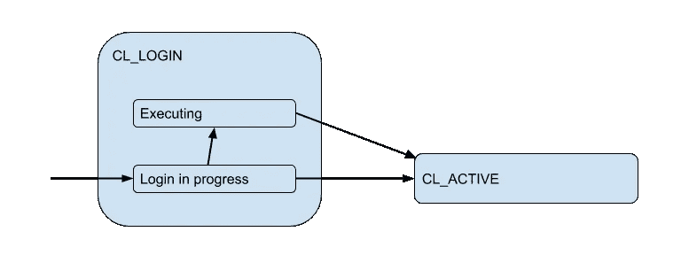

# 使用 PgBouncer 了解 Postgres 连接池

> 原文：<https://medium.com/hackernoon/understanding-postgres-connection-pooling-with-pgbouncer-unlisted-draft-bdb7ebf073ab>

# PgBouncer 内部

[PgBouncer](https://hackernoon.com/tagged/pgbouncer) 是 Postgres 的连接池[服务](https://hackernoon.com/tagged/service)。它有各种内部限制和有限的资源。从客户的角度来看，比如说，从某个网络应用的角度来看，它是这样的:

1.  客户端连接到 PbBouncer。
2.  客户端发出 SQL 请求/查询/事务
3.  得到响应。
4.  根据需要多次重复步骤 2-3。

这是客户端的连接状态图:

在登录阶段/状态(`CL_`代表`client`)期间，Pgbouncer 可能会基于一些本地信息(如 auth_file、证书、PAM 或 hba 文件)或以远程方式授权一个客户端—通过[数据库](https://hackernoon.com/tagged/database)中的`auth_query`。因此，登录时的客户端连接可能需要并正在执行查询。让我们显示为`Executing`子状态:

但是`CL_ACTIVE`查询也可能实际执行一些查询，因此通过 PgBouncer 链接到实际的[数据库](https://hackernoon.com/tagged/database)服务器连接，或者空闲，什么也不做。这种客户端和服务器连接的链接/匹配是 PgBouncer 存在的全部理由。PgBouncer 仅在一段时间内将这些客户端与服务器链接，这取决于`pool_mode`——针对一个会话、一个事务或仅仅一个请求。

> 由于事务池是最常见的，我们将在本文的其余部分假设它

因此，处于`cl_active`状态的客户端实际上可能链接到也可能不链接到服务器连接。为了说明这一点，我们将这个状态一分为二:`active`和`active-linked/executing`。这是一张新的图表:

客户机链接到的这些服务器连接被“汇集”——数量有限并可重复使用。因此，当客户端发送一些请求(开始一个事务或执行一个查询)时，可能会出现相应的服务器连接池被耗尽的情况，即 pgbouncer 打开了它所允许的尽可能多的连接，并且所有这些连接都被一些其他客户端占用(链接到)的情况。这个场景中的 PgBouncer 将客户机放入一个队列，这个客户机的连接进入一个`CL_WAITING`状态。当客户端仅登录时，这也可能发生，因此也有`CL_WAITING_LOGIN`用于此:

另一端是这些服务器连接:从 PgBouncer 到实际的数据库。那些有尊重的状态:`SV_LOGIN`当授权时，`SV_ACTIVE`当它与客户端的连接链接时(并且被使用或不被使用)，或者如果它是免费的— `SV_IDLE`。

PgBouncer 有一个管理界面，通过连接到一个名为`pgbouncer`的特殊“虚拟”数据库。其中有许多`SHOW`命令，其中一个命令`SHOW POOLS` 将显示每个池在每个状态下的连接数:

我们在这里看到 4 个客户端的连接都打开了，它们都是— `cl_active`。和 5 个服务器连接:4 — `sv_active`一个在`sv_used`中。这里有一篇关于如何监控这些状态的精彩文章。但基本上，你会希望以任何监控方式跟踪它们，这样你就有了历史画面。

# 库大小

没那么简单，PgBouncer 有 **5 个不同的设置**与限制连接数有关！

*   您可以为每个代理数据库指定`pool_size`。如果未设置，则默认为`default_pool_size`设置，同样默认为`20`值。
*   `max_db_connections`非常适合解决这个问题——它限制了到任何数据库的连接总数，因此表现不佳的客户端将无法创建太多 Postgres 后端。
*   `reserve_pool_size` —是对额外保留池的限制，如果常规池耗尽，即存在`pool_size`打开的服务器连接，则保留池将发挥作用。据我所知，它旨在帮助服务一批客户。
*   `max_user_connections` —这限制了从一个用户到任何数据库的连接总数*。从我的角度来看，这是一个非常奇怪的限制，只有在相同用户的多个数据库的情况下才有意义。*
*   `max_client_conn` —限制传入客户端连接的总数。它与`max_user_connections`不同，因为它包括来自任何用户的连接。

除了`SHOW POOLS`之外，Pgbouncer 的管理界面数据库也有`SHOW DATABASES`命令，显示实际应用的限制以及所有已配置和当前存在的池:

因此用`current_connections`除以`pool_size`将得到池利用率，因此如果它接近 100%，您就可以触发警报。

PgBouncer 还提供了`SHOW STATS`命令，该命令提供了每个代理数据库的请求和流量的统计数据(据我所知，这不是一个惊喜):

在这里，为了测量池利用率，我们最感兴趣的是`total_query_time`——当*主动连接到 PostgreSQL，执行查询*时，pgbouncer 花费的总微秒数。将此除以相应的池大小(将池大小视为一个挂钟秒内所有服务器连接可能花费在服务查询上的总秒数)，我们得到池利用率的另一个度量/估计值，我们称之为“查询时间利用率”。

这是我写的关于[用 ans RED 监控方法监控 PgBouncer 的文章。](https://blog.okmeter.io/use-red-and-real-world-pgbouncer-monitoring-61b34ebeebb8)

# 为什么仅仅观察利用率是不够的，还需要饱和度指标？

问题是，即使有像`total_query_time`这样的累积统计数据，当我们查看统计数据时，也无法判断两个时刻之间是否有短时间的高利用率。例如，您将一些 cron 作业配置为同时启动并对数据库进行一些查询。如果这些查询足够短，即短于统计数据收集周期，那么测得的利用率可能仍然很低，而在 crons 启动时，它们可能会耗尽池。但是，如果只看利用率指标，您将无法做出诊断。

我们如何在 PgBouncer 上追踪它？一种简单(且天真)的方法是在我们讨论过的`cl_waiting`状态下计算`SHOW POOLS`输出中的客户端。在正常情况下你不会看到它们，而看到等待的客户端数量大于 0 意味着池饱和。

但是如你所知，你只能采样`SHOW POOLS`，这导致了错过这种等待的可能性。

查看我关于 [Postgres 和监控](https://blog.okmeter.io/postgres/home)的其他文章。