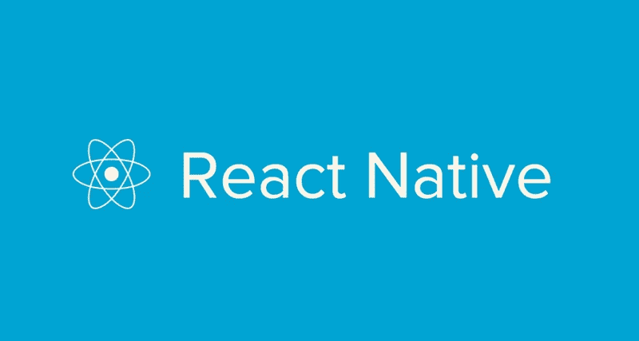
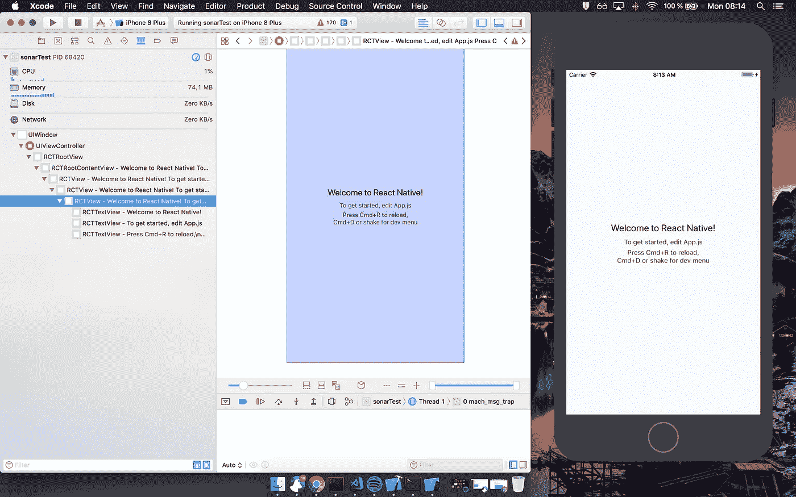
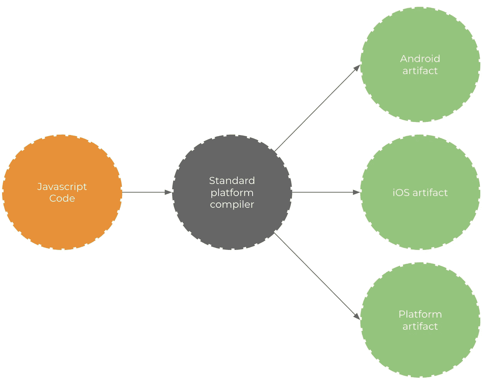
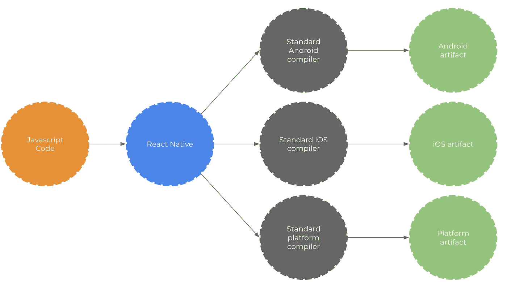
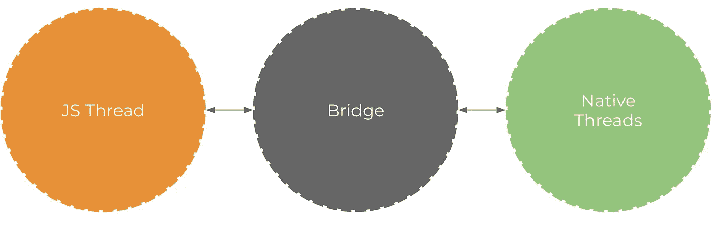
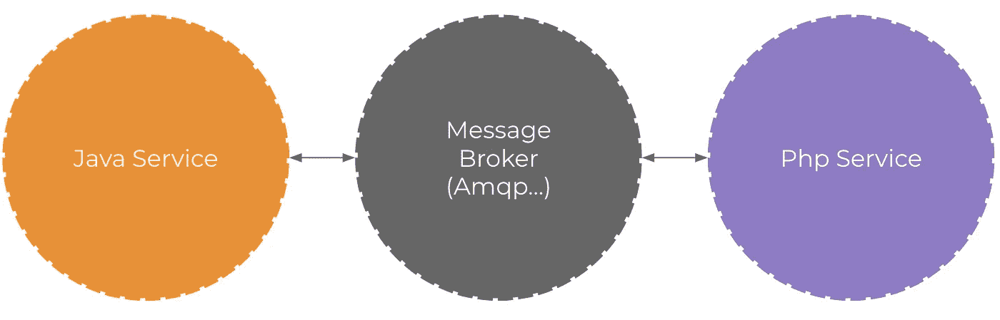
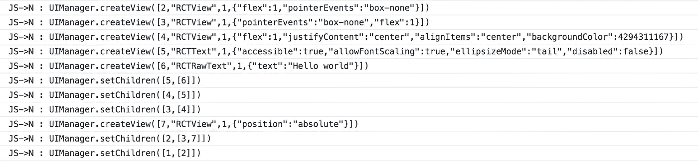
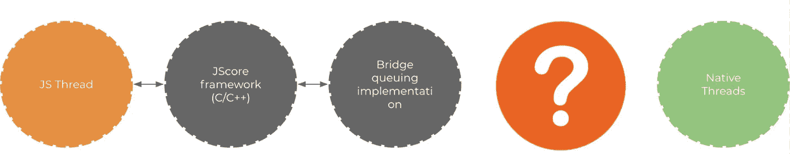
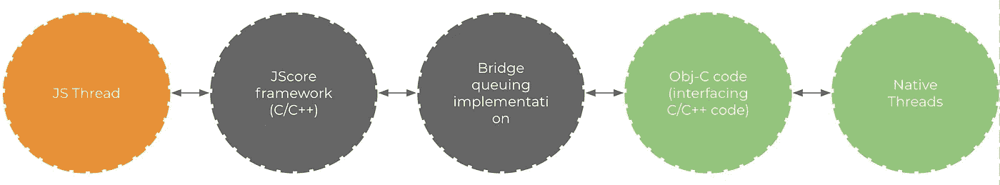
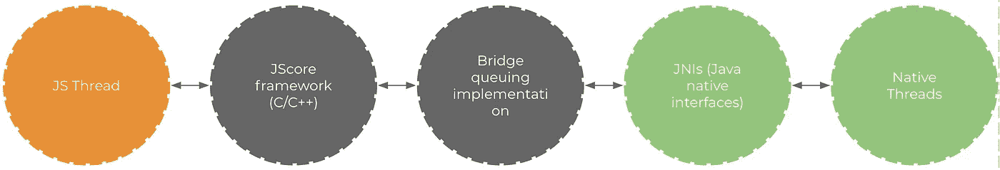

# 了解 React 本机桥的概念

> 原文：<https://medium.com/hackernoon/understanding-react-native-bridge-concept-e9526066ddb8>

以及为什么它的建筑是一流的。

React Native 通常被描述为一个游戏改变者，它允许在移动环境中运行 JavaScript 代码。它的主要优势在于，它不像其他竞争对手( [Phonegap](https://phonegap.com/) 、 [Ionic](https://ionicframework.com/) 、[Cordova](https://cordova.apache.org/)……)那样依赖 [webviews](https://developer.telerik.com/featured/what-is-a-webview/) ，而是依赖于不同平台提供的实际真实素材。默认情况下，它内置了对所有本地视图和组件的访问，以及对大约 70 个特定设备 API 的访问([您可以扩展它](https://facebook.github.io/react-native/docs/native-modules-ios.html))。

编写 React 原生应用时，我们构建原生 ui。这是关键点，我们创建`UIView`实例，就像我们使用特定于平台的语言一样:

[RCTView implements UIView](https://github.com/facebook/react-native/blob/master/React/Views/RCTView.h#L19)

我对这个框架的第一个假设是这样的:

> 他们可能会从 JS 代码中创建一个 [AST](/@jotadeveloper/abstract-syntax-trees-on-javascript-534e33361fc7) ，并对其进行转换，使其可以在多种设备上运行。

这将是有意义的，这实际上是 G [oogle/Flutter](https://docs.google.com/presentation/d/1cw7A4HbvM_Abv320rVgPVGiUP2msVs7tfGbkgdrTy0I/edit) 在构建应用程序时所做的事情(使用 [Dartlang](https://www.dartlang.org/) )。但这不是当地人的反应方式。

这种方法的主要问题是针对基于 JavaScript 代码的编译平台意味着创建新的编译器。我不知道任何现有的工具接受 JavaScript 作为入口代码，能够为每个目标平台生成代码。

NB: some have tried but only for mobile development with opinionated approaches

但是目前存在的是针对它们自己的特定平台的编译器。例如，我们有接受 Java / Kotlin 代码并以 Android 平台为目标的编译器，或以 iOS 平台为目标的 Obj-C / Swift。它有许多针对不同语言和目标的编译器。他们工作出色，因为**他们被设计为**为他们创造优化的人工制品。

React Native 的构建方式是**使用现有的编译器:**

它采用真正开放的架构构建，不仅允许代码在移动设备上运行，还允许在其他平台上运行:

*   [桌面应用](https://github.com/kusti8/proton-native)
*   [虚拟现实](https://facebook.github.io/react-360/)
*   [更多更](https://news.ycombinator.com/item?id=16198843)

它也可以与其他框架一起使用:

*   [Weex](https://github.com/alibaba/weex) ，一个 [Vuejs](https://github.com/vuejs/vue) 的 React 原生端口。
*   一个定制的[角度渲染器，允许在设备中运行 ng 应用，带有 React Native](https://github.com/angular/react-native-renderer) 。

那么这个团队是如何通过使用现有的工具和编译器来构建这样一个平台和框架不可知的框架的呢？

# 多个领域相互作用，仅此而已

让我们退一步，看看 React Native 的大图。

React Native 涉及两个领域，JavaScript 领域和原生领域。他们都能够共享信息。它们使用“桥”进行通信，这无疑是 React 原生架构的核心，提供了如此多的灵活性。

桥的概念是为这两个世界之间的双向和异步通信提供一种方式。这里重要的是，它们完全是用不同的技术编写的，但是**它们能够通信。**

JS threads communicates with the native ones through the bridge

# 记住你的后端

让我们回忆一下我们用多服务通信编写分布式后端应用程序的时候。

我们如何管理两个在语言/平台层面上完全不同的服务之间的通信？

我们使用可互操作的语言，如 JSON 或 XML，我们依赖异步协议，如 AMQP(或任何其他协议)。

Bidirectional communications between heterogeneous services

如果我们希望这两个服务进行通信，我们依赖于消息队列。第一个服务将一些命令推入队列，另一个服务必须在可能的时候执行这些命令*。*

*React Native 的行为方式相同。JavaScript 领域发送异步 JSON 消息，描述本机部分应该完成的动作。*

*例如，JavaScript 端将发送关于必须由本机端创建的视图的信息。当本地端准备好时，它将有效地创建视图:*

**

*JavaScript sends commands asynchronously to the Native side for view management, with JSON*

*在 React Native 中，桥支持消息代理角色，处理两个不同世界之间的异步命令。*

*它提供了多种可能性:*

*   *因为它是异步的，所以它是非阻塞的，因此允许在屏幕上进行平滑的视图管理(大约 6O fps 是 React 本机的黄金目标)*
*   *由于它是解耦的，并且基于可互操作的语言，它对其他框架和渲染系统**非常开放，只要它们尊重 React 本地桥命令接口***

*桥的语言越是无处不在，越是通用，可能性就越多……而它**的确是**！*

# *桥接实现*

*[这个桥是用 C/C++构建的，因此可以在多种平台、操作系统等上运行...](https://github.com/facebook/react-native/blob/81860c59c3453429bb4e70da2c372c92e66e134c/ReactCommon/cxxreact/NativeToJsBridge.cpp#L29)*

*它将 [Apple JavaScriptCore 框架](https://developer.apple.com/documentation/javascriptcore)嵌入其中，公开 API 以访问实际的 JavacriptCore VM 功能。很多人在 Obj-C 和 Swift 世界上使用这些 API。但是有一个 C API，Obj-C 那个其实只是一个包装器。*

*考虑到这一点，JavaScript 代码可以在 C/C++程序中运行。它可以注入变量、函数和声明全局变量来增强 JavaScript 现有代码。React Native 依靠这种魔力使 JavaScript 与本地世界通信，从而[触发 C/C++世界中的动作。](https://github.com/facebook/react-native/blob/52f431b4bb29062abd8ce20e01a4e60b47151a80/Libraries/BatchedBridge/MessageQueue.js#L254)*

**在 JavaScript 代码中注入东西也意味着函数可以由 C/C++代码执行。**

*这个图表快速总结了 JavaScript 世界如何处理 C/C++世界:*

**

*The JS code is managed by the JSCore framework*

# *本土的一面*

*原生端的通信是“最容易”的部分。*

*先说 iOS 平台。由于 Obj-C 是 C 语言的扩展，所以它可以与 C 语言进行本地通信。这样，桥梁和 Swift / Obj-C 世界之间的交流就变得简单而自然。*

**

*High level diagram of JS interacting with iOS world*

*在 Android 上，我们需要依靠 [Java 本地接口](https://docs.oracle.com/javase/8/docs/technotes/guides/jni/)来与桥对话。*

**

*High level diagram of JS interacting with Android world*

*这里有一个旧的，但非常棒和深刻的帖子，解释了桥是如何在 iOS 上实现的[，作者是塔德乌·扎加洛](https://tadeuzagallo.com/blog/react-native-bridge/)。*

**如果您对 React Native internals 还有其他问题，请告诉我。我会尽力提供我所知道的关于这个话题的一切。**

*感谢我的朋友@ Zenika 和@M6Web 的评论！*