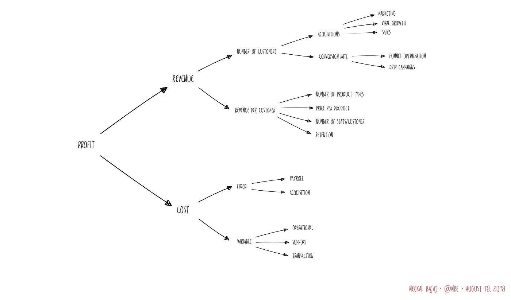

# 了解 SaaS 的商业

> 原文：<https://medium.com/hackernoon/understanding-the-business-of-saas-a947404ff36e>

软件即服务(SaaS)是一种优雅的商业模式。一旦你制造了产品，你就可以把它卖给任何数量的客户。唯一需要的改变是对配置的细微调整。SaaS 企业通过收取经常性费用来运作。在每个计费周期，我们需要重新赢得客户的信任，在我们和我们服务的客户之间建立强大的利益联盟。

对客户来说，SaaS 就是管用。他们不需要安装任何东西，支付更少的经常性费用在资产负债表上更容易接受。对我们来说，有两个好处。首先，有经常性收入使我们的财务可预测。其次，它减少了开发开销，因为新产品可以同时向所有客户推出。

为了理解 SaaS 的业务，让我们来解构一下控制它的杠杆。



在财务上，企业的目标是提高盈利能力，其中:

> ***利润*** *=收入—成本*

我们有两种方法可以增加利润。我们要么增加收入，要么降低成本。

# 收入

对于 SaaS 企业，收入可以建模为:

> ***收入*** *=客户数量*收入/客户*

或者更完全地说，

> ***收入*** *=客户数量*产品类型数量*每种产品类型价格*席位数量/客户*留存率*

为了增加收入，我们控制以下杠杆:

## 售出的产品类型数量

有两种方法可以增加我们销售给客户的产品种类:

1.  **打造更多产品。更有效但成本更高的方法是开发新的产品线来销售。例如，在 Benchling，我们建立了新的产品线，如工作流和请求，这扩大了可供购买的产品集。同样，Atlassian 允许你购买吉拉和合流作为单独的产品。**
2.  **细分现有产品线。**通过门控功能创建吸引不同细分市场的层级。例如，在 Benchling，我们可以向收集结构化数据的目标团队收取比基本笔记本产品更高的费用。销售只读许可证使我们能够接触到客户通常不愿购买的座位。

## 每种产品类型的价格

增加收入最简单的方法是提高每个产品线的价格。只要市场愿意支付更多，通过提高价格来增加收入就不需要开发。在理想世界中，我们有完美的价格不弹性，也就是说，我们可以提高价格而不损失任何顾客。只有当我们的产品提供无人能比的独特价值时，这种情况才会发生。为了计算出我们能给产品定价多高，我们通过一些策略对 SaaS 的定价进行了三角分析。

1.  **基于价值的定价。**了解我们增加了什么价值，并获取该价值的一部分。
2.  **竞争性定价。**看看别人对同类产品的收费。
3.  **实验性定价。尝试提高价格以衡量其对需求的影响。**

## 每个客户的座位数

增加席位的一套非详尽战略:

1.  **赋权传道者。给你的拥护者说服他人的工具。提供培训课程、支持、帮助文章访问和特殊功能。**
2.  **默认放任。大多数公司担心人们不付费就使用他们的软件。企业软件中更大的挑战是首先让人们使用你的产品。不要限制对功能的访问，而是默认启用它们并监控使用情况。如果人们开始使用他们没有付费的功能，在几个周期之后，他们会提出延长合同或在之后取消这些功能。如果人们已经花时间训练自己并收集数据，他们不太可能放弃支付升级费用。**
3.  **支持扩展性。人们很少只用一种工具工作。通过支持集成或更简单的方式从平台中共享，建立让他们与其他产品协作的桥梁。例如，Slack 应用程序集成了大量的商业应用程序，增强了它的实用性。**

## 保留

留存是对已完成支付周期数量的衡量。当其他人在提供价值方面做得更好时，客户就会流失。竞争对手需要创造一个有说服力的主张，说服我们的客户克服惰性、培训和迁移成本。失去一个客户意味着我们没有倾听。

为了确保顾客留下来，SaaS 企业需要一个顾客成功(CS)团队。cs 用来提高忠诚度的策略是:

1.  **培训用户。**不仅教授软件的功能，还教授变通方法。
2.  **有求必应。确保人们在遇到困难时知道如何获得及时的帮助。**
3.  **与产品团队分享反馈。**作为第一个了解客户痛点的团队，CS 在与产品团队分享反馈方面处于独特的地位，可以告诉他们人们在做什么、他们的困难以及问题的严重性。

## 客户数量

客户数量可以建模为

> *客户数量=收购量*转化率*

我们拥有的杠杆要么是增加通过大门进入的潜在客户数量，要么是提高我们将他们转化为付费客户的成功率。

## 费用

SaaS 企业的关键成本大致可分为:

1.  **开发:**工程师、设计师和产品开发团队其他成员的工资成本。对于 SaaS 企业来说，这往往是最大的开支之一。例如，一个由 10 名工程师组成的团队为一个产品工作一年很容易就需要 120 万美元。
2.  **支持:**在培训和支持客户上投入的时间。
3.  **运营:**运营业务需要支付给 AWS 的服务器、存储等成本。
4.  **交易:**支付给供应商的费用，如支付给信用卡处理商的费用等。

# 财务模型

SaaS 企业的核心论点是，成本大致呈线性增长，而收入呈指数增长。为了看到它的实际应用，让我们创建一个非常简单的业务模型:


收入在哪里:

```
Revenue = Number of product lines 
          * Avg price per product line 
          * Number of customers * (1 + customer growth) ^ n 
          * Avg # of seats/customer * (1 + upsell rate) ^ n
          - Previous payment cycle revenue * Churn rate
```

成本是

```
Cost = (Operational cost of deploy * Number of customers)
       + (Avg annual salary * (Number of engineers + New engineers/year * n))
       - (Transaction fee * Gross Revenue)
```

当我们开始亏损时，经过一段时间后，我们会看到令人难以置信的诱人回报。


随着时间的推移，绘制累积值的图表，我们得到:


了解起作用的杠杆使我们能够诊断问题并推动结果。你发现哪些杠杆对管理你的 SaaS 业务有影响？