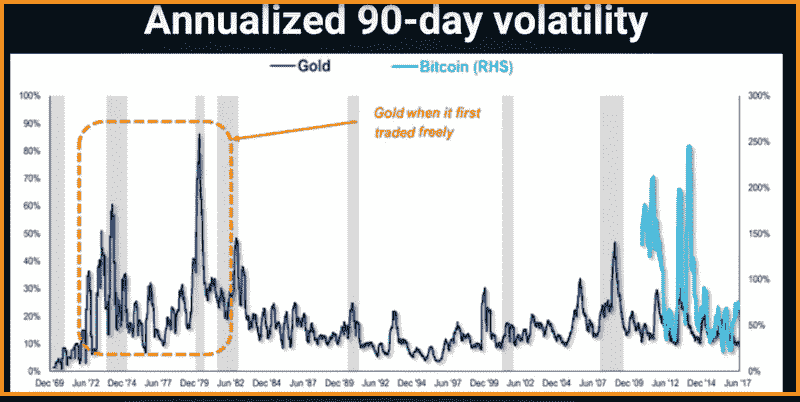

# 了解密码市场

> 原文：<https://medium.com/hackernoon/understanding-the-crypto-market-6f7d9df4664e>

## 为什么不稳定的加密市场对你有好处。

现在是 2011 年。

“比特币”一词被黑客和科技爱好者用来争论他们是否应该用这种新创造的神奇互联网货币点意大利香肠或蘑菇披萨。

没有人知道它从哪里来，没有人知道它会去哪里。但在那个时候，这种神秘的互联网货币有两个目的。付钱买披萨或者买毒品。

Try reaching into the screen to grab this.

快进到 2018 年。

加密货币的全球市值为 8000 亿美元。

让我们再读一遍。八个。一百。该死的。十亿。

比特币催生了一个全新的行业，迫使世界领导人和金融市场坐下来，注意并制定自己的战略，如何进入这个诱人的数十亿美元的市场。

有许多硬币和初创企业拥有自己的代币，背后有强大的团队和技术支持，旨在一点一点、一点一点地改变世界。

还有**秘密交易所**，在那里你可以用 BTC 兑换其他货币，利用价格波动和市场情绪赚取现金。

然而，任何一个花了一个小时跟踪加密价格的人肯定会注意到价格波动，这肯定会使市场看起来令人生畏。

这种波动在传统市场上从未出现过。资产、商品和股票市场 10%的波动是罕见的，*蓝月亮*出现。商人通常在这种罕见的日子里推出最贵的香槟酒。

但是 10%的变化在密码中被认为是可爱的。

加密交易者习惯于观察一天中 50%的变化，并认为这是完全正常的市场行为。

对于普通人来说，这是非常不稳定的，因此大多数人都远离加密货币，认为会发生绝对更糟糕的情况，不会用 10 英尺长的杆子接触波动如此剧烈的资产。

但这种波动也会让那些嗅到机会的人(比如我)感到刺耳。这些波动和赌博让我在几个月内从 1000 美元变成了 29000 美元。

交易者和冒险者嗅到了机会。最重要的是，他们闻到了钱的味道。

一般来说，人们会对他们不熟悉或者还没有被证明的事情持怀疑态度。正是一小部分相信它的人帮助世界进化。毕竟，没有敏锐的观众，艺术家什么都不是。

每个硬币都有两面，虚拟硬币也是如此，有效地将市场情绪分为高度乐观或高度悲观。

乐观是因为人们通常更喜欢高度评价他们投资的东西，就像流行的说法“**把你的钱放在你说的地方**”，这对比特币的早期采用者来说是完美的。

悲观是因为 **Crypto 非常不稳定**并且是一个庞氏骗局，没有人会从中受益。哈哈。虽然我同意这是高度不稳定的，但市场没有显示出庞氏骗局的迹象。这个篮子里有一些烂苹果，像 Bitconnect 这样的硬币被证明是庞氏骗局，但这几个元素只是加密市场这个巨大的转型草堆中的针。

在我们鸣枪准备放弃这个巨大的机会之前，让我们考虑一个重要的问题——

**任何在没有监管的自由市场上交易的东西都将高度不稳定。**

回顾过去，看看 1969 年不受监管的黄金市场吧。

An example of free market trading that is susceptible to huge price swings when unregulated.

红色方框表示的是黄金价格百分比的变化，当时市场仍未受到监管，从这个意义上说是“自由的”。将此与图表的右侧进行比较，比特币显示出类似的轨迹，**只是在本质上被放大了。**

很难挑出一个导致这种波动的因素，因为市场是几乎无限数量的因素的产物，这些因素可以导致价格向一个方向或另一个方向显著移动。这可能包括经济数据、地缘政治事件和市场情绪等诸多因素。

但是，很明显，这种波动并不意味着任何负面的东西。

每个强劲的市场在其最初阶段都会经历大幅波动。

黄金，股票，能源。一切。

**比特币有可能与主要法定货币的波动性相匹配**

与法定货币相比，比特币去年表现不算太差。平均而言，每日回报为正，波动性仍然是最高的，但英镑价值下跌近 8%似乎并不比 BTC 下跌 15%好多少。

*表格:2017 年货币对美元统计*

# 对比特币的价值储存和价值方法的看法差异太大

比特币的波动性在很大程度上也是由对加密货币作为价值储存手段和价值转移方法的内在价值的不同看法所驱动的。

价值储存是一种功能，通过这种功能，一项资产可以在未来具有一定的可预测性，它也可以被保存下来，并在未来交换某种商品或服务。

价值转移的方法是用于将财产以资产的形式从一方转移到另一方的任何对象或概念。

比特币目前的波动性使其有点不明确的价值储存，但它承诺几乎无摩擦的价值转移。由于比特币当前现货价格的这两个驱动因素相对于美元和其他法定货币有所不同，我们看到比特币的价值可以根据新闻事件波动，就像我们观察法定货币一样。

# 但是

在每种情况下都有一个常数。在任何市场变动中，无论是上涨还是下跌，供应和需求之间都有明显的差异**。**

简单来说，“**供给**是市场上人们想要出售的硬币总数，“**需求”**是人们想要购买的硬币。当这两个群体之间存在差异时，市场上的价格就会变动。

需求和供给之间的差距越大，这一举措的意义就越大。

# 秘密市场和渔民

一个叫晁的渔夫捕到了一条罕见的黄鳍鳟鱼，并在镇上的市场上宣布这一美味。很快，镇上的五星级酒店、米其林餐厅和想成为名人的人开始以更高的价格竞标这种特殊的鳟鱼，最终，它的售价比普通鳟鱼高出 77%。

Can you sell me this fish ?

这里到底发生了什么？肉好吃吗？它游到火星又回来了吗？它的皮肤上有钻石吗？

我不知道，买家也不知道。唯一的信息是关于那条特殊的鳟鱼有多么稀有和巨大，以及**感知价值**、**需求**驱动了拥有一条所述鱼的积极情绪。

第二天，这个小事件又重演了，与普通鳟鱼相比，价格飙升了 103%。(我还是找不到钻石。)

几天后，其他渔民观察这种鱼的价值和它产生的利润。他们聚在一起，并决定第二天跟随晁的船，以便自己捕捉一些这种有利可图的搅动鱼。

第二天，渔夫们鬼鬼祟祟地跟着晁到了大海的某个地方，那时他钓到了他标价的鳟鱼。令他们惊讶的是，他一直钓鱼，直到钓到一条相对较大的鳟鱼，然后把鱼鳍涂成黄色。

钻石到底在哪里？在你的脑海里呵呵。

鱼或硬币的感知价值决定了当天的市场走势。如果买家认为他们持有一枚优质硬币，他们会继续持有，直到它在未来达到更高的价格。然而，无限的因素可以决定一群人卖出，这在硬币市场上产生了连锁反应，导致过多的卖家，因此价格**下跌**。

同样，硬币价格上涨的原因是更多的人想买这种特殊的硬币，而不是卖掉它。

供求之间的这种差异、*这种* ***、波动、*** 导致加密价格上升和下降，直到达到**均衡**。

*由于加密货币交易所在全球层面***进行交易，我们每分每秒都在关注价格的变化，因为全球的投资者和交易者不断地间接决定市场价格。**

*当整体市场波动时，这种情况就会发生:硬币的买家/卖家比卖家/买家多，导致公司价格随着整体市场上涨/下跌。*

***毕竟市场本身只是一个个硬币的集合。***

*加密市场是一个复杂的、相互关联的系统，由大小投资者对大量不同的投资做出不协调的决策。可以说，“市场”并不是一个有生命的实体，相反，它只是一个口语术语，指的是由可靠技术支持的单个硬币的集体价值。*

# *被广泛接受的市场指标*

*这就引出了一个新问题:是什么创造了更多的买家或卖家？*

*对未来投资稳定性的信心在市场是涨是跌中扮演着重要角色。投资者更有可能购买硬币，如果他们确信它会在未来上涨，并导致每个纸上谈兵的投资者的最终目标，“兰博”。*

*然而，如果有理由相信硬币表现不佳，往往会有更多的投资者寻求卖出而不是买入。*

*原因包括:*

*   *对合法性的担忧*
*   *政府财政和[货币政策](https://www.investopedia.com/terms/m/monetarypolicy.asp)*
*   *技术变革*
*   *公司或政府绩效数据*
*   *钱包或交换黑客*

*例如，比特币历史上最大的单日跌幅发生在 2014 年 2 月 7 日。一夜之间，市场价值“损失”(下跌)了 49%。*

*我所指的不是别的，正是 MtGox 的陨落。在为比特币社区服务多年、获得交易者的信任和支持后，该交易所开始停止提现。不久后，他们发布了一份声明，称发生了大规模黑客攻击。2 月 7 日，该交易所停止了所有提款，显示黑客携带超过 85 万比特币潜逃。这一损失是黑客攻击的结果还是交易所簿记不善的结果，这是一个公开辩论的问题，但毫无疑问，这一事件对比特币的价格产生了数年的负面影响。*

*与许多未知商品一样，加密货币会受到市场风险和价格波动的影响。这方面被一些人视为一个巨大的机会，而其他人则希望尽可能保持。*

*因此，不要根据一个 YouTuber、Instragrammer 或伪名人所说的话来挥霍金钱，这是非常必要的。很可能他们在这些项目中有既得利益，这就是为什么人们更多地听说 Tron 或 Bitconnect，而不是 Waltonchain 或 Loopring。*

**通过了解市场风险，并教育自己做出明智的投资决策，当市场还处于萌芽阶段时，就有机会* ***赚钱*** *。**

*在未来很长一段时间内，加密资产将永远是一种未知的商品。他们只是没有传统股票市场的技术指标，而这些指标通常是用来分析资产的。*

*大多数股票或债券可以根据工具的某些特性进行分析。例如，股票有市盈率和股息，而债券有回报率。加密资产没有容易衡量的基本要素。*

**就未来回报而言，投资合适的硬币、合适的底层技术和合适的团队将会有很大的帮助。**

*就像传统市场一样，一些公司变得价值数十亿，一些公司成为独角兽并失败了，而一些公司表现出巨大的前景并以失败告终，或者几年后被公司收购。*

*因此，像任何股票一样，我们不能期望每一枚硬币都永远是投资组合中不变的一部分。*

*有些鱼你挂起来作为战利品，有些你放在鱼缸里，有些你用橄榄油在锅里煎。*

*对于你进入密码市场的第一步的终极资源，加上你的第一笔投资，如何投资，以及投资什么的指南，请查看我的指南*

* [## 如何通过交易和投资加密货币赚钱？

### 比特币！莱特币！以太坊！—激动！不知所措！还有什么不可以。

medium.com](/@shauryamalwa/how-to-almost-make-millions-by-trading-cryptocurrency-2f7bd5c1cedd) 

这些步骤让我在几个月内从 1000 美元变成了 29000 美元。

让它变大的唯一方法是自己学习如何抓鳟鱼。另一边见。干杯！

****************************************************************

鼓掌 1 次或 50 次。它帮助我获得曝光率。谢谢大家！

_

阐述我多年来的想法，并超级热衷于写区块链、交易、加密货币和生活。

我的目标是以一种精致、易懂的方式将加密货币带给大众。复杂无助于任何人，有偏见的媒体也是如此。

是的，我认为这个系统是一个巨大的谎言，是时候改变它了。

_

#longlivecrypto。

****************************************************************