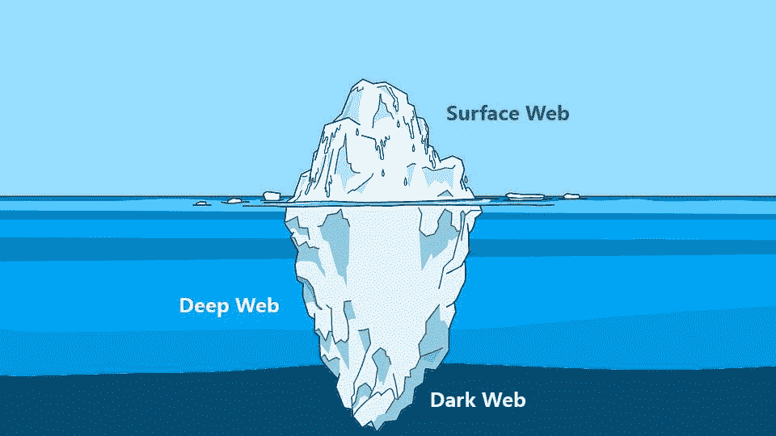

# 理解深层和黑暗网络

> 原文：<https://medium.com/hackernoon/understanding-the-deep-dark-web-8e4cad356587>

对诸如暗网、暗网和深网等术语的误解一直很普遍。在网络安全领域，随着网络犯罪分子用于通信、协作和参与恶意活动的技术的曝光，这些术语开始为人所知。本报告旨在帮助理解这些术语，并阐明其中的相关主题。

**表面网**

万维网被设计成一个供数十亿人在互联网上互动的平台。公开访问的最常见的 web 区域称为表面 Web。这包括使用搜索引擎(如 Google、Yahoo 和 Bing)可以找到的所有网站或页面。例如:当用户正在寻找关于特定主题的信息并进行在线搜索时。然后，用户可以键入一些关于他们正在寻找的关键词，并且会出现许多与这些关键词相关的各种网站的链接。

让这些网站被搜索引擎找到的是被称为网络爬虫的特殊编程脚本。这些爬虫遍历许多常见的网站目录，并使用这些页面上的链接来查找更多的网站。搜索引擎拥有先进的网络爬虫，每天从数千亿个网页中收集所有链接，并为每个链接建立索引以进行搜索优化。索引过程根据每个位置的内容和文本对每个网站及其页面进行分类。总而言之，surface web 包括可搜索的、索引的网站和网页。

**深层网络**

进一步进入万维网，我们发现了深层网络。阻止传统搜索引擎对其进行索引的网站或网页被称为深层或隐藏网络。当 web 爬网程序无法从这些网站访问和收集链接时，就会出现这种预防措施；因此，它们是不可搜索的。这可能是网站所有者的有意决定，也可能是网站性质造成的影响。网站所有者可以使用几种方法来隐藏他们的网站，使其不被网络爬虫发现，并防止网页被编入索引。其中一些方法包括确保没有表面网站包含指向其页面的链接，通过技术手段(例如，验证码)限制对页面的访问，或者要求登录才能访问页面。

Deep Web 的一个例子包括在 Pastebin 上发布的大量内容。由于信息发布的频率极高，大多数页面没有重定向到源的链接，只能通过使用特定的搜索工具才能找到。另一个例子是为特定人群创建的门户，这些人只能使用他们的登录凭证来访问 web 页面。

**暗网&暗网**

暗网是用来描述建立在互联网之上的加密网络，只有使用专门的软件才能访问。术语暗网也可以用来描述这些网络。此处找到的网站没有索引；因此，暗网在深网之内。这些网络被称为“黑暗网络”,因为它们具有帮助用户隐藏身份的特征，并且普遍支持非法活动。暗网可以是保密网络的形式，如 Tor 或 Freenet，也可以是对等网络，如 I2P 或朋友对朋友网络。这些形式的网络依靠通过加密层在网络上路由流量来支持用户的匿名。

访问暗网最常见的方法是通过访问私有网络，该网络建立限制以确保其用户的高度安全性。最受欢迎的选择是洋葱路由器(Tor)浏览器，它是由美国海军创建的，允许全球范围内的互联网匿名。Tor 因其高度的安全性、易用性以及所有软件可在几分钟内免费下载和安装而广受欢迎。匿名可以通过位于全球的各种 Tor 服务器路由网络流量来实现。这意味着，如果传输中的任何数据包被拦截，发送者和接收者将看起来像 Tor 网络上的随机节点，这使得几乎不可能识别用户在网络上做什么。不幸的是，通过许多节点进行路由意味着网络连接速度明显慢于传统互联网。

许多现存的网站只能通过 Tor 访问。这样的网站有一个特殊的。洋葱'顶级域名(TLD)而不是常用的。com '或'。“组织”。只有在 Tor 网络上运行的浏览器或应用程序才能连接到这些网站，如 Orbot 和 Orfox 移动应用程序或 web 浏览器扩展。

接入暗网有几种替代方法，例如使用隐形互联网项目(I2P ),这是一种点对点服务，其工作方式类似于 Tor，但可以在网络浏览器中运行。访问暗网的方法的不同之处在于它们的主要用途，通常集中在浏览、发消息或匿名共享；另一个关键方面是安全级别，这取决于他们使用的加密和路由协议。

朋友对朋友(F2F)网络是一种对等网络，允许连接特定的 IP 地址环，并使用户能够阻止任何其他 IP 知道它们在网络上的存在。除此之外，F2F 用户还可以对他们在网络上的交流进行加密，以进一步增强他们的安全性和匿名性。

**在深网上找到的信息&暗网**

由于在线使用和发布了大量个人信息，黑客染指其中一些信息是常有的事。这些信息包括信用卡号码、身份证图像、护照、医疗记录和多种类型的帐户凭证，如电子邮件地址、社交媒体帐户，甚至是订阅帐户，如网飞。

暗网已经证明了自己是一个非常有用的地方，它是黑客窃取并出售信息的市场，同时保护他们的身份。由于这些网站的性质，黑客可以很容易地找到有兴趣购买此类信息的个人。加密货币一上市，就迅速成为非法交易的首选支付方式，因为它们能够隐藏用户身份。据一家网络安全公司称，据估计，2016 年，银行凭证的售价将占账户余额的 1%至 5%，医疗记录的售价约为每份 50 美元，美国信用卡的信息售价为 12 美元。在这种信息不被出售的情况下，它经常被发布在 deep web 上，主要是 Pastebin 或 Github 之类的粘贴站点。

组织付钱给这些黑客来保护他们自己和/或他们的客户以保护被出售的信息已经变得很普遍。根据一份突出的报告，从 2016 年到 2017 年，违规数量有所下降，但从违规中收集的数据量有所增加。此外，2017 年，公司检索每条被盗记录的平均成本为 141 美元。

值得注意的是，在暗网上发现的任何市场信息的合法性都没有保证。然而，这些市场的通常做法是允许对供应商进行评级，这有助于他们基于其销售和互动的可靠性获得声誉。

**结论**

简而言之，互联网中可供公众搜索和访问的部分称为表层网络。然而，deep web 是因特网的一个区域，其中的网站没有索引，并且不能通过常规搜索引擎找到，或者可能需要授权才能访问。Darknet，也称为“黑暗网络”，是 Deep Web 的一部分，它需要特定的安全机制来支持匿名，以允许访问其站点和页面；比如 Tor 这样的隐私网络，或者 I2P 这样的点对点网络。重要的是要认识到暗网上敏感信息的繁荣市场，以及这些信息在深层网络上的传播。为了全面保护组织的各个方面，威胁范围必须包括深层网络和暗网。