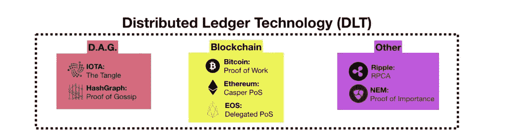

# 了解区块链和去中心化人工智能推动的可扩展和验证数据的淘金热

> 原文：<https://medium.com/hackernoon/understanding-the-gold-rush-of-scalable-and-validated-data-powered-by-blockchain-and-decentralized-ee05db6b6a68>

# 分散化带来的不信任

最近，对于**区块链技术**，有一个全球范围内的巨大宣传，但是这项技术如何创造价值，它对哪些用例有意义？

如果我们问中本聪的超级粉丝这个问题，他会回答:

> 在人类历史上，区块链技术第一次允许从 A 到 B 交易价值，而不必信任机构，而是信任民主网络，该网络通过开源算法进行自我控制。

这很有道理，它的 [**市值约为 2000 亿美元**](https://coinmarketcap.com/currencies/bitcoin/) ，抱歉是 2500 亿美元，OPS 现在是 1500 亿美元。顺便说一句，不管价格波动，市值是巨大的，但是，这篇文章的目的是关于**接下来是什么！**

为了理解这项技术创造的价值的指数增长，我们不必关注区块链本身的技术因素，而是关注由 [**去中心化**](/@VitalikButerin/the-meaning-of-decentralization-a0c92b76a274) **增加的**价值。****

去中心化意味着不是通过信任一个实体，而是通过开源算法来验证每一个信息。例如，比特币通过**“工作证明”来验证交易，**引入了交易块的概念，交易块在整个网络中复制和共享，没有编辑或删除分类账的可能性。

***相关链接:***

> [权力下放的含义| Vitalik Buterin](/@VitalikButerin/the-meaning-of-decentralization-a0c92b76a274)
> 
> [论公立和私立区块链|维塔利科·布特林](https://blog.ethereum.org/2015/08/07/on-public-and-private-blockchains/)
> 
> [比特币:一种点对点电子现金系统|中本聪](https://www.bitcoin.com/bitcoin.pdf)
> 
> [区块链的影响超越了金融服务|哈佛商业评论](https://hbr.org/2016/05/the-impact-of-the-blockchain-goes-beyond-financial-service)
> 
> [区块链是记忆|重要的话](/wordsthatmatter/never-break-the-blockchain-ecce69d8fd9a?source=linkShare-b5e20e64ca68-1519615413)
> 
> “区块链不可信”是什么意思？|普瑞蒂·卡西雷迪

# **验证数据的挑战**

由于其“不可信”核心，区块链技术对于分散和验证信息是有意义的。未来几年的主要用例将是从分散金融数据(交易)转向分散和验证本世纪最有价值的资产**数据。**

今天，即使大肆宣传，这项技术仍处于“早期阶段”在这一技术浪潮中，区块链技术对于重新发明集中式技术尚未破坏的东西是有意义的，一切都必须重新设计，不仅要有无摩擦的生态系统、大数据或人工智能，还要有**普遍验证的信息，没有人为操纵的可能性。**

在区块链市场，我们今天使用的每一种集中方法都没有用；这就是为什么这种技术的下一个独角兽将由重新发明我们如何在没有中介的情况下存储价值来驱动。这个新的技术时代被称为“互联网 3.0”或“价值互联网”

与金融交易不同，要分散数据，不仅需要存储每一条信息，还需要验证我们如何跟踪和执行数据。例如，当 Vitalik Buterin 开始建立以太坊时，面临的挑战是开发一个像操作系统一样设计的新区块链。

在以太坊网络上，和每个 OS 一样，**开发者可以运行应用**；每个应用程序都必须通过**智能合同**分散到区块链中，在那里执行功能，每个交易都必须调用整个智能合同、请求、谁发出的调用和结果。

利用区块链技术，目前不可能**创建高度可扩展的应用**并同时获得去中心化的附加值，因为有几个技术限制，最重要的是:

**每秒交易数:**比特币平均每秒可支持 3–7 笔交易，以太坊每秒可支持 12–20 笔交易。相比之下，visa 电路每秒需要 1200 笔交易，而像脸书这样的应用每秒需要超过 100 万笔交易

**交易成本:**一个比特币交易成本大约为 2/7 美元，一个没有运行智能合约的以太坊交易成本大约为 0.3 / 0.8 美元，这些成本对于一个每秒需要数百万次交易的应用来说是不可持续的。

**网络拥塞:**一个根本的问题是所有的应用程序都在同一个网络上运行，这导致了拥塞时期，交易成本可能会增加十倍，甚至会失败……**你还记得 Crypto-Kitties 吗？**

**具体使用案例:**以太坊被设计成一个去中心化的操作系统，用于具有一般用途的应用，而不专注于特定的功能，在去中心化和安全性方面类似于最先进的网络，排除了大量的使用案例。

***相关链接:***

> [将以太坊扩展到数十亿用户| Fred Ehrsam](/@FEhrsam/scaling-ethereum-to-billions-of-users-f37d9f487db1?source=linkShare-b5e20e64ca68-1519616881)
> 
> [密码产业和大规模采用|金融科技时报](https://thefintechtimes.com/crypto-industry-mass-adoption/)
> 
> [Crypto-Kitties 如何破坏以太坊网络| HackerNoon](https://hackernoon.com/how-crypto-kitties-disrupted-the-ethereum-network-845c22aa1e6e)
> 
> [DApps 的新时代来了，而且不是基于以太坊|黑客帝国](https://hackernoon.com/the-new-age-of-dapps-is-here-and-its-not-based-on-ethereum-2246fc4d9eee)
> 
> [以太坊:下一代加密货币和去中心化应用平台|比特币杂志](https://bitcoinmagazine.com/articles/ethereum-next-generation-cryptocurrency-decentralized-application-platform-1390528211/)
> 
> [等离子和公共以太坊链|潘若瑟](https://www.youtube.com/watch?v=nf1iEbBtbCE)

# **第一代分散应用**

许多优秀的团队正在开发技术来解决这些问题，并在不久的将来使复杂的分散式应用程序的开发成为可能。解决这些问题的挑战是将这项技术推广到大众，同时保持“不可信”的标准。

最近几年采用最多的解决方案是 **DAG** (有向无环图)，像区块链技术一样，DAG 是一种分布式账本技术(DLT)。在 DAG 网络中，进行交易的用户也管理共识，通常基于达到 51%参与者的法定人数。

这项技术**即使可以无限扩展，也是危险的**，因为它是可操作的，而共识是建立在对参与者的信任之上的。让区块链“不可信”的是通过算法验证信息的独特价值，匿名验证器和安全电路基于对欺骗网络的经济抑制措施。

非区块链 DLT 系统，如 DAGs、**没有通过算法**进行验证，问题是在区块链技术的这个早期阶段，人们和组织在理解无信任概念方面有很多摩擦。

这种误解变得更加令人困惑，**因为很多公司，都在投机，受“区块链趋势”的驱使。**“事实上，很多公司都在销售不可信的解决方案，比如私人区块链([共享数据库的混淆名称](https://www.theverge.com/2018/3/7/17091766/blockchain-bitcoin-ethereum-cryptocurrency-meaning))或者一些 DLT 的解决方案，被误认为是不可信的区块链。

这种趋势是危险的，因为如果一个组织开始信任一些可操作的东西，从长远来看，结果可能是一场灾难。

以太坊的 Raiden Network 和比特币的 Lighting Network 等解决方案的诞生，是为了在不丧失区块链网络安全性的情况下，解决与每秒交易量和交易成本相关的网络限制。基本上，这些解决方案是区块链交易和 DLT 私人网络的混合。

像 Raiden 这样的协议允许用户**打开一个私有的分布式连接**，在那里他们可以在区块链上只验证第一个和最后一个事务。与 DAG 相比，欺诈的风险是有限的，但每个中间交易都不会被验证。
该解决方案可用于微支付和扩展可操作的动态数据。

以太坊推出的一个非混合解决方案是等离子体，这是一个用于分散联邦区块链的协议。主要在公司内部协议中使用的联合区块链具有无限的可扩展性，但同时也是集中式的，因为它们依赖于有限数量的选定的非匿名验证器。

Plasma 为开发人员提供了通过智能合约创建和定制私人区块链的能力，无论是否发行新的加密货币，也无论是否有联合验证器。以太坊的公共区块链控制这个解决方案中的不可信者，作为并行:**以太坊是“最高法院”，私人区块链是“国家”**

***相关链接:***

> 分布式分类账和区块链有什么区别？| Bitsonblock
> 
> [DLT 最著名的神童——比特币区块链入门| TDTP](/@TheDigitalTP/primer-on-dlts-most-famous-prodigy-the-bitcoin-blockchain-bb11b7690a5d?source=linkShare-b5e20e64ca68-151961996)
> 
> [有向无环图(DAG) |维基百科](https://en.wikipedia.org/wiki/Directed_acyclic_graph)
> 
> [雷电协议&雷电网络:初学者指南| Spring 角色](https://blog.springrole.com/lightning-protocol-the-raiden-network-a-beginners-guide-c9d7bc702748?source=linkShare-b5e20e64ca68-1519616655)
> 
> [Vitalik Buterin 和 Joseph Poon 提出可扩展性解决方案:等离子框架| ETHNEWS](https://www.ethnews.com/vitalik-buterin-and-joseph-poon-produce-scalability-solution-the-plasma-framework)
> 
> [《区块链》毫无意义| The Verge](https://www.theverge.com/2018/3/7/17091766/blockchain-bitcoin-ethereum-cryptocurrency-meaning)

# **从垂直区块链模式到互操作性**

对开发第一代分散式应用程序的需求呈指数级增长**，这引发了一场开发可扩展和无信任技术的竞赛。**

在过去的两年中，许多创新项目开始构建测试无信任验证新方法的技术，如 Casper、NEO 或 EOS，以及专注于特定用例的新区块链技术，如 IOT、大数据、托管等。

这场竞赛产生了第三代区块链技术的概念，专注于**“互操作性”的想法**

由 AION、Polkadot 和 ICON 等项目开发的互操作性概念，开辟了一种新的智能方式来解决区块链技术中的技术限制，引入了通过多个区块链发言的**不可阻挡的应用程序的想法。**

该解决方案为第一代真正的复杂分散式应用开辟了道路，这种应用可以基于各种用例为每个功能使用性能最佳的区块链技术。与此同时，这种新方法可以降低风险，如受网络拥塞的影响或因网络缺陷而摧毁整个企业。

互操作性基础设施允许开发人员以一种新的智能方式创建去中心化的应用程序，我喜欢称之为**“区块链即微服务”**

“BAAM”概念类似于我们使用微服务创建现代集中式应用程序的方式，这些微服务基于针对每个功能的专用且可替换的 API。在 Dapp 中，我们将使用许多专注于特定需求的专用且可替换的区块链来执行每项任务。这种类型的基础设施将对该技术的发展进行指数级研究，特别是在新区块链集中于特定用例，而不会失去不可信的验证。

***相关链接:***

> [区块链到区块链:广泛采用和整合进入可能的领域|德勤](https://www2.deloitte.com/insights/us/en/focus/tech-trends/2018/blockchain-integration-smart-contracts.html)
> 
> [扩展可信计算的模型| Multicoin Capital](https://multicoin.capital/2018/02/23/models-scaling-trustless-computation/)
> 
> [区块链正在垂直化，所以我们需要互操作性](https://www.forbes.com/sites/adrianbridgwater/2018/02/07/blockchains-are-verticalizing-so-we-need-interoperability/)
> 
> [区块链平台:一条链统治一切？|黑客日](https://hackernoon.com/blockchain-platforms-one-chain-to-rule-them-all-f3f7dda84bae?source=linkShare-b5e20e64ca68-1519628363)

# 人工智能，为什么没有区块链就受限了？

在人工智能行业，另一个被过度炒作的科技领域，挑战是不同的，但同时也是巨大而复杂的。在这种情况下****数据的数量和质量至关重要**，对人工智能算法和可操作数据的信任对于各种用例来说都是危险的。**

**人工智能领域的最佳成果是在封闭和定义明确的生态系统中，如视频游戏，人工智能算法击败了每一个世界冠军，甚至在 DOTA 2 中，DOTA 2 被认为是业内最复杂的视频游戏之一。**

****

**人工智能在面部识别、声音识别、图像识别、视频识别、翻译或自动驾驶系统等领域取得了其他良好的成功，但也有一些错误。**

**在社交媒体或大数据这样的开放环境中，人工智能的现代算法表现较差，或者有时人工智能的结果是危险的错误。**

**一个关于可操纵数据、假新闻和巨魔如何操纵人工智能结果的可怕例子是 2016 年在 Twitter 上，微软创造了一个由人工智能算法驱动的机器人用户，并在 24 小时后开始推特说文化少数群体将被杀害和其他一些令人不快的声明。**

****

**在拥有可信数据的环境中，人工智能是有意义的，这个概念比算法更重要。基于人工智能的系统真的可以得到区块链技术的帮助，在干净的环境中用经过验证的不可操作的数据进行训练。**

**分散式人工智能的概念旨在解决人工智能算法的验证问题，这是分散式应用程序的一个关键点，同时验证它获取的数据和它生成的数据。**

****

**人工智能算法的分散解决了进一步的问题，即处理算法和执行复杂计算所需的计算能力。运行机器学习算法所需的计算能力非常昂贵，而且只有大公司才有。在分布式计算能力网络中，成本将呈指数级下降，从而允许每家公司使用算法进行复杂的计算。**

**分散人工智能的最雄心勃勃的项目之一是 SingularityNet，它使用区块链技术分散人工智能算法，同时建立人工智能市场，以激励开发者和数据交换。**

****

****相关链接:****

> **[数据质量对机器学习算法的影响|麻省理工学院](http://mitiq.mit.edu/ICIQ/Documents/IQ%20Conference%202006/papers/The%20Effects%20of%20Data%20Quality%20on%20Machine%20Learning%20Algorithms.pdf)**
> 
> **[人工智能时代的数据质量|走向数据科学](https://towardsdatascience.com/data-quality-in-the-era-of-a-i-d8e398a91bef)**
> 
> **[白皮书|奇点网](https://public.singularitynet.io/whitepaper.pdf)**

# **为什么人工智能可以成为区块链验证过程的核心？**

**区块链技术中的 AI 可以解决验证技术的戏剧性问题。**

****工作证明**在验证者(矿工)解决复杂的解密问题以换取加密货币时，为他们创造了经济上的抑制欺诈网络。这种不可信的方法基于 GPU 和电力的消耗成本，这使得它在环境影响和可扩展性方面不可持续，因为对于每个经过验证的块来说，它变得更加昂贵。**

****

**以太坊推出的当前最值得信赖的解决工作证明限制的解决方案是 **Casper** 。这个概念是，验证者必须阻止一些加密货币(股份)，股份成为它的投票权，如果它试图欺骗网络，验证者就失去了全部股份。Casper 不鼓励验证者通过烧毁他们的加密令牌来欺骗网络，而不是用高电力/GPU 成本。**

****

**Casper 是一种在利害关系算法证明范畴内的共识方法。另一个有趣的 POS 方法是由 Daniel Larimer 开发的**委托股权证明** (DPOS)以及 Bitshares、Steam it、EOS 和其他一些项目的核心。
DPOS 验证者不会因为烧毁他们的代币而失去动力，相反，他们会因为长期诚实而受到激励。POS 允许区块链网络扩展并更具可持续性，但从长远来看，这种共识方法是危险的，因为可能会产生一个高堆叠验证者的游说，具有集中网络的巨大决策潜力。**

**最令人印象深刻的共识算法之一，由 AION 推广，被称为**“智能证明**”，类似于工作证明，但基于人工智能。**

****

**这个概念允许验证者通过训练人工智能来解决复杂的数学问题，从而使用他们的计算能力；这种共享的人工智能可以比战俘中的单个矿工更快地解决加密问题。在 POI 中，共享人工智能继续提高其解决技能，因此当加密难度增加时，验证器不需要在计算能力方面花费更多。**

*****相关链接:*****

> **人工智能和区块链的融合:交易是什么？|中等**
> 
> **[白皮书| AION 网](https://aion.network/downloads/aion.network_technical-introduction_en.pdf)**
> 
> **[Casper 作为 EOS 合同|丹尼尔·拉里默](https://steemit.com/eos/@dan/casper-as-an-eos-contract)**
> 
> **[桩设计理念的证明| Vitalik Buterin](/@VitalikButerin/a-proof-of-stake-design-philosophy-506585978d51)**
> 
> **[结算终结| Vitalik Buterin](https://blog.ethereum.org/2016/05/09/on-settlement-finality/)**

# **不可信数据值**

**这一技术挑战背后的真正机会是去中心化数据和去中心化社区在未来十年将具有的不可估量的价值。人工智能和区块链技术合并的未来将是一个**互联的有效数据互联网**，供应商和用户都将被鼓励使用尽可能分散和有效的平台，因为他们数据的价值将通过持续交换跟踪和验证数据的方式来计算，类似于“有效数据经济”。**

**为了这个目的，已经有一场寻找最佳计算方法的竞赛，通过像 Nebulas 这样的项目，奖励 dapps 开发者的代码质量和用户参与度。谁将赢得这场竞赛将成为谷歌和分散数据交换。**

****

**推动这项技术在研究、开发、创新和想法方面达到超音速的动机，是使用公用令牌(专用于项目的加密资产)所带来的指数级经济优势，这种新的非金融价值正在解决科技行业今天面临的**最大问题之一。****

**在科技行业，公司的**资本是由无形资产驱动的，如社区、算法、合作伙伴和数据**。我们今天用来计算这些资产的所有方法都是初级的。**

****

**与金融资产或投机工具没有任何联系的效用令牌，如果被用作与技术产品的技术和数据进行交互的关键，则可以成为这些无形资产的有效估值工具，其基础是仅由市场供求驱动的资本化。**

**例如，如果我们必须计算像脸书这样的社交网络的数据价值，我们就不会有一个科学和有效的模型。**

**如果脸书将利用其数据库创建一些交互工具，并且访问这些信息的唯一方式将是脸书加密货币，那么由供需驱动的该令牌的市值可能是该社交网络数据的可信和有效的估值。**

**这种新工具是科技行业的一场革命，也是为什么对经过验证的数据的争夺将成为这一技术浪潮中数十亿美元公司的基本元素。**

*****相关链接:*****

> **[白皮书|星云](https://nebulas.io/docs/NebulasTechnicalWhitepaper.pdf)**
> 
> **[像美国证券交易委员会一样思考](https://hackernoon.com/think-like-the-sec-before-you-ico-412a24357d76)**
> 
> **[关于加密货币和初始硬币发行的声明| SEC.gov](https://www.sec.gov/news/public-statement/statement-clayton-2017-12-11)**
> 
> **[量化分权|中](https://news.earn.com/quantifying-decentralization-e39db233c28e)**

*****出自维塔利克·布特林:*****

****

**“这基本上就是代币 1.0。有一些好的想法，也有许多非常坏的想法，还有许多非常非常坏的想法，以及相当多的骗局。我预计 tokens 2.0 和人们将在 2018 年和 2019 年开始构建的各种东西通常会有更高的质量。尤其是一旦我们开始看到第一波代币的中长期后果是什么…对他们来说什么是好角色，什么是真正没有意义的角色？”**