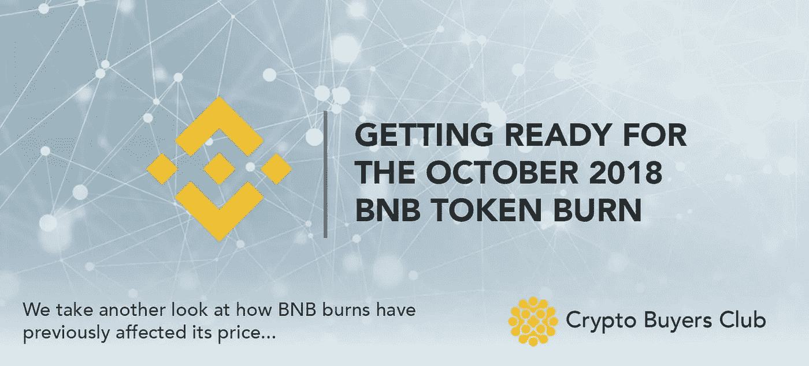
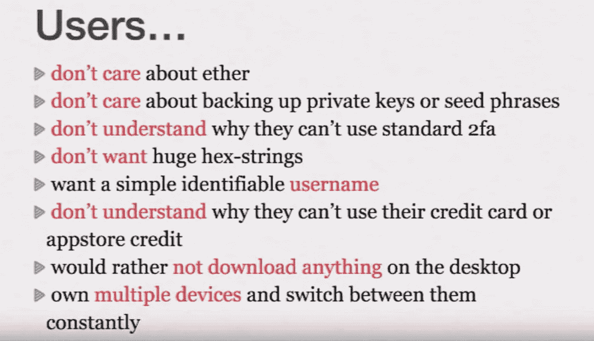
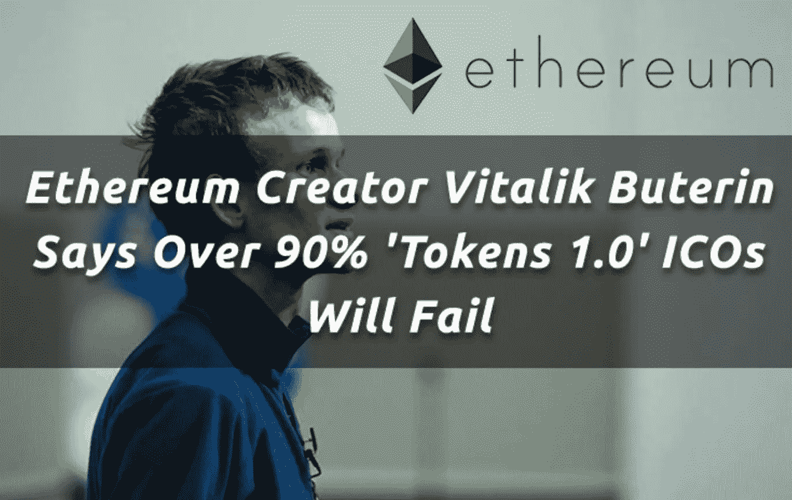

# 下一代区块链创业公司将是公用事业代币和私募股权的融合

> 原文：<https://medium.com/hackernoon/understanding-the-next-generation-of-blockchain-startups-powered-by-the-convergence-from-utility-cda65778239e>

## 在我们拥有代币、ico、私募股权和 IPO 的现代场景中，这些金融工具的融合如何帮助企业和初创公司以符合 SEC 的方式创造新的价值？

2017 年的 ICO 泡沫不仅是一件坏事，因为许多具有不同愿景和理解令牌使用方式的项目都得到了资助。截至 2018 年第四季度，我们现在有数据来了解令牌如何创造价值，它们可以提供什么样的使用情形，相反，什么样的数学驱动的令牌经济不能驱动请求或其内在价值，以及什么是骗局。

# 实用程序令牌

要定义什么是实用代币，首先，我们必须了解代币和硬币的区别:

> **硬币**是一种加密资产，像以太坊、EOS、比特币或 AION 一样，运行在自己的区块链之上，为维护网络可用和安全向矿工/验证者付费。
> 
> **令牌**是一种位于区块链网络之上的加密资产，不用于支付矿工/验证者。

正如我在上一篇文章[**中所写的，什么是加密货币在 HackerNoon** 上](https://hackernoon.com/whats-a-crypto-currency-really-is-fa93a3efadb4)

## 今天，一般来说，加密资产是一种可编程的价值存储，基于对背后技术的使用请求和需求，具有无限的使用案例和未发现的潜力

最关键的挑战是通过令牌的请求来推动价值。假设一家基于区块链的初创公司正在解决一个实际问题，他必须围绕他的代币的经济性开发一种可编程数学，以推动对代币的需求。

2017 年的泡沫告诉我们，当你必须用代币而不是硬币创造价值时，事情变得更加复杂，让我们检查泡沫后发生的数据，以了解如何创造价值:

## 案例 1:构建一个实用令牌来筹集资金和开发硬币

如果你正在开发一个区块链网络，令牌的用例是在现有的支持智能合约的区块链上制作一个 ICO，并使用 ICO 资金用你自己的硬币开发你的网络。在这种情况下，请求被驱动到您的区块链中进行交易，并使用构建在其上的分散式应用程序。

许多著名的区块链网络，如 EOS、AION、ICON、TRON、IOTA、NXT 甚至以太坊，就是这样开始的。

> 制造硬币是加密令牌唯一已经验证的用例；问题是，当你想在一个建立在区块链网络之上的平台或社区中创造价值时？

## 案例 2:构建一个实用令牌，作为购买商品或使用服务的货币

使用代币而不是现有的加密货币或法定货币来购买服务或使用 Dapp 功能的想法越来越多地引发了两个主要问题…
首先，代币价格波动是大规模采用的一个重要障碍，另一方面，Dapp 的用户体验目前无法与最容易获得的 web 2.0 用户体验相媲美:

例如，在 Dapp 市场中，你必须使用代币购买商品，完成购买的过程既困难又缓慢。
你必须从交易所购买令牌，之后，你必须从交易所向你的加密钱包进行交易，最后，你必须从你的钱包向网站的钱包进行另一次交易。

一般来说，这种缓慢而复杂的用户体验对于 Dapps 来说是一个巨大的差距。

在 ICO 泡沫期间，有很多项目都在应对现有的服务，比如优步或 Airbnb，但都使用代币作为货币。

为了在 web 3.0 中取得成功，突出的因素将是关注尚未解决的问题，挑战在区块链技术之外很难解决的问题。
在你能想到的绝大多数商业应用中，现有的 web 2.0 公司将在短期内获胜，从长远来看，也许该公司有时间做出自己的令牌或开始以某种方式接近区块链技术，所以与现有的解决方案竞争太危险了，只能复制它。
也就是说，一些公司，如分布式云服务行业的 Internxt，正在开发一种令人兴奋的方法来解决短期内的这个问题。其概念是为客户提供类似 web 2.0 的用户体验，客户可以用美元或任何法币购买服务，并自动将其兑换为代币，最终将代币直接交付给卖家。我有兴趣在一年左右的时间里观察这种混合方法的演变…

## 案例 3:构建一个实用令牌来激励用户用应用内奖励来下注令牌

我们在 2017 年 ICO hangover 中测试的另一个用例是使用令牌来激励令牌持有者购买更多和“Hodl”这些项目中的 90%不是分散的应用程序，而是试图使用集中的应用程序激励或奖金来用其令牌创造价值的 Web 2.0 应用程序。

由于这种用例类别的前景仍然暗淡，有一些非常明显的例外:币安像疯了一样增长，并在不到一年的时间里公布了接近纳斯达克的利润。在币安的例子中，使用 BNB 令牌通过奖金创造价值只是一个短暂的 therms 里程碑，他们正在开发一个由 BNB 在 2019 年推动的专用区块链的去中心化交易所。

在这种情况下，问题是，为什么一个公司必须创造一个令牌？在常规的 web 2.0 中，一个集中的应用程序可以开发一个集中的硬币来做奖励，就像经验点或视频游戏的货币。
问题在于，在这种使用案例中，真正的分散化并没有增加价值，这是非常危险的，因为一个平台必须迅速变得非常庞大，比如币安，才能利用这种设置创造需求。

使用这种设置的一个令人兴奋的方法是创建某种证明，这种证明并不完全像共识证明，而是基于用户用他们的令牌打赌的行为。
两个有趣的案例是 NumerAI 试图通过请求用户下注并押注他们的代币来预测金融走势，以提供市场预测或奖金 0X，即要求用户下注他们的代币来验证其他用户的任务以获得奖金奖励。我们可以称这种设置为社区的证明，我很有兴趣看到它的演变。

## 案例 4:构建一个效用令牌来激励用户出售他们的数据并分割收益

数据是新的石油，就质量和价值而言，去中心化的数据是这一领域的进步。
一些公司正在开发 Dapps，最终人们可以成为马克·扎克伯格，利用自己的数据赚钱。

这种激励用户并从数据请求中分割收入的想法非常酷，如果 Dapp 能够快速有效地扩展并基于用户交互和行为提供数据，从长远来看是可行的。在这个领域中，实用工具令牌在 B2B 领域中可以很好地工作，在 B2B 领域中，公司使用令牌支付请求数据的费用，智能合约以分散的方式自动向所请求数据的用户所有者支付费用。

# 2017 年泡沫的长期影响

在 ICO 泡沫期间，如今已经死亡的令牌相关创业公司的每一位 CEO 都在谈论他是下一个史蒂夫·乔布斯，以及每一位 ICO 投资者认为是下一个马克·安德森。最后，所有这些数字都有一个共同点，他们没有长远的眼光，尤其是在金融领域，因为科技行业需要钱，一大笔钱。

如果你正在运行一个基于分散式应用的初创企业或各种与加密相关的项目，一切都是挑战和昂贵的。
首先，你必须付钱给区块链的开发者，他们太膨胀了，同时你必须挑战区块链技术的局限性，这是膨胀的，扼杀了你的应用程序的用户体验。最后但并非最不重要的一点是，你必须与 web 2.0 行业竞争，他们速度快、成本低、用户友好，所以要确保在短期内他们很可能成为大多数领域的赢家。

因此，你需要资金和时间来扩大规模，你不能指望在很长时间内拥有数百万用户和收入。

筹集 1000 万美元，以建立一个非营利基金会(像比尔和梅丽莎盖茨一样)，烧掉所有的 ICO 资金，在一些大型交易所上市，并与监管机构斗争，希望迅速扩大规模，迅速达到收入，这看起来不是一个明智的想法。

如果你想在这个领域生存，你需要获得更多的资金，增加你的股权价值，所以你需要一个正规的公司，因为监管机构已经说过，要合规，你必须遵守一些规则，你需要在正确的地方成立公司，有正确的金融服务商和聪明的投资者来发展。

# 融合，区块链创业公司的一种新的惊人方法

在 2017 年泡沫结束时，区块链生态系统开始成熟，初创公司开始制定更成熟的财务长期愿景，试图找出如何以符合 SEC 的方式创造价值。

如今，最常用的文件是期货代币“SAFT”的简单协议，作为通过向合格投资者而非公开 ico 私下出售代币来筹集资金的模式。另一种合规的方式是向早期用户免费空投代币，只使用普通投资者的普通股票来获得资本。

泡沫过后，遵守 SEC 法规并运营一个正规的组织至关重要！通过一个融合友好的设置，效用令牌可以用于最终确定和验证一些无形资产的价值，如数据或社区参与。对世界各地的创业公司来说，验证数据和参与度的想法是一个巨大的进步，有助于各类投资者了解科技公司的真正价值，弥补了对技术驱动的横向思维普遍缺乏熟悉的问题。

在私募股权领域，初创公司的估值更多地来自其社区和数据的内在价值，而不是 EBITDA 这给与科技无关的投资者造成了很多误解和恐惧。问题是，这些价值不是 100%可以用数学来衡量的，有时很容易高估或低估一家科技公司。

> 如果基于使用请求和需求的实用令牌值可以帮助科技公司对其最重要的资产(如数据或社区参与)进行全面验证，会怎么样？

## 让我们用一个例子来思考这个问题:

在一个场景中，像脸书这样的技术公司有一个公用令牌，符合脸书公司拥有的 30%令牌的 SEC 标准。这可能意味着什么？
如果脸书将此令牌作为与脸书用户数据交互的唯一方式，基于请求和需求的令牌市值将验证脸书拥有的数据的内在价值，同时可以与数据所有者分享收入，使用户更愿意分享东西。

如果与此同时，脸书为其用户开发出一些基于游戏化的激励措施，以赌注代币为动力，甚至以收藏品和掉落来奖励行为，这可能会验证脸书社区的参与度。

对于一家区块链初创公司来说，这可能是一个巨大的游戏改变者，这家公司尚未上市，也不像脸书那样大，必须与投资者打交道，才能获得资金做大。如果一家初创公司拥有非常活跃的社区和有价值的数据，当它必须与投资者打交道时，解释为什么这些资产对他的贴现现金流如此重要，拥有一定比例的公用事业代币作为资产，对它的验证可能是有形和真实的。

> 公用事业代币和常规金融工具的这种融合可能是创业公司向前迈出的一大步，并可能从根本上推动全世界的创新。

还有一件事…房间里有一头巨大的大象..

# 安全令牌和资产令牌化

正如我在上一篇文章[“**什么是加密货币？”在 HackerNoon**](https://hackernoon.com/whats-a-crypto-currency-really-is-fa93a3efadb4) 有形和无形资产的安全令牌或令牌化的概念不能以分散的方式直接编程，它们需要以固定的价格集中起来，并且必须与监管机构打交道，因为划分这种金融工具和庞氏骗局的界限非常小。

例如，双子美元或 USDT 有一个集中的固定价格，由银行账户中的实际美元支持，这总是在 SEC 的眼中。与加密史上最大的骗局之一 BitConnect 相反，他们在一个集中交易所固定了令牌的价格，每天将价格推高 3%，这是一个经典的庞氏骗局。

我决定在金融专家的帮助下谈论这个问题，因为这种加密资产不是区块链和技术专家可以理解的，而是一种完全老式的金融资产。因此，我请试图帮助投资者接受加密货币和区块链相关项目的金融专家恩里科·佩托奇(Enrico Petocchi)写一些关于这一点的东西，并通过预先追踪接下来会发生什么来完成这篇文章:

“简而言之，安全代币可被视为加密(数字)证书，代表对发行者的部分或全部基础资产和/或现金流的质押/访问。

随着公用事业代币扩大了投资范围(通过提供基于数据收集、生产或消费社区等将商誉货币化的方法)。安全令牌将使以下各项成为可能:㈠将来自不同资产类别的流动证券化，㈡将资产所有权分割为数字(也可能是可交易的)证书。

安全令牌将允许在有限的治理限制下进行风险投资，并为资产支持的金融和投资组合分拆以及极端投资者的精选铺平道路。

CryptoCapitalMarkets (ICOs & STOs)、愿意直接接触投资者的常规交易所以及加密交易所将增强另类证券化资产流动性的可能性的结合，正日益赋予大型企业和初创企业前所未有的工具和融资技术。

加密金融科技的融合将使金融战略成为一种竞争武器，而不是一项执行任务，通过为相关利益相关者团体动态定制具体的投资提案，帮助弥合资金、想法和市场之间的差距。简单来说，就是开始的结束”。