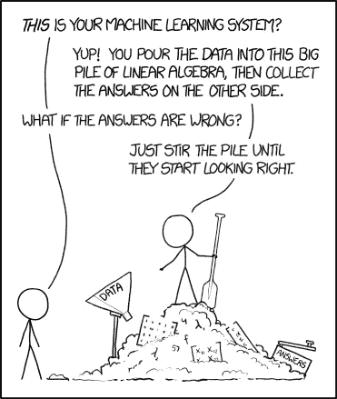
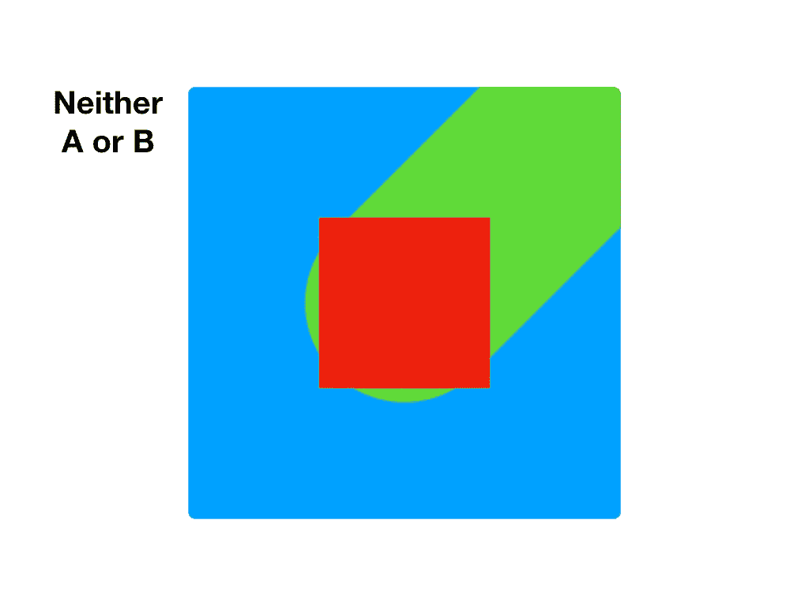

# 理解人工智能实际上看到了什么

> 原文：<https://medium.com/hackernoon/understanding-what-artificial-intelligence-actually-sees-7d4e5b9e648e>


许多人称人工智能(AI)为“黑匣子”，事实的确如此。人工智能最大的问题之一是，理解数据是如何被解释的非常困难。



在我们弄脏自己的手并潜入更深之前，让我们玩一个小游戏。

我将向你们展示一系列抽象图像，它们要么属于类别 **A** 要么属于类别 **B** 。


## 你认为下面的图片属于 A 类还是 B 类？

> **提示:**没有 **C** 。


我们稍后再讨论这个。

## 让我们先看一些例子。



## 现在你能说出它是属于 A 还是 B 吗？


# ⚠️剧透警报


# 答案是……A！

如果你选择 **B** ，不要尴尬，**你不是一个人。当问及一屋子的工程师和开发人员时，两者的比例总是 50/50。那么…为什么答案**是一个** …？**

因为是我说的。

答案是 **A** ，这是毋庸置疑的，但是如果你不同意我的观点，那么这是我作为教练的错。

作为培训师，我知道 **A** 是红圈。所以任何有红圈的东西都是 **A** 。我还知道 **B** 是一个橙色的圆圈。图像的其余部分无关紧要。这一切都是为了试图找到一组图像之间的模式。

但是很难。

在一个 AI 系统中，我无法用文字解释是什么让图像**变成了**。我能做的就是给你看更多的图片，希望它开始点击。

而你，那个 AI，不能告诉我你为什么会觉得是 **B** 。由我来盲目地给你提供数据，直到你得到正确的答案。

这是同样的一组图像，但没那么抽象。如果我问你同样的问题，每个人都会马上知道 A 是苹果，B 是橘子。这几乎太容易了，以至于许多人认为这是一个棘手的问题。我们都知道手和背景都是不相关的信息，因为我们是人类，从小就学习这些东西，但对 AI 来说，这不是已知的。它把图像看得更抽象，不知道你想让它关注什么。


# 误解

让我们来看看另一个玩具场景，它显示了我们可能会如何意外地向 AI 系统传达错误的信号。

我们有一些橡树样品。*(我住的地方有点阴)*


这里有一些棕榈树。*(沙滩上真的很阳光)*


下一个例子是一棵棕榈树，但是灯光更接近橡树。我们应该关注哪种模式？灯光？还是树的形状？模型可能很难分辨。


```
**Confidence:
** - Palm 0.75
 - Oak 0.60
```

在这个例子中，很明显我们留下了一个非故意的模式让人工智能去选择。然而，在现实中，它通常是更不显眼的东西。

# 在窗帘下偷看

那么，我们如何才能更深入地了解人工智能关注的是什么呢？

如果我们在图像上放一个矩形，然后记录下置信度的变化，会怎么样？如果信心下降，那么这可能是形象的一个重要部分。

哪张图更容易看出这根线是 USB？


第一个图像完全遮住了连接器，这使得几乎不可能猜测，所以我们可以表示矩形覆盖的区域是重要的。然而，第二个图像中的矩形并不妨碍我们确定电缆类型的能力。我们可以安全地将该位置标记为无关紧要。

我们可以继续在图像上传递矩形，以建立一个重要的热图。


我们可以看到，模型的重点是连接器的尖端，这很好。它看着我们想要它看的地方。

我们来看一个没有训练好的模型。


```
**Confidence:
** - USB 0.76
```

该模型以`0.76`的置信度正确预测了该线缆是 USB。我们可能会说这是可以接受的，特别是因为照片离得很远，质量也不好。

然而，经过更仔细的观察，这个模型似乎聚焦在错误的区域，而不是像我们预期的那样聚焦在电缆的两端。


这告诉我们什么？

该模型似乎过于依赖电线和手指。为了提高准确性和消除混淆，我们可以在负面训练集中包括更多的线和手的例子。

在我们的模型开始表现得更好之前，我们不需要在成堆的通用数据上训练。我们可以巧妙地使用这些信息来帮助重新训练模型，从而节省我们的时间和金钱。

# 使用工具

> 哇！这很好，但是我不想努力去实现它

好消息！你可以在我的 [GitHub](https://github.com/bourdakos1/visual-recognition-with-coreml) 上找到功能齐全的 iOS 应用😘

# 最后的想法

创建自己的模型很容易，但这并不意味着工作就此停止。机器学习最难的部分总是产生好的数据。

我们可以使用基本的指导方针，在我们的训练图像中使用相似的姿势、照明以及股票和自然照片的一致组合，以在我们寻求良好模型的过程中获得立足点。在那之后，我们只能使用工具和直觉来尝试并洞察人工智能的思维过程。

感谢阅读！如果你有任何问题，请随时联系 bourdakos1@gmail.com，通过 [LinkedIn](https://www.linkedin.com/in/nicholasbourdakos) 联系我，或者通过 [Medium](/@bourdakos1) 和 [Twitter](https://twitter.com/bourdakos1) 关注我。

如果你觉得这篇文章很有帮助，给它一些掌声会很有意义👏并分享出来帮别人找！并欢迎在下方发表评论。