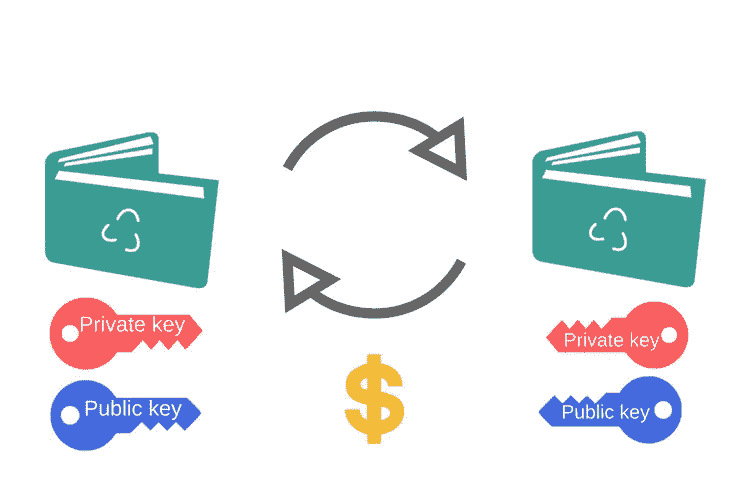

# 了解什么是加密货币钱包及其工作原理

> 原文：<https://medium.com/hackernoon/understanding-what-cryptocurrency-wallet-is-and-how-it-works-d68499480b48>

没有加密货币钱包，我们将无法访问、存储、发送、接收或追踪我们的数字货币，如比特币、以太坊、莱特币等等。当比特币被创造出来时，它作为一种去中心化货币的主要目标是让人们完全控制自己的钱。鉴于加密货币的价值正在增加，拥有自己的加密货币钱包来存储和管理您的硬币是正常和必要的。

## **什么是加密货币钱包？**

加密货币钱包是一个软件程序，使您能够存储私钥和公钥，并与各种区块链合作，允许用户发送、接收和监控数字货币。实际上，数字货币没有储存任何货币，也没有任何货币以物理形式储存在任何地方。只有交易记录存储在区块链上。

## **它是如何工作的？**

当有人向另一个人发送加密货币时，他们是在向接收者的钱包地址签署硬币的所有权。为了让接收者能够使用这些硬币，他们必须拥有与该货币被分配到的公共地址相匹配的私钥。当公钥和私钥匹配时，数字钱包的余额就会增加。没有真正的硬币兑换。

加密货币钱包是一个保险箱，我们用来存放非常重要和有价值的物品的那种盒子。我们不能失去这种盒子的钥匙，因为如果我们失去了它，我们就失去了我们重要财产的所有权。加密货币钱包也是如此。我们保留数字密钥，而不是物理密钥。那些数字密钥是以代码的形式存在的。

## **加密货币钱包的种类**

加密货币钱包分为三类——软件、硬件和纸质钱包。

*   **软件** **钱包** —有三种形式的软件钱包:桌面钱包(安装在笔记本电脑或个人电脑上，可以从单台计算机访问的钱包。它们安全性很高，但如果电脑中了病毒，就有可能丢失你的钱包)、在线钱包(那些运行在云上，可以从任何设备访问的钱包；你的钥匙是在线存储的)、手机钱包(那些在智能手机的应用程序上运行的钱包；它们比桌面钱包简单，可以在任何地方使用。
*   **硬件钱包**在 USB 等设备上存储私钥。它们支持离线存储，增加了密钥的安全性。这些钱包也支持不同的数字货币。您必须将您的设备插入任何连接到互联网的设备，输入您的密码并开始交易。
*   **纸质钱包**是一款安全生成可打印密钥的软件。如果你想在你的纸钱包上转移货币，你只需要将硬币从你的软件钱包转移到你的纸钱包的公共地址。

## **哪里可以买到加密货币钱包？**

有许多地方可以让你得到你的加密货币钱包。主要是在网络浏览器和应用商店。你也可以从网上商店买到你的钱包。最受欢迎的数字钱包有 MyEtherWallet.com、IMtoken、Gnosis、MyTrezor、Crowdwiz 等。

## **如何保护你的加密货币钱包？**

加密货币钱包的安全性取决于钱包类型和服务提供商。例如，在线钱包比离线钱包有更多的风险。但是，尽管在线钱包更容易受到黑客攻击，但由于针对所有钱包实施了许多措施，它们已被证明是安全的。不要忘记你必须保管好你的钥匙，因为丢失它将意味着你的硬币被盗。以下是一些保护加密货币钱包的方法:

*   始终保持您的软件最新
*   备份您的钱包
*   添加附加安全密钥

> 能源总理认识到了加密货币钱包的重要性。这就是为什么我们让我们的用户在 MyEtherWallet.com 上创建一个数字钱包，以确保他们的钱包，并将其转移到私人钱包。

Energy Premier 是一个位于区块链的电力交易平台，允许用户以更便宜、更快捷、更安全的方式进行电力交易。我们的使命是通过利用区块链技术，把能源的权力还给人民。区块链让美国变得透明和安全，也让所有电力消费者和供应商能够直接进入全球能源市场。

我们的预售已经开始，您可以在这里 **参与 [**。众筹定在 9 月 21 日。不要错过我们的旅程，立即参与以获得 30%的奖金！**](https://tokensale.energypremier.com/)**

*感谢您的阅读。*

