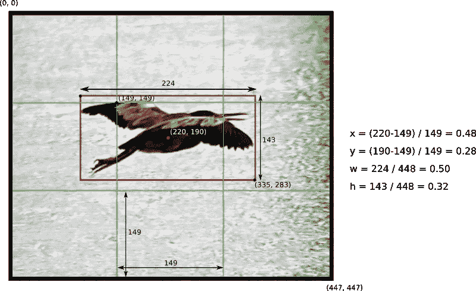
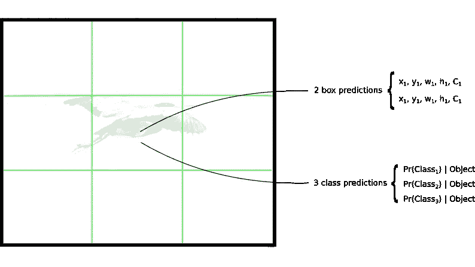
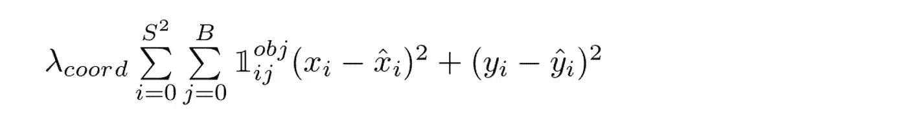
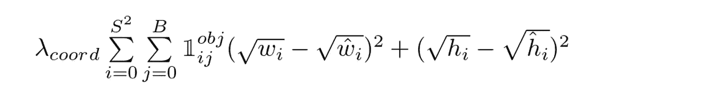
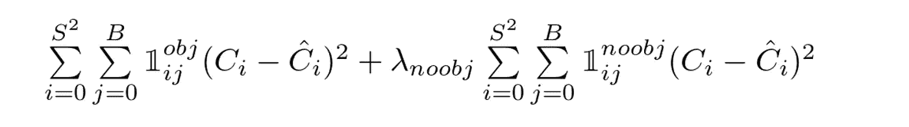
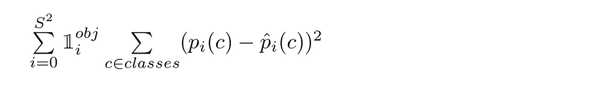

# 了解 YOLO

> 原文：<https://medium.com/hackernoon/understanding-yolo-f5a74bbc7967>


本文从想从头开始实现 YOLO 对象检测体系结构的人的角度解释了它。它不会描述网络的优点/缺点或每个设计选择的原因。相反，它关注于它如何工作。在你阅读这篇文章之前，你应该对神经网络，特别是 CNN 有一个基本的了解。

这篇文章中的所有描述都与 YOLO 的原始论文相关:[你只看一次:约瑟夫·雷德蒙、桑托什·迪夫瓦拉、罗斯·吉尔希克和阿里·法尔哈迪(2015)](https://arxiv.org/abs/1506.02640) 。从那以后，提出了许多改进，这些改进被合并到新的 YOLOv2 版本中，我可能会在另一个时间写这个版本。先理解这个原始版本，然后检查做了哪些修改以及为什么修改，会更容易一些。

# 什么是 YOLO？

YOLO(你只看一次)，是一个对象检测网络。目标检测任务包括确定图像上某些目标存在的位置，以及对这些目标进行分类。以前的方法，如 R-CNN 及其变体，使用管道在多个步骤中执行这项任务。这可能运行缓慢，也很难优化，因为每个单独的组件必须单独训练。YOLO，这一切都是通过一个神经网络完成的。来自报纸:

> 我们将对象检测重新定义为一个单一的回归问题，直接从图像像素到边界框坐标和类别概率。

因此，简单地说，你把一幅图像作为输入，让它通过一个看起来像普通 CNN 的神经网络，你在输出中得到一个包围盒和类预测的向量。

*那么，这些预测看起来像什么？*

# 预测向量

理解 YOLO 的第一步是它如何对其输出进行编码。输入图像被分成一个*S×S*网格单元。对于图像上出现的每个物体，一个网格单元被称为“负责”预测它。这是对象中心所在的单元格。

每个网格单元预测 *B* 边界框以及 *C* 类概率。边界框预测有 5 个部分: *(x，y，w，h，置信度)*。 *(x，y)* 坐标代表盒子的中心，相对于网格单元的位置(记住，如果盒子的中心*没有*落在网格单元内，那么这个单元对它没有责任)。这些坐标被标准化为介于 0 和 1 之间。相对于图像尺寸， *(w，h)* 框的尺寸也被标准化为[0，1]。让我们看一个例子:



Example of how to calculate box coordinates in a 448x448 image with S=3\. Note how the (x,y) coordinates are calculated relative to the center grid cell

在包围盒预测中还有一个组件，即置信度得分。来自报纸:

> 形式上我们将信心定义为 *Pr(对象)* IOU(预测，真实)*。如果该单元格中不存在任何对象，置信度得分应该为零。否则，我们希望置信度得分等于预测框和实际情况之间的交集(IOU)。

注意，置信度反映了*任何类别*的对象的存在或不存在。如果你不知道借据是什么，看看这里的。

现在我们已经理解了框预测的 5 个组成部分，记住每个网格单元都是这些预测的 B，所以总共有 *S x S x B * 5* 个输出与边界框预测相关。

还需要预测类概率， *Pr(Class(i) | Object)。*这个概率是以包含一个对象的网格单元为条件的(如果你不知道条件概率的意思，参见[这个](https://en.wikipedia.org/wiki/Conditional_probability))。实际上，这意味着如果网格单元上没有对象，损失函数不会因为错误的类预测而惩罚它，我们将在后面看到。该网络仅预测每个单元的一组类别概率，而不考虑盒子 *B* 的数量。这使得总的分类概率

将类别预测添加到输出向量，我们得到一个 *S x S x (B * 5 +C)* 张量作为输出。



Each grid cell makes B bounding box predictions and C class predictions (S=3, B=2 and C=3 in this example)

# 网络

一旦你理解了预测是如何编码的，剩下的就容易了。网络结构看起来像一个普通的 CNN，有卷积层和最大池层，最后是两个完全连接的层:

```
┌────────────┬────────────────────────┬───────────────────┐
│    Name    │        Filters         │ Output Dimension  │
├────────────┼────────────────────────┼───────────────────┤
│ Conv 1     │ 7 x 7 x 64, stride=2   │ 224 x 224 x 64    │
│ Max Pool 1 │ 2 x 2, stride=2        │ 112 x 112 x 64    │
│ Conv 2     │ 3 x 3 x 192            │ 112 x 112 x 192   │
│ Max Pool 2 │ 2 x 2, stride=2        │ 56 x 56 x 192     │
│ Conv 3     │ 1 x 1 x 128            │ 56 x 56 x 128     │
│ Conv 4     │ 3 x 3 x 256            │ 56 x 56 x 256     │
│ Conv 5     │ 1 x 1 x 256            │ 56 x 56 x 256     │
│ Conv 6     │ 1 x 1 x 512            │ 56 x 56 x 512     │
│ Max Pool 3 │ 2 x 2, stride=2        │ 28 x 28 x 512     │
│ Conv 7     │ 1 x 1 x 256            │ 28 x 28 x 256     │
│ Conv 8     │ 3 x 3 x 512            │ 28 x 28 x 512     │
│ Conv 9     │ 1 x 1 x 256            │ 28 x 28 x 256     │
│ Conv 10    │ 3 x 3 x 512            │ 28 x 28 x 512     │
│ Conv 11    │ 1 x 1 x 256            │ 28 x 28 x 256     │
│ Conv 12    │ 3 x 3 x 512            │ 28 x 28 x 512     │
│ Conv 13    │ 1 x 1 x 256            │ 28 x 28 x 256     │
│ Conv 14    │ 3 x 3 x 512            │ 28 x 28 x 512     │
│ Conv 15    │ 1 x 1 x 512            │ 28 x 28 x 512     │
│ Conv 16    │ 3 x 3 x 1024           │ 28 x 28 x 1024    │
│ Max Pool 4 │ 2 x 2, stride=2        │ 14 x 14 x 1024    │
│ Conv 17    │ 1 x 1 x 512            │ 14 x 14 x 512     │
│ Conv 18    │ 3 x 3 x 1024           │ 14 x 14 x 1024    │
│ Conv 19    │ 1 x 1 x 512            │ 14 x 14 x 512     │
│ Conv 20    │ 3 x 3 x 1024           │ 14 x 14 x 1024    │
│ Conv 21    │ 3 x 3 x 1024           │ 14 x 14 x 1024    │
│ Conv 22    │ 3 x 3 x 1024, stride=2 │ 7 x 7 x 1024      │
│ Conv 23    │ 3 x 3 x 1024           │ 7 x 7 x 1024      │
│ Conv 24    │ 3 x 3 x 1024           │ 7 x 7 x 1024      │
│ FC 1       │ -                      │ 4096              │
│ FC 2       │ -                      │ 7 x 7 x 30 (1470) │
└────────────┴────────────────────────┴───────────────────┘
```

关于架构的一些评论:

*   请注意，该架构是为 Pascal VOC 数据集设计的，作者使用 S=7、B=2 和 C=20。这解释了为什么最终的要素地图是 7x7，也解释了输出的大小(7x7x(2*5+20))。使用具有不同格网大小或不同类别数量的网络可能需要调整图层尺寸。
*   作者提到，有一个快速版本的 YOLO，具有较少的卷积层。然而，上表显示的是完整版本。
*   1x1 缩减层和 3x3 卷积层的序列受到 GoogLeNet (Inception)模型的启发
*   最后一层使用线性激活函数。所有其他层使用泄漏 RELU(φ*(x)= x，如果 x>0；否则为 0.1x*
*   如果你不熟悉卷积网络，看看这个[伟大的介绍](http://cs231n.github.io/convolutional-networks/)

# 损失函数

损失函数有很多要说的，就分部分来做吧。它是这样开始的:



YOLO Loss Function — Part 1

该等式计算与预测边界框位置 ***(x，y)*** 相关的损失。现在不要担心 ***λ*** ，只要考虑它是一个给定的常数。该函数计算每个边界框预测值 **( *j = 0)的总和..每个网格单元的 b*)****(*I = 0..S^2* )** 。 ***𝟙 obj*** 定义如下:

*   1，如果对象出现在网格单元 *i* 中，并且第 *j* 边界框预测器“负责”该预测
*   0，否则

但是我们如何知道哪个预测器对该对象负责呢？引用原文:

> *YOLO 预测每个网格单元有多个边界框。在训练时，我们只希望一个边界框预测器负责每个对象。我们分配一个预测器来“负责”预测一个对象，基于哪个预测具有最高的当前 IOU 和地面真实值。*

等式中的其他项应该很容易理解: ***(x，y)*** 是预测的包围盒位置， ***(x̂，ŷ)*** 帽子是来自训练数据的实际位置。

让我们进入第二部分:



YOLO Loss Function — Part 2

这是与预测的盒子宽度/高度相关的损失。这个方程看起来和第一个相似，除了平方根。那是怎么回事？再次引用论文:

> 我们的误差指标应该反映出大盒子中的小偏差不如小盒子中的小偏差重要。为了部分解决这个问题，我们预测边界框宽度和高度的平方根，而不是直接预测宽度和高度。

继续第三部分:



YOLO Loss Function — Part 3

这里，我们计算与每个边界框预测器的置信度得分相关联的损失。 ***C*** 是置信度得分，而***ĉ***是预测边界框与基础真值的交集。 ***𝟙 obj*** 当单元格中有对象时等于 1，否则等于 0。 ***𝟙 noobj*** 则相反。

此处和第一部分中出现的 ***λ*** 参数用于对损失函数的不同部分进行加权。这是增加模型稳定性所必需的。最高的惩罚是对于坐标预测(***λcoord****= 5)*，最低的惩罚是对于没有物体存在时的置信度预测(***λnoobj****= 0.5)*。

损失函数的最后一部分是分类损失:



YOLO Loss Function — Part 4

除了 ***𝟙 obj*** 项之外，它看起来类似于用于分类的正常平方和误差。使用这个术语是因为当单元上不存在对象时，我们不会惩罚分类错误(因此前面讨论了条件分类概率)。

# 培训

作者以如下方式描述了这种训练

*   首先，使用 ImageNet 1000 级竞争数据集，使用 224x224 的输入大小，预训练前 20 个卷积层
*   然后，将输入分辨率提高到 448x448
*   使用 64 的批量大小、0.9 的动量和 0.0005 的衰减来训练整个网络大约 135 个时期
*   学习率时间表:对于第一个时期，学习率从 0.001 慢慢提高到 0.01。训练大约 75 个周期，然后开始减少。
*   使用带有随机缩放和转换的数据扩充，并随机调整曝光和饱和度。

该过程在原始文件中有更详细的描述。打算自己重现，还没到那一步:)。

# 结论

我花了一些时间了解这篇论文的所有细节。如果你正在读这篇文章，我希望我分享了我的评论，让你的工作变得更容易。

我相信检验你是否真正理解了一个算法的最好的测试是从头开始尝试自己实现它。有许多细节在文本上并不明确，直到你把手弄脏并试图用它来建造一些东西时，你才会意识到。

感谢您的阅读，如果您有任何意见，请留下您的评论。