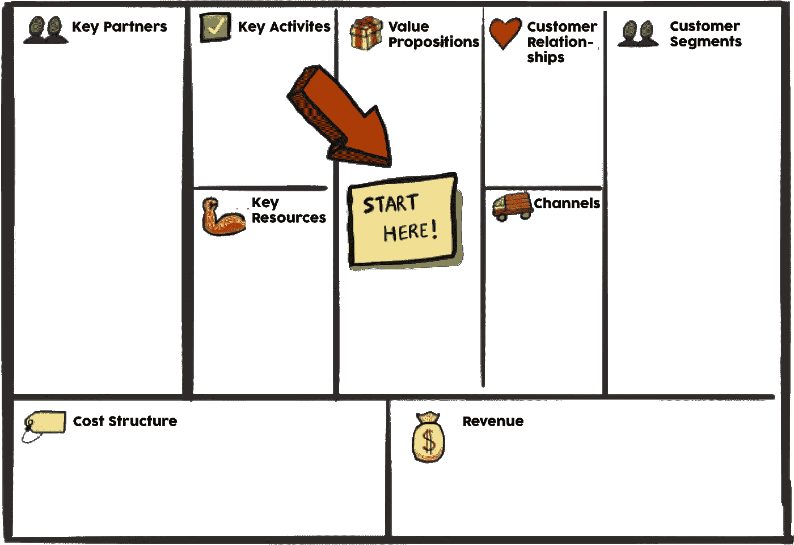
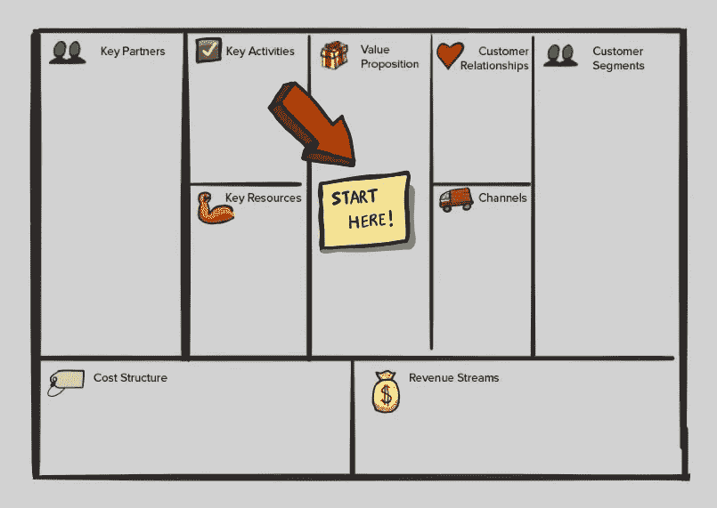

# 通过业务模型画布了解您的业务

> 原文：<https://medium.com/hackernoon/understanding-your-business-through-the-business-model-canvas-9fba2af06a39>

你需要一种直观的方式来帮助你理解商业模式。使用业务模型画布，您可以在规划和实施业务战略的许多不同领域中得到引导，并清楚地了解价值主张、可用资源等。

了解你的业务是重要的，了解你的竞争对手的业务也是必要的。商业模式画布的存在是为了让组织能够计划、交付和保留价值。

# 在你开始你的商业模式之前，看看我们的建议:

*   允许自己有 **1 小时**的不受干扰的时间，请不要超过这个时间！你有工作要做！
*   召集一些你的团队成员来帮助你制定计划。合适的人员在这里很重要。
*   当你在模型中工作时，找一个空间限制分心
*   准备好发挥创造力，深入思考！
*   不要用过去/现在来决定未来
*   企业中的每个部门可能有不同的模型。
*   如果你不知道，你猜！

# 通过业务模型画布工作

始终从价值主张开始，通过模型开始工作，了解您正在满足的需求，并确定您的受众正在接受的价值。你是做什么的？

在你建立了你的想法的价值主张后，剩下的就交给优先权了。解决你认为商业模式中最重要的方面。当你做这个练习时，把积木连接起来。如果您不确定这些部分的含义，请参见下面的列表:

## 价值主张—您是做什么的？

你满足了什么需求，你向你的观众传递了什么价值观

## 关键活动—您是如何做到的？

您的价值主张需要哪些关键活动？什么活动对你的分销渠道、客户关系、收入流等最重要？

## 关键资源—您需要什么？

你的价值主张需要哪些关键资源？

## 主要合作伙伴——世卫组织将帮助您？

谁是你的主要合作伙伴/供应商？合作的最重要动机是什么？

## 成本结构—成本是多少？

你工作中最重要的成本是什么？哪些关键资源/活动最昂贵？

## 收入流——你能赚多少？

你的观众愿意为什么价值买单？他们最近支付什么以及如何支付？他们喜欢如何付款？每个收入流对总收入的贡献有多大。

## 受众关系——你如何互动？

目标受众期望你建立什么样的关系？在成本和共振峰方面，你如何将它融入到你的作品中？

## 分销渠道——你如何接触到他们？

你想通过哪种渠道接触到你的观众？

## 观众群—世卫组织，你能帮忙吗？

你在为哪些群体创造价值？谁是你最重要的观众？

# 一旦你完成了…

在最初的计划阶段结束时，不要害怕与他人讨论你所开发的内容。尝试找出评审前可能遗漏的部分。有机会扩展你的业务吗？如果有，多少？你需要多少钱？你会在获得收入之前花光预算吗？有多少工作应该在室内完成，而不是在室外？

消除细节，你就走上了将想法转化为行动的道路！

商业模型画布看起来像是规划你下一个想法的有用工具吗？看看 cardboardit.com，今天就报名参加[30 天免费试用](https://app.cardboardit.com/users/sign_up)！

在社交媒体上找到我们！

[脸书](https://www.facebook.com/cardboardit/)、[推特](https://twitter.com/CardBoardIt)和[领英](https://www.linkedin.com/company/cardboardit/)

*原载于 2018 年 10 月 31 日*[*cardboardit.com*](https://cardboardit.com/2018/10/understanding-your-business-through-the-business-model-canvas/)*。*