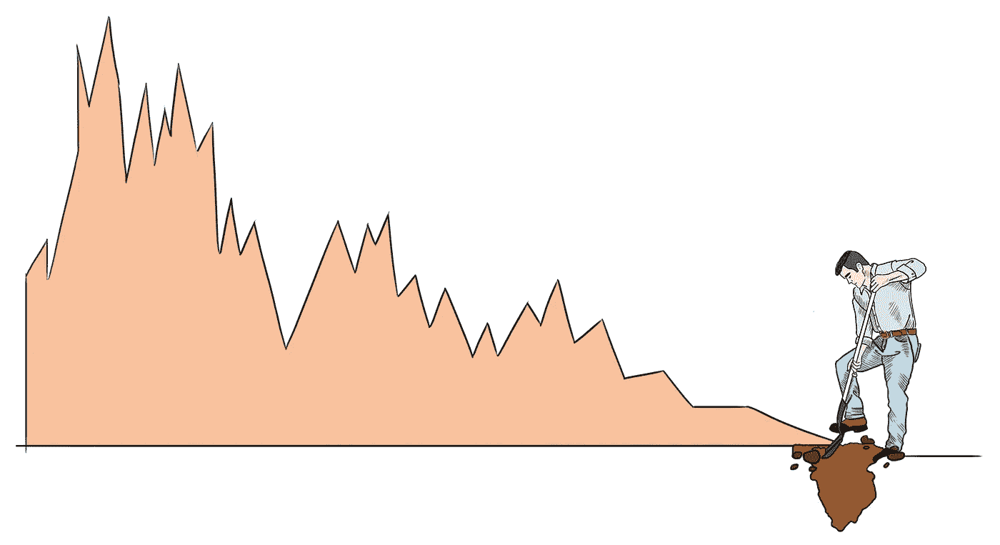
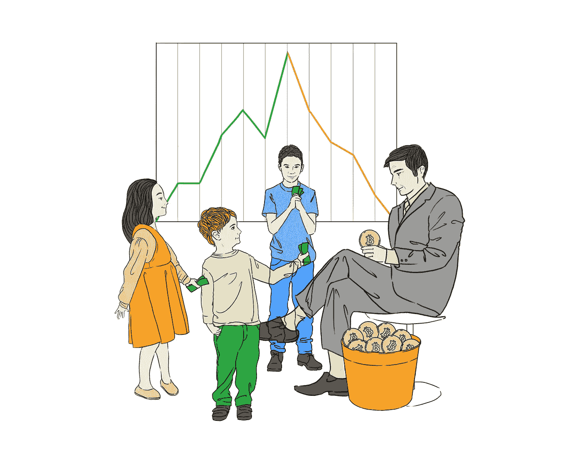

# 打破加密市场

> 原文：<https://medium.com/hackernoon/unf-ck-the-crypto-markets-4b02bd3d5d51>

# 让我们面对现实吧

密码市场目前陷入困境。他们面临着一致的操纵，以及比特币基地专业交易所、币安交易所和 Bittrex 交易所等个别主要交易所的具体问题，即使是最简单的代币互换和转让，也有许多问题需要关注。有要打败的机器人，要涉过的鲸鱼，要避开的顾问，要忽略的 ICO。但是，撇开可爱的文字游戏不谈，如今密码市场中的众多障碍已经让许多投资者和交易者感到厌倦，这些障碍已经让许多人付出了小到令人恼火，大到毁灭性的巨大财富的代价。

监管加密货币不一定会对市场产生任何影响。事实上，它可能最终会更糟。这里有一个与使加密更加规范相关的**缺点**的简短列表:

*   *人们已经把他们的钱投资到加密上，作为摆脱中央集权政府的一种方式。如果加密货币的最大优势(去中心化)被剥夺，它将失去将其作为投资工具的目的，随着投资者和交易所能做什么和不能做什么受到越来越多的限制，价值将大幅下降。加密货币的意识形态目标最终将会丧失。*
*   *监管实践可能导致权力滥用，由于分散的资产掌握在集中的权力手中，当权者如何利用加密货币来实现自己的目的将成为一个主要问题。*
*   除非监管完全无懈可击，否则那些足够精明、能发现其中漏洞的人将很有可能操纵新体系。

至于加密货币集中化监管的**利弊**:

*   *监管将强烈鼓励减少 ICO 骗局、操纵策略和完全的交易所内爆。由于泵和转储集团以及操纵策略(如清洗交易)的大幅减少，价格也将更加稳定。*
*   *监管实践的意图是建立一个更安全的加密货币投资空间。确保交易所的安全不一定会终结加密资产本身的去监管性质。*
*   人们的意识将会提高，中央政府将能够告知大众什么是加密以及如何投资。

具有讽刺意味的是，加密经纪人和交易所不受监管的性质是加密货币及其交易商愿意不惜一切代价维护的东西(即使许多人没有意识到这一点)，以摆脱缺乏自由和灵活性的传统经纪人的同义词。[来自《商报》](https://global.handelsblatt.com/editor/mmaisch)[的迈克尔·迈希](https://global.handelsblatt.com/opinion/an-argument-for-and-against-bitcoin-intervention-867652)解释道，

> “监管者和政策制定者当然应该确保交易以受监管的方式进行，他们应该尽可能地让市场免受操纵企图的影响。但除此之外，目前没有理由监管加密货币，因为过度热心的政客认为网络货币对不受约束的投资者的危害与吸烟或硬毒品一样大。”

市场中的痛苦、操纵和腐败会带来严重的副作用。不受监管是一把双刃剑**,因为有太多的障碍想要拿走你的钱，而你自己有能力成为这些市场的鲨鱼，并利用现有规则的缺失为自己谋利。操纵，低资本交易者面临的劣势，大量假冒专业知识的劣质建议，以及 ICO 的雷区，都是我们应该关注的问题。即使是最有经验的交易者也可能成为这些的牺牲品，成功的交易者只是找到了一个幸运的方法来解决这些问题。**

**围绕加密的结论是，市场不会很快崩溃，在市场中生存的最好方法是简单地了解他们面临的问题。这并不是说地平线上没有亮点——新的算法交易平台 [Level](http://lvl.co/?r=CxEGyn1x) 正在寻找方法，帮助交易员远离他们在这些高度动荡的市场中面临的所有地雷。但是，直截了当地说，在下面列出的市场环境条件得到改善之前，加密交易商目前都处于困境。**

# **弱势贸易**

**谈到加密货币交易，作为满是鲸鱼的大池塘中的一条小鱼，有一个非常明显的劣势。是的，这比传统市场的差异明显得多。根据市场新闻和研究做出正确的决定，准确评估硬币的价值，对成为一个盈利的交易者非常有帮助。但是，如果你是一个幸运儿，拥有至少可以暂时让市场朝着你希望的方向发展的资本，那该怎么办呢？理性的、基于研究的决定真的重要吗？**

****

**“We’re going lower, folks!” warned nobody who actually had control over the price of Bitcoin, ever.**

**根据 Hackernoon 作者 Bitfinex'ed 的一篇有趣的文章，他发现了一个他称之为“欺骗”的机器人，它能够随心所欲地拉动和操纵 Bitfinex 交易所[比特币](https://hackernoon.com/tagged/bitcoin)的价格。他说，**

> **“Spoofy 在他希望价格上涨时让价格上涨，Spoofy 在他希望价格下跌时让价格下跌，他得到了硬币……美元和比特币，当然可以实现这一点，而且在 Bitfinex 上不受惩罚。”**

**假设欺骗是这种交易者的一个孤立的例子，一个利用其压倒性的大量资本(天知道是从哪里来的)随心所欲地操纵市场的交易者，这将是令人难以置信的乐观。现实是，每天都有大量的比特币和其他替代货币[鲸鱼](https://www.ccn.com/bitcoin-whale/)**扭曲市场，使其对自己有利**。如果你不是那种可以随心所欲地推动价格涨跌的人，那么你实际上就处于劣势，受到 Spoofy 等账户的支配，这些账户基本上可以决定市场的走向。**

**事实是，我们大多数人都不是骗子，我们大多数人也不拥有数百万的加密资产，仅仅通过使用纯粹的资本就可以有效地影响市场。我们是一个巨大房间里的小玩家，房间里挤满了数百万其他小玩家和少数大玩家，他们或多或少会告诉我们什么时候该享受加密增长，或者埋头恐慌。**

# **不良建议来源**

**尽管我们喜欢拿充斥在我们脸书频道上的政治和各种话题中的假新闻开玩笑，但这些虚假来源对密码交易员来说是一个合理的问题。令人沮丧的是，我们有大量矛盾的、有偏见的和别有用心的故事告诉交易者他们下一步应该做什么，但这在这样一个年轻和蓬勃发展的资产类别中是意料之中的。除非你真的知道什么新闻故事是重要的，更不用说真实的了，否则很容易被市场误导。**

****

**Sources may tell you a certain coin is going to change the world, only to pull the rug out from underneath you as soon as they’ve completed their agendas.**

**以 2017 年末关于 [IOTA 与微软和思科](https://www.reuters.com/article/us-blockchain-iota-cisco/blockchain-network-iota-teams-up-with-cisco-volkswagen-others-on-data-marketplace-idUSKBN1DS2EE)合作的新闻为例。最初在 2017 年 11 月下旬宣布，IOTA 的市值迅速从 30 亿美元飙升至 170 亿美元。一枚硬币在现实世界中与两位技术领袖合作的兴奋足以在整个密码界引起**大规模的歇斯底里。然而，仅仅两周之后，[声称他们没有正式的合作关系](https://cointelegraph.com/news/iota-clarifies-misleading-microsoft-quote-no-official-partnership)，IOTA 平息了谣言，他们只是“……在市场上与 30 多家世界上最大的公司一起工作，作为一项共同创新活动。”正如你可能猜到的那样，IOTA 的价值直线下降，回到了它开始的地方，许多在看涨消息中跳跃的交易者最终变成了轻装上阵的人。****

**以下是一些避免假新闻以及对新闻和虚假/夸大的故事做出错误反应的技巧:**

*   ****对社交媒体的加密新闻持保留态度** —有很多可靠的脸书和推特发帖者，他们提供了大量基于来源的内容以及引用的和基于事实的信息。他们通常有大量的追随者和活跃的、有见地的评论区。然而，几乎任何人都可以在社交网络上发布关于比特币即将消亡或新的 sh*tcoin 将在下周达到 Coinmarketcap 前 5 名的消息(尽管它目前排名第 1064 位)。不要假设他们知道自己在说什么。众所周知，他们的预测是开玩笑的，或者是为了完成一项残酷的社会实验，看看他们能说服多少绵羊相信这些废话。如果他们的帖子中有一半是一年前的重复模因，他们的评论区充满了互相奚落和煽动网络争斗的人，这可能表明你关注错了人。**
*   **跟随那些经历过沉浮的专家——那些经历过 Mt. Gox 崩溃、无数国家禁令和解禁，以及诸如[以太坊创始人假死](https://futurism.com/ethereum-lost-4-billion-in-market-value-due-to-fake-fatal-car-crash/)等荒谬骗局的长期密码交易员往往只在需要的时候才按下恐慌按钮。在你的新闻订阅中加入可靠的理性声音是避免你自己反应过度的一个好方法。**
*   ****在你的消息来源中寻找消息来源**——如果一个重要的新闻故事正在一个不可信的网站或一个你不熟悉的网站上报道，看看他们的故事有什么类型的引用/链接。除了你在 Reddit 上看到的这个有 6 张赞成票的帖子，网络上还有类似的报道吗？也许等它在其他地方出现后，再假设它是真理。**

# **首次公开募股炒作——真正的泡沫指示器**

**首先，在网络泡沫的顶峰时期，有一件事值得注意，那就是公司是如何简单地通过认为自己有潜力做大的想法来筹集资金的。首次公开募股，更为人所知的是 IPO，通常被用作这些公司获得牵引力并上市的工具**，尽管其中许多公司没有公开使用或产生任何利润或收入的历史**。这听起来熟悉吗？加密货币对寻求融资的新加密令牌使用类似的方法，称为初始硬币发行(ICO)。**

****

**“Yes, peasants. My ICO will indeed cure cancer, fly us to Neptune, and provide the ability to time travel to meet Marty and Doc in their DeLorean. It’s the latest new Bitcoin of Bitcoins! Just trust me on this one.”**

**这些 ICO 基于吸引投资者购买具有潜在用例的硬币，它们本质上在加密货币世界中充当“众筹”。对于对硬币感兴趣的个人来说，它们是“从一开始就参与进来”的机会，希望硬币和管理各自硬币的团队将把它变成成功的东西，从而为投资者产生巨大的利润。ICO 当然有助于让值得的硬币出现，并且有几个成功的故事，例如以太坊的 2014 年 ICO，以每枚硬币 0.40 美元的价格筹集了超过 1800 万美元(截至 2018 年 8 月 15 日，目前为 281 美元)。然而，也有很多不成功的 ICO。根据 news.bitcoin.com 的密码分析师 Kai Sedgwick 的文章，**

> **“从去年开始，531 个已经失败或正在失败的 ico 中，有许多从一开始就显得很粗略。在大多数情况下，投资者能够发现迹象并避开。然而，并非所有人都毫发无伤地逃脱了:这些项目仍然筹集了 2.33 亿美元……由于回报减少，竞争加剧，以及永无止境的机会主义 ico，2018 年的加密投资比以往任何时候都更具风险。”**

**正如我们在互联网泡沫期间看到的那样，承诺很少的 ICO 获得了巨大的支持，特别是在 2017 年下半年，加密货币经历了大规模的历史性牛市。投资者喜欢在繁荣行业的小项目上赌博。但是他们自己的选择往往会让他们误入歧途。**

# **ICO 和 S-Token 诈骗**

**[最初的硬币发行](https://www.investopedia.com/terms/i/initial-coin-offering-ico.asp) (ICO)通常对投资者非常有吸引力，因为硬币的巨大回报潜力以及如果突破市场，巨大的风险/回报回报。但是历史上 ICO 的成功率非常低，因此存在风险。事实上，通过 ICO 融资并进入市场的硬币清单[比](https://icowatchlist.com/finished/best-returns)[历史上提供给投资者的大量 ICO 清单](https://www.cryptocompare.com/ico/#/completed)小得惊人。然而，成功的代币给投资者带来了丰厚的回报，列表显示像 NEO 这样的 ICO 自上市以来已经获得了 294，000%的投资回报率。**

**投资首次发行的硬币可能会有很大的风险，这真的是投资的终极赌博。如今，几乎每一个 ICO 符号都声称自己在改变世界，但很少有人能兑现承诺。许多人甚至没有任何上市的打算。原始数据表明，大多数时候，投资者根本就不应该相信即使是最出色的 [**白皮书**](https://www.investopedia.com/terms/w/whitepaper.asp) 的炒作。请记住，查看 coin 在这些功能文档上的初始计划可能会与他们实际公开上市的产品有很大差异。在事情正式确定之前，可以对他们最初的计划进行许多修改、调整、添加和删减。这就是为什么投资者最好使用白皮书作为指南，以了解特定硬币的 ICO 在[区块链](https://hackernoon.com/tagged/blockchain)上阐述的要点。不要把它作为决定它们是否值得你花时间投资的依据。**

**Talla.com 首席执行官罗布·梅表达了自己的观点，他说:**

> **“我认为像评估初创公司一样评估区块链要好得多——你假设起点是起点，而不是终点。在我看来，密码购买者评估白皮书就像评估最终产品一样，这就是他们出错的地方。”**

**2016 年，9500 万美元通过 43 次不同的首次硬币发行筹集。2017 年，这个数字膨胀了大约 39 倍，达到 37 亿美元，分布在 209 个独立的 ICO 上。截至今年上半年，2018 年 ICO 的募集资金*120 亿美元，随着近几周(7 月中旬)比特币的价格和成交量明显回升，并没有放缓的迹象。如果今年继续以这种总体速度增长，300 亿美元的 ICO 融资肯定是可以实现的。***

# ***战胜市场——大卫与歌利亚的心态***

***击败加密货币市场有时似乎令人生畏且不可能，但最好的办法是**专注于长期目标和投资**。花时间真正研究一下最近备受关注的一些硬币，特别是那些目前在 [CoinMarketCap](https://coinmarketcap.com/) 上排名靠前的硬币。这些受欢迎的硬币不一定是你想投资的，但对那些已经有了追随者的人进行可靠的研究通常会容易得多。理解这些硬币的使用案例。一些项目，如比特币，比其他项目走得更远，已经被用于现实世界的交易。但也有少数已经公开上市或仍处于 ICO 阶段的公司拥有潜在的突破性想法和令人印象深刻的白皮书。***

***由于加密货币每小时都会发生巨大的价格波动，因此很容易陷入交易波动，而这种波动在加密市场通常是巨大的。但是不要被这个困扰。当机会来临时，专注于重新平衡你的投资组合。卖掉你赢的硬币的利润来增加你可能有的亏损头寸。Lvl.co 的***等**网站甚至会为你自动完成这个过程，这样你就可以最大限度地减少对图表的关注，在进行有利可图的交易的同时享受你的一天。** [美元成本平均法](https://www.nasdaq.com/article/why-dollar-cost-averaging-is-a-smart-investment-strategy-cm354240)你的买卖是确保你从交易等式中去除贪婪和恐惧等情绪的另一种方式。******

****在一个充满掠夺者的放松管制的市场中，知道自己作为交易者的角色看起来绝对可怕，在某种程度上，的确如此。但是，自我意识到自己的位置，并了解他人可能不可信的事实，只会激励你对自己正在考虑的代币进行研究。那些做出理性和不带感情色彩的决定的人是那些找到最大化回报同时最小化风险的方法的人，尽管**事情现在是多么的糟糕**在密码的美好世界里。****

*******我在*** [***水平***](http://lvl.co/?r=CxEGyn1x) ***写了深入的加密货币分析，用于加密的被动投资工具。参见我们在做的***[***Lvl.co***](http://lvl.co/?r=CxEGyn1x)***以及参见我们的其他分析在*** [***我们的杂志***](https://medium.com/samsa-ai?utm_medium=partner&utm_source=hackernoon&utm_campaign=samsa_publication) ***。如果你喜欢你所看到的，给这篇文章 50 个掌声！如果你讨厌它，就用 49 表示你的不满。*******

*****本文及相关内容仅供参考。这不应被视为投资建议，你应该咨询财务顾问，并在进行任何投资之前进行自己的研究和尽职调查。在引用证券或商品时，仅用于说明目的，并不意味着对证券或商品分类的任何立场。就提供或讨论的* [*级*](http://lvl.co/?r=CxEGyn1x) *服务而言，这些服务仅可用于* [*级*](http://lvl.co/?r=CxEGyn1x) *白名单资产。*****