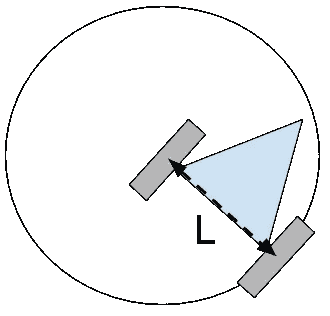

# 独轮车到差动驱动:Coursera 用 ROS 和 ROSbots 控制移动机器人——第二部分

> 原文：<https://medium.com/hackernoon/unicycle-to-differential-drive-courseras-control-of-mobile-robots-with-ros-and-rosbots-part-2-6d27d15f2010>

欢迎回到我们的多部分 [Coursera 的移动机器人控制](https://www.coursera.org/learn/mobile-robot) (CMR)系列的第 2 部分。这个系列用 [ROS](http://www.ros.org) 和 [ROSbots 机器人](http://www.rosbots.com)实现了从 CMR 学到的概念。

ROSbots 是一款基于树莓派的机器人套件。机器人套件旨在成为一个易于访问且非常友好的实验平台，添加其他传感器和致动器来实现您遇到的任何新的机器人概念。我们的代码是[在 Github 上开源](https://github.com/rosbots)。

组装这套工具大约需要一个小时。为了避免自己编译 ROS 和 OpenCV 的痛苦，我们有一个 [Raspbian ROS + OpenCV SD 卡镜像](/@rosbots/ready-to-use-image-raspbian-stretch-ros-opencv-324d6f8dcd96)你可以下载使用。

在我们系列的第 1 部分，[我们连接了 ROSbots 的 L9110 电机驱动器，并实现了 ROS 节点，让 UNO 板驱动我们机器人的轮子](/@rosbots/apply-coursera-control-of-mobile-robots-with-ros-and-rosbots-part-1-777a51f63617)。我们编译并上传到 UNO 的 ROS 固件订阅了两个 ROS 主题，`/wheel_power_left`和`/wheel_power_right`。在这些主题下发布的`Float32` ROS 消息描述了通过各自的脉冲宽度转动每个车轮的归一化功率(最大反向与最大正向之比在-1.0 和 1.0 之间)。

我们通过使用内置的`rostopic`命令行工具手动发布一个`Float32` ROS 消息来驱动每个轮子，从而结束了第 1 部分。

在第二部分中，我们将描述机器人差动驱动系统的运动学和动力学。然后，我们将应用这种理解并实现 ROS 代码，以遥控(RC)远程操作的方式可预测地驱动机器人。这将大致遵循来自 [CMR 第 1 周](https://www.coursera.org/learn/mobile-robot/home/week/1)和[第 2 周](https://www.coursera.org/learn/mobile-robot/home/week/2)的课程和编程任务。

对于那些熟悉 CMR 课程并且可能使用 [Sim 实现了课程的 Matlab 编程任务的人。I.am 模拟器](http://jpdelacroix.com/simiam/)，我们将使用 CMR 课程中描述的大致相同的文件和架构结构来实现我们的 ROS 版本。

# 单轮和差动驱动模型

由于轮式机器人不能飞行，我们只关心定义其姿态的三种状态:

```
x - position on the x-axis (ie in meters)y - position on the y-axis (ie in meters)φ - phi - angle of the unicycle counter clockwise from x-axis (ie in radians)
```


State and inputs for a unicycle model

对于独轮车模型，有 2 个输入影响机器人的这 3 种状态:

```
v = forward velocity (ie meters per second)w = angular velocity (ie radians per second)
```

虽然轮式机器人可以有任意数量的轮子和影响其姿态的更复杂的因素，但我们方便地使用独轮模型来描述大多数轮式机器人的动力学，因为它易于理解和直观。具体来说，我们直观地用`v`和`w`来描述独轮车会如何运动。

这一切都很好，但我们的 ROSbots 机器人是一个差动驱动机器人，两个轮子各有 2 个输入:

```
v_r = clockwise angular velocity of right wheel (ie radians per second)v_l = counter-clockwise angular velocity of left wheel (ie radians per second)
```

幸运的是，我们可以将独轮输入转换为差分驱动输入。在描述转换公式之前，我们需要用直尺进行一些测量。


Differential Drive Model

```
L = wheelbase (in meters per radian)R = wheel radius (in meters per radian)
```

因为`R`是车轮半径的度量单位，所以将`R`视为每弧度的米数是有意义的。

对`L`来说，这并不那么直观。在差速驱动运动学模型中，你可以把`L`想象成一个轮子旋转同时保持另一个轮子不动所画的圆的半径。所以`L`也是以米/弧度为单位，也就是那个圆的半径。



L is in meters per radian

我们不会进入令人痛苦的细节(因为这不是一个关于运动学的帖子)，但总的来说，我们可以使用独轮车模型的[运动学和差动驱动模型](http://planning.cs.uiuc.edu/node660.html)的[运动学来得出以下等式，以将独轮车`v`和`w`输入转换为我们的 ROSbots 机器人的`v_r`和`v_l`差动驱动输入。](http://planning.cs.uiuc.edu/node659.html)

```
v_r = ((2 * v) + (w * L)) / (2 * R)v_l = ((2 * v) - (w * L)) / (2 * R)
```

两个方程的分子单位都是米每秒。分母是米每弧度。v_r 和 v_l 分别以弧度/秒表示，顺时针和逆时针——这正是我们所期望的。

# ROS 中单轮驱动到差动驱动的转换

上面的两个方程是我们的甜心方程，我们在 ROSbots 机器人的 ROS 节点中实现了它们。

为了测试我们的机器人，我们将以遥控(RC)远程操作的方式驱动我们的机器人，通过键盘命令指定`v`和`w`输入。键盘接口是通过一个由 ROS 社区创建的[teleop _ twist _ keyboard ROS node](http://wiki.ros.org/teleop_twist_keyboard)应用程序。

SSH 到您的 ROSbots 机器人上的 Raspberry Pi (RPi)。在您的 RPi 运行中:

```
$ update_rosbots_git_repos
```

这应该可以从 Github 获取最新的 ROSbots 库源文件。

我们还将假设您正从我们离开第 1 部分的地方继续学习。具体来说，您可以通过以下方式将 motor_driver 固件编译并上传到 ROSBots 的 UNO 板上:

```
$ upload_firmware ~/gitspace/rosbots_driver/platformio/rosbots_firmware/examples/motor_driver/
```

作为健全性检查，如果您运行`$ rosnode list`，下面是正在运行的 ROS 节点:

```
/rosout
/uno_serial_node
```

如果您运行`$ rostopic list`，以下是 ROS 主题:

```
/diagnostics
/rosout
/rosout_agg
/wheel_power_left
/wheel_power_right
```

现在运行让我们运行独轮车来区别驱动模型机器人代码。同样，从 RPi SSH 终端运行:

```
$ rosrun rosbots_driver part2_cmr.py
```

如果您应该看到以下输出，则 ROS 节点正在工作:

```
[INFO] [1521228417.529282]: /part2_cmr RCTeleop initialized
[INFO] [1521228417.595446]: /part2_cmr wheelbase: 0.14 wheel radius: 0.035
[INFO] [1521228417.596918]: /part2_cmr v: 0 w: 0
[INFO] [1521228417.598303]: /part2_cmr vl: 0.0 vr: 0.0
[INFO] [1521228417.605237]: /part2_cmr right power: data: 0.0 left power: data: 0.0
[INFO] [1521228418.098403]: /part2_cmr v: 0 w: 0
[INFO] [1521228418.101346]: /part2_cmr vl: 0.0 vr: 0.0
[INFO] [1521228418.104728]: /part2_cmr right power: data: 0.0 left power: data: 0.0
...
```

现在**为机器人上的 RPi 打开另一个 SSH 终端**。

我们来看看还有哪些额外的 ROS 话题发布。从 RPi 上的第二个 SSH 终端运行`$ rosnode list`，您应该会看到列出了新的`/part2_cmr` ROS 节点:

```
/part2_cmr
/rosout
/uno_serial_node
```

现在让我们看看运行`/part2_cmr` ROS 节点给 ROS 系统增加了哪些其他主题。

在第二个 SSH RPi 终端中，键入
`$ rostopic list` —您应该会看到一个额外的`/part2_cmr/cmd_vel`主题。

键入`$ rostopic info /part2_cmr/cmd_vel`，您将获得关于`/part2_cmr/cmd_vel`主题的更多信息:

```
Type: geometry_msgs/TwistPublishers: NoneSubscribers: 
 * /part2_cmr ([http://192.168.0.22:33183/](http://192.168.0.22:33183/))
```

本主题传输一个 [ROS 扭转消息](http://docs.ros.org/api/geometry_msgs/html/msg/Twist.html)类型。扭曲信息是标准[几何 _msgs ROS 包](http://wiki.ros.org/geometry_msgs)的一部分，该包包含许多用于描述机器人几何和运动学的通用信息。

如果你看看 [ROS 扭曲信息](http://docs.ros.org/api/geometry_msgs/html/msg/Twist.html)的定义，你会注意到它实际上可以编码 6 个自由度的运动——3 个为线性运动，3 个为角度运动。我们实际上只需要 2 个 DOF——linear . x 是我们的`v`和 angular.z 是我们的`w`。

注意我们的`/part2_cmr` ROS 节点是主题的订阅者，但是目前没有发布者！没有人告诉机器人该做什么。

让我们通过运行`teleop_twist_keyboard` ROS 节点来添加一个发布者。在第二个 SSH RPi 终端中，键入:

```
$ rosrun teleop_twist_keyboard teleop_twist_keyboard.py /cmd_vel:=/part2_cmr/cmd_vel
```

默认情况下，`teleop_twist_keyboard` ROS 节点向名为`/cmd_vel`的主题发布 Twist 消息。`/cmd_vel:=/part2_cmr/cmd_vel`参数告诉 rosrun 将`/cmd_vel`名称重新映射到`/part2_cmr/cmd_vel`，所以现在发布的主题名称对于发布的`teleop_twist_keyboard` ROS 节点和订阅的`/part2_cmr` ROS 节点是相同的。

一旦运行了`teleop_twist_keyboard` ROS 节点，让我们首先调整线速度和角速度因子。点击“x”按钮，直到到达`speed 0.174`附近，点击“e”键，直到到达`turn 2.59`。如果你有 3 到 4 个小数位，那很好:

```
...
currently: speed 0.17433922005 turn 2.5937424601
```

正如运行 teleop_twist_keyboard 的输出所描述的，使用小写 u i o j k l…键来驱动你的 ROSbots 机器人。

RC Teleoperating ROSbots

噢耶！

# ROSbots 实现细节

我们大致平行于 CMR 课程的 Sim 的软件设计和文件结构。我是 Matlab 模拟器。

从我们源代码的顶层[通过。/part2/full 文件夹，您会看到以下文件结构:](https://github.com/ROSbots/rosbots_driver/tree/master/scripts/examples/coursera_control_of_mobile_robots/part2/full)

```
├── controller
│   ├── controller.py
│   ├── dynamics
│   │   ├── differential_drive.py
│   │   ├── __init__.py
│   ├── go_to_angle.py
│   ├── __init__.py
│   ├── rc_teleop.py
│   ├── robot.py
│   ├── supervisor.py
└── part2_cmr.py
```

`/part2_cmr` ROS 节点的 main()函数在顶层的`part2_cmr.py`中。在 main()内部，我们创建了一个`Supervisor`对象，并通过以下方式每秒调用它的 execute()函数两次(2Hz ):


创建主管时，它做三件事。

1.  创建一个`Robot`对象
2.  创建一个`DifferentialDrive`对象。
3.  为定义的目标创建所有需要的控制器对象——在我们的例子中，我们只需要一个控制器对象，即`RCTeleop`控制器。

控制器决定机器人做什么。例如，您可以创建一个“到达目标”控制器来规划到达特定航路点的路径。您可以创建转向角度控制器，以转向并跟踪特定的角度方向φ。现代汽车有一个速度控制器，又名巡航控制器，用于加速/减速和跟踪特定的速度。

在这篇第 2 部分的文章中，我们的主管将会有一个遥控独轮车控制器来执行遥控独轮车命令。在初始化时，`RCTeleop`订阅了`/part2_cmr/cmd_vel`主题并监听`Twist`独轮车命令。


rc_teleop.py

`self.twist_cb(.)`回调函数在`Twist`消息到来时被调用，并存储`v`和`w`速度。


rc_teleop.py

当管理者创建`Robot`对象时，`Robot`对象从 [ROS 参数服务器](http://wiki.ros.org/Parameter%20Server)获取其轴距和车轮半径的尺寸以及其电机的最小和最大速度(是的，真实的机器人有真实的物理极限)。


robot.py

当管理程序创建一个`DifferentialDrive`对象时，它会传递轴距和车轮半径测量值，因此`DifferentialDrive`对象可以准确地**将独轮车前进和角速度输入转换为差动驱动轮速度输入**。

这就是初始化的大部分内容。

每次调用`supervisor.execute()`时，管理程序执行以下操作:

1.  执行当前控制器—`RCTeleop`控制器——以获得独轮`v`和`w`速度。
2.  调用`DifferentialDrive`将独轮车`v`、`w`速度转换为`v_r`和`v_l`车轮速度。
3.  将`v_r`和`v_l`速度传递给`Robot`，后者将`Float32` ROS 消息发布给`/wheel_power_left`和`/wheel_power_right` ROS 主题——指导我们的 UNO 板转动 ROSbots 各自的轮子，如我们系列的第 1 部分所述。


Each time the Supervisor gets executed: supervisor.py

`RCTeleop`控制器的执行功能只是返回其存储的当前`v`和`w`。这里没什么令人兴奋的。


rc_teleop.py

`DifferentialDrive’s` `uni_to_diff(.)`功能实现了单轮驱动到差动驱动模式的转换。这是我们两个甜心函数实现的地方。

`Robot`的`set_wheel_speed(.)`功能有几个重要的职责。

1.  它将车轮速度限制在电机的物理限制范围内。
2.  **将车轮速度转换为车轮功率**。如果您还记得第 1 部分，我们的 motor_driver 固件只支持在-1.0 和 1.0 之间归一化的车轮功率——全速返回全速前进。`set_wheel_speed(.)`功能使用我们之前在 ROSbots 机器人上测量的空载速度的查找表将速度转换为功率。
3.  **我们的电机也有一个最小速度**。有一个最小脉冲宽度阈值，在这个阈值下，电机不会转动。如果控制器希望速度低于这个阈值，电机将无法支持它，所以目前我们只是设置电机速度为零，以节省电力。

难道我们不爱真实硬件的凌乱吗？

这就引出了第 2 部分的结论。我们已经谈到了单轮模型以及如何将单轮模型输入转换为差分驱动模型输入。我们在 ROSbots 机器人上使用 ROS 实现了这个系统，并以遥控操作的方式测试了这个系统。

在下一篇第 3 部分的文章中，我们将开始实现反馈，这是有效控制系统的关键部分。

像往常一样，关注@rosbots on Medium 获取更新。在 Instagram 和脸书[上关注我们吧！](https://www.facebook.com/hackrosbots)

欢迎在此评论或提问。但是如果你有技术问题，请在 answers.ros.org 上发表(主题“ROSbots question:*blahblah*”，标签“ROS bots”)。

如果你想合作，或者只是想打个招呼，请不要犹豫，去寻求一般的反馈。

如果你还没有这样做，[在这里购买你自己的 ROSbots 机器人](https://www.rosbots.com/purchase)跟着做吧。

谢谢！
杰克“机器人制造商”