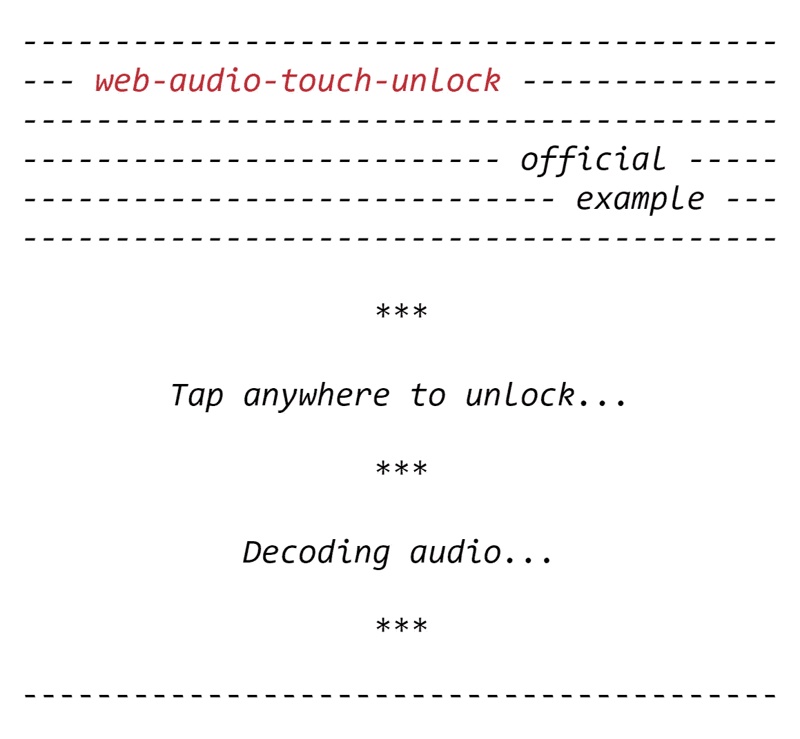

# 解锁网络音频——更智能的方式

> 原文：<https://medium.com/hackernoon/unlocking-web-audio-the-smarter-way-8858218c0e09>

[Web Audio](https://hackernoon.com/tagged/web-audio) [API](https://hackernoon.com/tagged/api) 为控制 Web 上的音频提供了一个强大而通用的系统，允许开发人员选择音频源、为音频添加效果、创建音频可视化、应用空间效果(如平移)等等。

它可以用于[开发](https://hackernoon.com/tagged/developing)复杂的基于网络的游戏或交互式应用，包括现代游戏音频引擎的功能以及现代桌面音频制作应用中的一些混合、处理和过滤任务；它可以很好地补充 [WebGL](https://get.webgl.org/) 提供的更高级的图形功能。

所有这些**听起来**棒极了(双关语)，尽管在 iOS 设备上有一个小小的[警告](https://developer.apple.com/library/content/documentation/AudioVideo/Conceptual/Using_HTML5_Audio_Video/PlayingandSynthesizingSounds/PlayingandSynthesizingSounds.html#//apple_ref/doc/uid/TP40009523-CH6-SW6):网络音频 [API](https://hackernoon.com/tagged/api) 要求在任何声音可以在网页上播放之前，声音必须由明确的用户动作触发，比如轻击。

iOS 设备之所以施加这种用户手势限制，是因为他们希望通过阻止广告或视频在用户与内容实际交互之前播放声音来保持愉快的用户体验，同时也是为了节省电池寿命，因为播放音频确实需要额外的处理能力。

在 Web Audio API 中，一切都发生在一个`[AudioContext](https://developer.mozilla.org/en-US/docs/Web/API/AudioContext)`中，这是一个由音频节点链接在一起构建的音频处理图，它控制它所包含的节点的创建以及音频处理或解码的执行。

在 iOS 设备上，这个上下文最初是挂起的(“锁定”)，为了在网页上启用声音，我们需要在第一次用户交互中让它脱离挂起状态，或者“解锁”。

[这个问题的早期解决方案](https://paulbakaus.com/tutorials/html5/web-audio-on-ios/)提出在运行中创建一个空声音，并在用户与页面交互后播放。

这种方法之所以有效，是因为在实际播放音频之前，[在锁定的音频环境中播放音频源会将其设置为](https://github.com/WebKit/webkit/blob/750df37180842038b25fc9efe18fc40053785e24/Source/WebCore/Modules/webaudio/AudioContext.cpp#L978) `[running](https://github.com/WebKit/webkit/blob/750df37180842038b25fc9efe18fc40053785e24/Source/WebCore/Modules/webaudio/AudioContext.cpp#L978)` [状态](https://github.com/WebKit/webkit/blob/750df37180842038b25fc9efe18fc40053785e24/Source/WebCore/Modules/webaudio/AudioContext.cpp#L978)。

让我们开始把一些代码放在一起，以便尝试提出一个更简单的解决方案。首先，我们需要实例化一个音频上下文，以便能够进行任何音频操作:

然后，在我们创建音频上下文之后，我们应该检查它的[状态](https://developer.mozilla.org/en-US/docs/Web/API/BaseAudioContext/state)属性。
如果状态等于`suspended`，我们可能正在处理一个 iOS 设备:

一些桌面浏览器，如 [Firefox Quantum](https://www.mozilla.org/en-US/firefox/) 在实例化后会在`suspended`状态中留下一个音频上下文，因此为了确保我们真正处理的是 iOS 设备，我们需要检查触摸事件是否可用:

如果音频上下文被挂起，我们可以调用它的`[resume](https://developer.mozilla.org/en-US/docs/Web/API/BaseAudioContext/resume)()`方法将其设置为`running`状态:

现在，你可能会想“*嗯，事情不可能这么简单…”*

…你是对的😔。这段代码需要在用户交互中运行，以便实际工作。因此，我们将把它包装在一个函数中，并添加该函数作为触摸事件监听器。

为了尽快尝试解锁音频上下文，我们将在页面上任何地方发生第一个`[touchstart](https://developer.mozilla.org/en-US/docs/Web/Events/touchstart)`事件时运行我们的代码:

这种方法的一个问题是，一些 iOS 版本的[试图在](https://bugs.webkit.org/show_bug.cgi?id=149367#c7) `[touchstart](https://bugs.webkit.org/show_bug.cgi?id=149367#c7)` [事件上解锁网络音频无法工作](https://bugs.webkit.org/show_bug.cgi?id=149367#c7)。

> `touchstart`可能是滚动手势的开始，并且从用户的角度来看，在该手势期间播放音频可能是完全不期望的。

因此，考虑到这一点，我们还需要尝试从`[touchend](https://developer.mozilla.org/en-US/docs/Web/Events/touchend)`事件以及最初的`touchstart`事件中解锁网络音频:

一旦音频上下文被解锁，我们将想要移除触摸事件监听器，因为我们不再需要它们了。为此，我们需要弄清楚音频上下文实际上是何时解锁的。

在早期的解决方案中，确定这一点的技术是查询声音的`playbackState`属性，这是在开始播放后不久动态创建的。之后直接做是不行的，因为启动声音是一个异步动作，所以查询必须通过超时回调来完成。
然后，如果声音在`PLAYING_STATE`或`FINISHED_STATE`中，您可以假设上下文被解锁。

这种方法在某些情况下可能仍然有效，但它远非简单，并且引入了兼容性问题，因为官方 Web 音频 API 规范不再支持`[playbackState](https://developer.mozilla.org/en-US/docs/Web/API/Web_Audio_API/Porting_webkitAudioContext_code_to_standards_based_AudioContext#Removal_of_AudioBufferSourceNode.playbackState_and_OscillatorNode.playbackState)` [。](https://developer.mozilla.org/en-US/docs/Web/API/Web_Audio_API/Porting_webkitAudioContext_code_to_standards_based_AudioContext#Removal_of_AudioBufferSourceNode.playbackState_and_OscillatorNode.playbackState)

一件有趣的事情是音频上下文的`resume`方法实际上返回了一个`[Promise](https://developer.mozilla.org/en-US/docs/Web/JavaScript/Reference/Global_Objects/Promise)`对象。当该承诺兑现时，我们确定音频上下文已被解锁，并且我们可以移除触摸事件监听器:

这就是你要做的:在 iOS 设备上解锁网络音频的防弹方式！

让我们再做一些调整，使这段代码可以重用。
首先，让我们把它包装在一个函数中:

最后，让我们提供一些有用的信息，如是否真的需要解锁网络音频，或者是否发生了错误以及原因是什么。
我们可以通过将所有内容包装在一个`Promise`中并从我们的函数中返回来实现这一点:

现在，您可以在代码中的任何地方使用该函数，如下所示:

# 结论

这就是在 iOS 设备上解锁网络音频 API 的简单有效的方法！

我已经创建了一个名为 [web-audio-touch-unlock](https://github.com/pavle-goloskokovic/web-audio-touch-unlock/) 的 [npm 包](https://www.npmjs.com/package/web-audio-touch-unlock)，它公开了这个方法，并使它易于在您自己的项目中使用。
只需将您的`AudioContext`实例传递给它，您就可以开始了！

你可以在这里自己尝试一下[。](https://pavle-goloskokovic.github.io/web-audio-touch-unlock-example/)

干杯！

**Tap anywhere to unlock…**