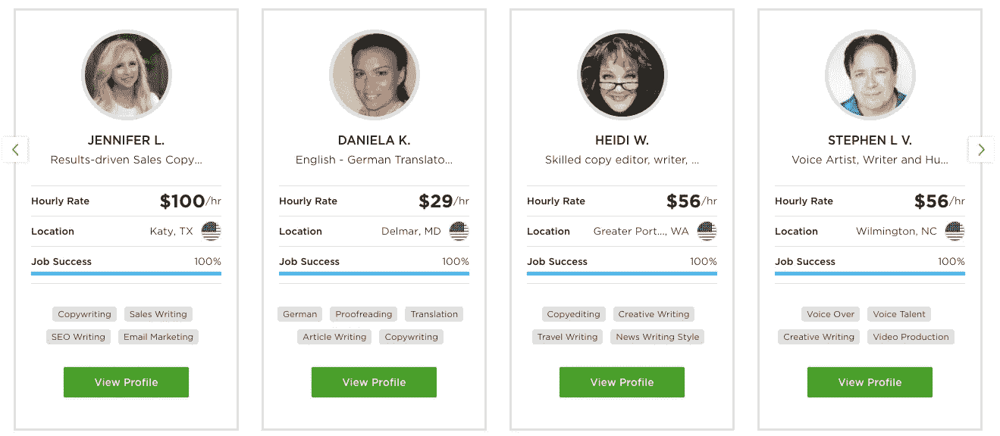

# 打开 Upwork 的 S-1:市场的衡量标准和教训

> 原文：<https://medium.com/hackernoon/unpacking-upworks-s-1-metrics-lessons-for-marketplaces-5c7b69595052>

对于风险投资支持的市场来说，明年看起来将是一个激动人心的时刻。许多公司预计将在 2019 年上市(优步、Lyft 和 Airbnb)，其他公司(Instacart、Thumbtack、Wag 和 Postmates)也将紧随其后。我们已经看到几个市场在本月首次亮相，Farfetch 和 Eventbrite 开始交易，并在上周为其 IPO 定价。

作为消费者和投资者，我们都是市场商业模式的忠实粉丝，并且很高兴看到公众市场对这些 IPO 的反应。CRV 已经与 [DoorDash](https://www.doordash.com/) 、 [ClassPass](https://classpass.com/) 、 [Patreon](https://www.patreon.com/) 、 [Pared](http://www.pared.com/) 以及其他公司合作，我们已经亲眼目睹了一个成功的市场所固有的病毒式传播、有利的经济状况以及忠诚的客户关系。

我们对 Upwork 即将进行的首次公开募股特别感兴趣，因为我们与该公司的个人历史(贾丝汀在斯坦福大学的毕业论文[是关于 Upwork 的！)以及我们对支持更灵活工作的平台的广泛兴趣。我们分析了该公司的](https://economics.stanford.edu/sites/default/files/publications/honors_thesis_-_justine_moore_2016.pdf) [S-1](https://www.sec.gov/Archives/edgar/data/1627475/000119312518267594/d575528ds1.htm) ，我们很高兴分享我们对 Upwork 的增长路径、竞争定位以及与其他公开市场相比的经济性的看法。

如果你正在建立一个市场，或者对 Upwork IPO 有想法，请发电子邮件到**twins@crv.com**给我们——我们希望听到你的意见！**此外，** **如果你对 IPO 感兴趣，但没有时间阅读整篇文章，请前往底部的“分析摘要”。我们已经根据 S-1 和我们的市场分析总结了我们的利弊。**

*注:“过去一年”或“过去一个季度”是指截至 2018 年 6 月 30 日的一年或一个季度，如 Upwork 的 S-1 所述。*

# **公司概况**

Upwork 是世界上最大的自由职业者市场，于 2015 年由 Elance(成立于 1999 年)和 oDesk(成立于 2003 年)合并而成。该公司将自由职业者与寻求帮助的企业和个人(“客户”)联系起来，帮助他们完成从网络开发到音频转录的各种任务。Upwork 平台允许客户寻找、雇佣、管理和补偿拥有 70 个类别 5000 多项技能的自由职业者。

Much of Upwork’s competitive advantage lies in streamlining each step of this process — the company uses AI to make the discovery and hiring process quicker, has implemented tools (like screenshot monitoring) to assess work frequency and quality, and allows payments through the platform.

与许多其他零工经济市场不同，大多数通过 Upwork 促成的客户/自由职业者关系完全是远程的。Upwork 认为，其竞争优势不仅在于整合供需，还在于该公司多年来收集的客户/自由职业者匹配和结果的数据。Upwork 将这些数据输入机器学习模型，以便更快地将每个客户与理想的自由职业者匹配起来。

该公司已经筹集了 1.68 亿美元的风险资金，Pitchbook 估计该公司 2014 年最后一轮融资的估值为 7 亿美元(由 Benchmark 牵头)。Upwork 的自由职业者群体包括来自 180 个国家的 357，000 名活跃员工，他们在过去的一年中为超过 475，000 名客户创造了 15 亿美元的总服务量(GSV)。

**交易条款**

Upwork 将在纳斯达克上市，股票代码为“UPWK”。最近的[监管文件](https://www.sec.gov/Archives/edgar/data/1627475/000119312518279324/d575528ds1a.htm)表明，该公司将以每股 10-12 美元的价格出售 1227 万股股票(包括来自现有投资者的 545 万股)。IPO 之后，Upwork 的流通股将超过 1.04 亿股，这意味着估值为 10.4-12.5 亿美元。

# **业务&财务概述**

Upwork 有几个收入来源:

1.  *市场交易费* —Upwork 从自由职业者创造的收入中抽取一部分(根据与客户的终身账单从 5%-20%不等)，并向客户收取 2.75%的处理费或每月 25 美元的固定费用。这些费用占该公司去年收入的 88%。
2.  *高级服务* — Upwork 为寻求额外功能的大型客户提供高级服务，包括定制报告和发票、合规服务以及接触顶级人才。高级服务的价格各不相同。这一收入作为市场费用包含在 Upwork 的财务报表中。
3.  *托管服务—* 在某些情况下，Upwork 直接雇佣自由职业者(或通过人力资源公司)为客户完成项目。Upwork 在毛收入的基础上确认这一收入，因为公司对服务负全部责任。托管服务占去年收入的 12%。

Upwork does not break out marketplace revenue into Standard and Premium tiers, but 10–15% of quarterly revenue typically comes from managed services as compared to the marketplace.

因为 oDesk 和 Elance 在 2015 年合并到 Upwork，所以该公司在此之前不必提供详细的财务数据。Upwork 的 S-1 提供了 2016 年和 2017 年的全年数据，包括 2016 年第三季度至 2018 年 Q2 的季度数据。这使得人们很难准确了解该公司的增长趋势和历史经济状况。

然而，我们估计 Upwork 今年将在 GSV 实现 18 亿美元的收入和 2.65 亿美元的收入，相当于过去三年两者的 CAGR 的 25-27%。与其他消费市场相比，我们将在下面更详细地解构这些指标——15%的接受率(收入/GSV)是标准的，而年增长率比我们预期的要低。

We estimated 2018 revenue and GSV given 1H 2018 numbers, and the fact that in 2017 Upwork made approximately 54% of the year’s revenue in 2H.

Upwork 的大部分 GSV (80%)来自大约 86，000 名核心客户，他们每个人在该平台上的消费都超过了 5，000 美元。他们仅占每年活跃客户的 20%，但却占 GSV 的 80%，并且拥有更高的保留率(Q2 2018 年奥运会的 83%，而所有客户的 58%)。这就是所谓的 [80/20 法则](https://mattermark.com/10-marketplace-kpis-matter/)，并且是市场交易的标准。

因此，收入在很大程度上取决于两个变量:1)客户数量(更具体地说，核心客户)，以及 2)每个客户的支出。在过去两年中，这两项指标一直在可靠地(尽管缓慢地)增长——核心客户在过去两年中以 17%的 CAGR 增长，而客户支出保留率从 2016 年末的 85%增长到 2016 年第三季度的 106%。这意味着，在接下来的每个季度，保留下来的客户实际上会在升级工作上花费更多。

对于长期使用该平台的客户来说尤其如此——Upwork 报告称，2017 年和 2018 年年初至今，50%的 GSV 来自使用 up work 三年以上的客户。2016 年、2017 年和 2018 年前六个月，该公司超过 10%的收入来自单一客户。虽然没有披露，但这可能发生在该业务的管理服务部分，因为只有 2%的 GSV 是由 Upwork 的最高计费客户产生的。

Upwork’s core clients include clients that have spent more than $5,000 on the platform cumulatively. The average client, as of Q2 2018, that is retained quarter over quarter is now spending more on the platform each quarter (client spend retention of 106%).

过去两年，Upwork 的季度毛利率平均为 66–68%，比 2016 年的 62%毛利率有所改善。这在很大程度上是因为该公司现在向客户收取管理费和服务费。

过去三年，EBITDA 利润率一直保持在 0%至 5%之间，略低于我们在 IPO 前研究的其他市场的中间值。Upwork 的运营费用在每年的各个类别中相当一致，在研发、销售和营销以及一般和管理费用之间大致平均分配。

Upwork has seen EBITDA margins below 5% each year for the past three years, but this is in line with (if slightly below) many pre-IPO marketplaces. The company sees operating expenses that are fairly equally split between R&D, sales & marketing, and G&A.

**市场动态**

*供应*

根据 S-1，Upwork 没有“计算或跟踪自由职业者保留指标，以管理我们的业务”，因为自由职业者过剩。过去一年，375，000 名自由职业者完成了 Upwork 项目，该平台每天收到 1 万份自由职业者的申请。以下是我们对该公司 S-1 自由职业者的其他了解:

*   Upwork 在 2017 年有 1200 万注册自由职业者，这意味着只有 3%的注册用户在这一年完成了一个项目。
*   80%的 Upwork 自由职业者拥有大学或高等学位，34%拥有研究生学位。
*   2017 年 GSV 的 19%是由美国自由职业者创造的(GSV 是所有国家中最大的)。
*   自由职业者的收购成本没有披露，但“绝大多数”都是通过有机分配免费获得的。

A sample set of freelancers in Upwork’s “Writing” category. Freelancers also each have their own profiles with more detailed information, previous customer reviews, and scores on Upwork competency tests for different skills.

供应质量(自由职业者)是非常重要的升级工作。许多项目类别需要重要的技能，例如移动开发、数据科学、图形设计、法律、会计等等。此外，即使对于像数据输入和转录这样的低技能任务，自由职业者也可以直接与客户沟通，并通过沟通、专业和及时性极大地影响客户的后续工作体验。

*需求*

与从个人到大型企业的客户签订升级合同。虽然该公司与财富 500 强中的 30%合作，但大约 80%的 GSV 是由与<100 employees. Upwork’s sales efforts are “increasingly targeted” at large enterprises, as they are more likely to establish large recurring contracts. Clients referenced in the S-1 include Microsoft (completed 1,800 projects in under a year), General Electric (completed 100 projects), and Corel Corporation (completes ~150 project per month).

As of 2017, Upwork had 5 million clients, implying that 9.5% of the registered clients completed a project in that year. Geographically, 67% of GSV was generated from U.S. clients, with no other country generating more than 10%. In 2017, 40% of clients worked with freelancers across more than one of Upwork’s 70 skill categories.

The company does not disclose acquisition cost on the client side either, but said that more than 80% of client registrations came from unpaid sources.

*匹配的客户产生的*

2017 年，从发布到被雇用(这在 Upwork 市场上是匹配的)的平均时间是 23 小时。双方的体验往往都是积极的-2017 年和 2018 年上半年，客户和自由职业者的 NPS 都超过 60。

与客户(“买家”)相比，Upwork 拥有异常多的自由职业者(“卖家”)——大多数市场看到的是相反的动态。据估计，TaskRabbit 的用户数量是“任务者”的 40 倍，优步的月骑行者数量是司机的 20 倍，易贝的买家数量是卖家的 5-7 倍。相比之下，Upwork 的注册卖家(自由职业者)是买家(客户)的两倍多。这有几个含义:

*   假设目前的自由职业者群体质量合理，并且普通客户不打算雇佣大量的自由职业者，Upwork 不需要专注于招聘更多的自由职业者——客户数量是增长的限制因素。
*   自由职业者的买家(客户)有很多选择。如果 Upwork 可以提供智能推荐，这将为出色的客户体验提供动力。然而，公司需要从所有这些自由职业者中抽象出选择的复杂性。
*   自由职业者之间的竞争将会非常激烈(我们之前估计去年只有 3%的注册自由职业者完成了项目)。我们可能会看到“超级卖家”(高频率和/或高质量)上升到顶端，而低质量的自由职业者迅速流失。

# **市场比较**

我们确定了七个公开市场作为 Upwork 的上市公司，它们都是在过去六年中上市的。以下数据是每家公司上市前的数据，以便与 Upwork 目前的指标进行比较。

Data points marked with * represent an average over the two years immediately prior to the company’s IPO. This was selected to be comparable with available data for Upwork. N/A refers to data that was not available in the company’s public filings. Total $ raised refers to pre-IPO funding.

*   **成长。**就 GSV 和收入而言，Upwork 的增长速度比所有公司都慢。GSV 去年增长了 20%(公司平均增长率为 55%)，收入增长了 23%(公司平均增长率为 60%)。没有哪个市场的 GSV 增长率低于 40%，营收增长率低于 55%。
*   **取息。**按季度计算，Upwork 的收入约为 GSV 的 14–15 %,这对于市场来说是相当标准的。comps 的平均值为 19%，中位数为 14%。
*   市场收入。Upwork 去年 86%的收入来自市场，与 comps 类似(平均值为 80%，中位数为 85%)。
*   **EBITDA 利润率。**up work 2017 年调整后的 EBITDA 利润率为 3.9%。尽管七家公司中有五家录得正的 EBITDA，但这一指标在各公司之间差异很大。这些成分的平均值为 4%，中位数为 8%。
*   **资金效率。**我们计算了每个市场的资本效率比率，即 IPO 前一年筹集的私人资本总额/产生的收入。Upwork 的比率为 1.21 倍，略高于 comps 的平均值(0.95 倍)。
*   **估价。**我们还计算了 IPO 时的估值与上一年 GSV 和收入的比率(使用 Upwork 定价区间的中间值)。Upwork 的估值比率明显低于竞争对手，收入和 GSV 分别为 5.7 倍和 0.8 倍，而竞争对手的平均水平分别为 15.0 倍和 3.6 倍。

# **市场格局**

**市场规模**

零工经济规模很大，而且还在增长，因为越来越多的人希望从事自由职业，以增加工作的灵活性和收入的多样化。经济学家劳伦斯·卡茨(Lawrence Katz)和艾伦·克鲁格(Alan Krueger)的一项研究发现，2005 年至 2015 年间创造的净新增就业岗位中有 94%属于“替代工作”，包括自由职业者、独立承包商、随叫随到的工人、合同公司工人和临时机构工人。

据估计，2017 年有 5730 万人(占总人口的 36%)从事自由职业。自 2014 年以来，自由职业者的增长速度比美国整体劳动力增长速度快近 3 倍，这主要是因为许多工作的千禧一代(47%)选择自由职业。如果目前的增长率持续下去，到 2027 年，超过一半的美国劳动力将成为自由职业者。

From Edelman Insight’s 2017 report on the freelancing market, commissioned by Upwork & Freelancers Union.

总的来说，自由职业者去年赚了 1.4 万亿美元(比前一年增长了近 30%)，这个数字预计还会增长。自由职业者的收入越来越高——⅔的那些离开传统工作成为自由职业者的人现在说他们比以前赚得更多。企业也更加积极地看待自由职业者——埃森哲的 [2017 年调查](https://www.accenture.com/t20170321T032507__w__/us-en/_acnmedia/Accenture/next-gen-4/tech-vision-2017/pdf/Accenture-TV17-Full.pdf?la=en)发现，85%的企业计划在未来一年增加对自由职业者的使用。

值得注意的是，并非所有这些自由职业者都参与了像 Upwork 这样的在线市场。只有 22%的自由职业者通常会去在线市场寻找自由职业者的工作——朋友和家人(43%)、专业联系人(38%)和社交媒体(37%)明显更受欢迎。然而，曾经在网上找到工作的自由职业者的比例一直在稳步上升，从 2014 年的 42%上升到 2017 年的 59%。71%的人表示，他们在网上获得的自由职业者的比例在过去一年中有所增加。

我们主要关注美国的自由职业者，但这一价值主张在其他地方可能更加重要。新兴经济体的工人可以使用像 Upwork 这样的平台来获得报酬更高的工作，事实证明，自由职业者的[主要市场](http://ilabour.oii.ox.ac.uk/where-are-online-workers-located-the-international-division-of-digital-gig-work/)包括印度、巴基斯坦、孟加拉国和菲律宾。此外，世界各地的公司使用这些平台来接触当地不具备技能的工人，或者寻找成本更低的劳动力。

**竞争分析**

Upwork 与其他在线自由职业者市场、在线招聘板和更传统的招聘和人事公司竞争。

1.  在线自由职业市场。Upwork 是 GSV 最大的在线自由职业者市场，但面临着多面手市场和特定类别市场的竞争。我们在下面列出了竞争对手——x 轴表示市场上的任务类型，从特定类别(如仅设计)到广泛类别，而 y 轴表示平台是只审核自由职业者还是对所有人开放。
2.  传统的工作委员会&招聘公司。一些客户可能会选择通过 Upwork 外包任务，或者雇佣兼职或合同工。因此，Upwork 还面临着来自工作委员会(如 Indeed，Monster，ZipRecruiter，Craigslist，LinkedIn Careers)以及招聘人员提供者(如 Adecco Group，Robert Half International，Randstand，Allegis)的竞争。

Upwork 最大的增值来源之一是连接世界各地的客户和自由职业者，使客户能够获得比当地就业委员会和人力资源公司更多的人才(通常价格更低)。因此，我们将在线玩家视为 Upwork 最重要的竞争对手。

据报道，[计划](https://www.haaretz.com/israel-news/business/.premium-fiverr-online-freelance-platform-eyeing-ipo-at-1-billion-valuation-1.6427826)于 2019 年上市的 Fiverr 可能是 Upwork 最大的竞争对手。1100 多万客户在 Fiverr 平台上完成了超过 2500 万个项目。来自客户的非正式评论表明，Fiverr 更受短期项目的欢迎，而 Upwork 通常是大型团队正在进行的复杂项目的首选平台。这可能是 Fiverr 作为一个专注于 5 美元“演出”(如标志设计)的平台的起源。

Fiverr 和 Upwork 都因没有更彻底地审查他们的自由职业者而受到批评——在这两个平台上，客户经常被不符合任务要求的自由职业者的申请淹没。这为专注于特定任务的小型平台创造了机会，并提供了进入经过严格审查的合格自由职业者库的途径(如 Gigster、Clarity)。作为回应，Upwork 和 Fiverr 都推出了优质产品，允许客户付费访问一批经过筛选的自由职业者。

# **分析总结**

根据我们的分析，我们总结了 Upwork 上市前的财务和竞争定位的一些主要优点和缺点:

**阳性**

*   *强劲的宏观趋势。*如上所述，劳动力市场正朝着自由职业的方向发展，为员工提供灵活性，为公司节约成本。越来越多的自由职业者开始在网上推销他们的技能，并与更广泛的雇主群体建立联系，Upwork 已经做好充分准备来利用这种增长。该公司是一个领先品牌，已经免费获得了大多数自由职业者和客户。
*   *规模和范围。* Upwork 是 GSV 旗下最大的自由职业者在线全球市场，对于任何希望获得最广泛潜在匹配的自由职业者或客户来说，它都是显而易见的选择。该公司的自由职业者提供 70 多个类别的 5000 多种技能，比大多数其他自由职业者市场的覆盖面都要广得多。
*   *数据优势。*up work 的规模和任期的一个显著优势是该公司拥有成功和失败的自由职业者/客户匹配的专有数据集。Upwork 的团队通过机器学习算法运行这些数据，以确定给定任务的最佳匹配，并发现可能表明欺诈或表现不佳的异常情况。
*   *保留和顾客满意。*up work 的 KPI 之一是客户消费保持率，定义为(来自群组 A 的第 2 年客户消费)/(来自群组 A 的第 1 年客户消费)——这是一种衡量公司是否能在一年内留住一批客户并让他们在平台上花费更多的手段。客户支出保留率从 2016 年的 92%增加到 2017 年的 99%，在截至 2018 年 6 月 30 日的 6 个月中增加到 106%。Upwork 还为自由职业者和客户提供超过 60 的 NPS。
*   *提高利润率。* Upwork 在过去两年中证明了提高利润率的能力——毛利率从 2016 年的 62%跃升至 2017 年的 68%。这一增长主要是由于 Upwork 成功地为客户实施了支付处理和管理费用，同时提高了客户消费留存率。该公司还拥有正的 EBITDA 利润率，与其他上市前市场一致。

**底片**

*   *增长速度缓慢。与其他上市前市场相比，Upwork 的增长缓慢。该公司 2017 年 20%的 GSV 增长率和 23%的收入增长率是迄今为止我们在每家公司 IPO 前一年分析的公开市场中最低的。虽然 Upwork 没有提供 2015 年之前的详细财务数据，但我们知道上一次客户支出年增长率超过 30%是在 2013 年。*
*   *缺乏数据。*如果没有更多的公司指标数据，很难全面评估 Upwork，尤其是在我们试图确定公司发展速度的时候。S-1 仅提供两年(2016 年和 2017 年)的财务&关键运营指标。只有两年的运营数据有点不寻常，尤其是对于一个成立近 20 年的公司。
*   *自由职业者质量控制。S-1 没有披露收入集中在自由职业者一方，所以我们不知道一小群高技能自由职业者是否在推动重要的活动。然而，每天有超过 10，000 名自由职业者申请，这个人才库的非同质性，以及正确匹配的重要性，Upwork 需要在评估自由职业者和控制质量方面非常有效。*
*   *围绕自由职业者身份的监管。*工人分类(独立承包商与员工)是一个越来越棘手的问题，对公司的税收、工资和福利责任有着重大影响。如果使用该平台的客户将一名自由职业者分类错误，Upwork 可能会被追究法律责任。此外，Upwork 还面临着对通过托管服务业务雇佣的自由职业者进行错误分类的风险。
*   *现金周期问题。自由职业者可以在周日提交按小时计费的账单后收款，但客户的钱通常在这个时候还在路上。因此，Upwork 必须通过运营现金为任何短缺提供资金。该公司目前持有 3100 万美元现金，弥补这一短缺历来不是问题，但如果一个或多个大客户限制资金，这可能会成为问题。随着业务规模的扩大，这种现金循环可能还需要升级，以保持比最佳水平更大的现金余额。*
*   *客户集中，尤其是在托管服务领域。* Upwork 没有披露托管服务业务中有多少客户，但托管服务在任何给定季度都占收入的 10 %- 15%。假设没有客户代表超过 2%的 GSV，但有一个客户代表超过 10%的收入(100%的 GSV 托管服务被视为收入)，我们假设至少有一个实质性的托管服务客户。与许多市场一样，80%的收入由 20%的客户创造也存在风险。

感谢阅读！请随时通过电子邮件((twins@crv.com)或 Twitter([@ venture wins](https://twitter.com/venturetwins))提出您的想法或反馈。

我们也很想知道你对下一步该写什么的想法——让我们知道你希望我们报道什么！你可以在这里查看我们过去的文章。

*感谢萨尔·古尔对本文的帮助。*