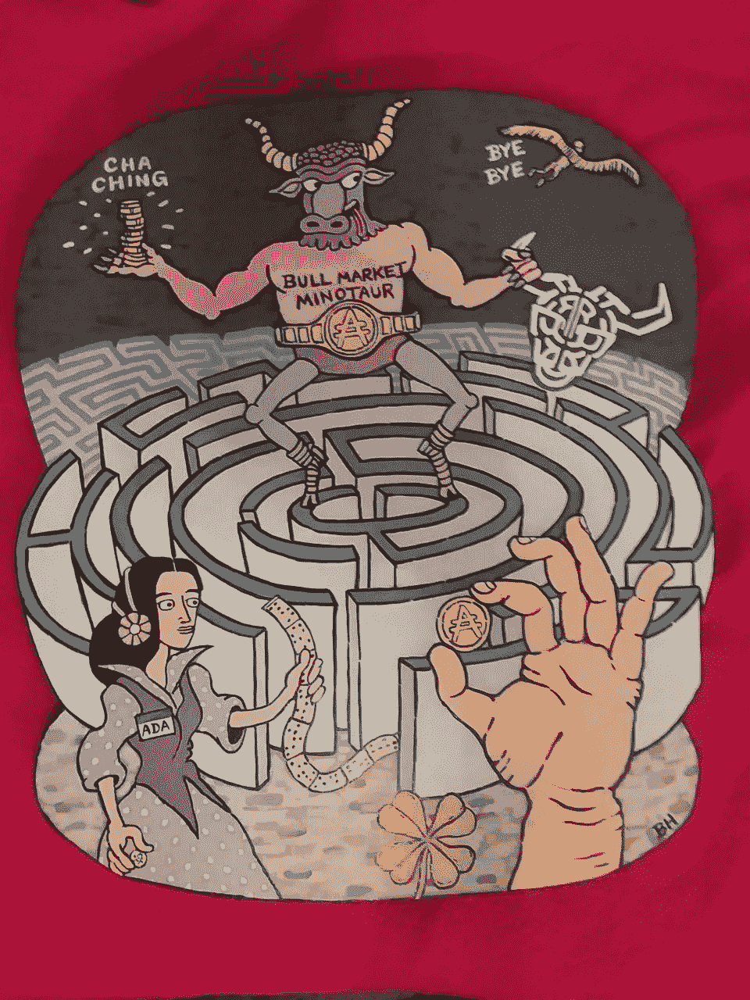
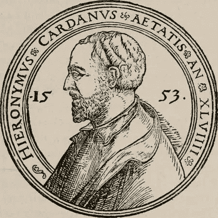
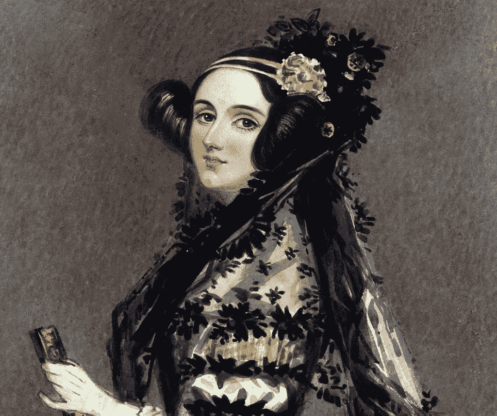
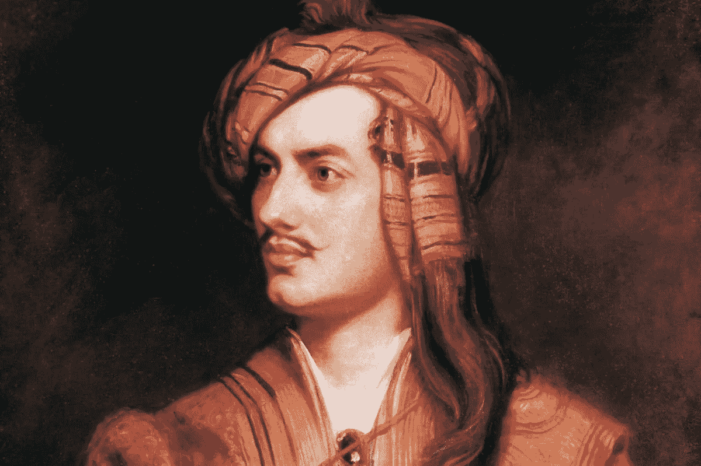
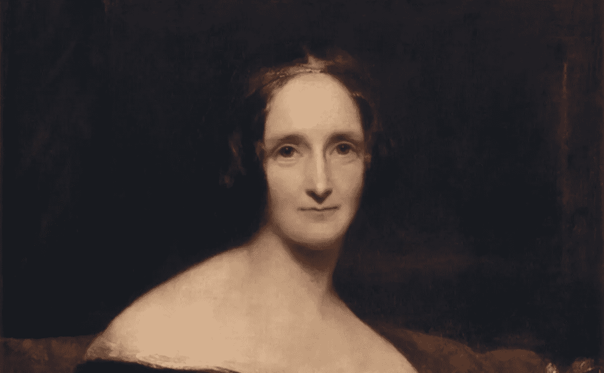
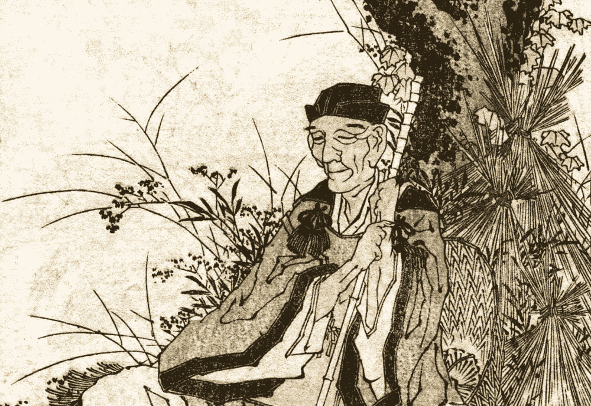
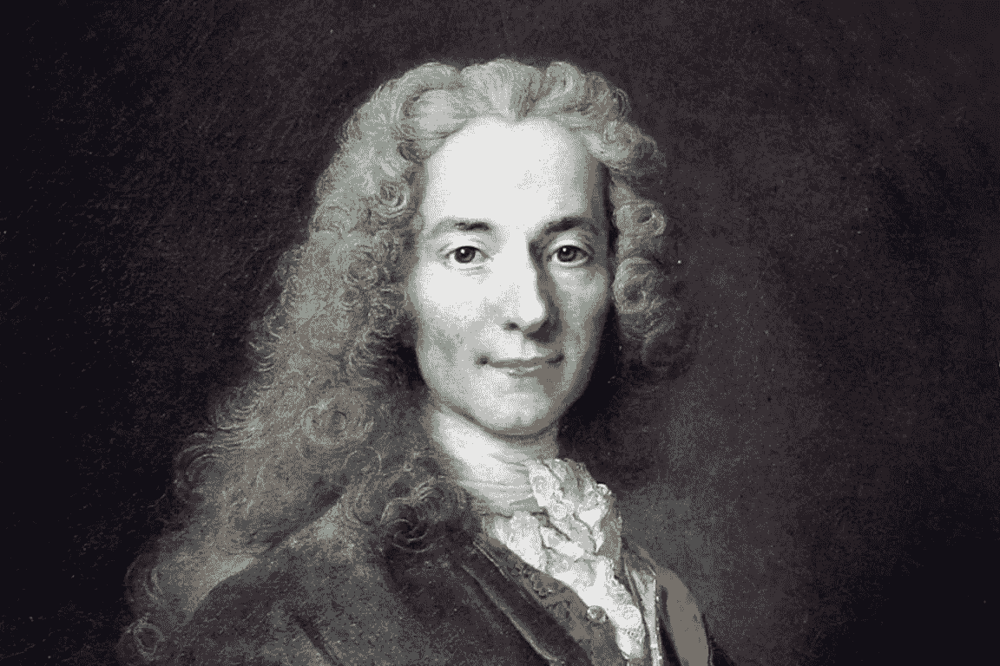
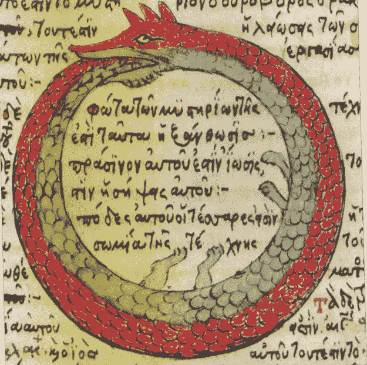
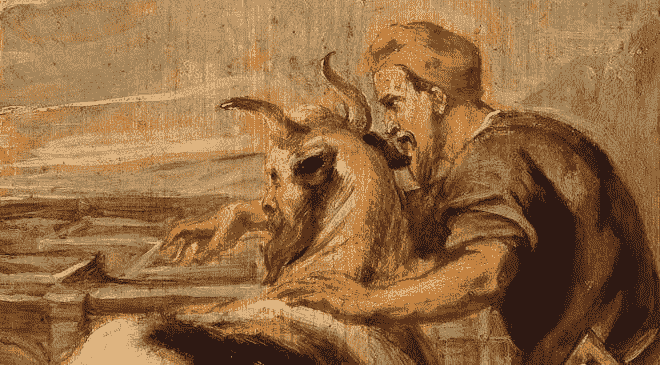
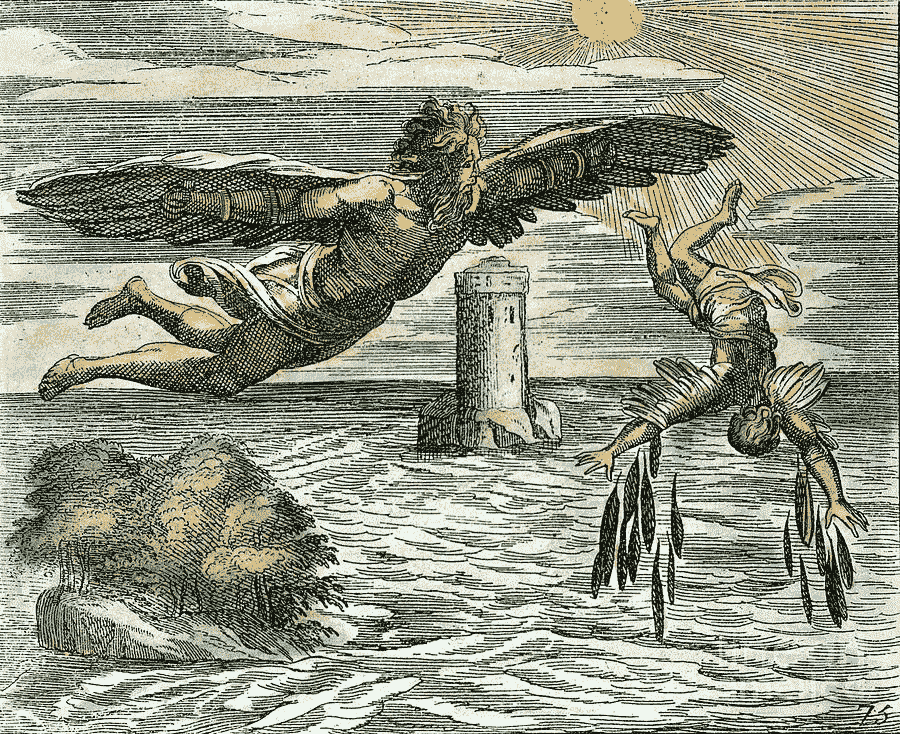

# 揭开卡尔达诺命名法的神秘面纱

> 原文：<https://medium.com/hackernoon/unraveling-the-myths-of-cardano-b59b45e2bdbd>

> 有没有想过为什么 Cardano 的加密货币的股票代码是“ADA”，或者为什么它的钱包以希腊神话命名？项目最初以什么命名，路线图发布标题中提到的所有人是谁？这篇文章将提供一个鸟瞰图和进一步阅读的链接。

Custom painting that includes Ada Lovelace, Icarus and Daedalus’ labyrinth and Minotaur ([source](http://t.me/CardanoGeneral/82088))

## [吉罗拉莫·卡尔达诺](https://en.wikipedia.org/wiki/Gerolamo_Cardano)

吉罗拉莫·卡尔达诺(1501-1576)是意大利数学家、物理学家、生物学家、内科医生、化学家、占星家、哲学家、作家和赌徒。他一生写了 200 多部科学著作，是文艺复兴时期概率数学领域的关键人物之一。

Gerolamo Cardano ([source](https://media1.britannica.com/eb-media/79/185479-004-38FF6399.jpg))

对于一个希望利用基于数学证明和博弈论的严格科学方法来构建高度灵活和可互操作的可编程货币形式的加密货币项目来说，采用这位意大利学者的名字似乎非常合适。

所以卡尔达诺生态系统是以吉罗拉莫·卡尔达诺命名的，但是为什么它的实际加密货币的股票代码是“ADA”呢？

Ada Lovelace ([source](http://www.historyanswers.co.uk/wp-content/uploads/2015/10/Ada_Lovelace_portrait-1024x858.jpg))

## [阿达·洛芙莱斯](https://en.wikipedia.org/wiki/Ada_Lovelace)

阿达·洛芙莱斯(1815-1852)是英国数学家和作家，因第一个认识到计算机不仅仅可以用于计算而闻名。洛夫莱斯编写了第一个在计算机上使用的算法，使她成为第一个计算机程序员。

有人可能会说，如果没有阿达·洛芙莱斯的远见，我们今天所知道的计算机就不会存在。为了向她的愿景致敬，Cardano 生态系统的创造者决定将其加密货币的股票命名为“ *ADA* ”，其最小的子单位(0.000001 ADA)命名为“ *Lovelace* ”，类似于比特币的最小子单位(0.00000001 BTC)以其创造者的名字命名为“ *Satoshi* ”。

卡尔达诺路线图的第一阶段包括 ADA 加密货币的“诞生”(2017 年 9 月主网发布)，并以阿达·洛芙莱斯的父亲拜伦命名，这并非巧合。他是谁？

Lord Byron ([source](https://media.poetryfoundation.org/m/image/15911/lord-byron-hires-cropped.jpg?w=1200&h=1200&fit=max))

## [拜伦](https://en.wikipedia.org/wiki/Lord_Byron)

乔治·戈登·拜伦(1788-1824)，第六代拜伦，英国诗人、贵族、政治家和浪漫主义运动的主要人物。他最著名的作品之一是《唐璜》，这是一首冗长的讽刺诗，拜伦在诗中将唐璜描绘成一个容易被女人诱惑的人，颠覆了唐璜是一个真正的好色之徒的传说。

拜伦和同为诗人的珀西·布西·雪莱成了朋友。卡尔达诺路线图的第二阶段以他妻子的名字命名；玛丽·雪莱。Shelley 版本代表了系统向分散的自治系统的演进。但是玛丽·雪莱和这有什么关系？

Mary Shelley ([source](https://short-biography.com/wp-content/uploads/mary-shelley/MaryShelley.jpg))

## [玛丽·雪莱](https://short-biography.com/wp-content/uploads/mary-shelley/MaryShelley.jpg)

玛丽·雪莱(1797-1851)是一位英国作家，她因写了《*弗兰肯斯坦*》而闻名，这是一部关于一位科学家在一次非正统的科学实验后创造出一种类人生物的小说。这部小说是拜伦、珀西·布西·雪莱和她自己打赌谁能写出最好的恐怖故事的结果。这部小说首次匿名出版，对文学和流行文化产生了相当大的影响。

虽然卡尔达诺生态系统不适合恐怖故事，但它将成为一个完全自主的系统这一事实可以与雪莱的作品相提并论。在 Shelley 之后，Cardano 的发布时间表的名称发生了变化，因为专注于智能合同的第三个版本是以 Joseph Goguen 的名字命名的。

Joseph Goguen ([source](https://upload.wikimedia.org/wikipedia/commons/9/9b/JosephGoguen.png))

## 约瑟夫·高根

Joseph Goguen(1941–2006)是一名来自美国的计算机科学家，他是加利福尼亚大学和牛津大学的教授，并在 IBM 和 SRI International 担任研究职位。Goguen 的工作集中在代数语义学和形式验证上。

Goguen 的工作启发了伊利诺伊大学计算机科学教授兼运行时验证首席执行官格里戈雷·罗苏开发了 [K 框架](http://www.kframework.org/index.php/Main_Page)。在接下来的视频(4 分 52 秒)中，罗苏解释了他是如何受到高根的影响，以及这与卡尔达诺的关系。

K 框架用于正式验证智能合约的代码，以便自动检查它们的缺陷，以便[防止灾难性的损失，如 2016 年以太坊道黑客攻击](https://youtu.be/jz5gu4keU9U)。因为许多编程语言是用 K 定义的，所以智能合约可以用大多数流行的编程语言编写，同时在 Cardano 的 Goguen 发布后自动进行正式验证，使其既高度灵活又安全。

在 Cardano 在 Shelley 版本中变得分散化并在 Goguen 版本中获得智能合约功能之后，Bash 版本将专注于尽可能提高 Cardano 的效率，提高其可扩展性。

Matsuo Bashõ ([source](https://www.plantea.com.hr/wp-content/uploads/2014/11/matsuo-basho.jpg))

## [松尾芭蕉](https://en.wikipedia.org/wiki/Matsuo_Bash%C5%8D)

松尾芭蕉(1644-1694)是一位著名的日本诗人，是公认的最伟大的 T2 俳句大师，俳句是一种由三个短语组成的非常短的日本诗歌形式。例如，巴绍的《T4 旧池塘》被认为是最著名的日本俳句。[可以翻译如下](http://www.bopsecrets.org/gateway/passages/basho-frog.htm):

*老池塘——青蛙跃入——水声。*

为了欣赏 Bash 令人难以置信的精彩和高效的诗歌，第四个 Cardano 版本以他的名字命名，希望采用这些相同的特征，以便随着采用的进展而扩展。

继 Bash 之后，第五个也是最后一个版本将专注于使 Cardano 可持续发展，实施其设想的财政模式和链上治理。

Voltaire ([source](https://biografieonline.it/img/bio/Voltaire_2.jpg))

## [伏尔泰](https://en.wikipedia.org/wiki/Voltaire)

弗朗索瓦-玛丽·阿鲁埃(1694-1778)，以伏尔泰闻名，是法国作家、哲学家和历史学家，在“启蒙时代”颇具影响力。启蒙运动的思想破坏了君主制和教会的权威，为 18 世纪和 19 世纪的政治革命铺平了道路。启蒙运动也以强调科学方法和还原论为标志。

由于与伏尔泰的愿景相似，第五版卡尔达诺以他的名字命名，该版本包括实施链上治理，利用液体民主来分散治理。

除了治理，区块链最重要的方面之一是其共识机制；用于确定哪个版本的区块链是正确版本的规则。对于卡尔达诺，IOHK 与 Kayias Aggelos 教授合作开发了一种新的共识机制，称为 Ouroboros。

Ouroboros, 1478 ([source](https://en.wikipedia.org/wiki/Ouroboros#/media/File:Serpiente_alquimica.jpg))

## [大毒蛇](https://en.wikipedia.org/wiki/Ouroboros)

大毒蛇是一种象征，描绘了一条蛇或一条龙在吃自己的尾巴。尽管“大毒蛇”这个名字来源于古希腊的οὐροβόρος，但它第一次出现在古埃及文本中(约公元前 1400 年)。它与卡尔达诺有关的原因是共识机制的周期性。

共识机制的第一个版本被称为“*大毒蛇*”，但随着更新版本的出现，现在通常被称为“*大毒蛇经典*”。第二个版本利用一种不同的方法(可验证随机函数，VRFs)来为协议生成随机性，并被称为*‘Ouroboros Praos’*(Praos[是古希腊语中的'*温和*'、*温和*'、*温顺*或'*善良*](https://biblehub.com/greek/4235.htm) ')。第三个版本叫做*‘大毒蛇创世纪’*(创世纪[在古希腊语中是‘T19’开始’](https://biblehub.com/interlinear/genesis/1.htm))，因为它允许加入区块链的新用户从创世纪区块(区块链的第一个区块)引导。第四个版本将关注[分片](https://en.wikipedia.org/wiki/Shard_(database_architecture))，这是一种有助于分散负载的数据库水平分区形式。因为这第四个版本的多面性，它被恰当地称为*‘大毒蛇九头蛇’*，以古希腊和罗马神话中有许多头的蛇形水怪[命名。](https://en.wikipedia.org/wiki/Lernaean_Hydra)

最后但并非最不重要的是，还有两个希腊神话是卡尔达诺提到的，值得分享。

Daedalus, the Minotaur and the labyrinth ([source](http://www.spainisculture.com/export/sites/cultura/multimedia/galerias/obras_excelencia/obras_excelencia_sf/dedalo_minotauro_museo_belas_artes_coruna_mgt0285.jpg_1306973099.jpg))

## [代达罗斯](https://en.wikipedia.org/wiki/Daedalus)

在古希腊神话中，代达罗斯是一位能工巧匠、创新者和艺术家。他最早是在名著 [*伊利亚特*](https://en.wikipedia.org/wiki/Iliad) 荷马中提到的。在希腊的克里特岛，代达罗斯受雇于弥诺斯国王，并开发了囚禁半人半牛的弥诺陶洛斯的迷宫。

在卡尔达诺，[官方钱包](https://daedaluswallet.io/)以代达罗斯命名，而一个头上有迷宫的牛头怪的图片被用作其标志，指的是所使用的复杂密码协议。除了代达罗斯，开发 Cardano 的公司 Input Output Hong Kong (IOHK)也为一个轻型钱包创建了一个开源原型，开发者可以使用它来实现自己的应用。他们以代达罗斯之子的名字命名这个钱包为伊卡洛斯。

Daedalus and Icarus ([source](https://theaeoneye.files.wordpress.com/2015/05/3-daedalus-and-icarus-granger.jpg))

## [伊卡洛斯](https://en.wikipedia.org/wiki/Icarus)

最后，在前面提到的荷马的古希腊故事中，代达罗斯和他的儿子伊卡洛斯后来试图逃离代达罗斯用羽毛和蜡建造的克里特岛。在这个故事中，代达罗斯警告伊卡洛斯不要自满和自大，要求他的儿子不要飞得太低或太高，因为海水的潮湿会堵塞他的翅膀，太阳的热量会融化它们。然而，伊卡洛斯无视代达罗斯的指示，飞得太靠近太阳了，从天上掉下来后，融化了翅膀上的蜡，淹死在海里。

在卡尔达诺，伊卡洛斯轻型钱包原型被埃姆戈用来开发 Yoroi(日语[意为“*铠甲*”](https://translate.google.com/#view=home&op=translate&sl=auto&tl=en&text=yoroi))，一款基于铬合金的轻型钱包。

*本文还有* [*俄文*](https://link.medium.com/tj3pquGC2S) *和* [*西班牙文*](https://forum.cardano.org/t/desentranando-los-mitos-de-la-nomenclatura-de-cardano/23011) *。*

> 喜欢这个故事吗？你可以在[媒体](/@undersearcher)和[推特](https://twitter.com/undersearcher)上关注我。
> 
> **免责声明**:本文仅用于信息和教育目的，不应视为投资建议。