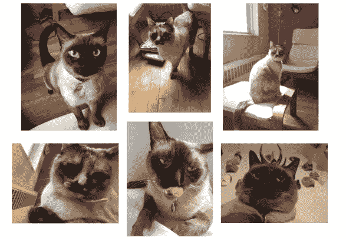
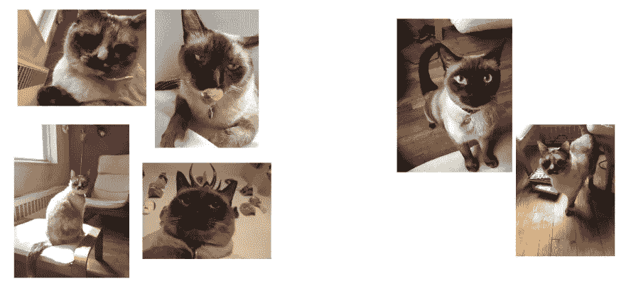
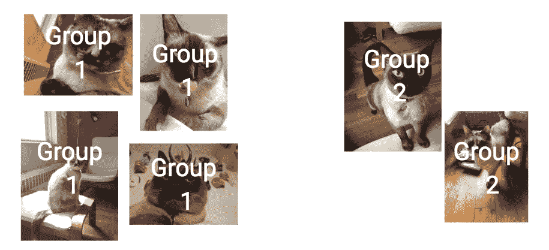
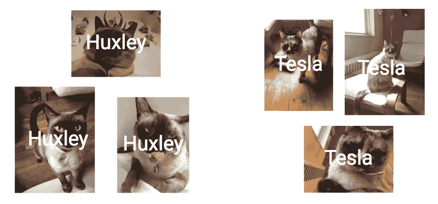

# 无监督学习去神秘化

> 原文：<https://medium.com/hackernoon/unsupervised-learning-demystified-4060eecedeaf>

无监督学习可能听起来像是一种奇特的方式来说“*让孩子们自己学习不要碰热烤箱”*但它实际上是一种从你的数据中挖掘灵感的模式发现技术。这与机器在没有成人监督的情况下四处运行，形成自己对事物的看法无关。来揭秘一下吧！

If this feels familiar, unsupervised machine learning might be your new best friend.

这篇文章对初学者很友好，但是假设你已经熟悉了**到目前为止的故事**:

*   机器学习就是[用例子给事物贴标签](http://bit.ly/quaesita_simplest)。
*   如果你训练你的系统，给它你正在寻找的答案，你在做[监督学习](http://bit.ly/quaesita_slkid)。
*   为了开始[监督学习，你需要知道你想要什么标签。(无人监管的情况下并非如此。)](http://bit.ly/quaesita_island)
*   标准术语包括[实例、特征、标签、模型和算法](http://bit.ly/quaesita_slkid)。

Here’s the video version of the ideas in this article, plus some bonus advice mixed in.

## 什么是无监督学习？

Your mission? Put these six images into two groups however you like.

查看上面的六个[实例](http://bit.ly/quaesita_slkid)。少了什么？这些照片没有附上标签。别担心，你的大脑很擅长无监督学习。让我们试一试。

想想你想如何将这些图片分成两组。没有错误的答案。准备好了吗？

## 数据聚类

在直播课上，谷歌人会喊出类似“*坐着对站着、*”、*能看见木地板对不能、*、*猫自拍对不猫自拍、*等答案。我们来考察一下第一个答案。

One way to split the images in to two clusters: sitting versus standing. Well, “sitting” versus standing.

## 无监督学习的秘密标签

如果您选择根据猫是否站立来定义您的分类，那么您的系统输出的标签是什么？毕竟，机器学习是关于[给事物](http://bit.ly/quaesita_simplest)贴标签。

如果你认为“*坐着和站着*”是标签，请三思！这就是您用来创建集群的方法(模型)。无监督学习中的标签要枯燥得多:类似于“*组 1 和组 2* ”或“ *A 或 B* ”或“ *0 或 1* ”的东西。它们仅仅表示群体成员，它们没有额外的人类可解释的(或诗意的)含义。

Unsupervised learning’s labels simply indicate cluster membership. They have no higher human-interpretable meaning, as disappointingly boring as that may feel.

这里所发生的是算法根据相似性对事物进行分组。相似性度量是通过算法的选择来指定的，但是为什么不尽可能多的尝试呢？毕竟，你不知道你在寻找什么，这没关系。把无监督学习想象成一种数学版本的物以类聚。

就像一张[罗夏卡](http://bit.ly/quaesita_inkblot)，结果有[帮你圆梦](http://bit.ly/quaesita_inkblot)。不要把你在他们身上看到的任何东西看得太重。

## 再看看！

作为这两只猫的骄傲的母亲，我感到难过的是，在我讲授这一课的大约 50 次中，只有一个观众注意到:“*猫 1 对猫 2。*”取而代之的是“*坐着、站着*”或者“*木地板不在/在*”或者有时甚至是“*丑猫对漂亮猫”。*(Awww。)

Turns out these were photos of my two individual cats! Maybe you spotted it, but most of my audiences don’t… unless I give them the labels (supervise their learning). If I’d presented the data with name labels in the first place and then asked you to classify the next photo, I bet you’d find the task easy.

## 经验教训

想象一下，我是一名数据科学家新手，正在开始无监督学习(当然！)对自己养的两只猫感兴趣。当我看到这些数据时，我将无法不看我的猫。因为我的拥抱对我来说太有意义了，我希望我的无人监督的机器学习系统能够恢复这里唯一值得关心的东西。哎呀！

在这十年之前，计算机甚至不能指望与世界上最好的
模式寻找者竞争这种任务:人类的大脑。这对于人来说很容易！那么，为什么看到这些未标记照片的数千名谷歌员工错过了“*第 1 类对第 2 类*”的答案呢？

> 把无监督学习想象成一种数学形式的“物以类聚”

我感兴趣的东西并不意味着我的模式发现器会找到它。即使模式查找器很棒，我也没有告诉它我在找什么，所以我为什么要指望我的[学习算法](https://www.youtube.com/watch?v=iLu9XyZ55oI&feature=youtu.be&t=0h5m12s)来交付它呢？这不是魔法！如果我不告诉它正确答案是什么...我得到我所得到的，我不会不高兴。我所能做的就是查看系统返回给我的聚类，看看我是否觉得它们鼓舞人心。如果我不喜欢它们，我就一遍又一遍地运行不同的无监督算法(“观众中的其他人，用不同的方式为我拆分它们”)，直到有些东西变得有趣。

> 结果就是一张帮助你做梦的罗夏卡片。

不能保证在这个过程中会有任何鼓舞人心的事情发生，但是试一试也无妨。毕竟，探索未知应该是一种冒险。好好享受吧！

If you think of [analytics](http://bit.ly/quaesita_datasci) as the quest for inspiration and ML/AI as automation using data, then you might have noticed how confusing the terminology is… Unsupervised learning is more likely to be used by *analysts* for *analytics* rather than engineers for ML/AI. Learn more in the [video](http://bit.ly/quaesita_ytanalystsai).

在下一集的[中，我们将看看一个警示故事，如果你忘记标签只是一个灵感，不应该太认真，更不用说被视为人类可以解释的，那么会出现什么问题。他们只是给你一些想法，让你知道下一步你可能会做什么。](http://bit.ly/quaesita_aimistakes)

如果你觉得艺术，你可能也会喜欢我的后续文章[使用人工智能作为改变感知的药物](http://bit.ly/quaesita_drugs)，它描述了如何在人工智能艺术中使用无监督学习和其他三种流行的技术

***总结:*** 无监督学习通过为你将相似的东西分组在一起，帮助你在数据中寻找灵感。有许多不同的方式来定义相似性，所以继续尝试算法和设置，直到一个很酷的模式吸引你的眼球。

# 感谢阅读！YouTube 课程怎么样？

如果你在这里玩得开心，并且你正在寻找一个为初学者和专家设计的有趣的应用人工智能课程，这里有一个我为你制作的娱乐课程:

Enjoy the entire course playlist here: [bit.ly/machinefriend](http://bit.ly/machinefriend)

# 喜欢作者？与凯西·科兹尔科夫联系

让我们做朋友吧！你可以在 [Twitter](https://twitter.com/quaesita) 、 [YouTube](https://www.youtube.com/channel/UCbOX--VOebPe-MMRkatFRxw) 、 [Substack](http://decision.substack.com) 和 [LinkedIn](https://www.linkedin.com/in/kozyrkov/) 上找到我。有兴趣让我在你的活动上发言吗？使用[表格](http://bit.ly/makecassietalk)取得联系。