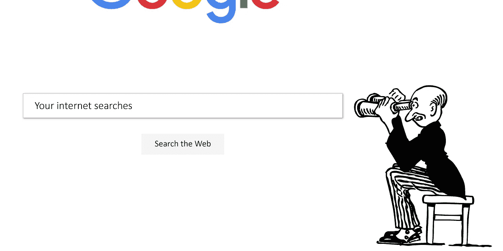
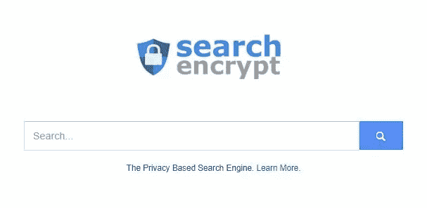
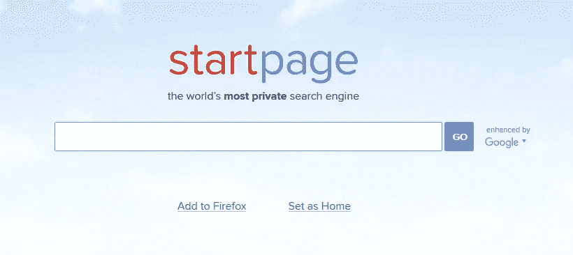
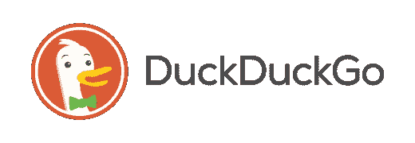
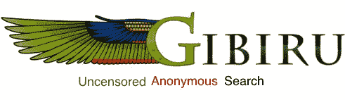
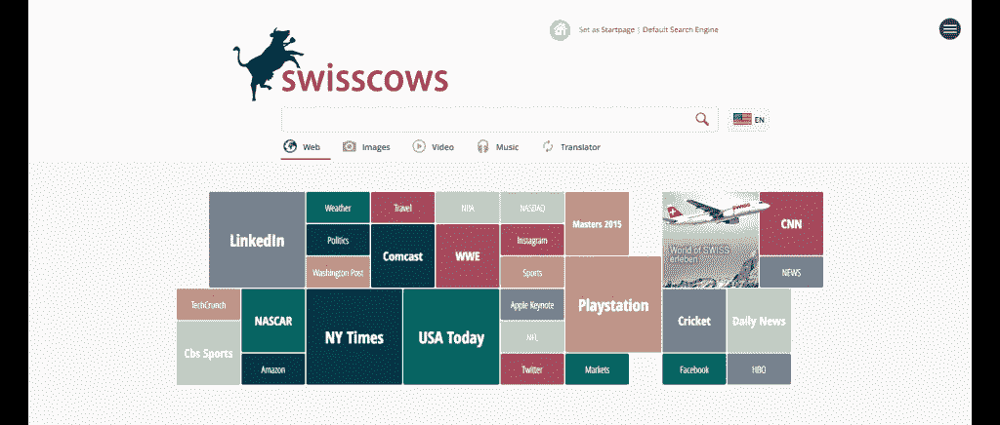
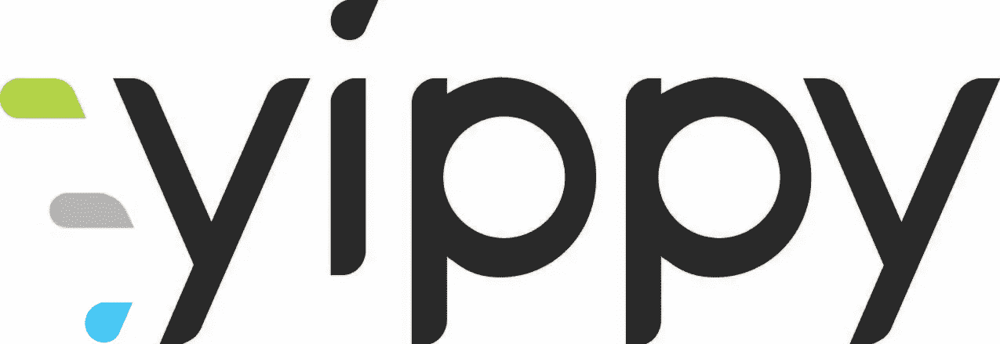
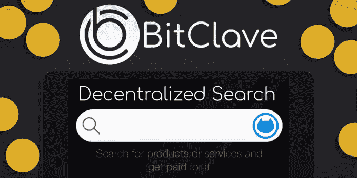
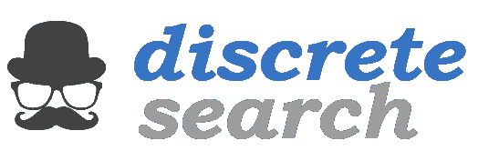
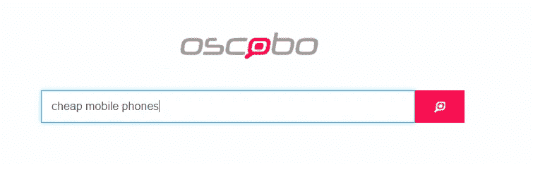

# 最好的私人搜索引擎——谷歌的替代品

> 原文：<https://medium.com/hackernoon/untraceable-search-engines-alternatives-to-google-811b09d5a873>

私人搜索引擎在过去几年里有了巨大的增长。直到最近，还无法想象有人能在搜索领域与[谷歌](https://hackernoon.com/tagged/google)竞争。然而，现在在搜索游戏中有许多小玩家正在快速成长。谷歌的[市场份额](https://netmarketshare.com/search-engine-market-share.aspx?options=%7B%22filter%22%3A%7B%22%24and%22%3A%5B%7B%22deviceType%22%3A%7B%22%24in%22%3A%5B%22Desktop%2Flaptop%22%5D%7D%7D%5D%7D%2C%22dateLabel%22%3A%22Custom%22%2C%22attributes%22%3A%22share%22%2C%22group%22%3A%22searchEngine%22%2C%22sort%22%3A%7B%22share%22%3A-1%7D%2C%22id%22%3A%22searchEnginesDesktop%22%2C%22dateInterval%22%3A%22Monthly%22%2C%22dateStart%22%3A%222016-05%22%2C%22dateEnd%22%3A%222018-01%22%2C%22segments%22%3A%22-1000%22%7D)已经从 2017 年 2 月的 78.7%下降到 2018 年 2 月的略低于 70%。

这些搜索引擎中的一些，包括 DuckDuckGo 和 StartPage，开始是普通的搜索引擎，没有隐私增强。然而，在他们意识到存储如此多数据的巨大风险后，他们决定采取不同的方法。

你的[隐私](https://hackernoon.com/tagged/privacy) *真的*重要，这些搜索引擎可以帮助你在网上保持隐私:

1.[**搜索加密**](https://www.searchencrypt.com)

这个[私人搜索引擎](https://choosetoencrypt.com/search-engines/private-search-engines-a-complete-guide/)使用本地加密来保护你的搜索。它结合了 AES-256 [加密](https://choosetoencrypt.com/tech/why-you-should-choose-to-encrypt-everything/)和安全套接字层加密。Search Encrypt 然后从它的搜索伙伴网络中检索你的搜索结果。完成搜索后，您的搜索词会过期，因此它们是私有的，即使其他人可以访问您的电脑。

[Search Encrypt](https://twitter.com/SearchEncrypt) 最近增加了更多新功能，包括隐私友好的视频、新闻和地图搜索。它的视频搜索可以让你直接在搜索引擎上观看视频，并有额外的隐私保护，而且没有前置广告。这个搜索引擎的加密和完美的转发保密实际上给了它[比 DuckDuckGo](https://choosetoencrypt.com/news/search-encrypt-has-better-privacy-by-default-than-duckduckgo/) 更好的隐私默认。

[***尝试搜索 Encrypt 的 Chrome 扩展***](https://chrome.google.com/webstore/detail/search-encrypt-a-private/oodblefojaocanejnikhhjcglbaelpbp?hl=en)

 [## 搜索加密保护您的搜索隐私-搜索加密博客

### 搜索加密(searchencrypt.com)是一个私人搜索引擎，可在线或作为浏览器的扩展。搜索…

choosetoencrypt.com](https://choosetoencrypt.com/search-engines/search-encrypt-protects-your-search-privacy/) 

2. [**起始页**](http://www.startpage.com)

[StartPage](https://www.startpage.com) 使用来自谷歌的结果，如果你喜欢没有跟踪的谷歌结果，这是一件好事。Ixquick 是一个使用自己搜索结果的独立搜索引擎，它开发了 StartPage 来包含来自谷歌的搜索结果。它的特性包括代理服务、URL 生成器和 HTTPS 支持。URL 生成器是一个独特的功能，它消除了对 cookies 的需求。它以一种隐私友好的方式记住你的设置。

StartPage 在全球范围内使用，但是它的大部分访问者来自德国。

3. [**DuckDuckGo**](http://duckduckgo.com)

DuckDuckGo 可能是最知名的另类搜索引擎。其首席执行官加布里埃尔·温伯格(Gabriel Weinberg)说，“如果联邦调查局来找我们，我们没有什么可以与你联系起来。”搜索主要来自雅虎。DuckDuckGo 的一个很酷的功能是它所谓的“[刘海](https://duckduckgo.com/bang)”。用户可以直接搜索其他网站，如亚马逊、维基百科、Yelp 或 Youtube，只需以感叹号开始他们的查询！

DuckDuckGo 最近在他们的产品线中增加了一个新的扩展。它不仅仅是保护你的搜索隐私，还会对你访问的网站进行隐私评级。

4.[吉比鲁 ](http://gibiru.com/)

Gibiru 的搜索结果来源于一种经过修改的谷歌算法。Gibiru 的首席执行官史蒂夫·马歇尔在一份新闻稿中宣布，他的服务正是谷歌早期的服务。它提供可靠的搜索结果，而不像今天的谷歌那样进行跟踪。

Gibiru 自称比 NSA 的搜索引擎更快，因为它不会在你的系统上安装各种个性化和跟踪 cookies。吉比鲁直言不讳地反对谷歌操纵或审查你的搜索结果的能力。

6. [**瑞士奶牛**](https://swisscows.com/)

瑞士奶牛是由 Hulbee AG 公司制造的，这是一家总部设在瑞士的科技公司。像这个列表中的其他私人搜索引擎一样，这个搜索引擎不为用户建立跟踪档案或使用唯一标识符。与其他搜索引擎的一个关键区别是，这是一个语义搜索引擎。这意味着它使用人工智能和机器学习来评估用户搜索的上下文。因此，Swisscows 提供了可以学习回答你的问题的搜索结果——一个很酷的搜索工具。

7.

**Yippy 还有一个附加特性，可以自动对查询结果进行分类。例如，对“狗”的搜索显示了顶部的结果，但也有训练、照片、狗品种、救援等类别。它不会在网上用广告跟踪搜索用户。Yippy Inc .也有一个搜索产品，与谷歌的搜索设备竞争。**

****

**8.**

****[Qwick 搜索快捷键](https://medium.com/u/c0c7de89192c#help_details)。****

********

****10. [**离散搜索**](https://www.discretesearch.com/)****

****[离散搜索](/discrete-search/about-discrete-search-the-private-search-engine-befb9df25b56)是一个元搜索引擎，不会跟踪任何可识别的信息。这是一个很好的选择，任何人都在寻找一个干净和用户友好的形式快速的结果。它使用端到端加密来尽可能地保护你的搜索隐私。****

********

****11. [**Oscobo**](https://www.oscobo.com/)****

****Oscobo 是一个专为保护用户隐私而创建的搜索引擎。它不会像谷歌一样追踪你的信息。Oscobo 说你用你的个人数据为你的搜索付费，但是你不应该这样做。****

****Oscobo [完全加密](https://choosetoencrypt.com/privacy/how-search-engines-encrypt-your-data/)你的搜索词，所以没有人可以拦截或解密你的搜索词。它的搜索引擎不使用第三方脚本或分析，所以只有你知道你搜索了什么。****

# ****为什么私人搜索引擎很重要？****

****我们经常听说互联网服务提供商(ISP)或美国国家安全局(NSA)侵犯公民隐私，但我们对此做了些什么呢？****

****浏览互联网时与第三方共享您的信息存在固有的风险。这就是为什么[私人搜索引擎](https://choosetoencrypt.com/news/search-encrypt-use-private-search-engine/)对用户有利。你的搜索结果泄露给任何人的风险微乎其微，因为大多数[私人搜索引擎](https://choosetoencrypt.com/search-engines/private-search-engines-a-complete-guide/)不会追踪任何可以将你与你的搜索词联系起来的信息。除此之外，通过私下搜索，你不会产生过滤气泡，将你与任何可能与你的信念相冲突的结果隔离开来。****

****当涉及到保护您的信息免受您访问的网站和您使用的搜索引擎的攻击时，安全胜于遗憾。随着像脸书和谷歌这样的网站大幅提高他们的追踪能力，你的数据在网络上变得更加分散。****

****************

# ****用虚拟专用网让自己更加私密****

**** [## 2019 年最佳隐私 VPN-private expert

### VPN 是在互联网上保护你的隐私的最好工具之一。而不是在…之间直接交流

choosetoencrypt.com](https://choosetoencrypt.com/privacy/the-best-vpns-for-privacy-in-2019/) 

练习安全搜索，使用私人搜索引擎。**** 

*******了解更多关于私人搜索引擎的信息*** 👇****

**** [## 什么是搜索加密？为什么你应该使用私人搜索引擎？-选择加密

### Search Encrypt 是一个基于隐私的搜索引擎。它是基于隐私设计而构建的，这意味着它是为了…

choosetoencrypt.com](https://choosetoencrypt.com/news/search-encrypt-use-private-search-engine/)****