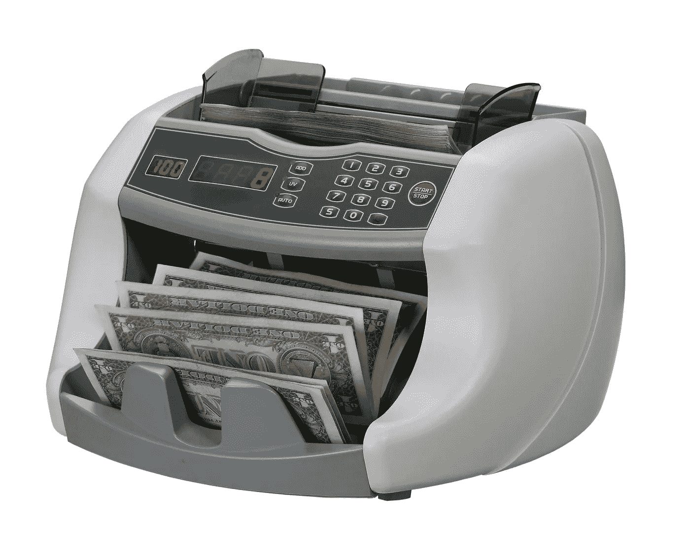
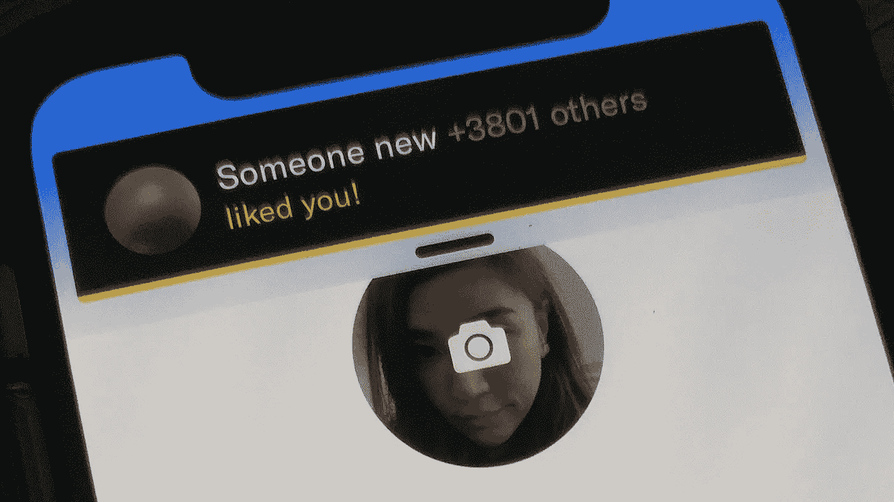
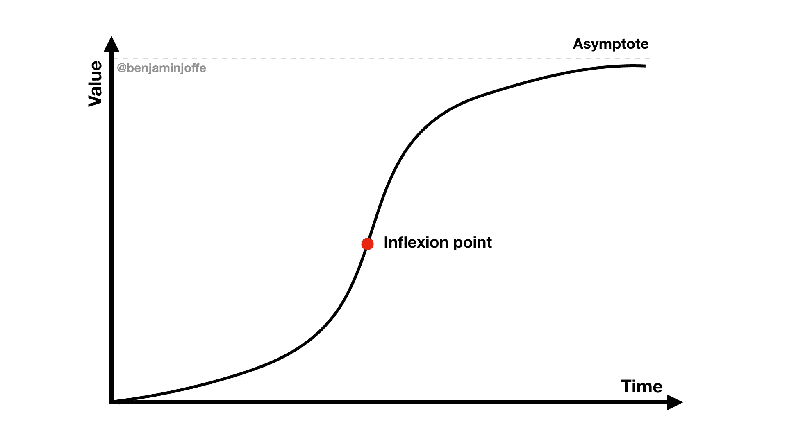
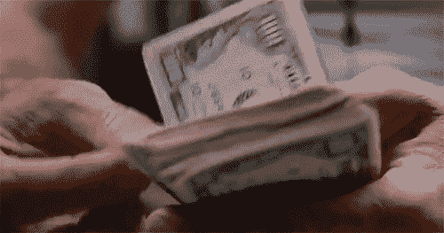

# 为你的创业公司获得资金的不同寻常的方法

> 原文：<https://medium.com/hackernoon/unusual-ways-to-get-funding-for-your-startup-e1fcadc7f510>

注意:这篇文章是针对硬件创业公司而写的，但是大部分也适用于其他创业公司。

# 我们知道谁资助硬件(或其他类别)，但不知道为什么

以硬件[初创公司](https://hackernoon.com/tagged/startups)(我们关注 [HAX](http://www.hax.co) )为例:你可以找到[硬件投资者名单](/sosv-accelerator-vc/2017-hardware-investors-ranking-and-how-to-get-funded-7e02b9e14182)和[趋势](/sosv-accelerator-vc/what-hardware-investors-want-in-2018-and-what-they-dont-2e506008f0af)，但这有点像给你一副滑雪板，告诉你*“往那边走，非常快，如果有什么东西挡住了你的路，就转弯”*。它向你展示棋子，但不告诉你如何玩这个游戏。

在我最近的一次演讲中，我强调了以下几点:

1.  经典方式
2.  现实
3.  [黑客](https://hackernoon.com/tagged/hacks)
4.  结束游戏

主要是因为游戏并不总是像它看起来那样。
我们开始吧。

# 经典的方式

这是你在任何地方都能听到的建议，甚至更多。我设法把它浓缩成以“T”开头的五个字:)

“I don’t hate Hardware, but I pity the fool.”

*   **牵引** 这是*真正的里程碑*、像技术演示、看起来像工作的原型、客户反馈、企业试点……展示给你把事情做好！这不是媒体报道、Youtube 浏览量和其他虚荣指标。请注意，被误导的客户发现也会导致对你产品需求的过度自信。i-Corps 真正起作用的事情，就去做吧。
*   **团队**
    你有经验或者血统吗？(卖了一家公司？前谷歌？行业？斯坦福？等等。).
*   **Tech**
    难做吗？可辩护？(秘制酱而非专利)实惠？
*   **时机
    时机**为什么是现在？市场或技术推动因素发生了变化吗？
*   **目标** 你说服不了人。找到更多相信的人。或者像我喜欢重复的“如果你想改变人，就改变人”。尤其是远离那些说“硬件硬”的人。

于是**牵引**、**团队**、**技术**、**计时**和**目标**。

这一切都很棒，但现实比这更残酷。

# 2.现实

游戏被操纵了！嗯，不完全是，但你会明白我的意思。

获得关注真的很难，所以风投经常依靠过滤器来处理需求流。一家被推荐的初创公司会立即得到关注。

A typical VC sees over 1,000 startups per year, and invests in less than 1%

这次我找不到一个聪明的头韵或缩写，所以请原谅我。

*   许多交易不是电话推销，而是通过推荐完成的，除了创始人的直接关系网之外，从未真正“社会化”。因此，风投可以在强烈推荐的交易和你的交易之间做出选择。强硬！
*   **社会证明**
    有了合适的标签和背书，风投们蜂拥而至，因为这不仅看起来潜力巨大，而且风险更低。连续创业者在之前的创业中已经学到了一些东西(创始人是一种职业)，并且大多会犯*新的*错误，这是有道理的。
*   **本地**
    我们去硅谷玩 2 周吧！那里有如此多的钱，你会毫无问题地找到一些，即使是来自第二或第三层的风险投资！事实证明，这很少奏效。为什么？因为你在当地没有任何记录，糟糕的介绍，也许是错误的法律设置，也许你不知道文化代码。如果你不在硅谷，大多数风投不会有问题(在早期阶段招募成本太高，也很难)，但在美国以外，情况就不同了。除非你已经有了优秀的科技和美国客户，否则第一轮就在当地寻找风投。是的，你可能得不到同样好的交易，但是你会浪费更少的时间，你会得到一笔交易。
*   **现金流**
    对于硬件来说，现金流是个问题。风投讨厌为营运资金融资。如果你在结构性负现金流的情况下扩大规模，你只会扩大问题。
*   **B2B**消费者大多外出。企业/工业和健康技术领域。五年前，HAX 投资了大约 75%的 B2C，现在不到 25%。主要是因为(1)消费者对价格非常敏感。$100?最好有苹果品质！以及(2)大多数消费产品是“最好拥有的”，而不是“必须拥有的”。STEM 似乎有更高的动机，因为它是对孩子未来的投资。

但是所有的希望都没有失去！我还列举了几个#hacks。

# 3.劈

我丰富的词汇量让我找到了前所未有的以“C”开头的八个单词。覆盖面，名人，便宜，冠军，军团，条件，中国，加密。

*   T21 媒体的报道大多是一种虚荣的衡量标准，但它能有所帮助。如果你没有像机器人或飞行汽车那样炫耀的“硬件色情”，那么专注于人类感兴趣的故事、幽默或令人兴奋的未来愿景。想了解更多想法，请阅读 TechCrunch 的麦克·布彻的[永恒演讲。](https://www.slideshare.net/mikebutcher/how-to-deal-with-tech-media-by-mikebutcher)
*   名人
    和合适的人在一起，你就是黄金。想想 Beats 和 Dre。一家初创公司正在制作一款[高科技麦克风](https://www.mikme.com/wireless-recording-microphone-for-podcasters)(我当场就买了，因为我正在考虑播客)，并表示 BBC 播音员很喜欢它。搞定了。
*   **便宜**
    不要挨饿而要**节俭**。这会让你减少对外部资金的依赖。伊利诺伊州的一些公司每月为每位创始人花费 1000 美元。其他公司已经搬迁到深圳，直到发货。我们在 HAX 有几家公司，他们在没有其他外部风险投资的情况下将复杂的产品推向市场(有时他们使用赠款或获奖，并开始向客户销售 POC 或产品)。一路自举盈利！(并保留他们公司 90%的股份)
*   **冠军**
    你没有网络的温馨引子？找一个拥有它的天使。这样的人可以帮助辛迪加交易。
*   **公司**
    公司可以为 POC 或其他支付费用。有些人很体贴，会留意你的现金流，提前付款。
*   **条件**
    通过修改与供应商、经销商和客户的合同来改善你的现金流。运气好的话，你的客户会提前付款给你，你会在交货后 60 天付款给你的工厂，达到现金流的天堂。工厂可以成为你的银行，而且是不稀释的！一定要见见业主，业主往往是企业家，交个朋友。如果他们不能给你足够好的条件，把你的(小)生意带到别处去。
*   **中国**
    在 [HAX](http://www.hax.co) 我们是中国原型制造和制造的大力倡导者。多半是因为速度和专业(问[蒂姆库克](https://www.inc.com/glenn-leibowitz/apple-ceo-tim-cook-this-is-number-1-reason-we-make-iphones-in-china-its-not-what-you-think.html))。与普遍的看法相反，你不需要高容量。中国的另一大优势是投资。自 2017 年以来，那里的风投资金比美国还多，许多中国风投乐于投资海外(以美元计)，因为他们发现交易比中国便宜(他们也看到了更多潜力，因为他们将中国市场纳入了他们的预测)。
*   **Crypto；我们还没有找到方法，但是如果你能有一个区块链的角度，你就能接触到另一类投资者。目前，你最好的选择是将你的硬件公司重新描绘成人工智能、机器学习甚至“行为分析”。你会得到更多的关注。我们的许多机器人和健康技术初创公司都是合法的人工智能或人工智能公司。也许你的也是！**

# 4.结束游戏

这是一个有点新的话题，但如果你已经筹集了一轮或更多的种子资金，并正在考虑下一轮融资，那么**你有必要问问自己，提前退出是不是一个更好的选择**。

你有多少动力？
真正的市场潜力是什么？
情况在变化吗？

《财富》青睐有准备的公司，90%的退场公司都在 M&A ( [CB Insights 报告称，2016 年共有 3358 家科技公司退场，3260 万家，98 家首次公开募股(IPO)——因此并购比正常情况多 30 倍)。超过 60%发生在 B 系列或之前，所以**留意你的渐近线&拐点**。](https://techcrunch.com/2017/01/31/cb-insights-3358-tech-exits-in-2016-unicorn-births-down-68/)

要了解更多关于退出的知识，你可以参加我们 6 月份在伦敦(6 月 5 日)、巴黎(6 月 12 日)、旧金山(6 月 19 日)和纽约(6 月 22 日)举办的[退出大师班](https://hax.co/exit-masterclass/)。

如果你发现更多的 Ts，更多的 Cs，或者有评论，请留言，发推特或电子邮件给我 ben@hax.co。

Now it’s all good.