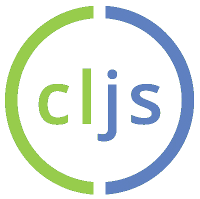
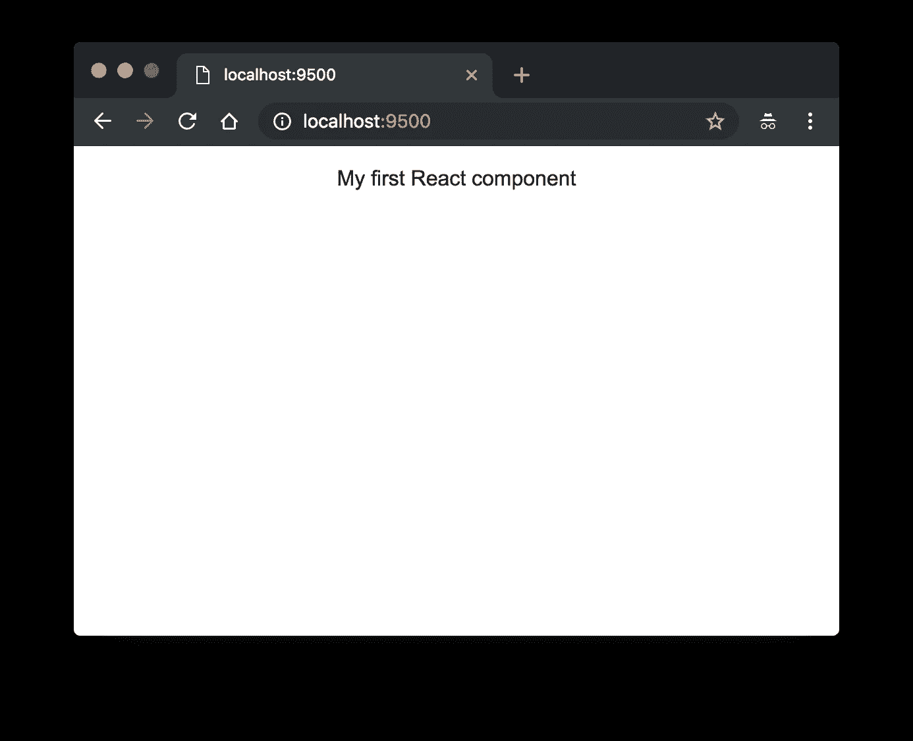
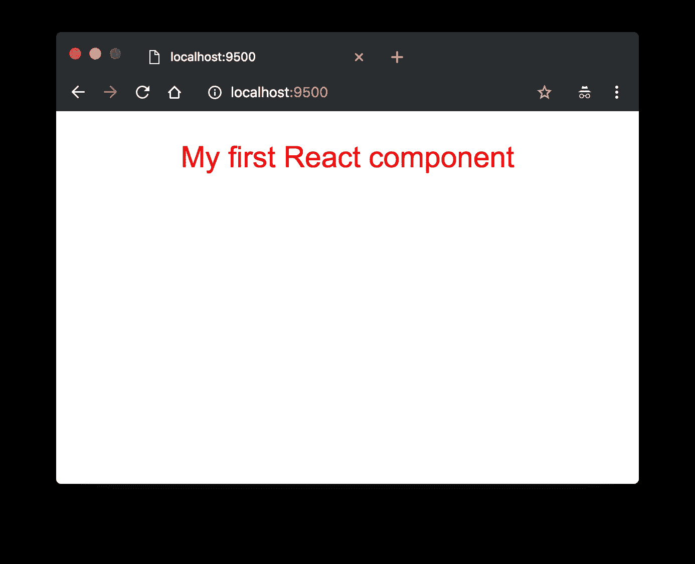

# 在 2018 年启动并运行 ClojureScript

> 原文：<https://medium.com/hackernoon/up-and-running-with-clojurescript-in-2018-7c7a1facfe46>



近几年来，ClojureScript (CLJS)的发展如此之快，以至于偶尔有必要撰写一篇关于如何尽可能简单地开始一个高效开发环境的快速帖子。

下面是我 2018 年末(11 月)的版本。

TL；博士，开始行动的最佳方式就是现在

*   [飞轮](https://figwheel.org/)(最新版本，[飞轮主](https://github.com/bhauman/figwheel-main))
*   [CLJ 命令行构建工具](https://clojure.org/guides/deps_and_cli)
*   [试剂](https://reagent-project.github.io/)给你反应绑定

首先你需要一个新的最新的 Clojure。

```
$ brew install clojure
```

(或者`brew upgrade clojure`如果您已经有了 1.9+版本并想获得最新版本)

创建基本项目结构:

```
mkdir -p my-project/src/my-project
cd my-project
mkdir -p resources/public
```

在项目根中创建一个`deps.edn`——这实际上是您的构建文件，对于一个简单的项目来说，它可以代替 Leiningen 或 Boot。

```
{:deps {org.clojure/clojure       {:mvn/version "1.9.0"}
        org.clojure/clojurescript {:mvn/version "1.10.339"}
        reagent                   {:mvn/version "0.8.1"}}
 :paths ["src" "resources"]
 :aliases {:fig {:extra-deps
                 {
                  com.bhauman/rebel-readline-cljs {:mvn/version "0.1.4"}
                  com.bhauman/figwheel-main       {:mvn/version "0.1.9"}}
                 :extra-paths ["target" "test" "resources"]}
           :build {:main-opts ["-m" "figwheel.main" "-b" "dev" "-r"]}           
           }}
```

这定义了你的构建配置文件，在“构建”下面键入(你可以添加更多，像一个生产化的，缩小的——见未来的博客帖子！)

但是，我们需要提供一些额外的运行时上下文，以获得热重载的好处。

同样在项目根中，创建`dev.cljs.edn`,包含:

```
^{:watch-dirs ["src"]
  :css-dirs ["resources/public"]
  :auto-testing true}
{:main my-project.core
 :output-to "target/public/main.js"}
```

让我们通过创建一个引用我们编译的 JS 的索引页面来创建一种进入浏览器的方法。把这个放进`resources/public/index.html`:

```
**<!DOCTYPE html>**
<html>
  <head>
    <link rel="stylesheet" href="/styles.css" />
  </head> <body>
    <div id="app"></div>
    <script src="/main.js"></script>
  </body>
</html>
```

和一个 CSS 文件在`resources/public/styles.css:`

```
body {
  font-family: Arial;
  text-align: center;
}
```

最后，我们需要一些实际的 ClojureScript！

创建`src/my-project/core.cljs`

```
(ns ^:figwheel-hooks my-project.core
    (:require [reagent.core :as r]))(defn my-component []
  [:p "My first React component"])(defn ^:export main []
  (r/render 
    [my-component]
    (.getElementById js/document "app")))(main)
```

现在，您可以只使用

```
$ clojure -A:fig:build
```

这应该会立即弹出一个浏览器窗口，显示您闪亮的新 React 应用程序，并通过新的 Rebel Readline 命令行编辑功能将您的终端放入 REPL。



编辑 ClojureScript(或 CSS)应该会导致您在浏览器中看到的立即热重新加载。

```
body {
  font-family: Arial;
  text-align: center;
  font-size: 22pt;
  color: red;
}
```



**补遗**

我在创建[手推车](https://trolley.link)时发现了这一切——这是一个为黑客、制造商、创业者和初创公司设计的简单支付系统&购物车。

这都是用 Clojure(脚本)编写的，尽管它可以与任何技术一起工作。随着我最近对现代 CLJ/CLJS web 开发的了解，还会有更多的博客帖子出现！