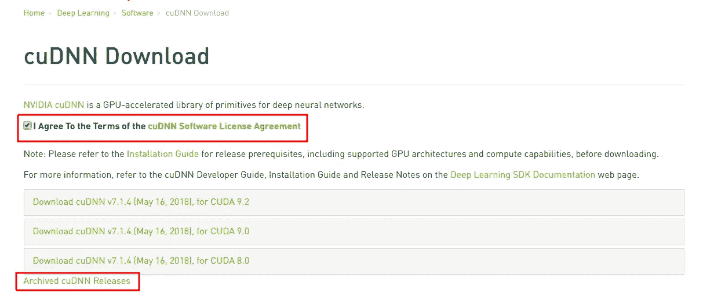

# 启动并运行 Ubuntu、Nvidia、Cuda、CuDNN、TensorFlow 和 PyTorch

> 原文：<https://medium.com/hackernoon/up-and-running-with-ubuntu-nvidia-cuda-cudnn-tensorflow-and-pytorch-a54ec2ec907d>

## 深入了解如何在 Ubuntu 18.04 上安装深度学习框架并使用您的 Nvidia GPU。


Ignore my old dusty PS3, I was able to find an orange Nvidia logo to match!

**本文和信息是截至 2018 年 6 月 25 日的最新/更新信息**

建立和训练深度学习模型是一项艰巨的任务。确保您的环境、软件包和 GPU 协调工作会增加这一努力。本指南相当深入地帮助了相对不熟悉 Linux 的用户。Ubuntu 最新的长期支持(LTS) 18.04 大约在 4 月底发布，所以我决定擦除我当前的 Linux 盒子，从头开始。包括安装我的深度学习环境。由于 18.04 相对较新，在确定要安装哪些软件包时可能会有些混乱。希望这篇文章有助于减轻这些担忧。我已经使用这个设置一个多月了，没有任何问题，但是如果你已经或者想要使用 Ubuntu 16.04 LTS，这些说明应该也可以。不管怎样，我慢慢地走完这个过程，并提供所有终端输入和大部分输出。我也不只是展示我在做什么，而是试图为 Linux/深度学习的新手解释为什么。

希望这对你有所帮助！让我们开始吧…

# 序文

**首选硬件**

*   英伟达 GTX 1070(我假设你有一个英伟达图形处理器)
*   华硕微型 ATX B150M-A D3
*   16 千兆字节内存
*   英特尔酷睿 I5–6500 3.2 GHz

**首选软件**

*   Ubuntu 18.04 LTS(桌面版)
*   [Miniconda](https://conda.io/miniconda.html) (也可以用 [Anaconda](https://anaconda.org/) —主[差](https://stackoverflow.com/questions/45421163/anaconda-vs-miniconda))
*   Python 3.6(通过 miniconda)
*   [我的终端的终结符](https://gnometerminator.blogspot.com/p/introduction.html)
*   [Tmux](https://github.com/tmux/tmux/wiki) 终端复用器(深度学习的必备工具)
*   [SublimeText](https://www.sublimetext.com/3) 作为我的文本编辑器
*   [VSCode](https://code.visualstudio.com/) 作为我的主要代码编辑器。以前是 Atom…

**我在这篇文章中使用了以下惯例**

*   任何前进到 **$** 并被**加粗的**都是让你键入终端并运行的命令。不要包括美元符号。
*   任何以 **#** 开头并且是*斜体*的内容都是一个注释，是为了提供更多清晰的信息。不要将这些添加到终端。
*   任何跳过的行都是控制台输出。基本上，运行命令后您可能会看到什么。我将不包括一些输出，特别是如果它很长，或者不是很有建设性。

这里有一个例子:

```
**$ run this comman**d *#comment about the command, do not include this
# comment about the proceeding output from the above command* some output that is potentially important…
    ack! test failed!!!
    Why did it fail? who knows… StackExchange Knows!
```

# **GPU 兼容性**

首要任务是确保您的 GPU 具有足够高的计算分数。TensorFlow 的文档说明:

> 具有 CUDA 计算能力的 GPU 卡 3.0 或更高版本用于从源代码构建，3.5 或更高版本用于我们的二进制文件。

我们不会从源代码构建 TensorFlow，而是使用他们预先构建的二进制文件。因此你需要 3.5 分或更高的分数。打开您的终端并运行:

```
**$ sudo lshw -C display | grep product**
    product: GP104 [GeForce GTX 1070]
```

现在你已经有了你的 GPU 模型，你可以用 Nvidia 的网站交叉引用它来确定你的计算能力。在我的情况下，这是 6.1 分，所以我可以走了。

接下来，我们要确保 Ubuntu 可用的所有软件包都是最新最好的，然后我们要安装/升级它们。运行:

```
**$ sudo apt update**
**$ sudo apt upgrade** *#will ask you Y/n if you want to upgrade*
```

接下来我们将安装 GPU 驱动程序。

# **英伟达驱动**

Ubuntu 预装了通用的 GPU 驱动程序。这些驱动程序不是高度优化的，我们不想牺牲任何性能。您首先需要为您的 GPU 找到并安装最新的 Nvidia 驱动程序。这篇好的 [StackExchange 帖子](https://askubuntu.com/questions/61396/how-do-i-install-the-nvidia-drivers/61433#61433)中列出了几个选项:

> **英伟达 PPA** —出色的性能。它通过使用 PPA 中包含的驱动程序(每一代 Nvidia 卡都不相同，这将在下面解释)来为大多数卡开箱即用。
> 
> **Ubuntu 默认推荐驱动*** — Ubuntu 做了一项惊人的工作，根据你使用的卡来计算你需要哪种 Nvidia 驱动。
> 
> **新版本** —这是 Nvidia 驱动程序的开源实现。他们也做了令人惊叹的工作，虽然他们不能与官方驱动程序或 PPA 的驱动程序相提并论(最新的 Nvidia 卡更是如此)，但他们每周所做的开发速度、承诺、奉献和进步，使人相信这是一个值得拥有和推广的选择。
> 
> **Nvidia 官方网站** —这是官方驱动程序(和 PPA 的一样)，但不同的是，它们不会自动升级，在更新、卸载和安装时会出现一些问题(非常罕见，但会发生)。

在研究了哪个驱动程序最适合使用之后，我选择了 Ubuntu 的 PPA。官方的 Nvidia 驱动程序已经知道了 T2 X 服务器的问题，需要更多的努力才能让它正常工作。不，谢谢…默认的 Ubuntu 驱动缺乏性能。新驱动程序虽然看起来不错，开源也不错，但它的性能并不好。添加 Ubuntu PPA 是最好的选择，因为他们有最新的 Nvidia 官方驱动程序，并已在 Ubuntu 上测试过，所以这应该是一个平稳的安装。好的，为此运行以下命令:

```
**$ sudo add-apt-repository ppa:graphics-drivers/ppa**
```

这个命令将把 PPA 库添加到 Ubuntu 的打包系统中。这是什么意思？Ubuntu 是基于 Debian Linux 构建的，因此使用了 Debian 的 dpkg 打包系统。这个系统为 Ubuntu 提供了要安装的应用。高级包工具(APT)允许您从终端轻松地与 dpkg 交互。它监督软件包的依赖性，并升级操作系统中的大量软件。

接下来，您需要确定需要安装哪个驱动程序。转到 [PPA 库](https://launchpad.net/~graphics-drivers/+archive/ubuntu/ppa)，向下滚动到页面底部。基于 Ubuntu 18.04，我可以在 nvidia-driver-390 和 nvidia-driver-396 之间选择。我选择 390 是因为它已经存在了很长时间，因此更多潜在的错误和问题将会被发现。

运行以下命令安装驱动程序。

```
**$ sudo apt install nvidia-driver-390**
```

继续用书签标记你的标签，是时候重启你的电脑了！当你重新开始运作时，我仍会在这里…

太好了，你回来了。希望如此！好的，让我们检查一下，确保驱动程序安装正确:

```
**$ nvidia-smi**
```

您的输出应该类似于下图，除了您的驱动程序版本号可能不同，以及您的 GPU 和进程。如果是的话，恭喜你！你有 Nvidia 驱动程序。


output of nvidia-smi

总结一下驱动程序部分，你要确保 APT 不会升级你的驱动程序。记得您将 PPA 添加到 APT，现在它负责管理该软件。请务必阻止我们正在安装的软件升级。

让 GPU 支持工作需要不同硬件和软件的配合。为了确保兼容性，我们将要求 Ubuntu 不要更新某些软件。您可以随时取消此保留。运行:

```
**$ sudo apt-mark hold nvidia-driver-390**
    nvidia-driver-390 set on hold.
*# To reverse this operation run:
# sudo apt-mark unhold package_name*
```

现在轮到 CUDA 了！

# **安装 CUDA 9.0**

问题是 CUDA 9.0 vs 9.1。据我所知，如果从源代码构建，9.1 版本似乎可以工作，而从二进制文件安装时，9.0 版本可以开箱即用。从二进制文件安装使这个过程不那么乏味，让我们继续这样做。

继续打开 [CUDA 文档](https://docs.nvidia.com/cuda/cuda-installation-guide-linux/index.html)。这些说明可能很难遵循，但是让我们一步一步来。

首先我们要检查你安装了什么 gcc 和 g++版本。

```
**$ gcc — version**
    gcc (Ubuntu 7.3.0–16ubuntu3) 7.3.0
**$ g++ — version**
    g++ (Ubuntu 7.3.0–16ubuntu3) 7.3.0
```

当您安装 PPA Nvidia 驱动程序时，这些驱动程序也安装了 gcc 和 g++ 7 . x 版。这很好，但是 TensorFlow 和 cuDNN 需要 6.x 版才能兼容。我们将暂时搁置这个问题，但在某个时候测试会失败，我们将在安装 CUDA 后解决这个问题。

让我们安装内核头文件。更多关于 Linux 头文件的信息，请点击[这里](https://askubuntu.com/questions/598948/what-does-linux-headers-uname-r-do)，尤其是[这里](https://answers.launchpad.net/ubuntu/+question/54157)。本质上，内核头文件是用于编译内核和任何其他应用程序/软件(在这种情况下是 CUDA)的文件，它们依赖于这些头文件中的信息。要安装 run:

```
**$ sudo apt install linux-headers-$(uname -r)**
    Reading package lists… Done
    Building dependency tree
    Reading state information… Done
    linux-headers-4.15.0–23-generic is already the newest version      (4.15.0–23.25).
    linux-headers-4.15.0–23-generic set to manually installed.
```

现在你需要下载 CUDA 并安装它。你可以从这个官方 [Nvidia 存档](https://developer.nvidia.com/cuda-90-download-archive)中抓取 CUDA 9.0。请看下图，看看要选择哪些选项。


下载完成后，运行以下命令:

```
**$ cd Downloads/** *#navigate to where the .deb file downloaded* **$ sudo dpkg -i cuda-repo-ubuntu1704–9–0-local_9.0.176–1_amd64.deb**
    Selecting previously unselected package cuda-repo-ubuntu1704–9–0-local.
    (Reading database … 224086 files and directories currently installed.)
    Preparing to unpack cuda-repo-ubuntu1704–9–0-local_9.0.176–1_amd64.deb …
    Unpacking cuda-repo-ubuntu1704–9–0-local (9.0.176–1) …
    Setting up cuda-repo-ubuntu1704–9–0-local (9.0.176–1) …
    The public CUDA GPG key does not appear to be installed.
    To install the key, run this command:
    sudo apt-key add /var/cuda-repo-9–0-local/7fa2af80.pub *# run the command the command they provide to install the GPG key* **$ sudo apt-key add /var/cuda-repo-9–0-local/7fa2af80.pub
$ sudo apt update**
**$ sudo apt install cuda** *#might take a few minutes to finish*
```

恭喜你！安装了 CUDA 9.0。让我们从更新中也保留这个包:

```
**$ sudo apt-mark hold cuda**
```

最后，你需要在你的。bashrc 文件。这个隐藏文件位于您的主目录中。您需要在您的。bashrc 文件:

```
export PATH=/usr/local/cuda-9.0/bin${PATH:+:${PATH}}
```

你可以使用任何你喜欢的文本编辑器，或者 nano 或者 vim。但是打开你的。bashrc 文件，并将其添加到文件的末尾，保存并关闭。您需要为启动一个新的终端会话(关闭并重新打开您的终端)。bashrc 文件更改以加载。。bashrc 是一个 shell 脚本，每次启动会话时 bash 都会运行它。您正在添加 PATH 变量，以便可以在您的路径中找到 CUDA。

```
**$ subl .bashrc** *#opens .bashrc file in sublime text, I copy pasta the above line of code then save and close sublime.* **$ cat .bashrc | grep cuda**
export PATH=/usr/local/cuda-9.0/bin${PATH:+:${PATH}} *#you should see this output*
```

伟大的 CUDA 准备接受考验！

```
**$ cd *#navigate back to home* $ cat /proc/driver/nvidia/version**
    NVRM version: NVIDIA UNIX x86_64 Kernel Module 390.67 Fri Jun 1 04:04:27 PDT 2018
    GCC version: gcc version 7.3.0 (Ubuntu 7.3.0–16ubuntu3)
**$ nvcc — version**
    nvcc: NVIDIA (R) Cuda compiler driver
    Copyright © 2005–2017 NVIDIA Corporation
    Built on Fri_Sep__1_21:08:03_CDT_2017
    Cuda compilation tools, release 9.0, V9.0.176
```

如果一切正常，那么 CUDA 已经安装并正常工作。GCC 仍然是 7.x 版本，但是我们将很快修复它。现在让我们来对付 cuDNN。

# **cuDNN**

在 cuDNN 上查看官方[文档](https://docs.nvidia.com/deeplearning/sdk/cuDNN-install/index.html#installcuda)。我们将逐步完成这些。首先你需要确保你已经在 [Nvidia 的开发者项目](https://developer.nvidia.com)创建了一个免费账户。一旦你注册，验证你的电子邮件并准备好，你可以从[这个链接](https://developer.nvidia.com/rdp/cuDNN-download)登录，它会直接带你到下载 cuDNN 页面。按照下图中的步骤找到特定的 cuDNN 版本。基于 TensorFlow 当时对最佳兼容性的建议，我选择 cuDNN 版本 7.0.5 而不是 7.1.4。

一旦在下载页面同意这些条款，然后在列表的底部寻找存档 cuDNN 版本的链接。7.0.5 是一个存档的稳定版本。



这将带你到档案，在那里你可以找到 cuDNN v7.0.5 for CUDA 9.0。

下载以下所有三个。deb 文件:

*   用于 Ubuntu16.04 的 cuDNN v7.0.5 运行时库(Deb)
*   适用于 Ubuntu16.04 的 cuDNN v7.0.5 开发人员库(Deb)
*   适用于 Ubuntu16.04 (Deb)的 cuDNN v7.0.5 代码示例和用户指南


下载后，运行以下命令:

```
**$ cd Downloads/** *#navigate to where you downloaded them
# Start with the runtime file* **$ sudo dpkg -i libcuDNN7_7.0.5.15–1+cuda9.0_amd64.deb**
    Selecting previously unselected package libcuDNN7.
    (Reading database … 236355 files and directories currently installed.)
    Preparing to unpack libcuDNN7_7.0.5.15–1+cuda9.0_amd64.deb …
    Unpacking libcuDNN7 (7.0.5.15–1+cuda9.0) …
    Setting up libcuDNN7 (7.0.5.15–1+cuda9.0) …
    Processing triggers for libc-bin (2.27–3ubuntu1) …
    /sbin/ldconfig.real: /usr/local/cuda-9.0/targets/x86_64-linux/lib/libcuDNN.so.7 is not a symbolic link*# then the developer file — dev typically includes the source code* **$ sudo dpkg -i libcuDNN7-dev_7.0.5.15–1+cuda9.0_amd64.deb**
    (Reading database … 236362 files and directories currently installed.)
    Preparing to unpack libcuDNN7-dev_7.0.5.15–1+cuda9.0_amd64.deb  
    Unpacking libcuDNN7-dev (7.0.5.15–1+cuda9.0) over (7.0.5.15 1+cuda9.0) …
    Setting up libcuDNN7-dev (7.0.5.15–1+cuda9.0) …
    update-alternatives: using /usr/include/x86_64-linux    gnu/cuDNN_v7.h to provide /usr/include/cuDNN.h (libcuDNN) in auto mode*# finally the doc file — necessary for running the installation test* **$ sudo dpkg -i libcuDNN7-doc_7.0.5.15–1+cuda9.0_amd64.deb**
    Selecting previously unselected package libcuDNN7-doc.
    (Reading database … 236362 files and directories currently installed.)
    Preparing to unpack libcuDNN7-doc_7.0.5.15–1+cuda9.0_amd64.deb …
    Unpacking libcuDNN7-doc (7.0.5.15–1+cuda9.0) …
    Setting up libcuDNN7-doc (7.0.5.15–1+cuda9.0) …
```

太好了，还不算太糟。让我们测试 cuDNN 安装。

```
**$ cd** *#back to home* **$ cp -r /usr/src/cuDNN_samples_v7/ $HOME** *#copy the test mnist files over to home.* **$ cd $HOME/cuDNN_samples_v7/mnistcuDNN**
**$ make clean && make**
    rm -rf *o
    rm -rf mnistcuDNN
    /usr/local/cuda/bin/nvcc -ccbin g++ -I/usr/local/cuda/include -IFreeImage/include -m64 -gencode arch=compute_30,code=sm_30 -gencode arch=compute_35,code=sm_35 -gencode arch=compute_50,code=sm_50 -gencode arch=compute_53,code=sm_53 -gencode arch=compute_53,code=compute_53 -o fp16_dev.o -c fp16_dev.cu
    In file included from /usr/local/cuda/include/host_config.h:50:0,
    from /usr/local/cuda/include/cuda_runtime.h:78,
    from <command-line>:0:
    /usr/local/cuda/include/crt/host_config.h:119:2: error: *#error — unsupported GNU version! gcc versions later than 6 are not supported!
    #error — unsupported GNU version! gcc versions later than 6 are not supported!* ^~~~~
    Makefile:203: recipe for target ‘fp16_dev.o’ failed
    make: *** [fp16_dev.o] Error 1
```

现在我们遇到了 gcc/++ 7 的问题。现在，我们需要缓解这个 gcc 问题。让我们安装 gcc 6.x 和 g++ 6.x，然后我们可以创建一个符号链接来告诉 cuDNN 寻找版本 6。我们也可以安装版本 7。

```
**$ sudo apt install gcc-6 g++-6**
    *# ln -s makes a symbolic link so cuda looks for gcc version 6 where we tell it to look.* **$ sudo ln -s /usr/bin/gcc-6 /usr/local/cuda/bin/gcc
$ sudo ln -s /usr/bin/g++-6 /usr/local/cuda/bin/g+**+
```

到底什么是符号链接？

> 符号链接也称为软链接，是一种指向另一个文件的特殊文件，很像 Windows 中的快捷方式或 Macintosh 别名。与硬链接不同，符号链接不包含目标文件中的数据。它只是指向文件系统中某处的另一个条目。这种差异赋予了符号链接某些硬链接所不具备的品质，如链接到目录或通过 NFS 联网的远程计算机上的文件的能力。此外，当你删除一个目标文件时，指向该文件的符号链接变得不可用，而硬链接会保留文件的内容[https://kb.iu.edu/d/abbe](https://kb.iu.edu/d/abbe)

好了，让我们再次尝试这个测试，确保 gcc6 和 g++6 正常工作。

```
**$ make clean && make**
    rm -rf *o
    rm -rf mnistcuDNN
    /usr/local/cuda/bin/nvcc -ccbin g++ -I/usr/local/cuda/include -IFreeImage/include -m64 -gencode arch=compute_30,code=sm_30 -gencode arch=compute_35,code=sm_35 -gencode arch=compute_50,code=sm_50 -gencode arch=compute_53,code=sm_53 -gencode arch=compute_53,code=compute_53 -o fp16_dev.o -c fp16_dev.cu
    g++ -I/usr/local/cuda/include -IFreeImage/include -o fp16_emu.o -c fp16_emu.cpp
    g++ -I/usr/local/cuda/include -IFreeImage/include -o mnistcuDNN.o -c mnistcuDNN.cpp
    /usr/local/cuda/bin/nvcc -ccbin g++ -m64 -gencode arch=compute_30,code=sm_30 -gencode arch=compute_35,code=sm_35 -gencode arch=compute_50,code=sm_50 -gencode arch=compute_53,code=sm_53 -gencode arch=compute_53,code=compute_53 -o mnistcuDNN fp16_dev.o fp16_emu.o mnistcuDNN.o -LFreeImage/lib/linux/x86_64 -LFreeImage/lib/linux -lcudart -lcublas -lcuDNN -lfreeimage -lstdc++ -lm
```

到目前为止一切顺利，最后，cuDNN 使用著名的 MNIST 数图像数据集进行了内部前馈卷积网络测试:

```
**$ ./mnistcuDNN**
    cuDNNGetVersion() : 7005 , cuDNN_VERSION from cuDNN.h : 7005 (7.0.5)
    Host compiler version : GCC 6.4.0
    There are 1 CUDA capable devices on your machine :
    device 0 : sms 15 Capabilities 6.1, SmClock 1784.5 Mhz, MemSize (Mb) 8116, MemClock 4004.0 Mhz, Ecc=0, boardGroupID=0
    Using device 0
    Testing single precision
    Loading image data/one_28x28.pgm
    Performing forward propagation …
    Testing cuDNNGetConvolutionForwardAlgorithm …
    Fastest algorithm is Algo 1
    Testing cuDNNFindConvolutionForwardAlgorithm …
    ^^^^ cuDNN_STATUS_SUCCESS for Algo 1: 0.027648 time requiring 3464 memory
*#… lots of additional lines ...
# ... Final few lines should say ...* Result of classification: 1 3 5
Test passed!
```

厉害！cuDNN 在工作。下一项任务…你猜对了。阻止这些包被更新和删除(您可以删除。deb 文件也在您的下载中/)我们在之前的 MNIST 测试中使用的复制样本目录:

```
**$ sudo apt-mark hold libcuDNN7 libcuDNN7-dev libcuDNN7-doc** *#These are the three .deb files we installed* libcuDNN7 set on hold.
    libcuDNN7-dev set on hold.
    libcuDNN7-doc set on hold.
**$ rm -r cuDNN_samples_v7/**
```

现在我们正进入最后冲刺阶段。是时候安装我们的深度学习框架了。首先是 TensorFlow，因为它通常比 pytorch 更挑剔。

# **深度学习框架**

首先用 conda 创建一个新的虚拟环境。我称之为“张量流”。下面我对用 pip 初始化 env 和在 env 创建后不安装 pip 做了一个评论。曾经有(可能仍然有)一个潜在的错误，如果你在创建了一个 env 之后安装 pip，那么不管你是否在一个激活的 env 中，pip 安装都会全局地安装软件包。这是非常不可取的行为。解决方案是用画中画初始化。这个 bug 现在可能已经减轻了。

```
**$ cd
$ conda create -n tensorflow python=3.6 pip numpy** *#remember to initialize the env with pip here.
# activate your conda environment* **$ conda source activate tensorflow**
*# now your user and hostname will be prepended with a (tensorflow) e.g. below
# keil@yuki-bot:~$
# (tensorflow) keil@yuki-bot:~$*
```

现在对于张量流。我从 TensorFlow 的[网站](https://www.tensorflow.org/install/install_linux#the_url_of_the_tensorflow_python_package)得到了下面的网址。重要的是要确保你正在安装软件包:tensorflow-gpu 而不是 tensorflow。否则你不会做太多的 GPU 计算…

我抓取了 python 3.6 GPU 支持 url，在页面底部找到。我们来装吧！

```
**$ pip install — ignore-installed — upgrade** [https://storage.googleapis.com/tensorflow/linux/gpu/tensorflow_gpu-1.8.0-cp36-cp36m-linux_x86_64.whl](https://storage.googleapis.com/tensorflow/linux/gpu/tensorflow_gpu-1.8.0-cp36-cp36m-linux_x86_64.whl)
**$ conda list | grep tensor** *#should show something like the following* tensorboard 1.8.0 <pip>
    tensorflow-gpu 1.8.0 <pip> *#this should say tensorflow-gpu… not tensorflow*
```

现在，我们可以通过在控制台中启动 python repl 并导入 tensorflow 库来测试 tensorflow 安装。

```
**$ python**
    Python 3.6.5 |Anaconda, Inc.| (default, Apr 29 2018, 16:14:5
    [GCC 7.2.0] on linux
    Type “help”, “copyright”, “credits” or “license” for more information.
**>>> import tensorflow as tf
>>> hello = tf.constant(‘Hello, TensorFlow!’)
>>> sess = tf.Session()** *# some warning messages and other verbose output...* tensorflow/core/common_runtime/gpu/gpu_device.cc:1356] Found device 0 with properties:
    name: GeForce GTX 1070 major: 6 minor: 1 memoryClockRate(GHz): 1.7845
    pciBusID: 0000:01:00.0
    totalMemory: 7.93GiB freeMemory: 7.46GiB
    2018–06–18 15:54:49.570548: I tensorflow/core/common_runtime/gpu/gpu_device.cc:1435] Adding visible gpu devices: 0
    2018–06–18 15:54:49.763041: I tensorflow/core/common_runtime/gpu/gpu_device.cc:923] Device interconnect StreamExecutor with strength 1 edge matrix:
    2018–06–18 15:54:49.763069: I tensorflow/core/common_runtime/gpu/gpu_device.cc:929] 0
    2018–06–18 15:54:49.763089: I tensorflow/core/common_runtime/gpu/gpu_device.cc:942] 0: N
    2018–06–18 15:54:49.763303: I tensorflow/core/common_runtime/gpu/gpu_device.cc:1053] Created TensorFlow device (/job:localhost/replica:0/task:0/device:GPU:0 with 7205 MB memory) -> physical GPU (device: 0, name: GeForce GTX 1070, pci bus id: 0000:01:00.0, compute capability: 6.1)**>>> print(sess.run(hello))**
    b’Hello, TensorFlow!’
**>>> exit()**
```

很好，看起来都不错。恭喜你，你已经安装了支持 GPU 的 TensorFlow。而且你不需要用 APT 持有 tensorflow，康达负责管理 tensorflow 的升级。

现在停用 tensorflow conda env 并为 pytorch 创建一个:

```
**$ source deactivate tensorflow
$ conda create -n pytorch python=3.6 pip numpy
$ conda source activate pytorch**
```

转到 pytorch 网站，生成一个命令来安装 pytorch。下图显示了我选择的选项:


```
**$ conda install pytorch torchvision cuda90 -c pytorch
$ conda list | grep torch**
*# packages in environment at /home/keil/miniconda3/envs/pytorch:* cuda90 1.0 h6433d27_0 pytorch
    pytorch 0.4.0 py36_cuda9.0.176_cuDNN7.1.2_1 [cuda90] pytorch
    torchvision 0.2.1 py36_1 pytorch
**$ python** *#start the python interpreter to test pytorch for GPU support* Python 3.6.5 |Anaconda, Inc.| (default, Apr 29 2018, 16:14:56)
    [GCC 7.2.0] on linux
    Type “help”, “copyright”, “credits” or “license” for more information.**>>> import torch
>>> torch.cuda.current_device()**
    0
**>>> torch.cuda.device(0)**
    <torch.cuda.device object at 0x7faff01a8860>
**>>> torch.cuda.get_device_name(0)**
    ‘GeForce GTX 1070’
**>>> exit()
$ source deactivate pytorch**
```

厉害！Pytorch 看起来不错。

就这样了。你们都完了。您已经安装了 tensorflow 和 pytorch，它们都在自己的 conda 虚拟 env 中有 GPU 支持。你安装了 CUDA 9.0，cuDNN 7.0.5，gcc/g++ 6.0，Ubuntu 最新的 nvidia 官方 GPU 驱动，以及最新的内核头文件。

希望所有这些对你有用，并且你在这个过程中学到了一些东西。获得 GPU 对深度学习框架的支持的最大挑战是确保所有不同版本的东西都能很好地协同工作。这只是需要一些研究和阅读 Ubuntu，Nvidia，TensorFlow 和 Pytorch 的官方文件。除此之外，大部分都是简单的命令拷贝。

我发现有用的高质量信息网站是 StackExchange，尤其是 Nvidia [开发者表单](https://devtalk.nvidia.com/)。当阅读在线论坛时，确保信息是最新的。很多答案和问题都是旧的，不再适合。我相信这个帖子很快也会过时。必要时我会尽量更新。

感谢你苦读这篇文章。深度学习愉快！

干杯，

狭海峡