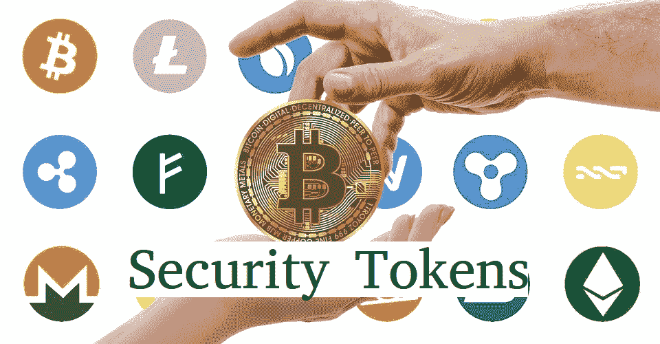

# 安全令牌的更新——区块链的新成员，你想知道的。

> 原文：<https://medium.com/hackernoon/update-on-security-tokens-new-kid-on-the-blockchain-which-you-want-to-know-34bcb18d8f5>

最近出现了关于安全令牌是否会在 2018 年扩大规模的问题，这个问题在[区块链](https://hackernoon.com/tagged/blockchain)中有许多不同的看法。

上周，StartEngine 的首席执行官开始了第二届年度 [ICO](https://hackernoon.com/tagged/ico) 2.0 峰会，呼吁对“安全”令牌的定义进行监管。他告诉人群，有价值的安全令牌即将到来，但与此同时，监管机构需要明白，并非所有令牌都是安全令牌。

Security Tokens Developments

他的信息是对美国和世界各地安全令牌的监管状况提出的无数意见之一。随着区块链的发展，官员们在如何对密码进行分类的问题上一直存在分歧。随着政府和金融监管机构发现更多关于区块链的信息，大多数区块链和相关机构都在循规蹈矩，以免被监管机构关闭。

这样做的一个后果是，几个交易所[正在将被视为或可能被归类为安全令牌的令牌](https://www.coindesk.com/hong-kong-orders-crypto-exchanges-delist-tokens-deemed-securities/)摘牌。这部分是因为处理安全令牌需要花费大量的时间和精力。交易所不仅要确保持有适当的许可证，还要应对不断变化的法律环境。交易所不得不花费不成比例的时间和精力来处理安全令牌的监管义务，仅仅是为了保持合规性。他们必须跟上监管机构不断变化的要求。

当监管机构要求亚洲的证券交易所摘牌时，情况就是如此。2018 年早些时候，我们在香港[看到了这一点。香港证券及期货事务监察委员会(SFC)报告称，他们向 7 家交易所发出了警告信，要求交易所摘牌。据称，此举是香港证监会更大努力的一部分，旨在警告投资者与加密货币和 ICO 筹资模式投资相关的风险。](https://www.coindesk.com/hong-kong-orders-crypto-exchanges-delist-tokens-deemed-securities/)

Gatecoin 还宣布，在有关证监会信函的消息浮出水面后，安全令牌将被摘牌。Gatecoin 是遵守监管规定的几家区块链实体之一。

对安全令牌加强监管的第二个后果是，像 tZero 这样的区块链公司正在围绕安全令牌开展他们的项目。Overtstock.com 的 tZero 正在创建一个内部替代交易系统(ATS)。这些交易系统有一个特殊的名称，尽管它们有相似之处(即代币在每个平台上交易)，但不要与交易所混淆。

通常情况下，合格的投资者是唯一能够使用 ATS 的人。这引起了区块链社区的担忧，因为像 ATS 这样只对合格投资者开放的平台显得过于排外。我们可能会看到区块链社区在替代交易系统是否是安全令牌的好去处，或者该平台是否过于精英化的问题上来回摇摆。

在安全令牌真正开始飞速发展之前，需要在这个不断变化的监管环境中解决更多的问题。随着监管规定的更新，交易所不愿意将与金融监管机构关系暧昧的股票上市的情况可能会有所改变。一旦描绘出一幅更清晰的画面，交易所可能会允许曾经退市的硬币重新上市。这种可能性是不确定的，即使发生，在相当一段时间内也不会发生。看起来我们正在接近这样一个点，为了让安全令牌成为现实，一些标准必须出现并被社区接受。

Polymath 正在建立安全令牌标准 ST-20，他们正在构建一个平台，允许投资者发行内置 KYC 和合规性的令牌。下面是他们的[终极指南:如何用 Polymath(第 1 部分)](https://blog.polymath.network/the-ultimate-guide-how-to-launch-a-security-token-with-polymath-part-1-4f5038f016e6)推出安全令牌

# 区块链的新成员是 [**加密货币&区块链监管任务组**](https://www.linkedin.com/company/cryptocurrency-blockchain-legal-regulatory-task-force/) ，由 [**Braeden Anderson** 领导。](https://www.linkedin.com/in/braedenanderson/)

Breaden 在他的文章中说。

> 区块链以奇迹般和开创性的方式改变了世界。这种隐秘的经历激起了强烈的情感——自由、授权和金融革命的感觉。行业专家、开发商、投资者和爱好者已经爱上了区块链技术及其带来的自由，包括我自己。但是爱有时会以一种有趣的方式遮蔽我们的视野，阻碍我们的实际思考。热情和兴奋变成了无政府状态，变成了对一个没有银行和政府的世界的幻想和错觉。你以前听过这个吗？当然，你有。老实说，即使是我也可能有半秒钟相信了——但后来我想起我生活在一个叫做现实的地方。天真和妄想的故事讲述者实际上已经说服自己和其他人，cryptos 将征服军队，并将世界上最强大的银行化为灰烬…“噗”

人们对这一领域的兴趣如此浓厚，以至于 Breaden 和他的同事们在很短的时间内就组建了一个由 33 名行业领袖组成的团队，他们中有法律顾问和企业建设者，也有区块链专家和金融专业人士。

本组织设定了以下目标。

1.  与区块链、金融、法律和监管领域的行业专业人士合作，促进加密货币和区块链领域的智能监管。
2.  分析 SEC 和 CFTC 最近的决策和执法行动
3.  向 SEC 和 CFTC 提交的关于新出现的法规、最近的决策和新的监管提案的意见函草案
4.  通过深思熟虑的辩论分享观点和传播智慧
5.  为 ico 和区块链初创企业提供战略建议
6.  分析 SEC 和 CFTC 最近的决策和执法行动
7.  向 SEC 和 CFTC 提交的关于新出现的法规、最近的决策和新的监管提案的意见函草案
8.  通过深思熟虑的辩论分享观点和传播智慧
9.  识别和调查欺诈性 ico
10.  确保区块链和加密货币市场参与者遵守现有法规。

要了解安全令牌领域的最新发展，请关注我。