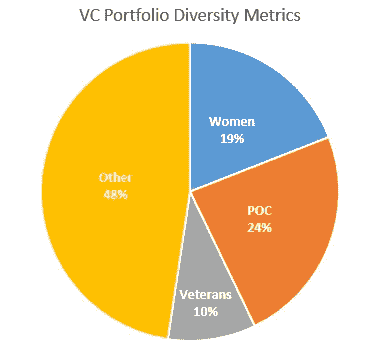

# 更新:追踪我们在深空风险投资公司的投资组合的多样性

> 原文：<https://medium.com/hackernoon/update-tracking-diversity-in-our-portfolio-at-deep-space-ventures-98ecad53b275>

2017 年 12 月[我写了一篇关于风投及其投资组合创始人多样性的文章](https://hackernoon.com/diversity-in-tech-tracking-progress-9f7db383b81e)。我呼吁风投们开始报告他们的多样性统计数据。从那时起，我就把这些数据贴在了[深空风险投资网站上。](http://deepspacevc.com/portfolio/)

下面是我们投资组合中创始人群体的[多样性](https://hackernoon.com/tagged/diversity)的最新情况。截至目前，我们投资组合中 52%的公司至少有一名创始人来自代表性不足的群体。

52% of our companies have at least one founder from an underrepresented group

# **为什么我如此关注多元化并跟踪我们投资组合中的多元化？**

1.  显然，思维的多样性比同质思维更有力量。增加投资组合中背景和生活经历数量的最佳方式，是让创始人多样化。投资组合的创始人在深空平台上是彼此的资源，在这方面，经验和思想的多样性是必须的。
2.  我们最好的公司由多元化的创始人领导。2017 年底，我们进行了一次客观的投资组合评估(根据在[决定](https://hackernoon.com/tagged/determining)表现时对我们很重要的统计数据对我们的公司进行排名)。我们排名前 10 的公司中，有 7 家是由一位来自代表性不足的群体的创始人领导的。我知道这是一个很小的样本量，但这个数字的强大是不容忽视的。

# 接下来呢？

我不知道为什么其他风投不会在他们的网站上公布他们的数据。但希望随着时间的推移，这种情况可以改变。我能控制的就是我在做什么。除了发布关于投资组合的统计数据，2018 年我还在跟踪关于我们的推介计数的统计数据。在我们召开的会议中，我将报告年底有多少公司的创始人来自代表性不足的群体的统计数据。如果我的采购方法中存在偏见或某种缺陷，我会找到并解决它。做到这一点的唯一方法是数据和透明度。

[斯蒂芬·海斯](http://deepspacevc.com/team/)是 [Deep Space Ventures](http://deepspacevc.com/) 的管理合伙人，这是一家位于德克萨斯州达拉斯的风险投资公司，投资电子竞技和 B2B 初创企业。

[点击这里在 Twitter 上关注斯蒂芬](https://twitter.com/hazesyah)

[在这里阅读更多关于深空冒险的信息](http://deepspacevc.com/)