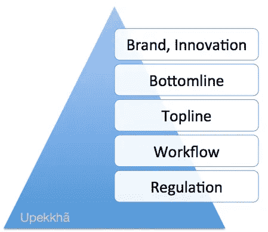

# Upekkha 的 B2B 需求层次

> 原文：<https://medium.com/hackernoon/upekkhas-hierarchy-of-b2b-needs-aka-maslow-for-biz-16162fa95bf0>

企业购买的每件产品都满足组织内部的一种或多种需求。理解这种需求层次的创始人在 B2B/SaaS 环境下会更快地走向 PMF。

我发现考虑一个特定的 B2B 产品如何适应购买组织的需求层次很有用，根据它在层次中的位置推断购买行为如何变化。这是一个简化的视图，在 PMF、定位和细分的早期阶段非常有用。

让我们来看看采购业务的需求层次。

## 规章制度

任何企业都必须首先让他们的监管部门保持一致。注册会计师、CS、会计、金融、环境、审批:政府早早地从合规中获利。如果你销售的产品满足这种需求，你通常会看到低竞争，大多是千篇一律的软件。这似乎是一种商品，通常由你的职能人员决定，也就是说，你的注册会计师将选择会计软件。每个地区、每个行业都有不断变化的特定法规需求，必须满足这些需求。制作有助于监管的软件意味着总是在追赶政府。销售税->增值税->商品及服务税等市场变化可能会引发垂死市场的动荡。

## 工作流程

在许多市场中，业务都是在纸和笔上进行的。在某些情况下，他们已经升级到 Excel 表格。他们很少转向软件，转向 SaaS 工作流软件的就更少了。选择的工作流 SaaS 需要易于采用、全面适用于他们的使用案例、提供比普通软件(或 excel 或笔/纸)更高的工作效率，并成为他们每天全天使用的工具。与大多数技术一样，在中端市场之前，企业已经采用了 SaaS/软件，而许多中小型企业尚未采用任何软件。

在时间即金钱的市场中，员工知道他们的“时薪”，经理们对他们的团队如何花费时间很谨慎，工作流生产力软件卖得很好。近年来，员工生产率的提高导致股价上涨，而不是工资上涨。因此，人力资本密集型企业正拼命寻求提高劳动力生产率。在高端，在谷歌，开发人员的成本为 20 万美元/年，即 100 美元/小时= >对于一个部门的 100 名员工来说，每个员工每月节省一个小时就是 1 万美元/月。在这种情况下，能够理解生产率提高团队领导很可能会为此付出代价！

## 头条新闻的

在快速增长的市场中，顶线增长是关键驱动力。净利润仍然至关重要，但成本归属很难，移动部件的数量和组织的增长使得提高底线变得更加不可预测。与印度的任何细分市场相比，不费吹灰之力，总收入就实现了 10-15%的年增长率，因为整个市场的年增长率为 20-30%。许多市场的增长速度甚至更快，这意味着缺乏增长投资将导致市场份额被竞争对手夺走。比较石油和天然气与金融科技。O&G 高度管制可预测的低/放缓增长。金融科技有新的不断扩大的市场——比如在线 P2P 贷款或“收入共享”。在前一种情况下，底线为王，在后一种情况下，爆炸式的顶线意味着对实际底线的控制非常低。任何获得更多利润的产品都被优先考虑。

## 底线也就是利润

随着一个组织的成熟和增长放缓或变得可预测，净利润是投资者和利益相关者的需求。在上面的例子中，在石油和天然气行业，他们的增长是有限的，成本被很好地建模和理解。增加顶线几乎是不可能的，但他们的成本结构的改善将在底线上显示出来。

有人喊道，给我市盈率，给我股息，给我看看你的投资资本回报率(RoIC)。具有明显底线投资回报(RoI)的产品备受青睐。虽然这是整个公司在一个缓慢增长的市场，这也是真实的成本中心的团体。作为利润中心的集团将倾向于优先考虑顶线增长而不是底线增长，除非他们有明确的授权关注底线。

## 品牌、创新和其他无形资产

在你获得利润和增长之后，还剩下什么？投资未来。

品牌是对未来的投资。提高品牌能让企业在客户粘性、降低收购成本和增加 ARPU 方面获得未来回报。传统上只有大型企业投资品牌，因为回报是非常长期和不可预测的。销售能改善顾客品牌形象的产品有其自身的不确定性。今年的优先事项明年可能就不存在了。

创新是另一种类似的无形资产。很难确定投资创新的回报，但这是必要的。如果你得到战略副总裁或创新副总裁的认可，那太好了！但是要小心改变策略和创新的风向。多年来管理这些团队的工作流可能是一个很好的机会。

## 使配合不当

向快速发展或处于生存模式的小型企业出售生产力。纯粹的生产率提高不太可能吸引这些买家，除非节省下来的时间可以更好地用于提高顶线或底线。

向成本中心推销生产力可能比推销底线改善更难。并不是所有的生产力提高都会转化为底线的提高，所以归因和闭环是很重要的。

向个人/团队销售顶线/底线。大多数团队都是成本中心，与他们谈论收入影响可能超出了他们的工资级别。个人关心自己的生产力，经理关心团队的生产力。

## 您的产品及其层级

完全相同的功能产品可以满足上述一个或多个需求，作为创始人，你对细分市场和定位的选择会产生巨大的影响。这可以通过一个叫做[待完成工作](https://jtbd.info/)的框架来捕获。

考虑一下 Documentum 与 SharePoint。功能相似。Documentum 追逐法规至关重要的市场—制药、法律。Sharepoint 追求团队生产力。基于这种定位，他们的门票大小差异很大，下游集成和功能也大不相同。但最终，它们都存储了文档。

或者学习管理系统。在这种思想中，Tickle 通过销售培训帮助增加收入，而 Adobe Captivate 的目标是监管(强制培训)。

对于生存岌岌可危的中小企业来说，明显的背线增加至关重要——这是氧气。对于一个长期规划的可预测增长非常重要的企业来说，工作流生产率、底线和顶线都变得很重要，但在不同的群体中。销售团队可能会寻求更高的利润。拥有整个 P&L 的球队可能会寻找顶级球员。一个成本中心，比如说金融、IT 或制造业，可能会寻求更多的节约(底线)。个别团队可能会寻求提高他们自己工作流程的生产率，使他们自己的生活更轻松，并给他们更多的时间来实现他们的 KPI。

成熟的企业，购买有助于盈利的产品比购买可能有助于盈利的产品更有意义。销售生产力在低票价时更容易，但在高票价时更难-你需要向更多的客户销售才能获得相同的总收入。监管机构推销自己——如果你有信誉和正确的渠道伙伴关系来接触最终用户。

## 行动

1.  当你在为一个企业迭代你正在解决的问题时，找出你正在解决的问题在层次结构中的位置。询问你的利益相关者使用你的产品提高了哪个 KPI。
2.  看看同一个问题是否向组织内不同的利益相关者传递了不同的价值。
3.  找出本月、本季度、本年度哪个层级对客户业务至关重要。想想你所面对的整个市场也是如此。
4.  如果你的目标受众不欣赏你销售的价值，你的销售周期会很糟糕。要么改变你的定位、你正在解决的问题，要么改变你的买家。

在层次结构中找到与你要解决的问题、你的买家和定位最匹配的点，你可能会更快地找到适合市场的产品。

_____

Upekkha 是一个加速器，帮助 B2B SaaS 初创公司从 10 万美元快速增长到>、100 万美元。