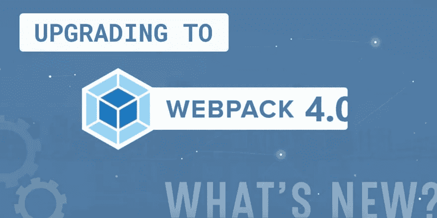

# 升级到 Webpack 4🎉

> 原文：<https://medium.com/hackernoon/upgrade-to-webpack-4-3ebb199aa9bf>



Webpack 4 *(代号连奏)*发布于两周前。它包含了许多闪亮的特性。与 Webpack 3 不同的是，Webpack 4 有一系列引人注目的功能，web pack 3 并没有对其前身进行重大升级。

需要注意的主要变化-

**1。缩短构建时间**
构建时间大幅减少(超过 60%)

**2。零配置**

我最近将我的 [**React-Redux 样板文件**](https://github.com/flexdinesh/react-redux-boilerplate) 升级为 **Webpack 4** 。目前还没有明确的迁移文档，所以我花了相当多的时间和精力来完成升级。我写下我想出的一切，这样可以帮助任何想升级的人。

以下是需要完成的配置更改。

*   方式
*   插件
*   属国

# 方式

Webpack 4 有两种模式——*开发*和*生产*。

之前，我们将标志`-p`传递给 webpack 命令来运行生产构建。对于 Webpack 4，您应该总是传入`mode`选项。你有两种方法通过 mode，

# 1.通过 npm 脚本

在你的`package.json`—

```
"build": "webpack --config config/webpack.dev.config.js --mode development" "build:prod": "webpack --config config/webpack.prod.config.js --mode production"
```

# 2.传递配置文件

在你的`webpack.dev.config.js`

```
mode: 'development'
```

在你的`webpack.prod.config.js`

```
mode: 'production'
```

# 插件

以下插件已从 Webpack 4 中删除，这些插件在以前的版本中广泛使用。

*   NoEmitOnErrorsPlugin
*   ModuleConcatenationPlugin
*   命名模块插件
*   CommonsChunkPlugin

现在，这些插件的配置应该放在`config file`中的键`optimization`内，并带有相应的选项。

这个片段可能会给你更多的信息

```
plugins: [// Not used like this anymorenew webpack.NamedModulesPlugin(),
  new webpack.NoEmitOnErrorsPlugin(),
  new webpack.optimize.CommonsChunkPlugin({
    name: 'vendor',
      children: true,
      minChunks: 2,
      async: true, 
    }),
  new webpack.optimize.ModuleConcatenationPlugin()],Instead, the above plugins are used like thisoptimization: {

  namedModules: true, // NamedModulesPlugin()splitChunks: { // CommonsChunkPlugin()
    name: 'vendor',
    minChunks: 2
  },noEmitOnErrors: true, // NoEmitOnErrorsPluginconcatenateModules: true //ModuleConcatenationPlugin
}
```

# 属国

如果您正在使用像`webpack-hot-middleware`和`image-webpack-loader`这样的依赖项，请确保您也升级了它们。我在使用`webpack-hot-middleware`时遇到了一个奇怪的问题，但是当我把它升级到最新版本时，它就自动解决了。

可以参考 [**React-Redux 样板**](https://github.com/flexdinesh/react-redux-boilerplate) 中的这个 [**commit**](https://github.com/flexdinesh/react-redux-boilerplate/commit/69dc839ad84c37b170e4c3d6f1f8ecb735fc2791) 进行参考。

Webpack 4 在很多方面都很棒。但是缺少升级文件是一件令人沮丧的事情。但是，我们都是了不起的问题解决者，所以我们不介意。

如果您计划升级到 Webpack 4，不要犹豫，您的开发体验肯定会成倍增加。上帝速度！

祝您愉快！✨

*原载于* [*dev.to*](https://dev.to/flexdinesh/upgrade-to-webpack-4---5bc5) *。*