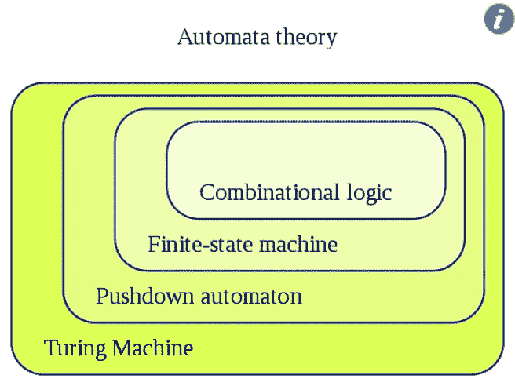
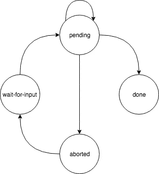

# 用状态机升级您的 React UI💡

> 原文：<https://medium.com/hackernoon/upgrade-your-react-ui-with-state-machines-30d1298e90be>

这篇文章是关于 React-Machinery，一个用于在 React 中创建和使用状态机来控制 UI 的库。 [*在 github 上找到完整源码*](https://github.com/francisrstokes/React-Machinery)

状态无处不在，它是 web 开发社区中特别热门的话题。我们有像 **redux** 这样的库来帮助管理全局状态，但是在组件级别上，我们可以更进一步，利用一些优秀的老式计算机科学。

几乎所有的 UI 组件都有一组特定的状态。像下拉菜单这样的简单组件有*未选中*，*处于选中*状态，*处于选中*状态。像 youtube 视频组件这样的复杂视图有许多状态，如*播放*、*暂停*、*加载*——以及许多子状态，如音量控制是否*展开*，或者是否启用了隐藏字幕。这也不限于 UI——任何种类的应用程序、对象或函数都可以是有状态的。

作为开发人员，我们经常使用**布尔变量**和 **if 语句来建模这些状态。虽然这本身并不坏，但这种方法存在一些问题:**

*   布尔表达式的组合很难理解和交流
*   随着需求的变化，这些分支 if 语句可能会产生不必要的副作用

有没有遇到过这样的错误，由于某种原因，状态的两个完全不同的部分以一种意想不到的方式结合在一起，产生一种奇怪的效果？我几乎在我参与的每一个项目中都有这样的经历，从游戏到水疗到休息后端。

幸运的是，计算机科学为这类问题提供了一个非常好的解决方案，恰当地命名为**有限状态机**。

## 有限状态机>组合逻辑

首先，粗略地说，有限状态机是:

> 一个**有限状态机** ( **FSM** )或**有限状态自动机** ( **FSA** ，复数:*自动机*)，**有限自动机**，或简称为**状态机**，是计算的数学[模型。它是一个](https://en.wikipedia.org/wiki/Model_of_computation)[抽象机器](https://en.wikipedia.org/wiki/Abstract_machine)，在任何给定的时间，它可以处于有限个 [*状态*](https://en.wikipedia.org/wiki/State_(computer_science)) 中的一个状态。FSM 可以响应一些外部[输入](https://en.wikipedia.org/wiki/Input_(computer_science))从一种状态变为另一种状态；从一种状态到另一种状态的变化称为*转换*。FSM 由它的状态列表、它的初始状态和每个转换的条件来定义。
> 
> 摘自[https://en.wikipedia.org/wiki/Finite-state_machine](https://en.wikipedia.org/wiki/Finite-state_machine)

希望这个定义能和我上面谈到的 UI 状态联系起来。如果没有，不要担心——一个实际的例子来了！

作为一个小注意，有趣的是注意到了描述中的那个词 ***自动机*** 。在数学和计算机科学中，自动机是处理可计算性的“抽象机器”。这些 ***自动机*** 形成一个层级:

From: [https://en.wikipedia.org/wiki/Automata_theory](https://en.wikipedia.org/wiki/Automata_theory)

从图中可以看出，有限状态机比单纯的组合逻辑(布尔和 if 语句)占据了自动机的更高层次。简单地说，它们为你提供了一种语言，以一种比你单独使用组合逻辑更精确的方式来描述一些东西。

我们可以将这一理论付诸实践，并与反应⚛️一起使用

## <hardchoicebutton>组件</hardchoicebutton>

不久前，韦斯·博斯在夏威夷导弹恐慌后发布了这条推特:

我将使用这个组件作为灵感，并使用***react-machinery***构建类似的东西。

结果将是一个名为 **HardChoiceButton，**的组件，它将显示一条消息，倒计时的秒数，以及一个作为道具运行的动作函数。

如果你愿意，你可以在阅读之前快速浏览一下完成的例子。

按钮开始处于*等待输入*状态，当用户按下按钮时，进入*等待*状态。

在*未决*状态期间，计时器从 5(或我们传递的任何值)开始倒计时。在倒计时过程中的任何时候，用户都可以再次按下按钮中止操作，进入*中止*状态。

如果在*等待*期间没有按下按钮，并且倒计时一直到 0，那么动作被执行，按钮进入*完成*状态。

我们可以用下面的 ***状态图来表示上述逻辑:***

## 引进反应机械

让我们开始定义**硬选择按钮**类:

正如您所看到的，由**react-machine**公开的 StateMachine 组件有 4 个属性:states 数组、获取/设置当前状态的函数和一些数据属性，我马上就要谈到这些属性。您可以将任何想要的数据源连接到***getCurrentState()***和***setNewState()***函数——从 redux 存储或 mobx 状态树中获取数据——但是这个示例只使用常规的组件状态。

states 数组包含有名称的对象，在本例中是一个名为 render 的函数。此处的 ***渲染*** 功能表示处于*等待输入*状态时要渲染的组件。该函数接收 ***数据*** 对象作为道具，允许我们显示‘发射导弹’消息。

尽管**硬选择按钮**只有一个州，但它并没有多大用处！让我们继续填写其余的州。

在此之前有一个小注意:与每个状态相关联的组件可以用两种方式给出。第一种是通过一个 ***渲染*** 功能如上图。这种方式遵循[渲染道具模式](https://reactjs.org/docs/render-props.html)。第二种方法是改为指定一个 ***组件的*** 属性。这不是一个函数，而是一个普通的组件。如果您有一个带有自己内部状态的 react 类组件，这种风格会更适用一些。

## 完整状态定义

State definitions + two class components

当我们在*等待输入*状态下点击按钮时，我们称 ***转换为(‘待定’)***。这是 ***状态机*** 组件传递给 ***渲染*** 以及 ***数据*** 对象的一个特殊函数。

里面还有另外一个键叫做 ***validTransitions。*** 用于登记允许与 ***过渡到*** 的状态。尝试转换到未注册的状态将导致错误。

还有一个 ***beforeRender*** 函数，允许你执行一些副作用的东西——在这种情况下，确保每当我们进入*等待输入*状态时，定时器都被重置。这样我们可以确保计时器总是从 5 点开始计时。

当挂起状态变为活动状态时，它会呈现 ***挂起*** 组件，这是一个相当简单的类组件，可以创建和销毁 interval，并呈现新按钮。间隔每秒调用 ***状态机的 ***道具*** 中定义的***decrease time left()***函数。***

尽管对于*未决*来说，将状态转换到*完成*状态的机制略有不同。我们可以描述一个自动转换，而不是将 ***转换为*** ，它使用一个函数来决定是否改变状态。这些类型的转换可以通过 ***自动转换*** 键在状态中定义。

其余的状态只是使用这些不同类型的转换逻辑的组合。

## 利益

那么，用这种方式建模组件会有什么好处呢？首先，你肯定**知道**你不可能到达一个你没有明确定义的状态。考虑一下，因为这是一个很大的想法。拥有这样的状态机实质上消除了您必须测试的一整类错误。

在此基础上，因为您显式地定义了这个数据结构，所以您可以使用它来生成关于组件的信息。取下面的函数:

这会产生以下对象(显示为 JSON):

您可以使用这些信息来为您的组件生成状态图。这是不言自明的。

现在假设您在生产站点上启用了日志记录。您可以轻松地编写一个状态机来记录每个状态变化，为您提供追溯到任何错误来源的线索。

最后，对业务逻辑中需求的更改通常可以干净地添加进来。假设我们需要添加一个新的行为，当用户在时钟还剩 1 秒的时候点击按钮。我们不需要简单地进入*中止*状态，而是需要进入*接近*状态。

Doesn’t take much to account for new requirements

## 结论

如果你发现自己因为 **if 语句**的奇怪组合而开发 bug，考虑使用**有限状态机**来实现组件。你现在就可以在 React 中用 **react-machinery** (只有 2kb gzipped！).状态机将帮助您更有效地对组件的工作进行建模、推理和交流。

*如果您对此感兴趣，请留下👏或者两个。在 github* *上查看* [*React-Machinery 的代码，并在那里或 Twitter*](https://github.com/francisrstokes/React-Machinery)[*@ fstokesman*](http://twitter.com/fstokesman)*上给我反馈。*