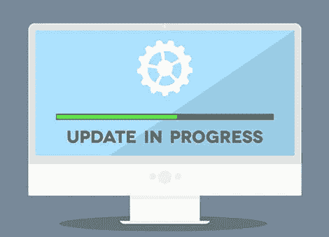
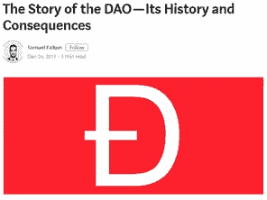
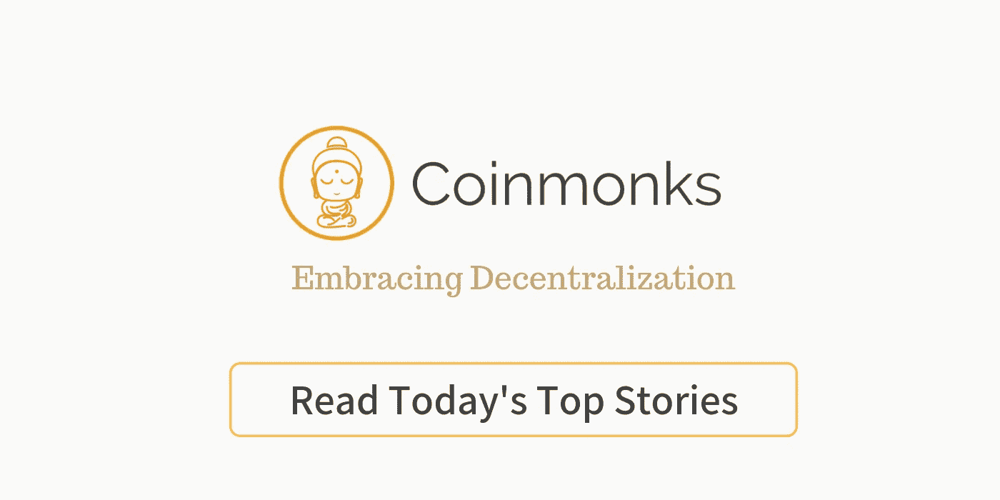

# 可升级以太坊合同 V2

> 原文：<https://medium.com/hackernoon/upgradeable-ethereum-contracts-v2-786d9c18cd9d>

## 充分利用委托通话

## [寻找代码？](https://github.com/kyriediculous/upgradeable-contracts-v2)

几个月前，我在[以太坊](https://hackernoon.com/tagged/ethereum) [区块链](https://hackernoon.com/tagged/blockchain)写了第一篇关于可升级智能合约的博文。我们解释过，智能合同一旦部署到区块链上，就不能更改。

等等？启动后无法升级代码？这似乎是个坏主意，尤其是如果你习惯于敏捷开发周期的话。虽然有保证的代码执行可能是一个好处，但当有一个错误时，它是完全相反的。智能合约中的漏洞导致了数百万美元的损失，甚至诞生了我们今天所知道的以太坊，在早期最受欢迎的智能合约之一 *slock.it DAO* 被发现存在漏洞，允许攻击者耗尽合约中的所有资金([重入攻击](https://solidity.readthedocs.io/en/v0.4.25/security-considerations.html#re-entrancy))。

[https://medium.com/swlh/the-story-of-the-dao-its-history-and-consequences-71e6a8a551ee](/swlh/the-story-of-the-dao-its-history-and-consequences-71e6a8a551ee)

# 第一版

[在我们关于这个主题的上一篇博文](https://hackernoon.com/upgradeable-smart-contracts-a7e9aef76fdd)中，我们探索了一种基于 [*五类型模型*](https://github.com/monax/legacy-docs/blob/master/solidity/solidity_1_the_five_types_model.md) 的策略，这是 Monax(现在的 [Hyperledger Burrow](https://www.hyperledger.org/projects/hyperledger-burrow) )在 Solc 发布之前构思的，所以它在以太坊世界中已经相当古老了。这种模型将存储和逻辑划分到单独的契约中，并有一个注册表来跟踪各个部分。这个版本的部署变得很昂贵，尤其是如果我们一次又一次地实例化同一个契约。这类似于在传统编程中实例化类，但是以太坊区块链上的契约部署花费了大量金钱，所以我们不想花费不必要的费用。

# 代理库

*五种类型的模型*开始还可以，但不是最佳的。对于代理库，我们的基本合同是一个已经部署在区块链上的库。当我们创建一个这样的实例时，我们将部署一个将它的调用转发到指定地址的契约。如果我们想要更新库中的一些函数逻辑，我们将重新部署库，并将我们的契约指向这个新库。即使采用这种策略，也有相当多的代码开销来实现它。最终，我们的目标是将实例化契约的代码限制为只有一个函数，一个转发函数。

# 可升级的 V2

一年多前，Vitalik 在 Reddit 上发布了一篇关于期货合同的帖子[。问题是在 metropolis 之前(写这篇文章的时候)，转发函数的输出大小不能是动态的，并且被限制在 *4096 字节*。该问题已在 *Metropolis* 中修复，现在我们可以正确实现这种类型的转发。

契约调用使用 **DELEGATECALL** 的低级版本转发(虽然在 solidity 0.5.0 中，高级版本现在也返回数据)。Delegatecall 将调用转发给另一个契约，并允许该契约**更改委托者的存储，同时保留原始消息对象**。](https://www.reddit.com/r/ethereum/comments/6c1jui/delegatecall_forwarders_how_to_save_5098_on/)

委托通话没有很好的记录。文档说明它获取调用契约的上下文(消息对象和存储)并在转发的调用中使用它。一个未记载的特征是，如果转发器在协定中没有它自己的存储定义，只要存储顺序匹配，它在初始化之后仍将采用主协定的定义和它自己的值。

让我们用一个代码例子让它更清楚(感谢来自 [Origin Protocol](https://www.originprotocol.com/) 的家伙给我指出了这个方法)

# 例子

首先，我们有一份主合同。它在存储器中有一个名为 *count* 的无符号整数集和两个函数。一个用于将*计数*加 1，一个用于检索变量。

DummyMaster.sol

接下来我们有一个契约，它将作为 *DummyMaster.sol* ，**的实例。注意，两个契约都以*地址 impl* 开始，因为契约需要遵循彼此的存储顺序。**在 *Dummy.sol* 的构造函数中我们设置了 *DummyMaster.sol* 的地址。

Dummy.sol

编译后， *Dummy.sol* 没有匹配 DummyMaster 的 ABI，为了更容易与契约交互，我们可以编写一个未部署的接口契约。这一步不是必需的，但是通过在代理地址实例化接口，这样更容易创建 *calldata* (参见 *test.js* )。

DummyInterface.sol

test.js

让我们测试我们的新架构！首先部署主服务器，然后部署几次代理服务器，并在构造函数中传递主服务器地址。在我们的测试中，我们部署代理三次。我们可以测试每个代理都有单独的存储，如果我们每次都使用相同的契约，那么所有情况下的计数都必须等于 1，计数应该是 3。

就是这样，一个非常简单的方法来编写可升级的智能合同！一个警告是，这些合约的交易稍微昂贵一些，因此将它与保存所有数据的整体合约(如 ERC20 令牌合约)一起使用不是一个好主意。

另一方面，按用户或有限用户之间的合同，如第三方托管、奖金或身份声明注册，将大大受益于此。

完整代码可以在 [my Github](https://github.com/kyriediculous/upgradeable-contracts-v2) 上找到！感谢阅读！

Learn smart contract development