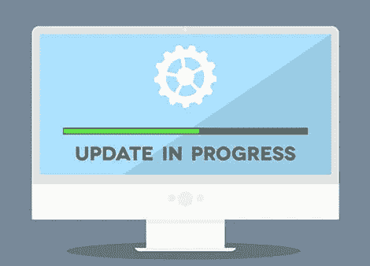
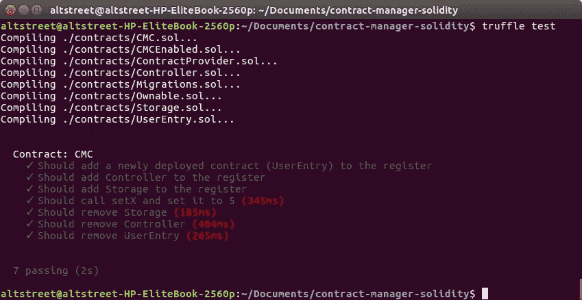

# 可升级的智能合同

> 原文：<https://medium.com/hackernoon/upgradeable-smart-contracts-a7e9aef76fdd>

*如果你只是简单地寻找代码，你可以在这里* *找到回购* [*。*](https://github.com/kyriediculous/contract-manager-solidity)

当你熟悉[以太坊](https://hackernoon.com/tagged/ethereum)(或者一般来说[区块链](https://hackernoon.com/tagged/blockchain)的时候，你可能会遇到*‘不可变’*这个词。当考虑区块链时，我们主要将其与系统的分类账和功能状态不能被篡改或删除的事实联系起来。当具体考虑智能合约时，我宁愿将其与*“不可变对象”*的定义进行比较。

> 在面向对象和函数式编程中，**不可变对象**是一个对象，它的状态在创建后不能被修改

这意味着，一旦我们的合同部署到区块链，它是固定的。我们不能改变其预定义范围(setters)之外的状态，但更重要的是我们不能改变代码。

为了解决这个问题，我们将讨论一个解决方案，该方案基于将我们的契约存储和逻辑拆分到单独的契约中，同时通过注册中心引导调用。之后，我们将讨论一些利弊。



# **合同管理合同**

该模型将基于 Monax 的[五种类型模型，针对最新的 Solidity 语言特性进行更新，以使其更易于理解和阅读。我们将执行以下合同:](https://monax.io/docs/solidity/solidity_1_the_five_types_model/)

1.  CMC —在我们的系统中跟踪合同的注册表
2.  控制器—根据我们的存储合同运作的合同
3.  存储—具有必要的获取器和设置器的数据存储契约
4.  ALC——包含特定于应用程序的逻辑(通常是用户入口点)的契约

如果您以前有 web 应用程序的经验，那么这个动作流看起来就像您从命名中所期望的那样。

用户→ALC→控制器→存储

# ALC、控制器和存储的基本类别

我们添加到注册中心的每个合同都将从一个基类开始，该基类为我们的注册中心设置并包含以太坊地址、一个用于合同访问控制的修饰符、一个从注册中心的合同中获取地址的接口以及一个删除合同的选项。

# 合同登记处

我们的合同注册中心将跟踪我们的系统当前在*映射*中使用的合同地址。我们将使用*字节 3* 2 变量，因为我们不能将动态类型(字符串)作为键。我们将添加一些函数来添加、获取和删除注册表中的函数，并添加一个函数来更新我们部署的契约所使用的注册表。*(可以从*[*OpenZeppelin*](https://github.com/OpenZeppelin/zeppelin-solidity/blob/master/contracts/ownership/Ownable.sol)*)获取 Ownable.sol】*

就是这样！现在是说明它如何工作的时候了，为此我们将创建一个简单的工作流，通过 ALC 和控制器将变量 *x* 存储到我们的存储契约中。**每个合同将被单独部署，并在创建后添加到注册表中。**一个好的惯例可能是给你的合同起一个和定义它们时一样的名字。

# 对其进行测试

在 github repo 中，您会在 test 文件夹中找到一个文件，其中包含一些基本的单元测试。要运行这些程序，请确保您已经安装了[块菌](http://truffleframework.com/docs/getting_started/installation)并且 [Ganache](http://truffleframework.com/ganache/) 正在运行。运行 test 命令来运行单元测试:

```
truffle test
```



completed tests

# 赞成和反对

这种设置的两个优点当然是代码的可维护性和可升级性。我们现在可以在现有存储之上部署新的控制器或 ALC，这样我们的用户数据就不会受到影响。

最大的缺点是汽油成本。部署这个宝贝将比仅仅部署一个合同花费更多，特别是如果工作流程真的很简单的话。除此之外，您/用户在进行状态更改时，将额外支付 10%的天然气费用。

我知道对于用户来说，这可能会有一些信任问题，但是我并不认为这是一个争论，因为他们可以很容易地检查注册，以检查哪些合同正在使用。

感谢你的阅读，我希望你喜欢它，尤其是学到了一些新东西。这只是一个基本模型，一个更大的系统当然会在 CMC 上有更多的逻辑，甚至系统的不同部分会有不同的合同经理。

如果你想了解更多关于可靠性的知识，一定要看看我们的 [dApp 教程系列](https://itnext.io/create-your-first-ethereum-dapp-with-web3-and-vue-js-c7221af1ed82)和我们的[令牌教程](https://hackernoon.com/create-your-own-ethereum-token-bfa6302084da)！

如果你喜欢这篇文章，随时欢迎你留下你的建议并支持免费的知识分享！

*ETH—0x 6d 31 CB 338 b 5590 adafec 46462 a1 b 095 ebdc 37d 50*