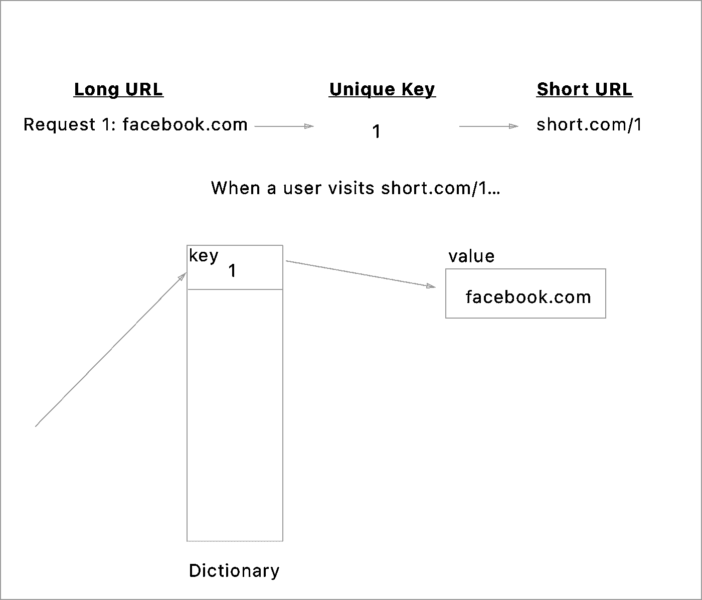
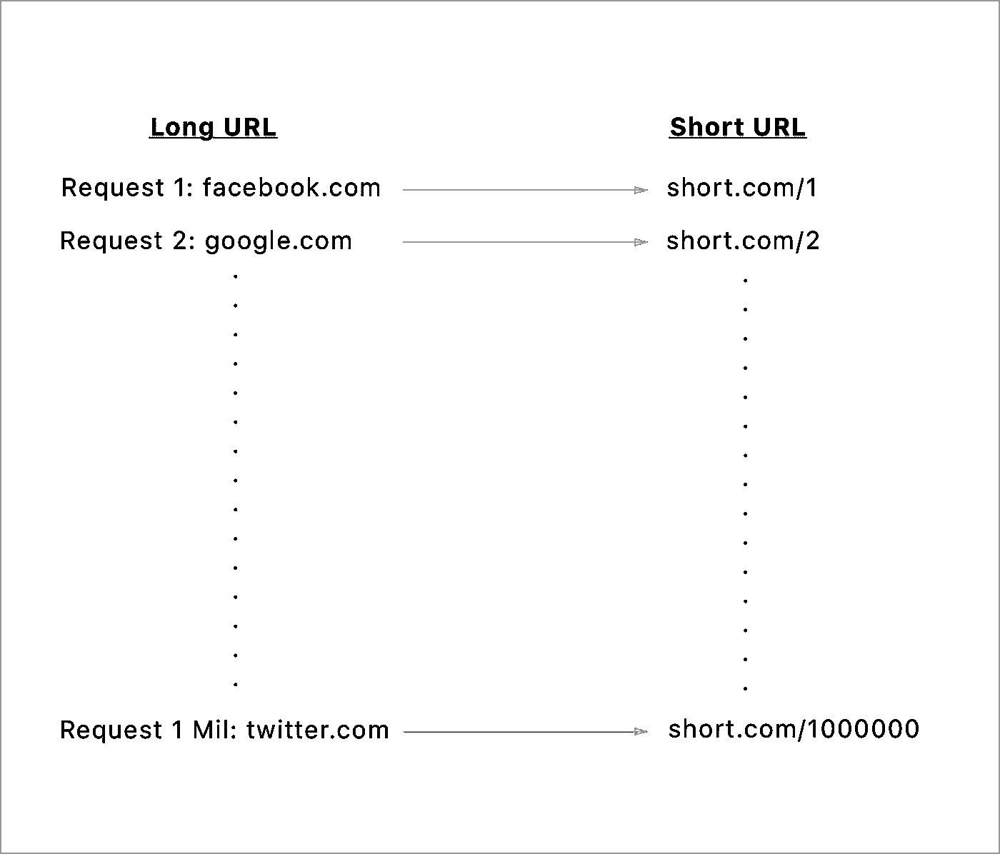
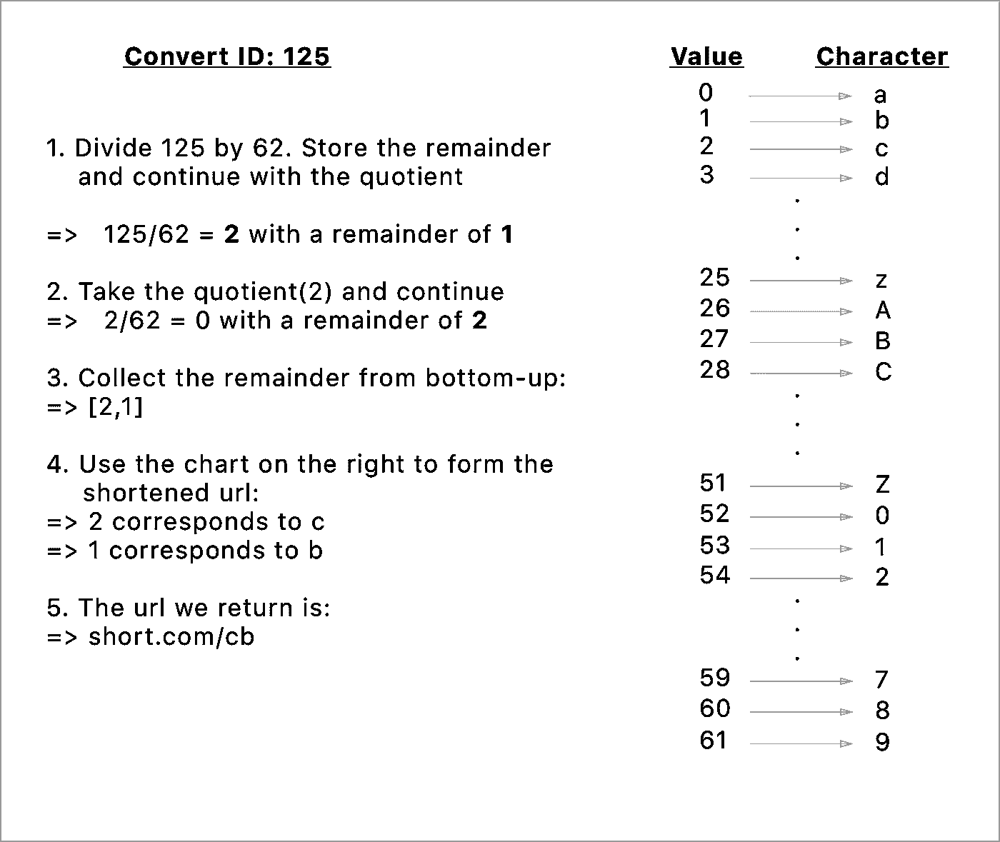
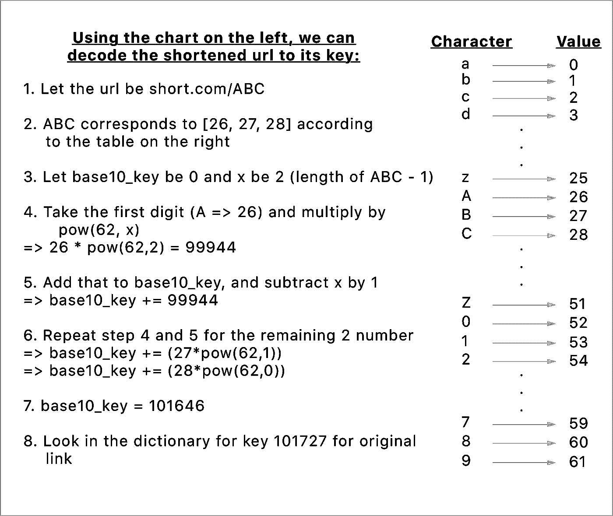
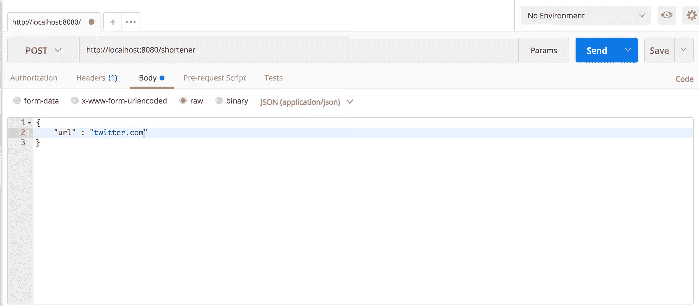

# Java、Spring Boot 和 Redis 中的 URL 缩短服务

> 原文：<https://medium.com/hackernoon/url-shortening-service-in-java-spring-boot-and-redis-d2a0f8848a1d>

## 使用 Java、Spring Boot 和 Redis 从头开始构建 URL 缩短服务


Url Shortening with Java, Spring Boot, and Redis

你有没有想过网址缩写是如何工作的？一个奇怪的问题让我看到了几个关于实现的 StackOverflow 帖子。出于好奇，我决定实现一个并写下我的经历。

今天我们就用 [Java](https://hackernoon.com/tagged/java) ，Spring Boot， [Redis](https://hackernoon.com/tagged/redis) 来搭建一个。对于没有耐心的人，请直接跳到**实现**。拿出你最喜欢的编辑器，跟我来！

# URL 缩写的来源

第一个 URL Shortener 是由 TinyURL 的创始人 Kevin Gilbertson 在 2002 年创建的。Kevin 对在论坛上发送长链接感到恼火，他决定做些事情来改善他的用户体验。


Kevin probably did not enjoy sending links like these

如今，链接缩短不仅用于改善链接共享体验。随着 Twitter 的发展(有着烦人的 140 个字符的限制)，URL 缩短达到了顶点。2011 年，Twitter 宣布自动将链接缩短至 23 个字符。我们并不总是想到网址缩写，但它们在改善我们的在线体验方面发挥了重要作用。

# URL 缩短背后的理论

现在我们已经讨论了 URL 缩短的起源及其动机，让我们来讨论它们是如何实现的。

## 编写记录词典

字典解释单词的意思。让我们把这些词定义为“关键”，把这个词的意义定义为“价值”。你们中的一些人可能会问，字典是如何帮助我们缩短 URL 的？


Are my URLs shorter yet?

请这样想:

1.  每次 URL Shortener 收到要缩短的链接时，它会将该链接保存到字典中，并向请求该 URL 的个人返回一个短 URL。
2.  当一个缩短的 URL 被提供给 URL 缩短器时，URL 缩短器查看字典并检索原始链接。

让我们直观地看看这个:



A visual representation of how URL shortens

URL 缩短程序为它收到的每个请求创建一个新的 ID(也称为密钥)。那么 URL 缩短器如何为它接收到的每个 URL 创建一个新的密钥呢？嗯…

## 唯一密钥生成

为了简单起见，让我们假设 URL Shortener 使用请求号作为字典的键。我们可以使用请求编号，因为我们可以保证每个请求编号都是唯一的(我们不能让请求编号 1 出现两次)。然后，我们可以通过将请求编号直接转换为缩短的链接来缩短 URL:



URLs grow so fast sometimes

然而，如果许多用户开始使用 URL Shortener，这些方法将无法扩展。例如，在撰写本文时，Twitter 平均每天有 3.3 亿用户。即使一小部分用户在一天内发送链接，这种方法也会很快产生比原始链接更长的链接。解决这个问题的一个方法是使用**基转换**将请求数转换成一个更短的表示。

## 使用基本转换缩放 URL 缩写

碱基转换是什么意思？基数转换是从不同的数字基数转换数字的过程。我们习惯看到的数字被称为十进制数。基数 10 仅仅意味着我们有 10 种方法来表示数字(0-9)。假设来说，我们可以把数字转换成任意的基数。例如，如果我们要使用字母(a-z-A-Z)和数字(0–9)来表示数字，那么我们的基数是 62(26 个小写字母+ 26 个大写字母+10 个数字的总和)。使用以下算法，我们可以在基数 10 和基数 62 之间进行转换:

```
Let x be the base10_number
While x is greater than 0:
  Take x and divide by 62\. Store the remainder and let x = quotient
Take the remainders from bottom-up (Last-In-First-Out)
```

使用 62 进制数，我们可以通过使用下面显示的转换表将每个单独的数字转换成相应的字符来产生一个唯一的 ID。观察一个通过基数转换过程将十进制数转换为唯一 ID 的示例:



Base10 conversion of ID 125 to base62

既然我们已经缩短了 URL，检索 URL 的步骤就更加简单了。我们可以使用下面的算法来获取要从字典中检索的十进制数:

```
Let x represents the length of the shortened url
Let base10_id equal 0
For each character c in the url starting from the first:
  val = value of c from the chart provided above
  base10_id plus(val * pow(62, x))
  Minus x by 1
return base10_id
```

让我们看一个这样转换的例子:



An example for retrieval of shortened url ABC

观察我们如何仅用 3 个字符(ABC)来表示第 100，000 个请求。使用这种方法将允许我们更好地扩展我们的 Shortener。

# 履行

言归正传！让我们先来看看 [Spring Boot](https://projects.spring.io/spring-boot/) :

## Spring Boot

Spring Boot 是一种让 Spring 应用程序运行的自以为是的方式:它允许我们在短时间内让代码在 web 上运行。让我们从官方[网站](https://start.spring.io/)生成一个 Gradle Spring 项目开始。请确保将 Web 添加为依赖项。

接下来，让我们将上面介绍的基本转换方法翻译成代码。在`src/java/main/urlshortener.app`中创建一个名为`common`的包，并创建一个名为`IDConverter.java`的 Java 类

## IDConverter.java

我们将使用`IDConverter`来抽象获取缩短后的 URL 的惟一 ID 的逻辑，以及将惟一的 URL 转换回字典键。因为我们只需要一个`IDConverter`的实例，所以让它成为一个 [Singleton](https://en.wikipedia.org/wiki/Singleton_pattern) 。

首先，让我们用一个列表和一个散列表来初始化这个类，以映射基数 10 和 62 之间的表示:

`indexToCharTable`代表上述 base10 到 base62 示例中的转换图表，而`charToIndexTable`代表将缩短的 URL 转换回字典键的示例中显示的图表。

接下来，让我们创建一个函数，它接收一个请求号(ID ),并将其转换成一个唯一的 URL:

`createUniqueID`接受一个 id (base10)并使用上面定义的帮助函数将其转换为 base62。然后，该函数使用`indexToCharTable`转换将 base62 数字的每个组成部分转换为一个字符，以返回一个唯一的 URL。

接下来，让我们创建一个相反的函数:接收一个惟一的 URL 并返回请求号(id):

`getDictionaryKeyFromUniqueID`接收唯一的 URL ID，并将其转换回 base62 数字对应项。然后，该函数获取 base62 数，并执行算法来计算请求数(id)。

接下来，我们将实现字典来存储 URL。在此之前，我们先绕道说一下 Redis。

## 雷迪斯

> Redis 是一个开源的(BSD 许可的)、内存中的数据结构存储，用作数据库、缓存和消息代理

对于服务，我们应该使用数据库来实现持久性。在筛选了从 SQL 到 NoSQL 的各种选项之后，Redis 似乎是一个很好的选择，因为它能够用作内存中的数据结构。我们需要的字典功能可以从 Redis' `[hset](https://redis.io/commands/hset)`获得。

为了使用 Redis，我们必须首先从[官方网站](https://redis.io/topics/quickstart)安装它。我强烈建议在继续之前跟随网站上的 15 分钟教程，以便更好地理解 Redis。

接下来，我们将把 Jedis 纳入我们的`build.gradle`。
Jedis 是一个 Redis Java 客户端:它允许我们直接从 Java 使用 Redis 的功能。

```
compile group: 'redis.clients', name: 'jedis', version: '2.9.0'
```

## URLRepository.java

接下来，我们将在`src/main/java/urlshortener.app`中创建一个名为 repository 的新包。存储库是一种“封装存储、检索和搜索行为的机制”。抽象数据库细节是一个很好的实践，所以我们将在这里创建`URLRepository`。

`@Repository`注释允许 Spring 检测该类，并将其包含在构建路径中。稍后我会更详细地解释这一点。

这些函数在很大程度上是不言自明的。`incrementID`增加一个 id(请求编号)并增加它。`saveUrl`获取一个密钥和原始 url，并使用`jedis.hset`将其存储到 Redis 中。`getUrl`获取一个 id (key)并使用`jedis.hget`从 Redis 中检索它。

接下来，让我们在`src/main/java`中创建一个服务包，并创建一个 Java 类`URLConverterService`。

## URLConverterService.java

我们将使用`URLConverterService`通过调用我们之前创建的存储库和助手来抽象缩短 URL 的请求。
在高层次上，服务应该能够:
1。获取原始 URL 并返回一个缩短的 URL
2。获取缩短的 URL 并返回原始 URL

`@Service`注释允许 Spring 将类包含到它的构建路径中。`@Autowired`注释允许 Spring 通过在它的构建路径中查找它所依赖的类(URLRepository)来解析类的依赖性。因为我们已经用`@Repository`标记了 URLRepository，所以可以自动解析依赖关系。

`shortenURL`接受要缩短的 URL，调用存储库保存原始 URL，并使用基本 URL 执行字符串操作以返回缩短的 URL。`formatLocalURLFromShortener`获取用于执行 POST 请求的 URL，并获取主机名和端口号。`getLongURLFromID`从 URL 获取 uniqueID，并使用存储库检索原始 URL。

到目前为止一切顺利！下一步将是在网络上提供这种服务。接下来，在`src/main/java/urlshortener.app`中创建一个名为 controller 的包，并创建一个`URLController`类。

## URLController.java

在高层次上，`URLController`是我们的 web 应用程序的入口点。我们希望我们的`URLController`做两件事:

1.  接收缩短 URL 的请求，并使用缩短的 URL 进行响应
2.  接收一个缩短的 URL，并自动将用户重定向到原始网站

`@RestController`注释自动为所有带有`@RequestMapping`注释的函数添加一个`@ResponseBody`注释。这授予他们接收和响应请求的功能。标有`@RequestMapping`注释的函数能够响应由注释中的值映射的特定 URI。

`shortenURL`功能被映射到`/shortener`端点，并对应于由`method`参数指示的 POST 请求。`“consumes”`指函数期望接收的请求类型。该函数接收一个`ShortenRequest`类和一个`HttpServletRequest`作为参数，使用`URLConverterService`处理它们并返回一个缩短的 URL。我们接受`HttpServletRequest`,因为我们需要请求的主机名和端口号，以便执行我们的字符串操作来产生一个缩短的 URL。我们可以使用`ShortenRequest`作为参数，因为我们将 ShortenRequest 声明为一个类，并将其标记为`@JsonCreator`，从而允许 Jackson(一个 JSON 序列化程序)检测我们的请求并将其转换为一个类对象。这是一个很好的实践，因为它允许我们避免从 URL 硬编码 get 请求。

`redirectURL`功能映射到`/{id}`。这意味着函数被映射到一个动态地址(这是有意义的，因为缩短的 URL 是惟一的)。然后，该函数使用`@PathVariable`注释获取 ID，并使用`URLConverterService`检索原始 URL。最后，我们使用一个`RedirectView`将浏览器重定向到原来的 URL。

看起来不错！但是，我们应该处理传递给 shortenUrl 函数的 URL 无效的情况。为此，我们将在`src/main/java/urlshortener.app/common`中创建一个名为`URLValidator`的助手类。

## URLValidator.java

在缩短 URL 之前，我们将使用`URLValidator`来验证它们。让我们把它做成单例，以确保只有类的实例被共享。

`validateURL`接收一个 URL 并将其与正则表达式匹配。如果 URL 匹配任何被识别为 URL 的模式，则该函数返回 true。

然后我们重构`URLController’s` shortenUrl 如下:

最后，我们来创建一个 app 的入口。在`src/main/java/urlshortener.app`中创建一个名为`URLShortenerApplication`的类

## URLShortenerApplication.java

URLShortenerApplication 是我们的 Web 应用程序的入口点。

`@SpringBootApplication`表示该类是应用程序的起点。这将扫描我们的配置并解决类的依赖性。

接下来，我们必须用主类的位置来更新我们的 build.gradle。

```
mainClassName = "urlshortener.app.URLShortenerApplication"
```

这允许我们使用 gradle 来构建和运行我们的项目。

## 测试

既然基本功能已经完成，我们应该测试它。为了避免文章太长，我将描述如何运行手动测试而不是自动化测试。

要运行应用程序，请确保安装了 [gradle](https://gradle.org/install/) 。首先，在终端中键入`redis-server`来启动我们的 Redis 实例。接下来，在项目所在的终端中键入`gradle build`，然后键入`gradle run`。

一旦运行，我们可以使用 [Postman](https://www.getpostman.com/) 进行测试。打开 Postman，输入 URL 为[http://localhost:8080/shortener](http://localhost:8080/shortener)，切换方法为 POST，设置主体为`application/json`。以下是 Postman 应该如何看待这一点的示例:



Set the url to anything you would like to try with

按 Send，我们应该会看到一个字符串形式的 URL 返回。尝试将该 URL 粘贴到浏览器中。如果你已经照着教程做了，它应该会成功！

作为参考，[这里的](https://github.com/DenimMazuki/URLShortener)是程序的完整源代码！

# 结论

恭喜你走到这一步！我希望你能从这个教程中获得乐趣，并学到一些关于 URL 缩短的新知识。

本教程只是触及了 Spring Boot 和 Redis 功能的皮毛。如果你觉得它们有趣，我强烈建议你多花些时间在上面！

感谢您的阅读！如果您有任何反馈、问题或者您希望我写的任何未来主题或项目，请随时联系我:)。

再见。