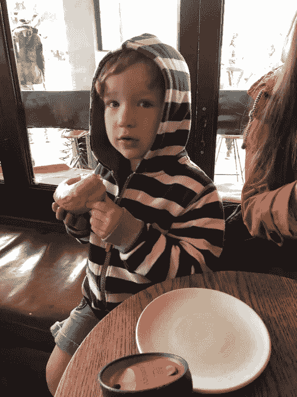

# 美国医疗保健对病人不利。

> 原文：<https://medium.com/hackernoon/us-healthcare-is-against-the-patient-8b99723e71ba>

## 解决问题的唯一方法就是别再假装它坏了。

当一个人的薪水取决于他对某事的不理解时，让他理解这件事是很难的—厄普顿·辛克莱

这个帖子会黑。在此之前，我们先来谈谈甜甜圈。

我 5 岁的儿子 Boone 喜欢油炸圈饼，他很聪明。如果我告诉他“你可以拿走面包店任何一个甜甜圈的 20%”，他会走向柜台，挑一个他能找到的最大的。我不会怪他。他会按照我设定的规则来玩。

*健康保险公司可以从每一美元保费中保留 20 美分作为管理成本和利润:* [*当成本上升时，他们会赚更多的钱。*](https://www.npr.org/sections/health-shots/2018/05/25/613685732/why-your-health-insurer-doesnt-care-about-your-big-bills)

如果我告诉 Boone“你的工作是让人们保持健康。但是他们每次来看你的时候都会给你甜甜圈，当他们生病的时候，“他会支持什么？

*这种收费服务模式付费给医院做事的***患者，而不是***患者。***

**如果我告诉 Boone“你可以给人们这种药丸，让他们永远感觉更好，或者这种药丸，让他们每周都有更多的甜甜圈，”他会开什么药？**

***制药分析师提问:“* [*治愈患者是一种可持续的商业模式吗？*](https://www.cnbc.com/2018/04/11/goldman-asks-is-curing-patients-a-sustainable-business-model.html)**

***布恩每次都会挑油炸圈饼。像任何一个 4 岁的孩子一样，他是一个自私自利的机器。***

***为什么我们会期待健康保险公司、医院和制药公司有什么不同呢？***

***这是医疗保健的肮脏小秘密。***

***我的[爸爸](https://www.linkedin.com/in/michaelsoman/)做了 30 年的家庭医生，后来成为团体健康合作社的首席医疗官，这是太平洋西北地区一个屡获殊荣的 60 万会员综合服务系统。他说，如果未来的人类学家研究美国医疗体系，他们会得出结论，其目的是创造可补偿的事件。***

***许多人认为飞涨的成本、巨大的价格差异、缺乏透明度以及无法就医疗程序的投资回报率达成一致是医疗保健固有复杂性不可避免的症状。这一行的每个人都有高尚的目的，都在尽力而为。***

***事实对 Boone 来说很简单:我们得到这些结果是因为它们是系统设计要得到的结果。***

***“给我看动机，我会给你看结果。”—查理·芒格***

***对于健康保险公司、医院和制药公司来说，当前的医疗保健系统运行良好。***

***如果这个系统为病人服务，它会是什么样子？***

***作为起点，所有相关人员都将处于同一条船上。任何支持你的保健的企业只有在你健康的时候才会健康。***

***该系统将奖励健康的选择。[它可能会使用区块链技术来消除不必要的中间商，提高透明度，减少浪费。](https://hackernoon.com/how-affordable-healthcare-looks-in-2025-ddf8ba4d1364)***

***我们的健康，也许还有这个系统本身，都与我们的经济利益息息相关。***

***还有什么？***

***我们正在建造[体面](https://www.decent.com/)来寻找答案。***

******

***This one’s for you, buddy.***