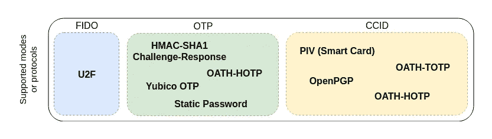
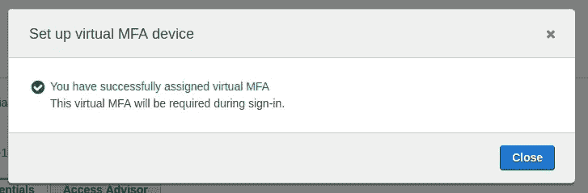

# 使用 YubiKey 作为 MFA 设备来替换 Google Authenticator

> 原文：<https://medium.com/hackernoon/use-a-yubikey-as-a-mfa-device-to-replace-google-authenticator-b4f4c0215f2>


Yep, just a door lock.

> **免责声明 **
> 
> 在可能的情况下应该使用 U2F，因为它比任何其他替代方案都要安全得多。我使用 TOTP 而不是 U2F 的唯一原因是因为亚马逊网络服务不支持两个 MFA 设备连接到同一个用户，他们的 AWS CLI 也不支持 U2F。
> 
> 基本上，您可以使用 U2F 来访问 web 控制台，但在终端中运行 CLI 命令时，请忘记使用 U2F(对我来说，这是不可接受的)。

# 什么是 YubiKey

YubiKey 是一款小型硬件认证设备，由 Yubico 开发，支持多种认证协议。

它是一个 USB key(有些版本支持 USB-A，有些 USB-C，最新版本甚至支持 NFC)，带一个 LED 和一个按钮*。*


> **注意:**似乎 YubiKey 4 的固件版本介于 4.2.6 和 4.3.4 之间，存在一个安全漏洞，使得攻击者能够使用公钥重建私钥。你可以在这里和[阅读更多关于这个](https://crocs.fi.muni.cz/public/papers/rsa_ccs17)[的内容。](https://www.yubico.com/keycheck/)

## USB 接口

Yubico 将这些 *USB 接口称为*，它们中的每一个都支持一种或多种模式/协议。

1.  **FIDO:** 该接口仅支持 **U2F** 协议。
2.  **OTP:** 这个接口有 2 个插槽(短按和长按)。每一个都可以配置使用为:**宣誓-HOTP，优必科 OTP，**挑战-响应或者**静态密码**。默认情况下，Yubico OTP 预先配置在第一个插槽中。
3.  CCID: 这是允许钥匙充当智能卡的接口。最多支持 **32 个誓言-TOTP/誓言-HOTP** **代码，PIV** 和 **OpenPGP** 。

## U2F

一种开放式身份认证标准，支持对任意数量的基于 web 的应用程序进行强大的双因素身份认证，例如 Gmail、Salesforce、Amazon Web Services、Twitter 和数百种其他服务。

U2F 是推荐的双因素方法。与 TOTP/谷歌认证器不同，它可以防止网络钓鱼，而且比短信/语音通话方式更难破解。

它不需要任何软件或驱动程序。默认情况下，它可以在 Chrome 和 Firefox 中运行(你需要改变一个配置标志)。阅读更多关于 [FIDO U2F](https://www.yubico.com/applications/fido/) 的信息。

## 智能卡(PIV)

智能卡包含一个代理数据交换的芯片。这些相同的功能包含在 YubiKey 4 和 5 系列中，基于 CCID 协议的行业标准个人身份和验证卡(PIV)接口，该接口支持 USB 接口上的 PIV。

## 尤比科 OTP

YubiKey 生成一次性使用的加密密码。黑客需要物理访问您的 YubiKey 来生成动态口令。这是一个奇怪的字符串，如果你触摸你的 YubiKey 来输入文本。

## OpenPGP

在现实世界中，文档和数据通常通过签名进行验证。在虚拟世界中，OpenPGP 是一种基于标准的公钥加密技术，用于对文本、电子邮件、文件等进行签名、加密和解密。

## **静态密码**

一个基本的 YubiKey 功能，它可以生成一个 38 个字符的静态密码，与任何应用程序登录兼容。它最常用于无法改造以支持其他双因素身份认证方案(如预启动登录)的遗留系统。

> 注意:这种模式容易受到键盘记录程序的攻击，所以应该尽可能避免。

## 誓言-TOTP/誓言-HOTP

该密钥生成一个 6 或 8 个字符的动态口令(或一次性密码)，用于登录任何支持 TOTP 誓言或 HOTP 誓言的服务。

TOTP 誓言和 HOTP 誓言的区别在于前者是基于时间的，这意味着新密码会在设定的时间间隔生成，通常是每 30 秒生成一次。后者是基于事件的，意味着为每个事件生成一个新的一次性密码。

## 挑战-回应

挑战-响应方法最适合离线验证。用于 Windows、Mac 和 Linux 电脑登录。



USB Interfaces and the different modes supported

## 将使用哪个接口？

出于我们的目的，我们将使用 **CCID 接口**，因为它允许存储多达 32 个誓言-TOTP/誓言-HOTP 条目。如果我们只关心一个誓言 HOTP 提供者，我们可以使用 OTP 接口。然而，谷歌认证和 Authy 都是基于 TOTP。

# 设置(GNU/Linux)

## 确保 PC/SC 智能卡守护程序正在运行

[PC/SC 智能密钥守护程序](https://linux.die.net/man/8/pcscd)(或 pcscd)是一项旨在与智能卡交互的服务。

我正在运行 Arch Linux(我再也坚持不住了:P ),所以我将使用`systemctl`来启动/启用 pcscd 服务。


pcscd status


Start and enable pcscd.service

## 安装 YubiKey 管理器 CLI 工具

在 Arch Linux 上，你只需要运行`sudo pacman -S yubikey-manager`。安装完成后，您应该能够运行`ykman info`从您的密钥中检索详细信息。


我们只对 CCID 接口感兴趣，所以我们可以选择用下面的命令`ykman mode "CCID"`禁用 OTP 和 FIDO，但这不是必需的。

# 通过不同的提供商使用您的 YubiKey 4

当你在手机中使用 Google Authenticator 或 Authy 时，你必须用你的相机扫描二维码，然而很明显，你不能用你的 YubiKey 做到这一点。

相反，你必须得到一个 [Base32 key](https://en.wikipedia.org/wiki/Base32) ，并使用之前安装的`ykman`工具将其传递给 YubiKey。要使用此工具为服务添加 2FA/MFA，您需要提供上述密钥和标识符，以帮助您以后识别您的服务/帐户。

```
ykman oath add -t <SERVICE_NAME> <YOUR_BASE32_KEY>
```

`-t`标志表示您需要触摸您的钥匙，以便稍后获得 6 位数字代码。建议这样做是为了防止恶意软件在没有任何用户干预的情况下生成代码。

运行前面的命令后，您现在应该能够生成一个 6 位数的代码，再次运行`ykman`。

```
ykman oath code <SERVICE_NAME>
```

它会要求你触摸你的 YubiKey，然后在屏幕上显示代码。

## 开源代码库

进入你的用户设置>安全，点击“启用双因素认证”。


在下一个屏幕中，当出现提示时，您需要选择“使用应用程序设置”。


在此之后，您将进入一个屏幕，在那里您可以下载一组安全代码，以防您丢失或损坏 MFA 设备而无法登录。据我所知，这不是每个服务都实现的，在其中一些服务中，如果你丢失了密钥…那就完了。


一旦你进入带有二维码的屏幕，你需要点击“输入这个文本代码”的链接，然后一个带有 Base32 键的模式就会打开。您可以使用以下命令配置您的密钥:

```
ykman oath add -t github.com <YOUR_BASE_32_KEY>
```

之后，您需要运行`ykman oath code github.com`来获取您的 6 位数代码并完成 2FA 设置。

## AWS (IAM 用户，而非 root 帐户)

登录后，转到 IAM >用户，然后单击您的用户名。然后，您需要单击“安全凭证”选项卡。


Security credentials tab

如您所见，没有分配 MFA 设备，因此要分配一个，只需单击“Manage”。在下一个屏幕中，选择“虚拟 MFA 设备”。


Setting up a MFA device

在这里，您可以选择显示二维码或显示密钥。出于我们的目的，我们只想要密钥。


然后可以运行`ykman`来配置 AWS MFA:

```
ykman oath add -t aws-username <YOUR_BASE_32_KEY>
```

然后运行`ykman oath code aws-username`两次，得到两个 6 位数的代码，完成设置。



MFA has been set up correctly

## GitLab

转到您的用户设置>帐户并选择“启用双因素身份验证”。


在下一个屏幕中，你会看到二维码，以及右边的一些文字。这包含您的 Base32 密钥。

> **注意:**在使用`ykman`键之前，您需要删除空格。


拿到密钥后，流程和 GitHub 一模一样。首先，您需要在 YubiKey 中配置 GitLab，运行以下命令。

```
ykman oath add -t gitlab.com <YOUR_BASE_32_KEY>
```

在此之后，只需运行`ykman oath code gitlab.com`来获得您的 6 位数代码，并完成 2FA 设置。

# 额外的东西！

## 使用`fzf`简化您的工作流程

如果你是一个重度 CLI 用户，不知道`fzf`，你应该停止阅读这篇文章，转到[这里](https://github.com/junegunn/fzf#examples)或者[这里](/@sidneyliebrand/how-fzf-and-ripgrep-improved-my-workflow-61c7ca212861)。

```
ykman oath code $(ykman oath list | fzf)
```

使用`ykman oath list`,我们可以获得用这个键配置的不同服务的列表。该命令的工作方式是:

1.  将`ykman oath list`的输出传递给`fzf`。
2.  选择要验证的服务，然后按 enter 键。
3.  `ykman`将要求您触摸按键，并输出与之前选择的服务相关的正确的 6 位数字代码。

你可以在这里看到这个动作[。](https://asciinema.org/a/217104)

## 使用 Yubico 验证器而不是 ykman 来获取 6 位代码

如果你不想使用`ykman`来获得你的 6 位数代码，你也可以选择使用 [Yubico 认证器](https://www.yubico.com/products/services-software/download/yubico-authenticator/)(一个基于 GUI 的工具)。

在我的例子中，我必须从 Arch 用户库(AUR)安装`[yubico-yubioath-desktop](https://aur.archlinux.org/packages/yubico-yubioath-desktop/)`。


OOOPS! I need to insert the key


List of services using YubiKey


Touch your YubiKey and you will see a 6-digit code for the selected service


DONE!