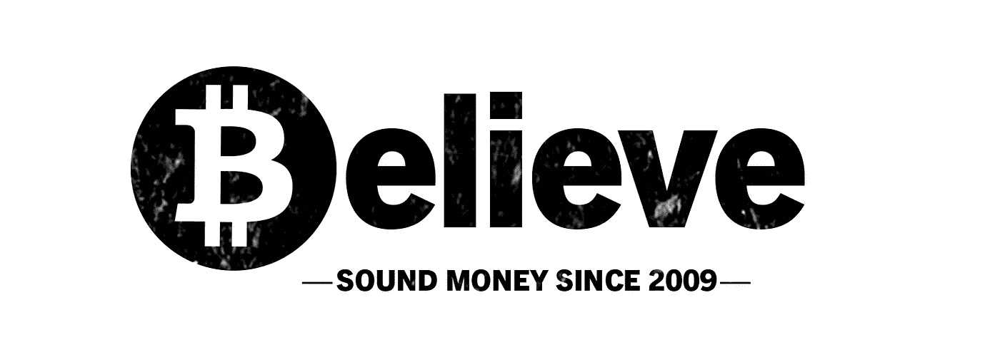
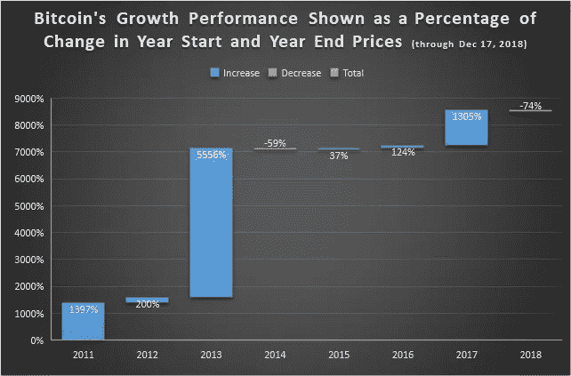
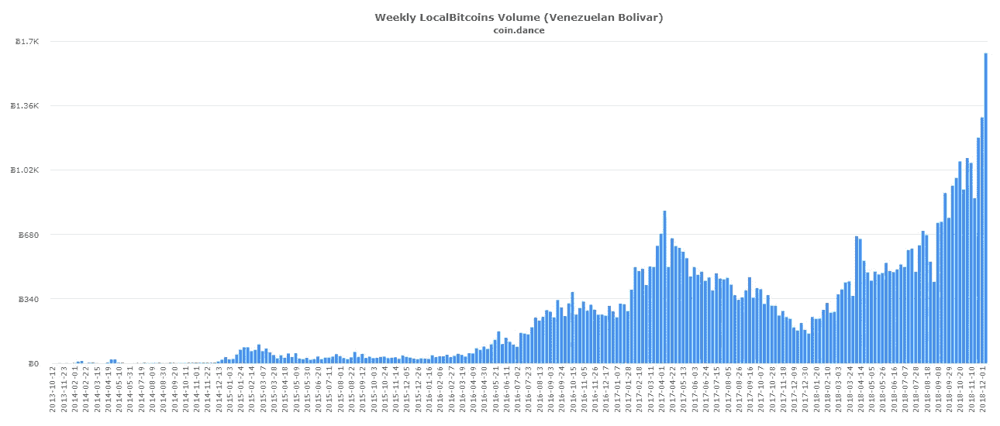

# 比特币真正有意义的用例

> 原文：<https://medium.com/hackernoon/use-cases-for-bitcoin-that-actually-make-sense-4f66a2d1b05d>

Source: [whengift](https://www.whengift.xyz/)

怀疑论者有时认为，比特币作为一种货币(用小写的“b”指代，以区别于作为协议和支付网络的比特币)没有价值，因为大多数商家不接受比特币支付，如果不能花，你的钱有什么用？事实上，全球只有大约 14，000 个地点直接接受比特币，剧烈的价格波动(以美元计算)继续限制比特币在商业中的实用性。然而，如果我们将这一采用障碍添加到比特币的“艰难销售”列表中，我们还应该包括一个警告:价值是一种社会建构，可以通过多种方式抽象出来，因此仅根据零售用途来判断比特币有点短视。

我认为，一旦我们超越比特币的价格发现阶段，随着越来越多的人认识到不依赖第三方进行交易的好处，它将越来越多地被接受。如果你不相信这一点，请阅读《为什么比特币(仍然)重要》中的第[部分第一](/@brettschor/ten-years-in-why-bitcoin-still-matters-d3fb0de741fa)和第[部分第二](/coinmonks/ten-years-in-why-bitcoin-still-matters-4ce27c7c298)部分，并考虑这一点:**尽管价格暴跌**，比特币生态系统仍在辉煌扩张——像[闪电网络这样的开源项目正在急剧增长](https://bitcoinist.com/bitcoin-lightning-network-quadruple/)以使比特币在 Visa 和万事达卡这样的高容量支付轨道上更具竞争力。 像 [Fidelity](https://www.coindesk.com/fidelity-looking-to-expand-digital-asset-trading-beyond-bitcoin-and-ether) 和 [ICE](https://www.ccn.com/breaking-what-crypto-winter-nasdaq-to-launch-bitcoin-futures-market/) 这样的知名机构正在推出新的金融产品和服务，这些产品和服务将为市场带来更大的流动性和更高的价格稳定性，像 [Square](https://cryptoslate.com/bitcoin-payment-with-squares-cash-app-signals-growing-adoption/) 这样的主流公司正在推动实体店采用比特币。

实际上，在正式采用阶段开始之前，可伸缩性和流动性只是需要解决的两个问题；我们还需要监管的明确性、更好的保密交易机制、更多的教育以及围绕比特币构建的技术的更友好的用户界面——所有这些都将成为现实。虽然我们还有很长的路要走，还有许多障碍要克服，但在过去十年中，比特币已经有了许多现实应用，这很能说明问题。如果你从等式中去掉道德判断，货币形式的比特币为使用它的人提供了巨大的价值。进一步证实比特币已经具有价值的一些用例包括:

## **犯罪活动**

或许比特币最广为人知也最具争议的用途是用于非法目的。与任何领先的新技术一样，罪犯往往是第一批早期采用者。互联网刚出现的时候是这样，比特币也是这样。[丝绸之路](https://en.wikipedia.org/wiki/Silk_Road_(marketplace))客户使用比特币在两年时间内(2011 年至 2013 年)买卖了价值超过 10 亿美元的毒品，网络犯罪分子从[勒索软件攻击](https://www.technologyreview.com/s/610803/true-scale-of-bitcoin-ransomware-extortion-revealed/)中获得了数百万美元(以比特币交易)。比特币还被用来帮助洗钱、逃税，以及在更有限的程度上用于恐怖主义。

虽然犯罪活动确实令人担忧，但使用法定货币进行类似犯罪的情况经常以更大的规模和更频繁的方式发生……最近关于德意志银行涉嫌洗钱 3.5 亿美元的头条新闻(除此之外，他们之前还与丹麦银行参与了一项价值高达 1500 亿美元的洗钱计划)更加令人震惊。

展望未来，我认为出于以下几个原因，使用比特币进行不法活动的现象可能会减少:

1.  犯罪分子正在了解到，比特币并不是真正匿名的，因为资金轨迹被记录在一个开放的区块链中，存储着所有交易的永久、不可改变的历史。
2.  像[chain analysis](https://www.chainalysis.com/)这样的公司正积极与政府、密码交易所和金融机构合作，以识别欺诈、勒索和洗钱的案例。
3.  随着交易所和货币服务提供商越来越遵守“了解您的客户”( KYC)和反洗钱(AML)法规，当局将更容易将钱包地址与真实用户身份联系起来。
4.  网络犯罪部门已经开始努力[将用于勒索软件攻击的比特币钱包地址](https://www.ccn.com/us-blacklists-bitcoin-addresses-of-iranians-behind-samsam-ransomware/)列入黑名单。不管这有多有效，犯罪分子将需要更加努力地隐藏他们的身份，或者使用替代的、更加匿名的交易方法。
5.  价格波动(只要持续)是寻求使用比特币的犯罪分子持续担忧的一个来源，尤其是在熊市期间。

就像互联网、无线通信和几乎所有其他给我们生活带来深刻价值的技术一样，比特币将继续有一小部分用户参与非法活动。然而，仅仅因为比特币可能被坏人利用而拒绝使用比特币将是对社会的悲剧性伤害，尤其是当我们考虑到比特币已经被以更具建设性和有益的方式使用时。

## **储值**

可以说，如今比特币最大的用途是作为价值储存手段。像黄金一样，它被一些人视为对冲通胀的工具，也是一种不断升值的资产，随着时间的推移，它将保持其价值或购买力的增加。如果你需要比特币服务于这一目的的证据，看看 2011 年至今的价格图表。忽略波动性，画一条线连接所有每年的最低价格下跌…你会明白为什么它是过去十年中表现最好的资产。

Year Start/Year End Price Taken From [BitInfoCharts](https://bitinfocharts.com/bitcoin/)

如果你在历史高点附近(或今年任何时候)购买了比特币，你还没有庆祝任何价格升值，但明智的做法可能是保持一点耐心。**比特币的技术设计非常优雅，其核心具有弹性，从历史上看，这一特性在价格方面也是如此。**

对于正在经历荒谬的 800，000% 年通胀率的委内瑞拉公民来说，比特币是一种极好的价值储存手段。根据点对点交易平台[本地比特币](https://localbitcoins.com/)收集的数据，这是委内瑞拉在全球贸易额方面将[排在第四](https://totalcrypto.io/bitcoin-adoption-trading-volume-country/)的主要原因。其他遭受货币贬值的国家，如阿根廷、土耳其、津巴布韦和伊朗，在过去的一年里，比特币的交易量也出现了激增。因此，尽管像努里埃尔·鲁比尼、杰米·戴蒙和沃伦·巴菲特这样的批评家认为比特币是一种糟糕的价值储存手段，但在货币政策管理不善的国家，精明的投资者可能不敢苟同。

Source: [Coin Dance](https://coin.dance/volume/localbitcoins/VES/BTC)

## 人道主义援助

比特币拥有几个特性，使其成为一个很好的捐赠平台。首先，它的公开区块链(open ledger)是不可变的、高度透明的，因此捐助者可以确保捐款被送到预定的接受者手中，没有任何银行或政府从中渔利。其次，在时间敏感的国际资金转移方面，比特币网络比传统金融系统更便宜、更高效。由 10，000 家银行组成的全球网络使用的 [SWIFT](https://www.swift.com/) 系统运行缓慢且容易出错，跨境支付中涉及的官僚开销导致高额佣金和低于预期的转换率。当地银行还受到特殊利益政治的影响，这可能会阻碍救援工作，而且在国家灾难或经济危机期间——恰恰是最迫切需要及时金融援助的时候——它们可能会变得不起作用。

在委内瑞拉和卢旺达等地，正在进行一些小型的人道主义援助工作，在这些地方，比特币被用于可验证地将钱直接送到需要帮助的人手中。 [Paxful 的](https://paxful.com/)“用比特币建造”活动最近筹集了足够的比特币，为卢旺达[的两所学校](https://www.ccn.com/paxfuls-built-with-bitcoin-campaign-completes-second-school-in-rwanda/)提供资金，一项名为[空投委内瑞拉](https://airdropvenezuela.org/)的新倡议最近开始筹集 100 万美元的比特币(和其他货币)，将分发给下载了 [Airtm](https://www.airtm.io/#/) 加密钱包的多达 10 万委内瑞拉公民。

其他善意比特币倡议的例子包括法国儿童基金会委员会发起的加密货币筹款活动，以及菠萝基金的成立，该基金由一位匿名捐赠者创立，他用 5500 万美元的比特币利润支持了 60 多个慈善机构。[慈善比特币](http://bitcoinforcharity.com/about/)展示了一些接受比特币捐赠的经过验证的组织，更多内容可以在[这里](https://en.bitcoin.it/wiki/Donation-accepting_organizations_and_projects)找到。

## **规避政治**

比特币的抗审查特性使其成为政府不喜欢的事业的理想支付渠道。当 Paypal、Visa 和 Mastercard 等公司屈服于政治压力，拒绝处理捐款时，这笔钱被用来支持维基解密法律基金。如果你在支持维基解密封锁的阵营中，这个特殊的例子可能不是一个卖点，但希望你能支持使用比特币来赋予那些经常压制妇女权利的国家的妇女权力。在阿富汗，女性开设自己的银行账户在文化上是不被认可的，[这位社会企业家](https://www.forbes.com/sites/laurashin/2017/08/08/how-bitcoin-solved-this-serial-entrepreneurs-problems/#4355e5f7309c)用比特币支付她的女性员工，以此给她们提供更多的财务主权和独立性。

关于比特币如何被用来保护生活在独裁政权下的人民的公民自由，这是一个非常消息灵通的专家帐户，请查看对 Alex Gladstein 的精彩采访，Alex Gladstein[人权基金会](https://hrf.org/)的首席战略官。他就世界各地的人权活动人士、持不同政见者和记者如何利用比特币绕过独裁政权的大规模金融监控机构提供了一些出色的见解。

## **跨境汇款**

与全球社区相关的另一个用例是能够更快、更便宜地进行海外支付。使用传统银行业务跨境发送和兑换现金既麻烦又缓慢且昂贵，尽管替代性汇款服务可能更快，但它们并不便宜:西联汇款可以收取高达 10%的转账费用。据 2015 年报道，[非洲移民工人](https://www.independent.co.uk/news/business/news/bitcoin-is-being-used-by-african-migrant-workers-to-send-money-home-10098169.html)受益于比特币支付服务，如 [Bitpesa](https://www.bitpesa.co/) ，这使他们能够以低廉的价格向家乡的朋友和家人汇款。根据 Humans.net 最近的一项研究，近三分之一的美国自由职业者倾向于接受比特币或其他加密货币的跨境支付，以保留更大比例的薪水。

就个人而言，当一个住在不同国家的朋友需要偿还我在旅行时借给他的一些钱时，比特币就派上了用场。我住的地方没有 Venmo 或 Cash App 这样的服务，使用比特币远没有执行缓慢而昂贵的电汇那么麻烦。

## **最终想法**

诚然，比特币作为一种交易媒介的效用在今天的范围内仍然极其有限，我非常确定愤世嫉俗者将继续通过指出价格波动和强调其被犯罪分子采用来为其使用蒙上阴影。然而，我也相信，忽视比特币已经被证明的效用的怀疑论者最终会发现自己是少数派。事实上，近代史上每一项重大颠覆性技术都发生了这种情况(如果你需要更多的说服力，一定要看看安德烈亚斯·安东诺普洛斯强烈推荐的关于[基础设施反转](https://www.youtube.com/watch?v=5ca70mCCf2M&t=7s)的演讲)。

比特币有潜力成为变革的强大而积极的推动者，我坚信，随着新的用例变得更加普遍和广为人知，这一点将变得越来越明显。当这种情况发生时，我怀疑我们将处于一轮新的牛市之中，回头看看今天的价格，那些对比特币不屑一顾的人将痛苦地清楚，比特币被低估的程度有多严重。