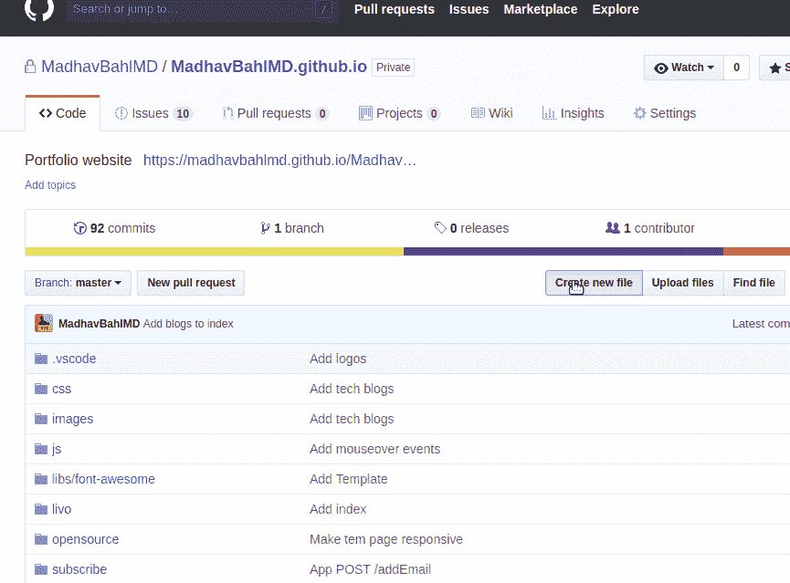

# 在 GitHub 页面中使用自定义域:2 个简单的步骤

> 原文：<https://medium.com/hackernoon/use-custom-domain-with-github-pages-2-straightforward-steps-cf561eee244f>


我有一个部署到 GitHub 页面的网站，并且想要一个自定义域，当我查看文档时，这有点让人不知所措，当然对于初学者来说很难理解。

如果你正在做类似的事情，请完成这两个简单的步骤，节省你的时间:)

在进行关于如何使用自定义域的两个步骤之前，我将简要介绍如何使用 GitHub 页面发布您的网站。**如果你已经有了一个 GitHub 页面(如 somename.github.io)，你可以直接进入第 1 步，将 CNAME 添加到 GitHub repo。**

# 使用 GitHub 页面发布您的网站

由于这是一篇具有简单步骤的教程文章，我将直接进入步骤:)

## 步骤 1:创建存储库

当然，第一步是为您希望发布的网站创建存储库。

假设(就我而言)是`MahdavBahlMD.github.io`


## 第二步:推进你的代码

名为`index.html`的 html 文件将作为主页发布。如果没有 index.html 文件，则搜索`README.md`文件，该降价文件将作为主页发布。


## 注意*

您还可以将静态网站的代码推送到名为`gh-pages`的分支中，并选择该分支在下一步进行渲染/发布。但是并没有硬性规定你必须发布 gh-pages 分支，你也可以简单地部署 master 分支。

## 步骤 3:转到设置

单击设置选项卡。


## 步骤 4:发布 GitHub 页面

向下滚动到`GitHub Pages`部分并选择`master branch`(或`gh-pages branch`)


**注意*** 请记住，`index.html`文件将被渲染为已发布网站的主页，如果没有找到 index.html，`README.md`将被发布，因此请保留相应的文件名。

## 第五步:去网站

15-20 秒后，您可以进入发布的网站(`Your site is published at <address>`)


# 添加自定义域

遵循这两个步骤！

# 1.将 CNAME 添加到 GitHub repo

首先，您需要在 GitHub repo 中添加一个 CNAME 文件。现在，就像添加一个普通文件一样，可以通过两种方式来完成。

一种方法是创建一个名为 CNAME(没有任何扩展名)的新文件，在该文件中添加域名(比如我的例子中的 theleanprogrammer.com ),然后从 Git bash 或您的终端提交并推送更改。

第二种方法是直接从 GitHub 中完成，

*   点击“创建新文件”
*   将文件命名为“CNAME”
*   在内容中，添加域名

就这样，GitHub 部分结束了



# 2.向您的 DNS 提供商添加记录

第一步(添加 cname)要在你的 GitHub 端完成，你自己的 repo！第二步(添加记录)将由您的 DNS 提供商完成。

在这一步，我们将创建一个`ALIAS`或`ANAME`记录，或者简称为`A`记录，指向 GitHub pages 服务器的 IP(或域)。

这样做很简单，你需要做的就是在你的域名提供商的网站上找到一个可以添加记录的部分。通常这个部分本身被称为 DNS。找到后，在`Points To`字段中添加以下 IP 地址。

```
185.199.108.153
185.199.109.153
185.199.110.153
185.199.111.153
```


关于设置 apex 域的完整文档，[点击此处！](https://help.github.com/articles/setting-up-an-apex-domain/#configuring-a-records-with-your-dns-provider)

# 好了

觉得文章有帮助？

 [## 在线程序员|订阅

### 编写代码的学员|想学习编程和开发的人的向导、老师和导师，订阅成为第一个收到我消息的人。

http://madhavbahl.tech](http://madhavbahl.tech/subscribe/) 

订阅 LeanProgrammer，成为第一个从我这里获得未来更新通知的人。


如果你想讨论什么，随时联系我，:D

如果您能给我反馈、建议或询问，我会非常高兴。此外，我喜欢交新朋友，我们可以成为朋友，只要给我发邮件。

> 非常感谢你一直读到最后。所有最好的和快乐的想法！如有需要可以联系我:
> 邮箱:madhavbahl10@gmail.com
> 网页:[http://madhavbahl.tech/](http://madhavbahl.tech/)
> Github:[https://github.com/MadhavBahlMD](https://github.com/MadhavBahlMD)
> LinkedIn:[https://www.linkedin.com/in/madhavba*HL/*](https://www.linkedin.com/in/madhavbahl/)