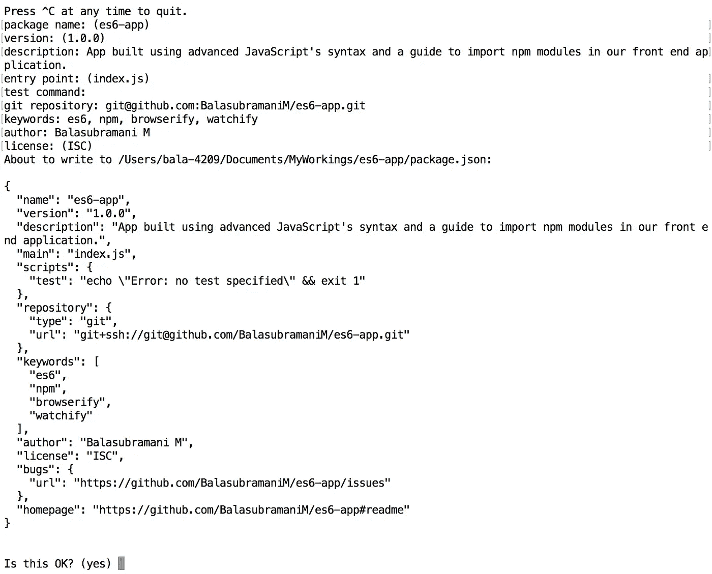

# 使用 ES6 JavaScript 语法(require、import 等。)在您的前端项目中。

> 原文：<https://medium.com/hackernoon/use-es6-javascript-syntax-require-import-etc-in-your-front-end-project-5eefcef745c2>

## 在本教程中，我们将在我们的应用程序中使用高级 JavaScript 语法来根据最新标准维护代码，并使用 Node.js require 在我们的前端项目中导入 npm 模块。

## 为什么需要升级？

当我在 4 年前开始写 JavaScript 时，情况完全不同。我们大量使用 jQuery，使用脚本和链接标签在我们的应用程序中包含 JS 和 CSS 文件，并在每次需要更新时替换我们的文件。

考虑这一行，

```
<script type="text/javascript" src="jQuery.js"></script>
```

如果您一直在本地使用该文件，则需要更新它。否则，您需要在需要时手动更改版本。

考虑下面这个，

```
import jQuery from “jQuery”;
```

你能看到转变吗？不需要不惜任何代价手动更新。只要 npm 更新将更新您的应用程序中的所有模块。没有单独的命令或工作。您可以以模块化的方式从更广泛的 JavaScript 生态系统中引入令人惊叹的工具和实用程序。

那么，当事情发生变化时，你的前端应用程序为什么不呢？是的，是时候提升自己了。

在罗马，做一个 ____？是的，当你在当今世界使用 JavaScript 时，你应该这样做。

## 先决条件

1.  [Node.js & NPM](https://www.npmjs.com/package/download) (NPM 自带 Node.js，不需要单独安装)
2.  [Browserify](https://www.npmjs.com/package/browserify) (以后再装吧，不要现在装)
3.  [Watchify](https://www.npmjs.com/package/watchify) (以后再装吧，不要现在装)

## 让我们编码

安装所有的必备组件。

通过发出以下命令，使用 NPM 创建一个目录，导航并初始化您的项目。

```
$ mkdir es6-app
$ cd es6-app
$ npm init
```

填写您的详细信息。更多信息请参考下图。



Package.json configuration.

当没有值要填写时，可以将字段留空并按 enter 键。这只是一个参考，让我们现在专注于我们的应用程序。

现在，在您的`es6-app`根目录中，您可以看到一个名为`package.json`的文件，它是使用您提供的配置创建的，并且在您的项目中创建一个`index.js`文件，或者您在初始化期间在输入字段中给出的任何内容。

让我们安装名为 [reading-time](https://www.npmjs.com/package/reading-time) 的 npm 模块来计算内容的阅读时间，就像你在媒体上看到的和我们的其他先决条件一样。

在根目录中，发出以下命令。

```
$ npm i browserify watchify --save
$ npm i reading-time --save
```

现在您可以看到在您的根目录中创建的`node_modules`文件夹和 package.json 文件中的依赖项。

安装文件转换所需的开发依赖项。

```
$ npm i babel-core babel-preset-es2015 babelify --save-dev
```

您已经安装了所有需要的依赖项。

现在，在您的`index.js`文件中，添加以下代码。

```
import readingTime from "reading-time";window.calcRT = ev => {
 var stats = readingTime(ev.value).text;document.getElementById("readingTime").innerText = stats;
};
```

这里，您已经导入了已经安装的阅读时间 npm 模块，并从用户那里获得了一个示例文本来计算阅读时间。

**注意:您在 JavaScript 文件中使用了** `**import**` **关键字。**

> 浏览器还没有升级自己来使用这些语法，当浏览器在不久的将来这样做时，我们不知道什么将是 es 版本。

我们需要转换`index.js`文件，这样我们就可以在浏览器中使用转换后的版本。

在 package.json 文件中添加以下 browserify 预设(依赖项)。(需要帮助时，参考[项目](https://github.com/BalasubramaniM/es6-app)

```
"browserify": {
        "transform": [
            [
                "babelify",
                {
                    "presets": ["es2015"]
                }
            ]
        ]
    }
```

以及其他配置，并用下面的配置替换脚本配置。

```
"scripts": {
        "build": "browserify index.js -o dist/bundle.js",
        "watch": "watchify index.js -o dist/bundle.js -v"
    }
```

是时候变身了。发出以下命令来传输文件。

```
$ npm run build
```

现在，您的文件被传输并创建在一个名为 dist 的文件夹中。现在让我们将这个转换后的文件添加到我们的 HTML 文件中。

在根项目中创建一个名为 index.html 的 html 文件，并向其中添加以下内容。

```
<!DOCTYPE html>
<html><head>
    <meta charset="utf-8">
    <meta name="viewport" content="width=device-width, initial-scale=1">
    <title>ES6 - App</title>
    <link rel="stylesheet" href="[https://cdnjs.cloudflare.com/ajax/libs/bulma/0.7.1/css/bulma.min.css](https://cdnjs.cloudflare.com/ajax/libs/bulma/0.7.1/css/bulma.min.css)" />
    <script defer src="[https://use.fontawesome.com/releases/v5.1.0/js/all.js](https://use.fontawesome.com/releases/v5.1.0/js/all.js)"></script>
    <script type="text/javascript" src="dist/bundle.js"></script>
</head><body>
    <section class="section">
        <div class="container">
            <div class="level">
                <h1 class="title is-4 level-item has-text-centered">
                    Welcome to ES6 - APP
                </h1>
            </div>
            <div class="level">
                <h1 class="subtitle is-5 level-item has-text-centered">
                    Learn to use &nbsp;<a href="[http://es6-features.org/](http://es6-features.org/)">ES6 syntaxes</a>&nbsp; in your front-end application
                </h1>
            </div>
            <br>
            <div class="level">
                <p class="level-left level-item">Type your text to calculate the reading time</p>
            </div>
            <div class="level">
                <textarea class="textarea" onkeyup="calcRT(this)" placeholder="Add your text ..."></textarea>
            </div>
            <div class="level">
                <div class="level-left">
                    <p>Reading time:&nbsp;</p>
                    <p class="has-text-info" id="readingTime">0 min read</p>
                </div>
            </div>
            <div class="level">
                <div class="level-left">
                    <p>Medium Tutorial:&nbsp;</p>
                    <a target="_blank" href="[https://medium.com/full-stack-web-development-from-scratch-to/use-es6-javascript-syntax-require-import-etc-in-your-front-end-project-5eefcef745c2](/full-stack-web-development-from-scratch-to/use-es6-javascript-syntax-require-import-etc-in-your-front-end-project-5eefcef745c2)">
                     Use ES6 JavaScript syntax (require, import etc.) in your Front end project.
                    </a>
                </div>
            </div>
            <div class="level">
                <div class="level-left">
                    <p>Source code:&nbsp;</p>
                    <a target="_blank" href="[https://github.com/balasubramanim/es6-app](https://github.com/balasubramanim/es6-app)">
                     GitHub - es6-app
                    </a>
                </div>
            </div>
        </div>
    </section>
</body></html>
```

就是这样。您已经使用高级 JavaScript 语法创建了前端项目。我希望这一定会作为你即将到来的建设的参考。

现在，您需要自动化您的构建过程。运行以下命令而不是`npm run build`来观察并在文件更新后立即更新文件。

```
$ npm run watch
```

您已成功实现流程自动化。

如果你有任何疑问，请在评论区告诉我。尽你所能地握住拍手图标来表达你的感激之情。

最终项目可以在[这里](https://github.com/BalasubramaniM/es6-app)找到。

玩 es6-app @[https://balsu.me/es6-app/](https://balsu.me/es6-app/)

谢谢你。