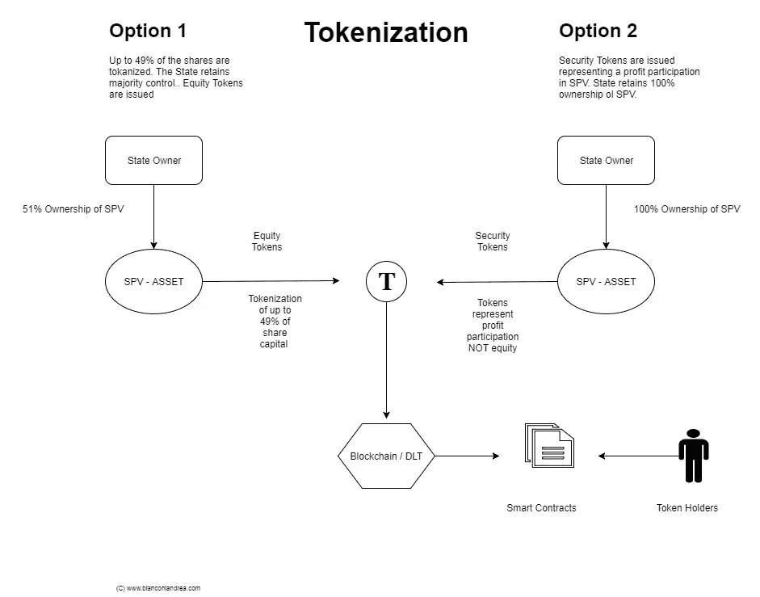
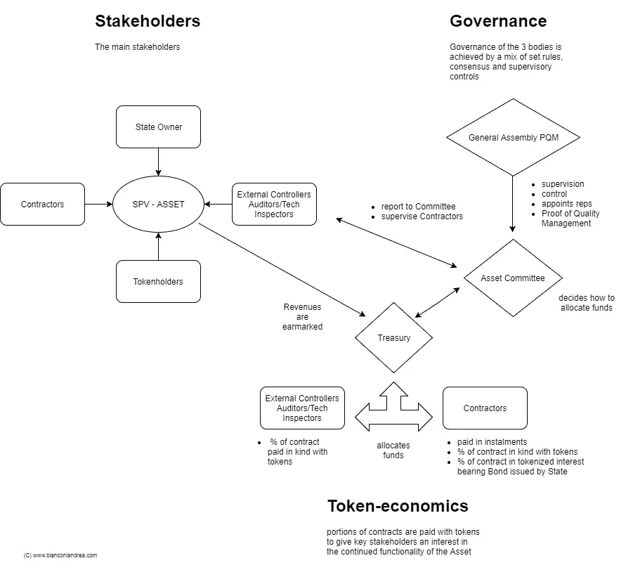

# 使用区块链和代币经济学来修复私有化

> 原文：<https://medium.com/hackernoon/use-the-blockchain-and-token-economics-to-fix-privatizations-f0df8cfcd917>

## 一个基于区块链的模型来扭转功能失调的私有化

[Article first published on Cointelegraph](https://cointelegraph.com/news/can-the-blockchain-and-token-economics-fix-privatizations)

当我写下这篇关于热那亚[莫兰迪公路桥](https://en.wikipedia.org/wiki/Ponte_Morandi)戏剧性坍塌的文章时，我是出于愤怒。尽管我很清楚这一悲剧事件的根源在于错误的私有化模式及其错误的激励措施，但我当时还没有意识到这是一个全球性的问题。从某种意义上说，私有化的不满和失败是一种世界范围的现象，鲜为人知，大多不被承认，也很少辩论。

事实上，在网上快速搜索关键词“失败的私有化”，会出现一长串全球失败的例子，从 T4、欧洲、非洲、美国、南美和亚洲。这篇[哥伦比亚大学的论文](https://kelley.iu.edu/nagupta/gupta_surveychapter.pdf)和这篇迈克尔·哈德森的论文[让我们为不平等而荣耀](https://michael-hudson.com/2013/04/failed-privatizations-the-thatcher-legacy/)值得一读。

对政府来说，将国有资产私有化或庄严地经营服务和职能是筹集资金以帮助固定预算的一个简单的选择。如果私有化可以有效地提高某些资产或服务的管理效率——只要这种资产或服务受到自由市场力量和竞争的支配——那么就有一些私有化宁愿用特权寻租的私人垄断来取代国家垄断，而不受自由市场竞争的影响。在实践中，国家将其利用公共资产或服务提取租金的特权转移到富有的私人投资者手中。这是私有化的不利之处，特别是在所谓的“T2”自然垄断中，或者在关键的战略资产或服务中，公众不得不在没有任何替代选择的情况下使用。例如，收费公路、[水](https://www.theguardian.com/global-development/2015/jan/30/water-privatisation-worldwide-failure-lagos-world-bank)、一般医疗服务、电网或[监狱](https://www.prisonlegalnews.org/news/2011/oct/15/the-failed-promise-of-prison-privatization/)就是如此。

对这种私有化模式的不满在许多国家引发了许多扭转这种模式的呼声，例如，在英国，其铁路系统[运转不良](https://www.citymetric.com/transport/rail-privatisation-hasn-t-worked-it-s-time-reverse-it-3613)或[水务部门](https://www.directdemocracyireland.ie/european-people-reverse-water-privatisation-fglab-markets-bidding/)和[天然气部门](https://www.theguardian.com/commentisfree/2018/jan/09/nationalise-rail-gas-water-privately-owned)。

> 在另一篇有趣的研究论文中，作者米尔德里德·e·沃纳强调了“80 年代和 90 年代的私有化实验是如何失败的……这导致了逆转。但是这种反向私有化过程并不是回到旧模式…相反，它预示着一种新的平衡立场的出现，这种立场结合了对市场的利用、深思熟虑和规划，以达成既有效率又更具社会最优的决策

然后，我突然意识到，出于本能和热那亚事件后的愤怒，我所阐述的正是全球实现这一新的“更加平衡的地位”所需要的。

因此，我重新研究了最初的提议，结果是这篇文章，它详细阐述了如何使用区块链和代币经济学作为一种可行的模型，来扭转战略性公共部门中错误和功能失调的私有化。

我还要感谢我的同事 [Thomas Euler](https://www.linkedin.com/in/thomaseuler/) 和 [Karl Michael Henneking](https://www.linkedin.com/in/dr-karl-michael-henneking-04729113/) 在 [Untitled-INC](http://www.untitled-inc.com/) 为我提供了关于这一新模式治理的宝贵反馈和想法。

由于加密空间正在快速发展，我希望经常看到这个主题的新发展和创新方法。因此，我认为这个模型是非常“不固定的”,需要在未来进行修改和改进。

**使用代币-经济学**

虽然[代币经济学](https://en.wikipedia.org/wiki/Token_economy)的起源可以追溯到 19 世纪早期——在精神病学研究领域——但这个术语现在通常被密码世界借用来泛指一个经济激励系统，用于影响利益相关者的行为，使其朝着有利于整个系统的预定义良性模式发展。代币经济学是社会研究的一个分支，它与传统经济学没有什么不同，除了它密切关注[行为经济学](https://en.wikipedia.org/wiki/Behavioral_economics)和[博弈论](https://en.wikipedia.org/wiki/Game_theory)以便提供正确的经济激励来推动个人行为。

**创建基于区块链/DL 的系统来管理战略性公共资产**

以下模板可适用于对整个社会具有战略意义的公共资产或服务，最好不要完全掌握在私人手中，但在理想情况下，国家应始终至少保留对此类资产/服务的控制权，以保护社会免受私人经营者滥用的后果。例如，这些资产是至关重要的水源及其供应基础设施、能源工厂和电网、公共道路、最基本的医疗服务和基础设施以及监狱。

**1。令牌化:股权还是证券令牌？**

术语“[令牌化”](https://cointelegraph.com/news/why-tokenization-is-still-a-chimera-expert-take)主要与证券、股票和实物资产相关，它表示创建一个数字令牌，代表与基础资产相关的不同类型的权利，如所有权、经济支付权、投票权等。代币通常在区块链上发行。

在提议的模型中，有必要进行标记化，以将与公共资产相关的经济权利以数字格式“翻译”出来，这种数字格式可以很容易地分发给利益相关者，并且可以附加智能合同条款，以保证对激励措施至关重要的某些条款的自动执行。

战略性公共资产(“A”)将被转移至一家[特殊目的公司](https://en.wikipedia.org/wiki/Special-purpose_entity)(“SPV”)。这里基本上有两种选择。

**选项 1** 是通过[智能合约](https://www.investopedia.com/terms/s/smart-contracts.asp)发行包含所有权、投票权和利润分配权的股权代币，将特殊目的公司的股份进行代币化。

**选项 2** 是发行[证券代币](/@andreabianconi/the-future-of-icos-and-the-potential-of-securities-token-offerings-4047a3bf1a5a)——不代表特殊目的机构的股权参与——而只是分享特殊目的机构利润的经济权利。

这两种选择之间的区别是:(I)在选择 1 中，发行股权代币，因此 SPV 和 A 的相应所有权部分也被转让；(ii)适用的公司法将规定属于股东的投票权，因此也将规定属于所有股权凭证持有人的投票权。这可能会降低治理的灵活性。此外，由于适用的公司法还规定了股份转让的手续(如公司登记处和公证处)，这些“现实世界”的程序使以数字方式发行的股权凭证和基础股票证书之间的对账变得非常复杂，从而影响了智能合同条款的灵活性和自动化执行。因此，我得出结论，第二种选择更好，因为:a) A 和 SPV 始终 100%掌握在公众手中；b)发行的安全令牌不代表 SPV 中的权益，而只是获得货币支付的权利；c)即使出于证券法律应用和合规的目的，这仍然是一种证券，发行人在设计附属于它的货币权利以及它们在治理中的作用(即投票权)时将几乎没有限制。d)发行不受选项 1 中的实物所有权(即 1 股 1 股)或股票价值的限制，而仅受 SPV-A 的盈利能力限制，或者，如果盈利能力不足，则受国家为不足部分提供担保的意愿限制；e)如果国家需要筹集资金来回购资产或在反向私有化的情况下向私人投资者支付罚款，或者如果必要的话，撤销以前授予的私人对公共资产的特许权，这种安全令牌也可以空投给主要利益相关者和/或适当拍卖给投资者。总之，选择 2 似乎更灵活。

Tokenization of strategic public assets

**2。主要利益相关者和资金流动**

主要利益相关者将是:

-拥有该资产的国家；

-使用公共服务/资产的公民；

-维护和服务承包商；

代币持有者。

资金流动将是:

-由 A 产生并由 SPV 收取的费用，如公共道路通行费或公用事业账单；

- SPV 对维护服务和维修的付款。

**3。区块链和 DLs**

在我的第一个提议中，我提倡使用开放访问的公共区块链。

一些评论家也对这种模式下区块链的必要性提出了质疑。“区块链”一词引起了一些混乱。这个术语现在被广泛用于指代几乎任何类型的 DL(分布式账本),当然不仅仅指第一种也是最纯粹的区块链形式，即比特币协议。因此，在这个模型中使用区块链/DL 实质上意味着**创建一个存储记录的资产会计系统**。由于 DLs 的构建方式是模块化和可选的，因此这里没有必要像比特币一样建立一个 100%无权限和去中心化的区块链。一些功能可以分散，而另一些功能可以集中。此外，为了保证更分散的监督和控制，集中化仍然可以受到治理条款的积极影响。此外，无论采用哪种类型的区块链/DL 和共识协议来使该模型工作，这仍然是一个技术问题，超出了本文的目的，将由除我之外的技术熟练的人来解决。这里需要注意的是，它应该主要保证 **(i)透明度和(ii)存储记录的不变性**。这意味着利益相关者应该能够访问所有与特殊目的公司的财务状况、维护账单、安全报告、工程报告、公开招标程序、承包商账单等相关的文件。一切都应公开，接受公众和政府的审查，数据不能被任何利益攸关方更改或破坏。这是一个众所周知的问题。当热那亚发生这样的戏剧性事件时，关键证据和文件会突然从服务器上消失。

Blockchain use for tokenizing public strategic assets

**4。代币经济学和利益相关者的正确激励**

一个平衡的经济激励和治理工具系统对于积极影响关键利益攸关方(如承包商、审计员和国家本身)的行为至关重要。承包商是其中重要的一部分。太多时候，特别是在公共采购工作中——例如公共道路——所有公民都非常关心已完成工程的恶劣条件及其随后的维护状况。在最好的情况下，这既是国家无力管理其资源的标志，也是让承包商为其糟糕的工作负责的标志。在最坏的情况下，这是腐败的迹象。

为了让承包商承担责任，他们必须在产生收入的资产的适当运作和适当维护方面有经济利益。这可以通过**确保承包商“参与游戏”**来实现。

除了像往常一样在达到里程碑时获得分期付款外，承包商还将获得 SPV 发放的代币作为实物支付。这确保了承包商对资产的持续功能感兴趣。在出现争议的情况下，公共行政部门将对分配给承包商的代币拥有额外的追索权，这些代币可以通过智能合同条款自动收回或烧毁。显然，争端解决机制和所谓的“[神谕](https://cointelegraph.com/explained/blockchain-oracles-explained)也必须到位。

还可以通过要求承包商按照合同价值的百分比认购有息政府债券来提供更多的“利益”。这种政府债券也可以是“象征性的”，从而确保在承包商违反合同义务或其担保/保证或维护期时，对承包商有额外的追索权。该债券将作为智能托管的抵押品持有。虽然它的功能类似于传统的[履约保证金](https://www.investopedia.com/terms/p/performancebond.asp)——银行代表承包商担保履约——但这里的区别在于，国家债券对承包商没有成本，并且在良性循环中，政府和承包商都受益，承包商收到利息付款，(简单地说，这是一种内部出资为政府债务融资的方式，从而减少了对机构投资者的依赖)。通过对该数字债券中的不同特征进行编程可以实现的灵活性是另一个关键优势。

**5。治理工具**

调整私人承包商的激励措施只是游戏的一部分，而影响政府的行为要困难得多。为此，我们必须创建一套正确的治理工具。这里主要关注的是避免国家浪费金钱，并确保它有效地分配资产产生的收入。因此，在这种模式中，为特殊目的机构和所有利益相关者制定一套适当的治理规则是必不可少的。

**第一步是指定 SPV 产生的收入**用于(I)维护或(ii)新基础设施的再投资或(iii)分配给令牌持有者。剩余利润再分配的百分比也可以在智能合同中进行不同的编程，以最大限度地激励员工。例如以更高的百分比奖励最勤奋的承包商。

**第二步是创建治理机构**。

在这个模型中，我设想了 3 个管理机构，财政部、资产委员会和大会。

-财政部接收来自特别目的机构的收入，并根据其指定上述收入用途的任务，按照资产委员会的指示分配资金。

-资产委员会应由国家代表、令牌持有者代表和特定活动部门技术合格的专业人员代表组成。资产委员会根据第三方控制者、审计师和技术专家提供的关于资产状况(即维护和/或新投资)的一系列优先级和报告，决定如何使用特殊目的机构的收入。

-大会由所有利益相关方组成，它将对资产委员会的组成进行投票，并对资产委员会的资金分配进行事后监督。

有趣的是，我在 [Untitled-INC](http://www.untitled-inc.com/) 的同事 [Karl Michael Henneking](https://www.linkedin.com/in/dr-karl-michael-henneking-04729113/) ，引入了**质量管理证明(“PQM”)**的概念，这基本上是一种评估资产委员会分配资金效率的评级机制。基本上，可以通过将投资金额与用户表示的满意度以及审计员和技术专家的报告进行比较，来创建反映资产状态的评级指数。简单地说，投入的资金越多，从利益相关者那里得到的反馈越少，评级就越低，因此资产委员会的表现也就越差。反之亦然，投资金额越低，收到的反馈报告越多，资产委员会的评级和绩效就越高。

Governance scheme for tokenization of public strategic assets

**结论**

虽然过去私有化的局限性和功能障碍现在很明显，并受到越来越多的公开质疑，但对管理关键公共战略资产的新方法和新模式的需求变得越来越迫切。我的第一份提案引起了人们的兴趣，这对我来说是一个惊喜，一些公共行政部门的询问——包括尼日利亚政府关于利用这一模式扭转其电网私有化的可能性的询问——让我希望未来会有所改变，区块链/DLs 和智能合同等新技术将有助于创造这一新模式。我希望看到这种模式应用于任何需要经济有效地管理公共战略资产的地方，而不会让它们盲目地落入私人手中或浪费的公共手中。

一个新的、更加平衡的战略公共资产和服务管理模式即将出台。

# token # token ization # smart contract # bianconiandrea # token economics #区块链#私有化#反向私有化