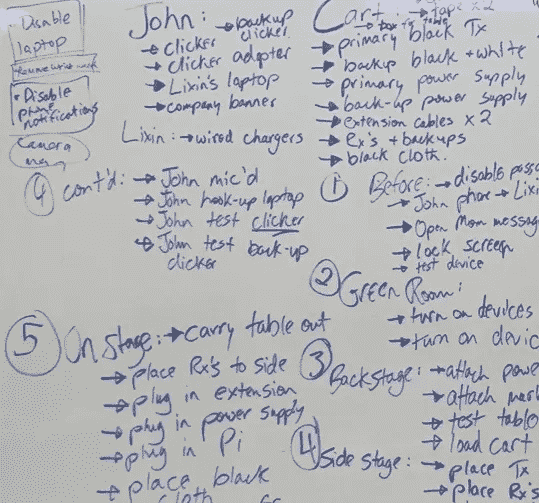
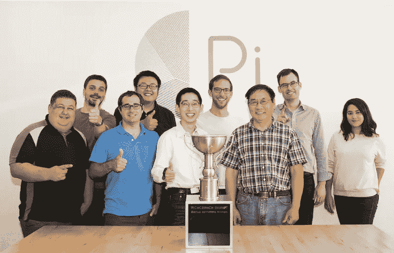

# 利用媒体帮助你的公司实现主要目标

> 原文：<https://medium.com/hackernoon/use-the-press-to-help-your-company-achieve-major-goals-8e713b5053a3>

事实上，所有的宣传都不是好的宣传，如果它不能帮助你的公司实现目标*。*如果你知道如何让新闻报道为你的创业公司服务，那么它可以成为有效的免费广告。无线充电初创公司 [Pi](https://www.picharging.com/) 的创始人兼首席执行官、去年 TechCrunch Disrupt SF 的获奖者约翰·麦克唐纳表示，关键是为你的新闻报道设定一个具体的目标，利用你的扩展网络寻求帮助，并为成功和失败做好准备。

约翰在 FirstMark 主办的每月一次的活动上详细介绍了这三个步骤。

*The Pi team leveraged the press around TechCrunch Disrupt to achieve their fundraising goal.*

## **什么时候让媒体参与进来？**

简单来说，合适的时间就是你的企业有目标要实现的时候。“当你的业务蒸蒸日上，当你完成了一轮融资，当你超越了一个重要的销售里程碑，那就是你开始接到媒体电话的时候。这也是你不需要媒体的时候，”约翰说。

> 为你的公司造势的最佳时机是当你有需要完成的事情时，而不是当你已经完成了一些事情时。

你的目标可能是让投资者对你的公司感兴趣，以完成新一轮的融资，通过提高品牌认知度来推动销售，获得新的企业合作伙伴关系，或者对你的特定风险投资很重要的另一个目标。

对于一家初创公司来说，发布会通常是最大的媒体机会。“你只发射一次。一旦你向世界展示了你的公司，没人会在意你第二次向世界展示你的公司。”约翰建议道。Pi 将他们公司的推出视为帮助他们筹集 A 轮融资的独特机会，并带着这一特定目标在公告发布时接洽公关。

## 谁能帮你准备出版？

规划公关策略时，利用外部资源是非常重要的。约翰建议在准备期间联系以下人员:

*   **投资人**:和你现有的投资人聊聊，大的小的。他们认识记者。他们有认识记者的朋友。他们在社交媒体上有追随者。“所有这些都是强有力和有益的，”约翰说。请求他们的支持。他们和你一样希望你成功。"
*   **活动组织者**:无论你是在参加一个小型的本地比赛还是一个全球性的颁奖典礼，都要和活动组织者接触。他们希望你成功并引起轰动，因为这有助于他们的活动，他们将提供支持以实现这一目标。征求他们的意见:谁会参加活动，你应该和谁交谈，过去做过哪些成功的演示，他们对你的演示有什么具体的想法？
*   **你的村庄**:不要忽视你身边圈子之外的人对你实现媒体目标的帮助。在初创企业中，这从你的家人和朋友开始，延伸到公关公司、品牌顾问，甚至公共演讲教练。无论你是否需要帮助来完善一份推介材料或提高你的演讲技巧，在你的社区中寻找能提供建议的专家。

## **你如何为媒体做准备？**

“你需要为每一个可能发生的事情做好准备，特别是如果你正在直播，这样你就不会搞砸了，”约翰说。“事情不可避免地会出错，你最好在所有人都在看的时候做好准备。”

*A snapshot of the detailed A/V checklist Pi used to prepare for their live company launch at TechCrunch Disrupt.*

确保你为成功做好准备同样重要。你的团队必须准备好处理突如其来的外部请求，同时在混乱中专注于你最初的目标。在围绕 TechCrunch Disrupt 的媒体报道之后，五大消费电子原始设备制造商中的四家联系了 Pi。他们决定暂停那些令人兴奋的机会，这样团队就可以专注于他们参与事件的原因:筹集 a 轮融资。

## 别忘了说谢谢。

最后，在所有的关注中，很容易忘记是谁把你带到那里的。约翰说，当你实现目标时，要记住是你的团队让你成功。一定要感谢他们的辛苦。你不是一个人走到这一步的！

*Your team is the reason you’re successful — make sure they know that.*

*想了解更多利用媒体的技巧，包括当媒体帮不了你的时候，请观看约翰在纽约的完整演讲:*