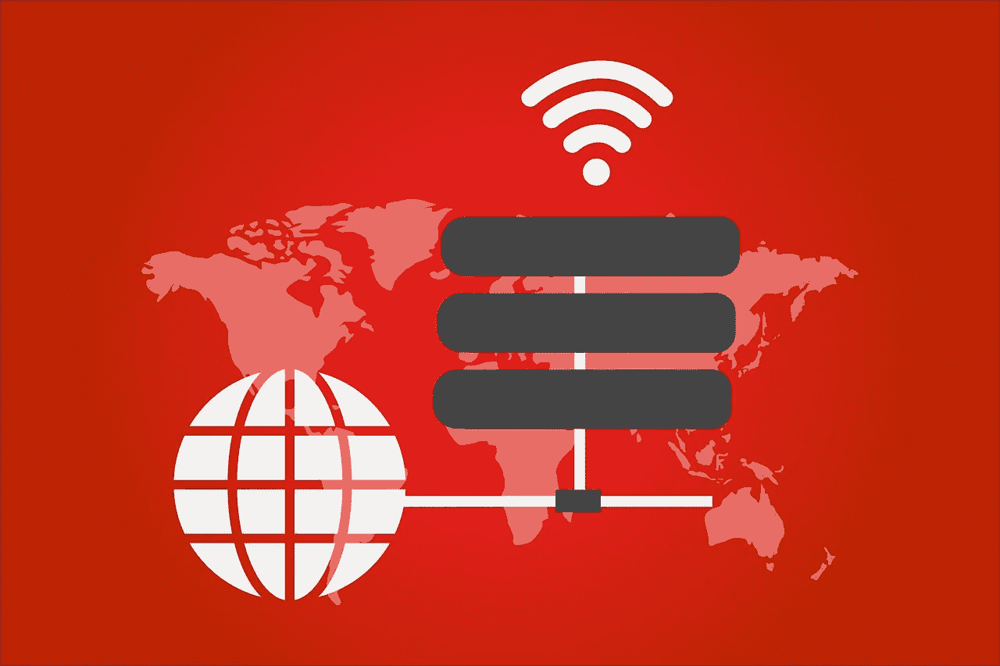

# 有用的 VPN 功能

> 原文：<https://medium.com/hackernoon/useful-vpn-features-794d77134b50>

我不想写一篇关于如何建立 VPN 的文章，因为互联网上有成千上万的 VPN，每一个都有不同的品味和特定的需求。

今天我只想谈谈几件简单的事情，它们带来了很多误解和大量的问题(甚至来自极客)。

**VPN 客户端几乎可以安装在任何接入点上**

即使是非常旧的接入点，您也可以获得升级或安装所需的软件包。例如，对于我的旧 Zyxel Keenetic Ultra，我能够找到一个非官方的更新，其中包含了许多有用的东西，包括 [OpenVPN](https://openvpn.net/) 客户端。

对于您的接入点，也可能有固件可供免费下载。如果您已经初步设置了使用 VPN 的所有接入点，那么整个生活会变得容易得多。

**VPN 允许有选择地路由流量**

您只需要知道您想要使用 VPN 连接的子网的地址。然后，您在 VPN 服务器上添加\更新这些网络的列表，客户端接收它们并开始仅驱动必要的\指定流量通过 VPN。其余的流量直接通过，不需要 VPN。重要提示:有许多指南和说明，遵循这些指南和说明，您可以通过 VPN 路由 100%的流量。这通常很慢，很贵，而且你几乎不需要一直使用它。

**移动设备**

出于某种原因，许多人认为 VPN 和移动设备的工作原理是:“要么全有，要么全无。”不，事实并非如此。即使有了 iPhone，你也可以通过 VPN 只驱动必要的流量。

**Tor**

我还想补充一点，由于我不知道的原因，大多数人都忘记了 [Tor](https://www.torproject.org/projects/torbrowser.html.en) ，它也有助于类似的任务，目前工作稳定快速。

**我的例子**

作为一个简单的家庭解决方案，我会推荐[谷歌计算引擎](https://cloud.google.com/compute/)，在那里我以最低的成本运行一个 OpenVPN 服务器。当然，你可以选择任何其他托管提供商和 VPN 服务器。

此服务器的客户端存在于我的接入点(本机客户端)、笔记本电脑和电话上。(由于某种原因，标准客户端 Android 拒绝读取配置，但是阿恩·施瓦贝的客户端安装并启动了)。它工作得很好，没有任何抱怨。

比起任何免费甚至付费的服务器，我对个人服务器的安全性和耐用性更有信心。我能够控制这里的一切，包括可能的病毒渗透企图。我相信它会一直运行而不会停机，没有理由相信相反的情况(嗯，除了大量的谷歌地址[被封锁](https://www.cnbc.com/2018/04/18/russia-blocks-google-amazon-ip-addresses-in-bid-to-ban-telegram.html)，但是改变服务器的 IP 地址是相当容易的)。

下面，我提供我的客户端设置示例(当然，没有键)。尽管这是我第一次部署 OpnVPN，但服务器和客户机在晚上几个小时内就安装好了。

**配置客户端**

证书可以直接添加到配置文件中，以便顺利地传送到接入点或电话:

*客户端*

*开发调谐器*

*原始 udp*

*远程你的服务器 IP 1194*

*解析-无限重试*

*无绑定*

*持续键*

*坚持吞*

*动词 3*

*< ca >*

*把你的 CA 证书放在这里*

*</ca>*

*<证书>*

*把你的证件放在这里*

*< / cert >*

*键<键>键*

*将您的私钥证书放在这里*

*< /按键>*

*方向键 1*

*< tls-auth >*

*将您的静态密钥证书放在这里*

*</TLS-auth>*

我使用几乎默认的服务器设置。只有一点——我添加了*将*推到那里——这样只有必要的流量才能通过 VPN:

看起来是这样的:

*推送“路线 x . x . x . x 255 . 255 . 255 . 255”*

*推送“路线 x . x . x . 0 255 . 255 . 255 . 0”*

就是这样。万事如意！