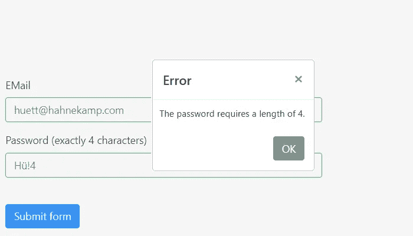
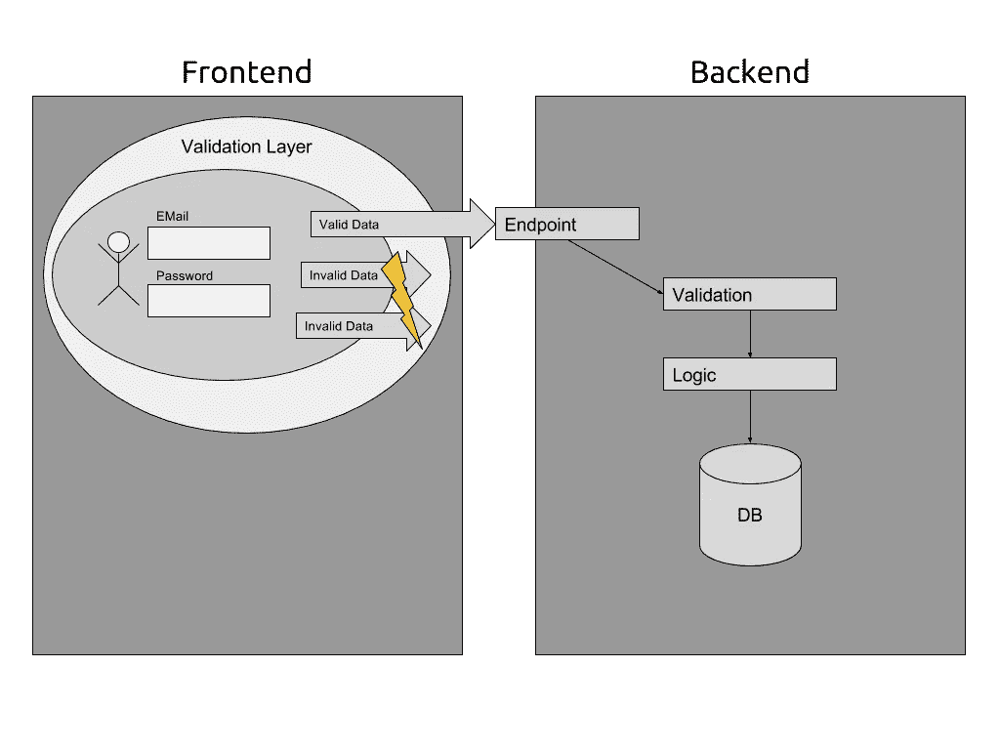
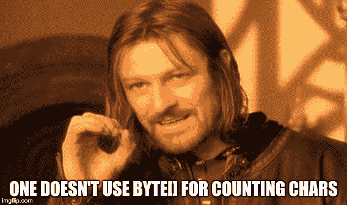

# 无用的错误消息

> 原文：<https://medium.com/hackernoon/useless-error-messages-29eacd3735e1>

良好的实践要求我们在异常发生时向用户显示错误消息，以便他们知道哪里出错了。我想说明的是，好的设计让例外成为例外——错误到用户无能为力的地步。在大多数[案例](https://hackernoon.com/tagged/cases)中，当异常发生时，最好的方法是向用户显示一条单一的通用消息。

# 无法解释的例外

一如既往，context 是现代主流的 web 应用。因此，我们将从一个简单的注册表开始。我们需要一个用户的电子邮件和密码，正好是 4 个字符长。我们可以假设表单在客户端和服务器端都有工作验证。


令我们惊讶的是，我们收到了一封来自客户的电子邮件。他抱怨注册不起作用，并附上了以下截图:



显然，用户的密码正好是 4 个字符长。同样明显的是，表单验证同意这一点，并将边框颜色设置为绿色。然而，出于某种原因，后端获得了另一个意见并显示了错误消息。

我们的用户不知道他做错了什么。更糟糕的是，他不知道如何进行登记。

怎么会走到这一步？我们如何避免这种情况？在我们进入细节之前，让我们澄清一些基本的事情。

# 异常===非受控状态

我们不应该错误地将例外作为 if 条件的替代。

例如:

```
public boolean validateRegistration(String email, String password) {
  /* some validation code */
  try {
    this.checkPassword(password); 
  } catch (PwLengthException ple) { 
    return false; 
  } 
  return true; 
} public void checkPassword(String password) throws PwLengthException { 
  if (password.size != 4) { 
    throw new PwLengthException(“The password requires a lenght of 4”); } 
  }
}
```

如果密码无效，那么函数`checkPassword`将抛出一个异常。异常在调用方用作条件表达式。

然而，我们应该把每一个异常都看作是我们应用程序的一个意料之外的，因此也是不受控制的状态。

火箭科学将这一点发挥到了极致。如果一个异常出现在主例程中，那么它通常会触发系统的自毁命令。开发人员明白异常的本质:系统超出了他们的控制。这个国家需要采取极端措施来防止更多的灾难性事件。


*Ariane 5 triggering self-destroy after an unhandled buffer overflow exception in 1996\. Source: ESA*

我们是网页开发者，不是火箭科学家。我们系统中的异常将永远不会需要类似的激烈措施，如摧毁用户的笔记本电脑，因为密码复杂性是错误的:)。

然而，就像火箭科学家一样，我们设计系统的方式永远不会出现例外。如果他们这样做，那么我们是在未知的领域。

该示例可以更正为:

```
public boolean validateRegistration(String email, String password) {
  /* some validation code */ 
  if (!this.isValidPassword(password)) {
    return false; 
  } 
  return true; 
}public boolean isValidPassword(String password) { 
  return password.size == 4; 
}
```

# UI 作为针对无效数据的看门人

我们如何实现一个应用程序设计，使得异常抛出在理论上是不可能的？

用户界面的任务就是让用户保持在正确的轨道上。每一个可能的行动都应该是既定过程的一部分。用户应该没有办法走出设计的路径。

来自用户的无效输入是该过程的一部分。因为这是我们应用程序的计划状态，所以没有理由抛出异常。当无效输入未经过滤地传递到我们的后端时，这只会成为一个问题。因此，UI 需要通过验证来处理它。

所以我们的前端充当了看门人的角色。它确保只有有效的数据才能进入我们的系统。这意味着，从理论上讲，我们的系统不能进入不受控制的状态。

我们的密码输入示例只是需要前端验证的输入类型之一。用户的访问可能需要安全许可。或者用户的国家可以定义区域限制。更常见的是，用户必须手动输入有效的 URL。



UI as Gatekeeper

当然，这并没有让我们从后端的正确验证中解脱出来。例如，如果用户故意绕过它，就不能责怪前端。他们可以更改 URL 参数。或者它们可能正在嗅探端点并发送经过处理的数据。

在这些情况下，我们处于不受控制的境地。抛出异常是合理的。但是请用标准错误屏幕捕捉它。

# 从理论到实践

让我们回顾一下。我们已经确保只有当应用程序进入不受控制的状态时才会抛出异常。我们已经确保只有有效的数据才能进入我们的系统。因此，任何前端主导的行动都不能使系统失败，对吗？不对！

让我们回到最初的例子。原来，我们的服务器端验证代码以某种方式使用了一个字节数组，而不是一个简单的字符串…

```
public void finishRegistration(String email, String password) {
  /* some validation code */
  if (!this.isValidPassword(password.getBytes())) {
  /** 
  * only for safety reasons. Can’t happen due
  * to proper client validation
  */
    throw new PwLengthException(
      “The password requires a length of 4”);
  }
  return true;
}public boolean isValidPassword(byte[] password) {
  return password.length == 4;
}
```



*In UTF-8 an ‘ü’ takes two bytes. Source: imgflip.com*

你认为这在实践中不会发生吗？嗯，我的朋友…这些事情…一直都在发生。

# 未知的根本原因

正如我们所看到的，用户输入本身并不是根本原因。是我们的应用程序有问题。

更糟糕的是，我们向用户显示了一条不正确的错误消息。这只会让他们困惑。毕竟，他们做的一切都是对的。

如果我们是诚实的，我们的消息应该是这样的“亲爱的用户，你的密码似乎是好的。由于一些无法解释的原因，它还没有被后端接受。我们搞砸了。不好意思。”

# 如何修复这个 bug？

现在应该很清楚，有了完善的验证机制，异常仍然会发生。但是我们可以肯定，如果抛出了一个异常，那不是用户的错。

因此，将我们的努力投入到一个能够显示不同错误消息的模块中是没有意义的，每个错误消息都是国际化的，并且支持上下文信息的替换，如“密码需要长度 4 而不是%s”。

道歉就好。然后，确保我们记录事件以及我们可以收集的所有相关信息。让我们使用一个复杂的日志收集器并优化我们的内部流程来尽快修复这些错误。我们只能这样了。

# 摘要

异常不能替代 if 条件。

用户界面应该确保来自用户的异常不会发生。

不要给你的用户展示误导性的信息来迷惑他们。

*原载于 2018 年 1 月 14 日*[*【www.rainerhahnekamp.com】*](https://www.rainerhahnekamp.com/en/useless-error-messages/)*。*