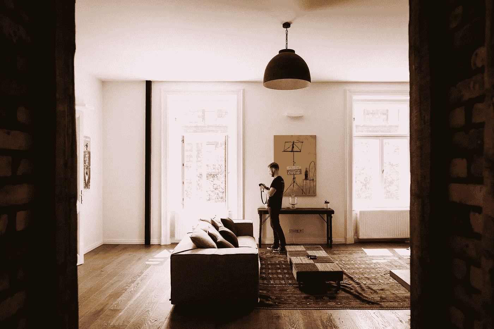

# 用户自适应和环境感知的智能家居环境

> 原文：<https://medium.com/hackernoon/user-adaptive-and-context-aware-smart-home-environments-888f395d384d>

智能家居设备正在迅速普及，原因很容易理解。在我们忙碌的生活中，方便是最重要的。智能家居环境提供了大量的功能，使日常生活更加轻松。从允许用户通过智能手机控制照明和恒温器的设备，到显著提高家庭安全性的产品，甚至是可以远程管理的烹饪机器，智能家居提供了多种省钱和增加便利的方式。

随着智能家居设备的发展，有必要找到使该技术适应用户及其所处环境的方法。物联网是基于人机交互的。通过坚持这一基本的物联网原则，智能家居设备可以发展到处理和学习由电器、传感器和这项技术的人类用户产生的数据。换句话说，智能家居环境必须适应其居民的特定需求和惯例，允许技术随着时间的推移而个性化，以响应人的行为。

在许多方面，实现这些概念所面临的挑战类似于智能城市、智能电网和个性化可穿戴设备的持续发展。这项工作需要融合许多学科，包括人机交互、心理学、社会科学和情境意识。

智能家居中的环境数据可以从多种来源获得，如房屋及其附近的传感器、电力和水耗表，以及提供额外数据的智能城市传感器，如室外温度、社区的总用电量和污染水平。

当然，完成这项任务是一项高度复杂的事业。该技术的设计必须能够适应广泛的用户和背景情况。此外，将有价值的数据从剩余数据中分离出来以有效地定制智能家居设备非常具有挑战性。然而，通过使用机器学习方法来提取有用的信息，可以实现创建用户自适应和上下文感知的智能家居环境的复杂性。毫无疑问，我们都将从这些发展中受益匪浅，便利性增加，安全性提高，口袋里的钱也更多了。

*由* [*DataArt*](https://www.dataart.com/industry/iot-and-m2m-solutions?utm_source=medium&utm_medium=social&utm_campaign=i-spring-2018) *物联网负责人伊洛宁撰写。*