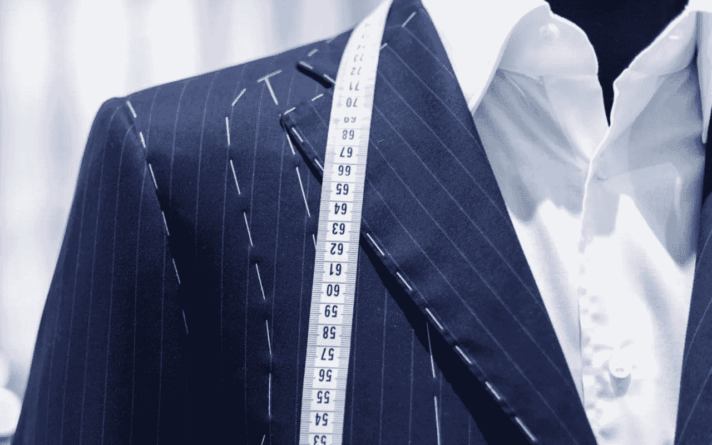
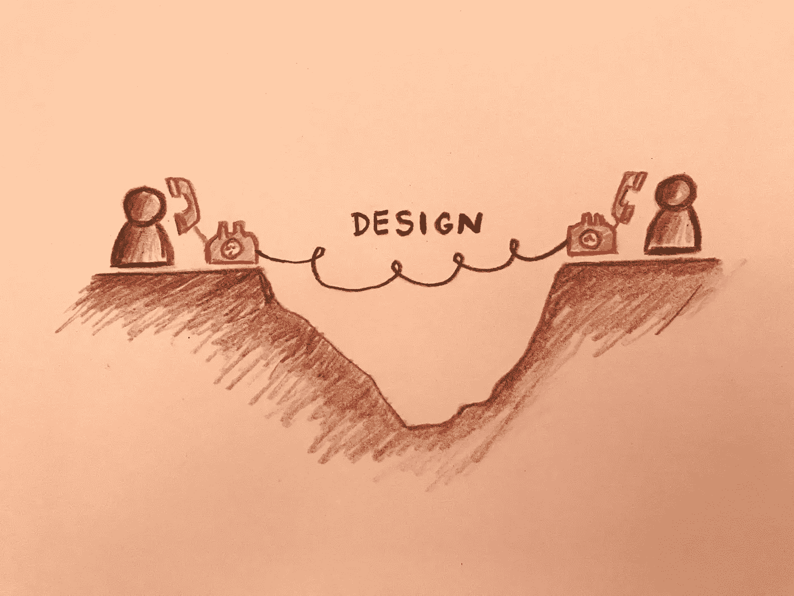
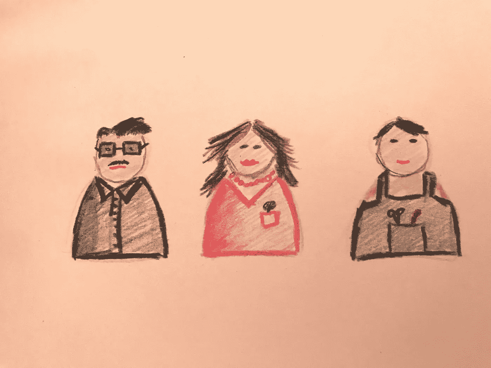
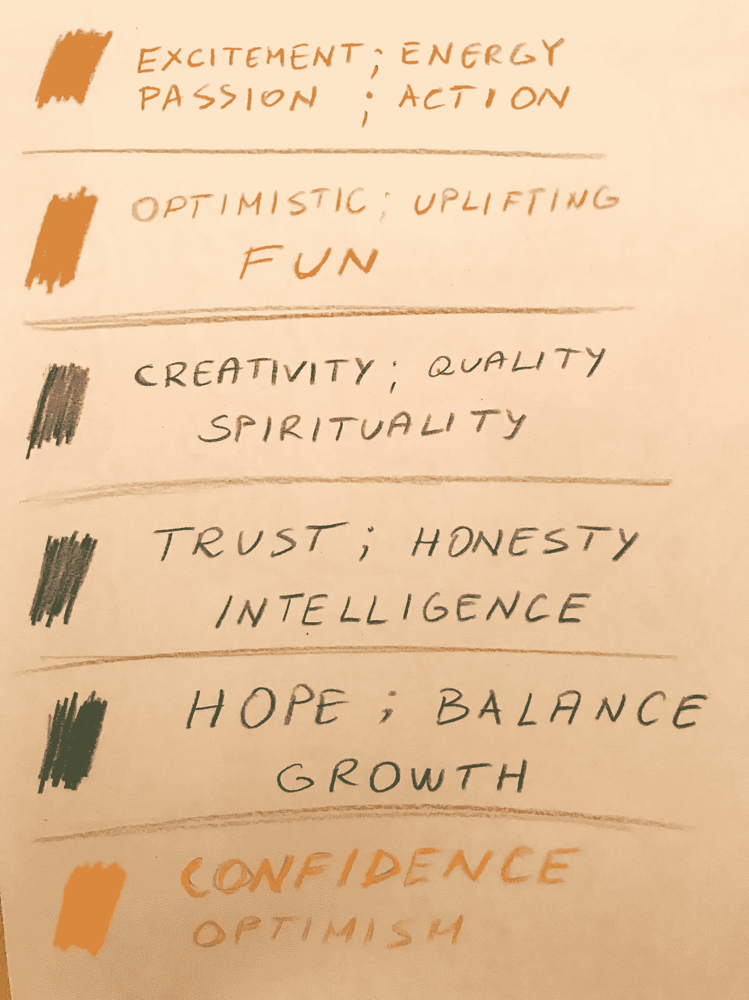

# 以用户为中心的设计原则就像魔术一样——即如何取悦用户并传递正确的信息

> 原文：<https://medium.com/hackernoon/user-centered-design-principle-works-like-magic-i-e-c1b62950c0e4>

以用户为中心的[设计](https://hackernoon.com/tagged/design)是一种帮助你将产品或服务塑造成用户需要、想要和渴望的形式的方法。每个消费者群体都有一定程度的社会惰性，这基本上是改变他们行为的阻力。所以不要试图说服他们使用你认为是最先进的产品的**。相反，让他们熟悉它，把它作为“*这正是我所需要的*”类型的产品来展示——从**他们的**的角度来看。以下是你可以做到的方法…**

*注:我写的是总体设计。可以是网站设计、网站文案、产品包装、产品宣传册、*[*Facebook*](https://hackernoon.com/tagged/facebook)*广告封面、instagram 故事或任何包含买卖双方视觉沟通的内容。在下文中，我将把这个组件称为“设计”。*

## 你是谁并不重要，重要的是你提供的价值

我倾向于以错误的方式开始几乎每一个项目——以这样的介绍:*你好，我们是 ____，我们爱 ____* 。然后我记得找到这个设计的人在找别的东西。他们自己感兴趣的东西。所以，克制自己不要写你的牛逼，关注目标客户的需求(除非你在写招聘广告，然后拿出豆包和免费零食)。

# 差距

创造一个产品很难。这需要时间、金钱和努力。经历创造它的过程，你会产生情感依恋。因此，将它作为有史以来最好的产品来推销是很自然的。因为这是你的，你也相信。但不幸的是，你必须做得更好才能说服顾客购买它。

任何生意都是买卖双方的关系。它包含两个方面，每个方面都有自己的观点。这是一种**给&取**的关系。不给予&接受，因为你不想只是接受任何东西，你脑子里有一个特定的奖励。为了让一段关系正常运转，双方都应该清楚地表达出他们的付出和他们想要的回报。这样，双方的期望都得到了满足，关系(业务)也会发展。

Communication via design

设计是买卖双方的媒介。它应该用来在双方之间进行视觉交流，缩小差距，并密封这种互让关系。

# 人物角色

缩小差距的第一步是了解对方。你不可能见到所有的人，但是你可以做一个市场细分，在你想要解决的细分市场中创造一个角色。用笔和纸画出那个人。注意年龄、教育程度、衣服、发型、眼镜、兴趣以及尽可能多的你能想到的个人细节。现在，看看纸上的这个人，找出你的哪个朋友最能让你想起这个人。将你认识的人形象化是很重要的，因为这将帮助你理解顾客是如何思考的，他想要什么。更好的是，在你推出你的设计之前，你可以和那个人做一个 A/B 测试。

Get to know your customers

## 买家视角

当你介绍你的设计时，几乎每个人都会经历这个步骤:

1.  注意到包裹
2.  问“这是什么？”
3.  疑惑“我为什么要在乎？”
4.  想要被说服
5.  需要证明[1]

请确保您的设计回答了这些问题。尤其是 3 号。传达他们的好处应该是你的首要任务。

# 你的报价和未知因素

通过设计进行交流是非常有效的。难怪设计行业背后有一个完整的产业。它给了你一个只用文字和色彩就能赢得人心的方法(如果用心和注意使用的话)。

购买决定通常来自我们的潜意识、情感和直觉。品牌就是直觉。如果购买者对你的产品感到满意，你就做对了。如果你解决了他们的问题，改善了他们的生活，积极的感觉就会出现。这是你的设计应该响亮而清晰地表达的。这里有一种方法可以做到…

## 猜字游戏

我喜欢玩一个文字游戏，我把它分为五类，并指定我希望我的客户在与设计互动后的感受和状态。

1.  文化/ *什么是公司文化？*

例如，负责任、专业、非正式、友好、有能力…

2.声音/ *我们想要什么样的语气和声音？*

例如，有个性、有魅力、值得信赖、有爱心…

3.利益/ *客户对我们提供的利益有何感受？*

例如:自在、放松、自信…

4.我们为客户提供了什么价值？

例如，轻松、无忧的服务、可靠性……

5.X-Factor / *与竞争对手相比，是什么让您成为无与伦比的服务？*

例如，全天候可用、有机、环保、传统……

需要一些时间来思考你想用什么词来描述你的设计。但是当你走的时候，把它们堆起来，找出相似的组。然后提取三四个你认为最重要的关键词。这些词最能描述你的产品和你希望你的顾客感受到的情感。最后，如果设计没有提到这些关键词，那就从头开始。

完成所有这些步骤后，设计将会容易得多，因为你知道你是为谁设计的，你希望你的顾客有什么样的感受。这让事情变得简单多了。这就是以用户为中心的设计的力量——击中客户最佳点的机会要高得多。把你一美元中的 80 美分花在准备上，从长远来看肯定会有回报的。

# 额外加分

在你的设计中使用颜色的情感触发来获得一些额外的分数。

## 阅读材料

我强烈推荐一些关于产品设计和设计心理学的书籍。

[1] — [品牌差距:如何弥合商业战略和设计之间的距离](https://www.amazon.com/Brand-Gap-Distance-Business-Strategy/dp/0321348109)，Marty Neumeier

[2]——[一个广告人的自白](https://www.amazon.co.uk/Confessions-Advertising-Man-David-Ogilvy/dp/190491537X)，大卫·奥格威

[3]——[日常用品的设计](https://www.amazon.com/Design-Everyday-Things-Donald-Norman/dp/1452654123)，唐纳德·诺曼