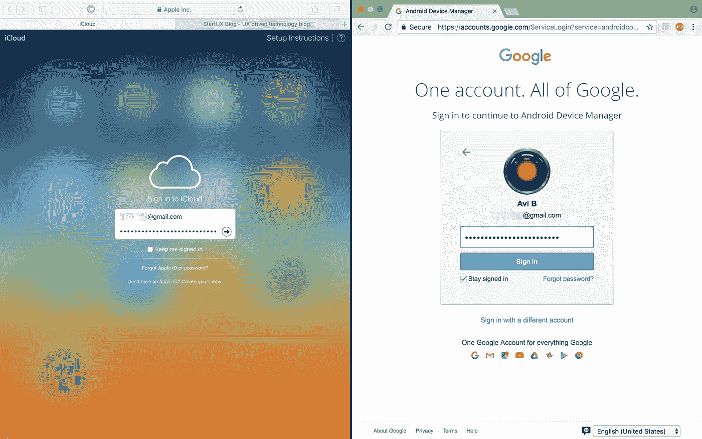
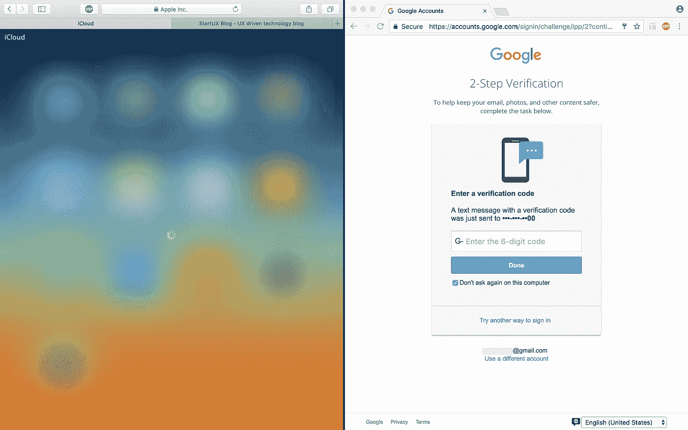
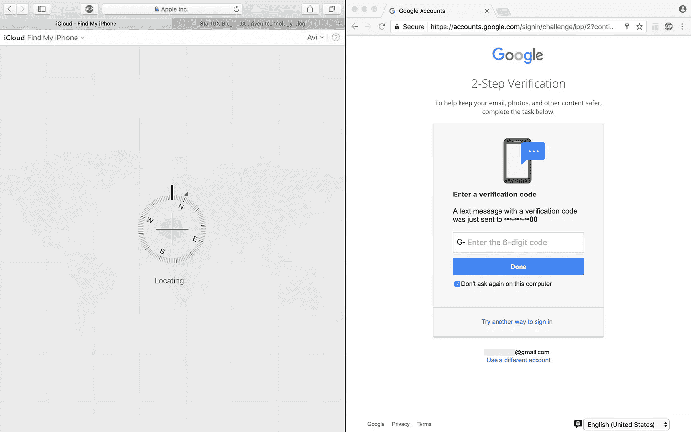
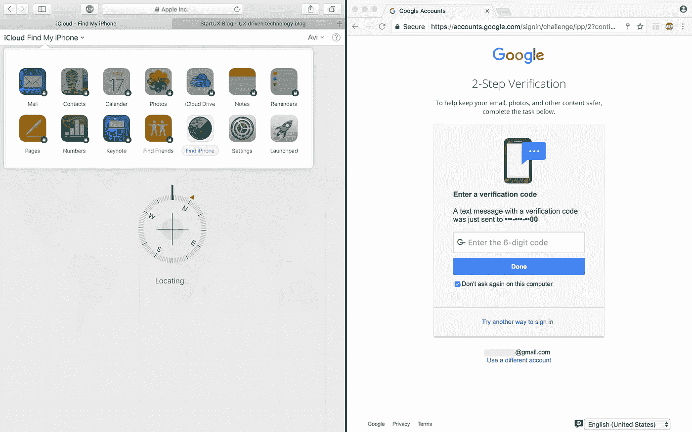
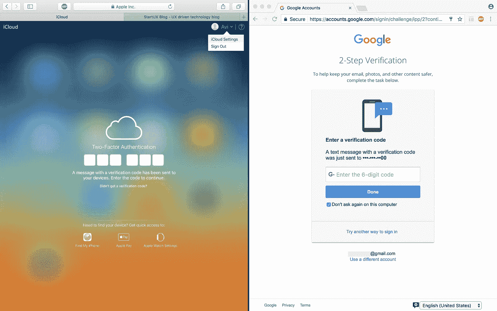
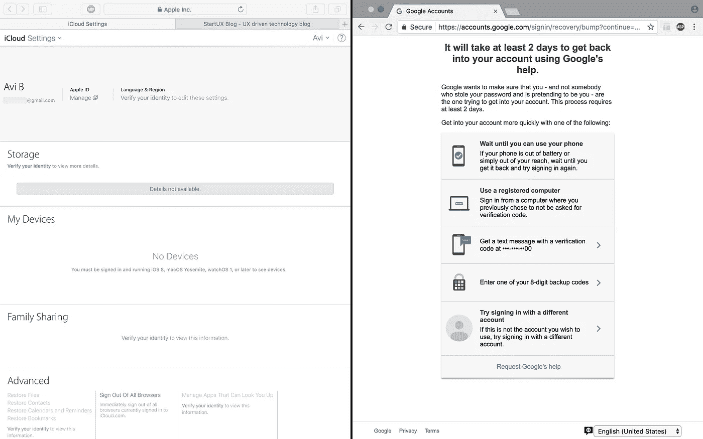
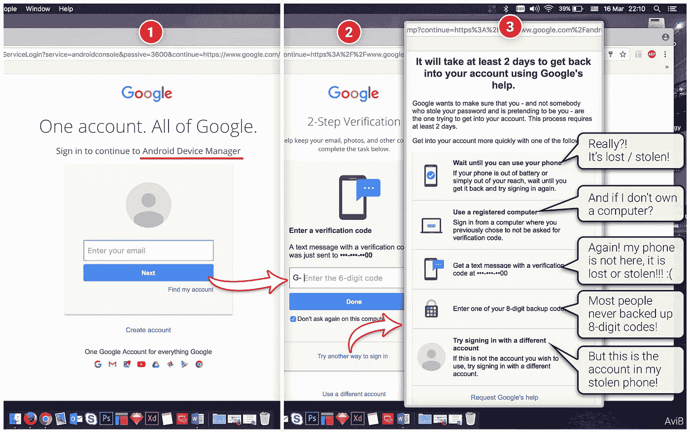
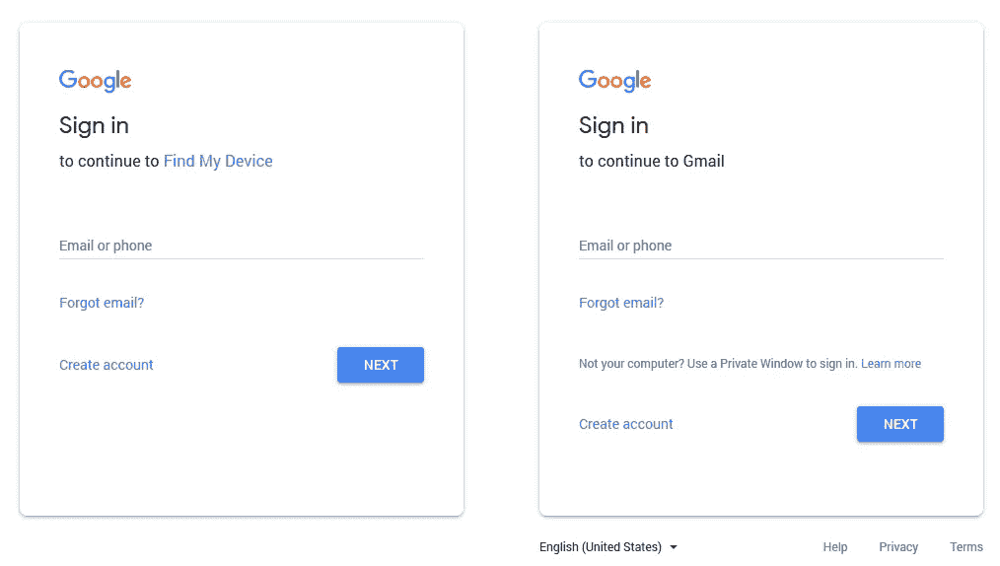

# 用户体验与网络安全

> 原文：<https://medium.com/hackernoon/user-experience-vs-cybersecurity-9a8b59f7573a>

## 我们的界限在哪里？

作为 UXers，我们[在设计](https://hackernoon.com/tagged/design)时考虑到用户的需求(以用户为中心的设计)，我们从最终用户的角度考虑问题，我们总是尽最大努力设计最直观、最人性化的产品。但是当谈到简单性、UX 与 T2 的安全和隐私时，我们的底线在哪里？如何才能在两者之间取得平衡？有没有可能在不影响用户体验的情况下设计出安全的产品？

# 糟糕的经历

我刚回到家，然后我意识到我的安卓手机丢了！于是我从包里拿出我的 Macbook，用[谷歌的](https://accounts.google.com/signin/v2/identifier?service=androidconsole&flowName=GlifWebSignIn&flowEntry=ServiceLogin)(又名 Android 设备管理器)找到我的手机。但问题是，昨天在工作中，我不得不清除浏览器数据(前端，Cookies 和 HTML+CSS 原因),因为这个原因，我被注销了我的谷歌帐户！

是的，就像很多人一样，我的账户使用了[双重认证](https://en.wikipedia.org/wiki/Multi-factor_authentication)来保护，没有手机，我被锁在了自己的账户之外，甚至找不到我的手机！这有点烦人，因为在那一刻，你所关心的是尽快找到你的手机。无论你做什么，没有你的手机和两步验证码，是不可能进入你的帐户！这是“先有鸡还是先有蛋”的悖论…

# 安全很重要

那么，现在你可能对你的在线账户使用双因素认证(2fa 是把你的手机变成一个认证设备)，如果你没有，你应该使用 2FA！强烈建议使用额外的一层保护，因为今天比以往任何时候都更容易(业余黑客甚至无聊的青少年！)来黑网上账号。访问你的云账户有很多创造性的方法，从[社会工程](https://en.wikipedia.org/wiki/Social_engineering_(security))、[网络钓鱼](https://en.wikipedia.org/wiki/Phishing)，甚至是简单的设计操作(甚至是 UX 黑暗模式)。所以是的，今天即使没有黑客技能的人也可以从在线教程和 YouTube 视频中学习如何黑客。

# UX 与安全之间的平衡

所以让我们来关注双因素认证，看看苹果和谷歌是如何处理的。想象一下，你刚刚丢失了你的手机，你急着去找它！现在时间对你不利！因此，如果你有一部 iPhone，你可以去苹果的[查找我的 iPhone 网站](https://support.apple.com/explore/find-my-iphone-ipad-mac-watch)找到你的手机。如果你有安卓手机，你会去[安卓设备管理器](https://www.google.com/android/devicemanager)网站找到你的手机。

但是由于你的账户有双重认证，没有手机你无法证明你就是你所声称的那个人！那你怎么办？嗯，这是一个经典的例子，因为我们知道谷歌比苹果更注重安全，这是一件好事，但我们也知道苹果总是痴迷于设计、体验和简单。所以即使在这种情况下，看起来苹果通过设计解决了一个安全问题，甚至比谷歌更好！让我们更深入地看一看，分析一下，从中吸取教训。

# 1.登录体验

iCloud 很简单，但谷歌在 UX 与[有着不同的登录方式，其利弊](http://ux.stackexchange.com/questions/78805/why-is-google-using-a-new-2-step-gmail-sign-in-process)。(顺便说一下，显示用户的图片是不错，但是黑客可以验证这个账号是属于你的)。

# 2.两步认证

*苹果让你进去，而谷歌要你用手机认证，但唯一的问题是你的手机丢了！*

**

# *3.正在查找我的 iPhone…*

*苹果会帮你找到你的 iPhone，而不会强迫你进行身份验证！因为他们知道你的时间很宝贵，而且你很急。虽然谷歌希望你更加努力地工作…*

**

# *4.任务完成，iPhone 找到了！*

***澄清一下** —苹果只允许你访问“查找我的 iPhone”页面，你将无法访问 iCloud 账户中的其他部分！但这是一件好事，因为如果有人侵入你的账户，他将从你的数据中隔离出来，由于 2FA，你将会在你的 iPhone / Mac 上收到通知[有人使用你的 Apple ID 访问了你的账户](https://support.apple.com/en-us/HT204145)。即使你的 iPhone 永远消失了，[你仍然可以访问你的 iCloud 数据](https://support.apple.com/en-il/HT202649)。*

**

# *5.但是 Launchpad 想要 2FA*

*Launchpad 需要您的认证！所以如果有人黑进你的账号，他就被隔离在一个地方。所以在我看来，毫无疑问——苹果在 UX 和安全性方面做得更好！因为即使没有认证，你至少可以定位你的手机！*

**

# *6.你不能通过！*

*所以没有认证，就像谷歌一样，即使是苹果也不会在设置页面给你显示任何个人数据。至于谷歌，你仍然被锁定在你的账户之外，无法定位你的安卓手机。谷歌—请修复它:)*

**

# *7.冷静点，做好心理准备！*

*除非你附近有一台注册的电脑，否则你将被谷歌账户拒之门外！所以做好准备，确保你有备份代码！你可以将它们存储在你的电脑、u 盘甚至其他云账户上，比如 DropBox、OneDrive 等。(确保您对代码进行了加密/密码保护)。做好准备！否则你将不得不面对这个:*

**

# *总而言之:*

*即使在今天，当谈到安全性和可用性之间的平衡时，苹果更注重设计，但在谷歌对 Android 设备管理器采取措施之前，请确保你做好准备，否则你会浪费宝贵的时间，直到你找到一种不用注册手机访问你的帐户的方法(如果有的话)。所以不要偷懒，接受谷歌的建议，在你激活两步认证后马上获得你的 8 位数密码。万一你丢了手机，至少你还能访问你的谷歌账户。*

*所以，好消息是你可以做些什么，有几种方法可以确保你在手机丢失或被盗的情况下不会被锁定帐户。**事实上，谷歌甚至建议你在启用两步认证后马上做些什么，但我猜大多数人都忽略了这一点。所以[你有责任](https://support.google.com/accounts/answer/185834?hl=en)对此做些什么并做好准备！否则谷歌不会帮你！***

*顺便说一下，对我来说幸运的是，我已经在我的电脑上备份了我的 8 位数代码，所以最终我能够找到我的手机…它在我的车里！它可能从我口袋里掉出来了。但是这次(可怕的)经历让我意识到我们应该做好准备，我想和你分享一下，以防你丢失手机…*

*附注:请随意评论，并让我知道是否有任何其他的解决办法/黑客/官方文件，为锁定他们的帐户的人。*

# *更新:*

*这篇文章最初于 2017 年 3 月 16 日发布在 [StartUX](http://www.startux.net/ux-vs-cybers-security/) 上，但我想在 Medium 上重新发布它，所以我检查了从那时起是否有什么变化，但除了谷歌方面的一些设计变化(他们已经将[材料设计](https://material.io/design/)应用到他们的登录屏幕)，但除此之外，没有什么真正的变化:*

**

*Minor UI changes ( Material Design)*

## *如果你喜欢这篇文章，请阅读我的其他文章:*

*[如何修复脸书群体 UX](https://hackernoon.com/how-to-fix-facebook-groups-ux-36209dd6f6a8)
[Lifehacks 跟上科技新闻](https://hackernoon.com/lifehacks-to-keep-up-with-tech-news-c92834b24687) [开放设计:设计师的免费工具](https://uxplanet.org/open-design-freeware-tools-for-designers-f7bdde99f2e0)
[iPhone Vs MacBook Pro](/adventures-in-consumer-technology/iphone-vs-macbook-pro-9902c7fc64d3)[你的智能手机 vs 你的 PC](/adventures-in-consumer-technology/smartphones-will-replace-pcs-soon-541b5c8a4f48) [苹果，是时候将 iOS 与 macOS 融合了](https://uxplanet.org/apple-its-time-to-merge-ios-with-macos-4f04c947c19d)
[VR、AR & MR](https://uxplanet.org/the-differences-between-vr-ar-mr-27012ea1c5)* 

> ***通过下面的**拍手**帮助别人**找到我在 Medium 上的文章。
> 跟我上: [**推特**](https://twitter.com/4Barel) ， [**中**](/@4Barel) **，** [**脸书**](https://www.facebook.com/startux.net/) 和 [**LinkedIn**](https://www.linkedin.com/in/abarel/)*

*

Follow StartUX page on Facebook for more TL;DR Tech & UX updates*