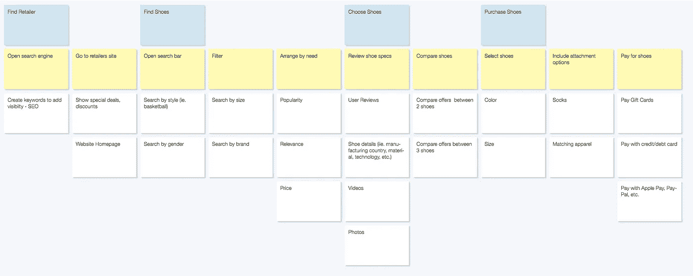
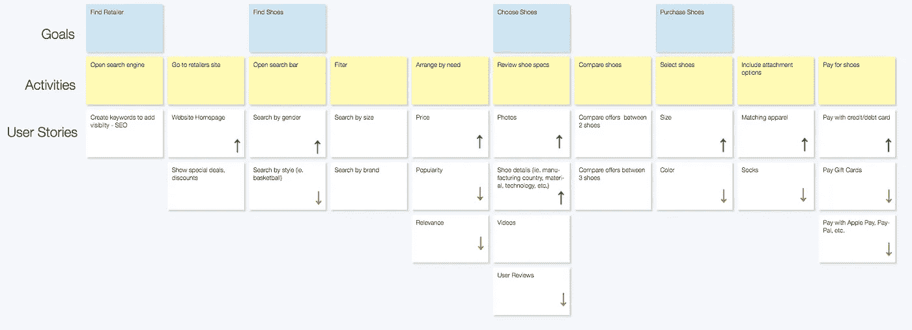
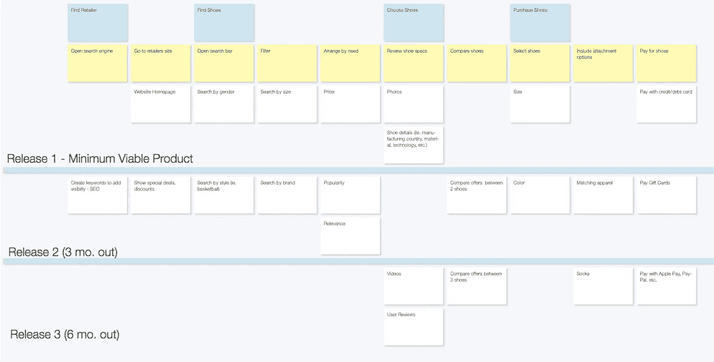

# 面向初学者的用户故事映射

> 原文：<https://medium.com/hackernoon/user-story-mapping-for-beginners-f1b280d53c27>

用户故事映射(USM)允许项目经理、开发人员和设计师将一种方法放在产品设计的持续复杂性之后，并创建一个令人敬畏的用户体验(UX)。使用 USM 创建允许开发人员创建以用户为中心、以用户体验为中心的产品和流程。

这个过程从关注用户目标开始，通过理解手边的问题来分解产品/过程。收集并列出用户为达到目标而采取的每一步。只需跟随旅程和叙述来发现用户活动中涉及的每个步骤。创建一个解决方案来改进产品，甚至可以创建多个用户故事，这是一个帮助你在团队中共享理解的工具。

通过组织目标、活动和用户故事，您可以创建一个整个团队都能理解、区分优先级并遵循的易于遵循的视觉效果。这就是所谓的用户故事地图。项目经理、开发人员和设计师需要一个简单的视觉来组织目标和理解客户。然后，团队成员可以通过有组织的地图跟踪目标、活动和用户故事，该地图可以通过 USM 提供的视觉帮助轻松更新和改进，从而增加共同理解。

总的来说，用户故事映射提供了一种易于理解的视觉效果，可以培养共同的理解

# 步骤 1 —发现阶段—了解目标

首先，你要吸引顾客和他们的行为，以达到既定的目标。为用户使用你的产品所达到的目标创建一个摘要。对于每个确定的目标，把它写在一张卡片上，并按照它们最先出现的时间顺序排列卡片。例如，如果用户想要购买一双鞋，他们的目标将是:

"寻找零售商，寻找鞋子，选择鞋子，购买鞋子."

对于特定的用户，这可以进一步细分，他们的目标可以是“找到篮球鞋”、“选择最好的鞋”、“购买最便宜的鞋”

# 第 2 步—发现阶段—详述旅程

一旦定义了目标，然后通过添加活动来详细描述用户的旅程。用户为实现目标而采取的每一步都公布在目标下。这为理解完成一个目标并继续下一个目标的各个部分提供了一个视觉效果。例如，为了找到一个零售商，用户将首先打开他们的搜索引擎，在结果中选择一个零售商，然后在选择的站点上开始寻找鞋子的过程。

# 步骤 3 —设计阶段—创建解决方案

你已经理解并定义了目标，你详细描述了用户的旅程。下一步是什么？创造解决方案。一旦发现阶段结束，您现在进入设计阶段。作为一个用户，你有一个明确的目标。要实现它，你必须采取一些步骤。

具体来说，寻找新鞋的用户希望找到一个可靠的零售商来购买一双篮球鞋。他们可能在寻找折扣、特定品牌和特定尺寸。对于不同的用户类型，你必须准备好处理不同用户的需求。为了准备，开发人员确定的用户故事被安排在相关活动下。看看这个:

# 步骤 4-发展阶段-确定任务的优先级

用户故事地图可以很快被想法填满，这意味着团队需要做更多的工作。需要注意的是，不同的任务或用户故事有不同的优先级。某些任务(用户故事)对产品的成功更为关键，其他的增加支持，但可能不是发布产品所需的最重要的部分。

# 步骤 5 —开发阶段—发布

在这个快节奏、不断变化的需求的世界里，识别什么是可以尽快发布的最小的工作产品是很重要的。也就是说，在列出的特性中，有多少是可以添加的，更重要的是可以删除的，并且仍然有一个可销售的产品。在创业社区，我们称之为最小可行产品(MVP)。由于时间和资金的限制，在每个版本中选择哪些部分必须被省略变得非常困难。然而，通过关注最常见和最容易开发的任务，开发者和设计者可以优先关注用户旅程中最重要的事情。

剩余的任务(用户故事)被推到 backlog 中，可能会被久而久之开发。任务(用户故事)由卡片之间的水平线分隔，显示一段时间内的不同版本。可以添加时间表和时间估计，以便更好地理解产品的时间表及其生命周期。提供对潜在成本和时间的更好估计。

# 第六步——改进并重复

随着您的产品和业务的增长，利用 USM 的机会也会增加。每次你在这个过程中导航，在产品的创造和经验教训中都会有打嗝。改进你所学的，重复 USM 流程。

通过使用 USM，它将支付巨大的红利，并导致您的产品和业务的增长。每次你在这个过程中导航的时候，你将学习并反馈到下一个迭代中。

当您使用 USM 时，您可以预期以下结果:

*   通过更好地了解您的用户来提供更好的产品
*   通过不过度构建不必要的功能来加快上市速度
*   通过不在非增值活动上浪费时间来降低成本

认为用户故事映射可以帮助你或你的企业吗？看看 cardboardit.com，今天就报名参加[30 天免费试用](https://app.cardboardit.com/users/sign_up)！

在社交媒体上找到我们！

[脸书](https://www.facebook.com/cardboardit/)、[推特](https://twitter.com/CardBoardIt)、[领英](https://www.linkedin.com/company/cardboardit/)

*原载于 2018 年 10 月 15 日*[*cardboardit.com*](https://cardboardit.com/2018/10/user-story-mapping-for-beginners/)*。*