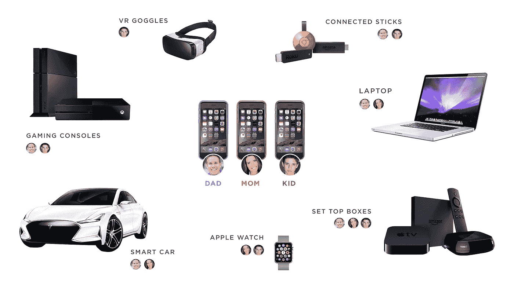
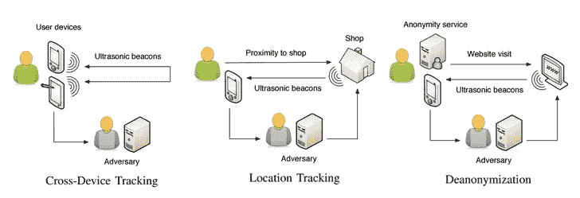

# 用户追踪:来自战壕的故事

> 原文：<https://medium.com/hackernoon/user-tracking-tales-from-the-trenches-ab2c8d7fe80c>

```
A skilful traveller leaves no track.
A skilful speaker makes no slip.
A skilful reckoner needs no counting rod.

Laozi, The Tao Te Ching, chapter 27
```


人类从狩猎采集社会发展到购买社会的过程已经完成。

古代商人开拓了销售商品的新天地，因此出现了丝绸之路、荷兰东印度公司等现象。最后一家公司是第一家真正在官方证券交易所上市的公司，它甚至促成了一个全新领域的形成过程:股票市场。随着互联网的出现，类似的故事也发生了。这导致了新方法的出现，并随着时间的推移而演变。最初，用户跟踪促进了销售/收入的增长，因为商家能够发现目标受众。最近，用户追踪已经开始占据更广阔的领域:犯罪预测、预防恐怖行为，当然还有广告的新时代。

进化过程是无法停止的。大约在 3.85 亿年前的泥盆纪中期，由于进化过程，早期的呼吸空气的鱼类可以在陆地上停留很长时间，这是在第一批人类出现后很久很久以后。与前面的陈述类似，对用户的跟踪经历了一个演变过程:从众所周知的 cookie 到那些无法删除的 cookie，从天真的收集 IP 地址到人工智能驱动的技术。

## 跟踪方法

跟踪用户有两个根本原因:营销和间谍活动。营销人员需要将产品与适当的受众相关联，这一案例说明了一切。间谍活动可能是不同目的的主要目标:TOR 网络或常见站点的匿名化、一些恶意行为、欺诈/诈骗，甚至是情报。第二个原因让我思考如何应对他们。


Museum of spies in NYC: at one time the future generation will make an exhibit for user tracking tools

这篇文章的主要目的是让你熟悉跟踪的主要方法，让你在网上冲浪更安全一点。

让我们言归正传。

**饼干**

cookies 是最古老、最智能的跟踪方法，旨在识别特定站点上的用户。操作的原理很简单:如果没有关于某个用户的信息，站点就判定某个用户第一次上站点，生成一个唯一的标识符，并把它(带有一些关于用户的附加信息)写入 cookie。在接下来的访问中，网站可以通过利用记录在 cookies 中的标识符来识别用户。理论上，清除 cookies 后，用户就变成了网站的匿名用户。

在 Java 和 PHP 世界中，JSESSIONID 和 PHPSESSID 相应地是通用 cookies 的一个著名例子，在旧式的 MVC 应用程序中，没有它们，认证过程通常是不可行的。除了 HTTP Cookie，还有 Flash Cookies 和 Silverlight Cookies。

**画布指纹**

画布指纹是一种跟踪用户的技术，它允许网站通过利用 HTML5 画布元素来识别和跟踪访问者。canvas fingerprinting 的关键思想是绘制一条隐藏的文本线，并将该数据转换为唯一的标识符，用于跟踪，而无需在客户端持久化。GPU/图形驱动的变化导致指纹的多样性。从浏览器中获取尽可能多的元数据有助于提高质量。

下一个信息通常用作基于画布指纹的标识符的来源:

*   屏幕分辨率
*   颜色深度
*   平台
*   时区
*   用户代理人
*   语言
*   IE 特定插件列表
*   已安装字体列表
*   DNT 标签
*   存在会话和本地存储，索引数据库
*   AdBlock 存在
*   绘制隐藏的 3D 画布的价值

在收集必要的信息之后，散列函数被应用于概括的元数据。非加密散列函数，如 [MurmurHash3](https://en.wikipedia.org/wiki/MurmurHash) 适合于此目的。出于测试目的，我创建了画布指纹的基本实现，查看[源代码](https://github.com/arukavytsia/canvas-fingerprinting)。关于生产中的用法，看一下[指纹库。](https://github.com/Valve/fingerprintjs2)


Reddit attempted to fetch canvas fingerprint, but was locked by Firefox

事实上，这种跟踪在 Tor 网络中被广泛用于去匿名化。Tor 的开发者为这个漏洞做了一个补丁。Firefox 通知试图获取画布指纹，并阻止这一行动，Chrome 有同样的特殊插件。除了画布指纹，WebGL 指纹和 WebRTC 指纹也可以以类似的方式使用。

**Evercookie**

Evercookie 是一种超级优化的 HTTP Cookie。Evercookie 是由 Samy Kamkar 创建的，它在网络浏览器中生成[僵尸 cookie](https://en.wikipedia.org/wiki/Zombie_cookie)，故意难以删除。

根据[库中的自述文件](https://github.com/samyk/evercookie):

```
Evercookie is a Javascript API that produces extremely persistent cookies in a browser. Its goal is to identify a client even after they've removed standard cookies, Flash cookies (Local Shared Objects or LSOs), and others.

This is accomplished by storing the cookie data on as many browser storage mechanisms as possible. If cookie data is removed from any of the storage mechanisms, evercookie aggressively re-creates it in each mechanism as long as one is still intact.

If the Flash LSO, Silverlight or Java mechanism is available, Evercookie can even propagate cookies between different browsers on the same client machine!
```


Evercookie in comparison to usual

Evercookie 将自己的副本复制到不同的位置，以防止删除自己，为此，它使用下一个位置:

*   HTTP/Flash cookie
*   HTML5 本地/全局/会话存储
*   Web SQL 数据库
*   银光存储
*   Web 缓存
*   Web 历史记录
*   HTTP ETags
*   使用 HTML5 canvas 标签自动生成、强制缓存的 PNG 的 RGB 值— (OMG，PNG 中的 cookie！)

移除 Evercookie 非常困难。然而，它有一个缺点——和 cookies 一样，数据保存在硬盘上(或者手机的 NAND 存储器中)。而这也就意味着隐姓埋名模式对 Evercookie 是无懈可击的。

这种类型的跟踪可用于去匿名化。根据爱德华·斯诺登泄露的文件，Evercookie 是一种追踪 Tor 用户的方法。

**IP 追踪**

使用一个客户的 IP 地址允许找出一个供应商的位置和名称。然而，由于有线和无线网络中周期性的 IP 改变，这种方法是非常不可靠的，并且在实践中仅用于近似的位置确定，静态 IP 地址跟踪更有意义。在 VPN/代理服务无处不在的时代，IP 跟踪对于在未阻止 Canvas Fingerprint/Evercookie 的情况下将 IP 地址关联到客户端是有用的。

**十字装置追踪**



Schema of cross device tracking

像 Twitter、脸书、Reddit 这样的公司能够将用户与他们的设备关联起来，因为他们的移动应用程序需要认证。其他公司也想拥有这类数据，但他们的网站访问者往往没有经过身份验证。除了关于智能手机的信息，关于智能电视、手表、游戏机的数据也非常有价值，可以带来更广泛的客户体验。在这种情况下，跨设备跟踪可以派上用场。

跨设备跟踪有两种基本类型。第一种方法基于收集大量元数据:位置、设备 id、行为分析、网络历史。建立设备图是这种技术的最终目标。第二种类型是基于使用听不见的超声波音频信标，由一个设备发射，并由另一个设备的麦克风检测和识别。



Sneak peek on uXDT

专家称这项技术为 uXDT(超声波跨设备追踪)。在 Tor 网络中应用 uXDT 进行去匿名化是可行的。

Demo of deanonymization in the TOR network with uXDT

**行为分析**

基于用户个人行为的跟踪利用了下一个指标:冲浪特征，如滚动速度、鼠标移动速度、经常使用的搜索过滤器、首选产品、点击频率等。降低浏览器速度的重量级脚本是这种方法的一个明显缺点。

值得一提的是，行为分析通常作为不同人工智能驱动方法的辅助技术来应用。这不是没有原因的，IT 巨头雇佣人工智能领域最优秀的人才，目标是提高 KPI。不同的 ML 方法适用于从追踪到有价值的信息(如 CTR、转换率)浓缩收集的数据。从简单的[线性回归](https://en.wikipedia.org/wiki/Linear_regression)到更高级的方法如[隐马尔可夫模型](https://en.wikipedia.org/wiki/Hidden_Markov_model)，范围很广。

瞧，就是这样！