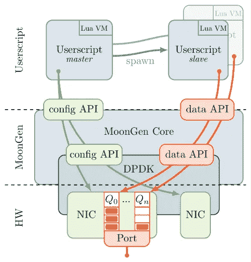
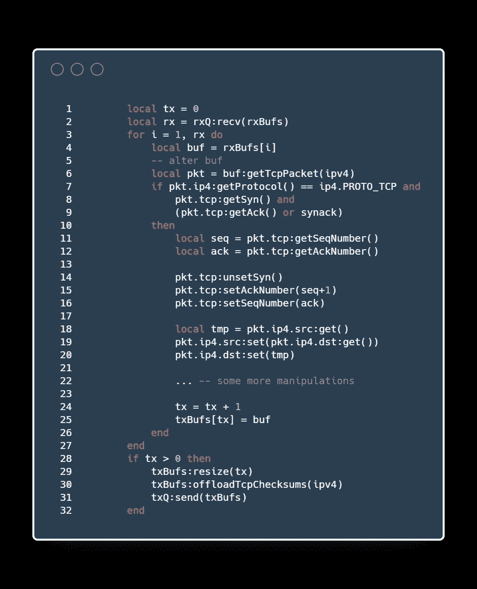
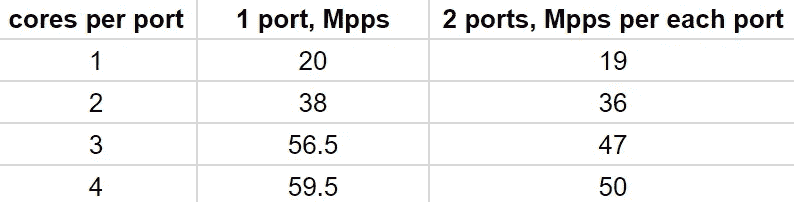
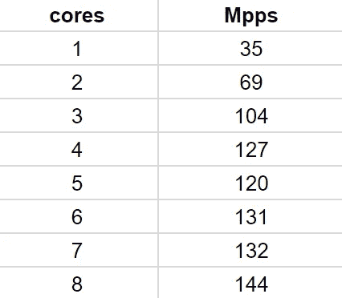
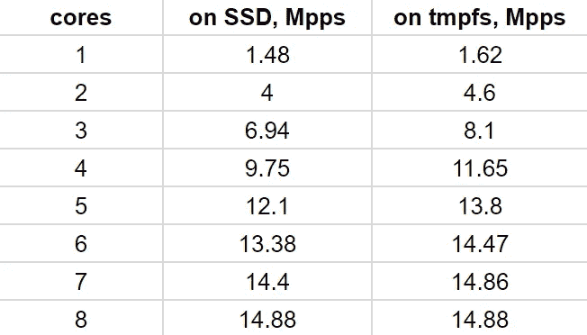
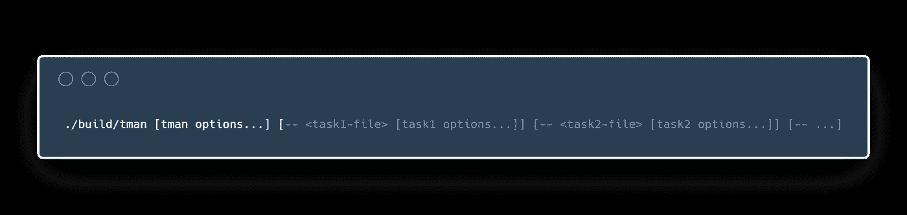

# 用户空间流量生成

> 原文：<https://medium.com/hackernoon/userspace-traffic-generation-fe32e2bd97da>

An artist’s concept showing MoonGen + DPDK + Lua traffic generation stack

在野外缓解 DDoS 攻击需要测试和学习各种技术。硬件和软件网络解决方案需要在接近真实生活的人工环境中进行测试，有大量的流量模拟攻击。没有这样的经验，人们永远不会认识到每个复杂工具所具有的特定能力和局限性。

在这篇文章中，我们将公开 Qrator 实验室中使用的某些流量生成方法。

**免责声明**

众所周知，我们建议所有读者不要尝试使用我们在这项研究中提到的工具。组织 DoS 攻击会受到法律迫害，并可能导致长期监禁。Qrator Labs 负责任地在隔离的实验室环境中进行所有测试。

# 最先进的，或者我们为什么要这样做

我们领域的挑战性问题是使 10G 以太网接口充满小数据包，即处理 14.88 Mpps(每秒数百万个数据包)。这里和下面只考虑最小的以太网分组，即 64 字节大小，因为我们对最大分组速率感兴趣。简单的计算表明，我们只有大约 67 纳秒来处理一个数据包。为了便于比较，这个值接近于在现代 CPU 上缓存未命中的情况下，从主内存中获取一段数据所需的时间。如果我们必须处理 40G 或 100G 以太网接口，试图使它们饱和，事情会变得复杂得多。

由于典型的数据平面从用户空间应用通过内核传递到网卡，因此提高网络性能的第一个直接的想法是直接在内核中实现数据包生成。这种解决方案的一个例子是 [pktgen](https://github.com/danieltt/pktgen) [ [2](http://netoptimizer.blogspot.com/2014/10/unlocked-10gbps-tx-wirespeed-smallest.html) ]内核模块。这种方式确实有助于提高性能，但不够灵活，而且内核源代码的任何更改都需要较长的实现-加载-测试循环，从而导致较低的生产率(即程序员花费的时间和精力)。

另一种方法是提供从用户空间到映射到 NIC 的缓冲区的直接访问。这种方式更复杂，但值得尝试实现更高的性能。缺点是较高的复杂性和较低的灵活性。例子有[网络地图](http://info.iet.unipi.it/~luigi/netmap/)、 [PF_RING](https://www.ntop.org/products/packet-capture/pf_ring/) 、 [DPDK](https://www.dpdk.org/) [ [4](https://www.dpdk.org/) 。

另一种实现高性能的合理但昂贵的方法是专用硬件，例如 [Ixia](https://www.ixiacom.com/) 。

也有基于 DPDK 和使用脚本的解决方案，因此在控制生成器的参数和改变运行时发出的包方面提供了一些灵活性。下面我们还将描述我们使用 MoonGen 工具的经验。

# 月神建筑

MoonGen architecture. A figure from the article [[1](https://www.net.in.tum.de/fileadmin/bibtex/publications/papers/MoonGen_IMC2015.pdf)].

MoonGen 的主要特点是:

1.DPDK 用户空间数据流处理，所有高性能都源于此；

2.Lua [ [5](https://www.lua.org/) ]栈，其顶部是用户友好的脚本，后端绑定到基于 C 的 DPDK

3.幸亏用 Lua 编写的 JIT 脚本运行得相当快，与人们通常对脚本语言的期望相反；

MoonGen 可以被视为 DPDK 库周围的 Lua 包装器。至少以下 DPDK 操作被暴露给用户 Lua 接口:

*   网卡配置；
*   内存池和缓冲区的分配和访问，内存池和缓冲区应连续分配并对齐，以最大限度地提高性能；
*   直接访问网卡 RSS 队列；
*   具有 NUMA [ [12](https://en.wikipedia.org/wiki/Non-uniform_memory_access) ]感知和 CPU 关联的线程控制 API。

## 月神

MoonGen 是一个基于 DPDK 的可脚本化的高速数据包生成器。Lua 脚本控制整个负载生成器:用户提供的脚本处理所有进一步发送的数据包。得益于令人难以置信的快速 LuaJIT VM 和数据包处理库 DPDK，它可以用 64 字节的数据包饱和 10 Gbps 以太网链路，同时只使用一个 CPU 内核。即使 Lua 脚本修改了每个包，MoonGen 也能达到这个速率。它不依赖于重放相同缓冲区的技巧。

MoonGen 还可以接收分组，例如，检查被测系统丢弃了哪些分组。由于接收也完全在用户的 Lua 脚本的控制之下，它可以用来实现高级测试脚本。例如，可以使用彼此建立连接的两个月原实例。这种设置可以用来对防火墙等中间设备进行基准测试。

MoonGen 专注于四个要点:

*   高性能和多核扩展:每个 CPU 内核每秒超过 2000 万个数据包
*   灵活性:每个包都是由用户提供的 Lua 脚本实时制作的
*   精确和准确的时间戳:在商用硬件上进行亚微秒精度的时间戳标记
*   精确的速率控制:在商用硬件上可靠地生成任意流量模式

## **DPDK**

DPDK 是一个数据平面开发套件，由多个库组成，用于加速在各种 CPU 架构上运行的数据包处理工作负载。

在网络日益成为人们通信方式的基础的今天，性能、吞吐量和延迟对于无线核心和接入、有线基础设施、路由器、负载平衡器、防火墙、视频流、VoIP 等应用越来越重要。

DPDK 是一种轻量级的、无处不在的构建测试和脚本的方式。用户空间数据流不是我们经常看到的，因为通常情况下，应用程序通过 OS 和内核堆栈与网络硬件通信，这与 DPDK 的操作方式相反。

## **卢阿**

一般来说，Lua 努力提供简单、灵活的元特性，可以根据需要进行扩展，而不是提供一个特定于一种编程范式的特性集。因此，基础语言是轻量级的——完整的参考解释器只有大约 [180 kB 编译的](https://www.lua.org/about.html#why)——并且容易适应广泛的应用。

Lua 是一种动态类型语言，旨在用作扩展或脚本语言，并且足够紧凑，适合各种主机平台。它只支持少量的原子数据结构，比如布尔值、数字(默认为双精度浮点)和字符串。数组、集合、列表和记录等典型的数据结构可以使用 Lua 的单一本地数据结构表来表示，这是一种异构的关联数组。

Lua 使用 JIT (just in time)编译，因此，作为一种脚本语言，它仍然具有与 C[[10](https://nullprogram.com/blog/2018/05/27/)等编译语言相当的性能。

# 为什么是月神

作为一家反 DDoS 公司，Qrator Labs 需要开发、更新和验证其防护解决方案。为了测试这些，需要一些模拟真实攻击的流量生成器。然而，在 OSI 的 L2、L3 层模仿危险但简单的洪水攻击并不容易，因为在流量生成方面实现高性能可能很棘手。

换句话说，DDoS 缓解公司在隔离的实验室环境中模拟各种 DoS 攻击来了解不同硬件设置的真实行为是很自然的。

MoonGen 是一种用最少的 CPU 内核生成网卡线速流量的方法。与生成大量流量的许多其他方式相比，用户空间数据流极大地提高了这种(MoonGen + DPDK)栈的性能。使用纯 DPDK 需要更多的努力，所以人们不应该对我们的工作流优化工作感到惊讶。为了扩展它的功能和实现一些特定的测试，我们还维护了一个原始 MoonGen 库的克隆。

为了实现最大的灵活性，包生成逻辑由用户定义的 Lua 脚本描述，这是 MoonGen 的主要特性之一。在相对简单的数据包处理的情况下，这种解决方案看起来工作得足够快，足以让单个 CPU 内核的 10G 接口饱和。一种典型的处理输入包和制作新包的方法是处理相同类型的包，并改变它们的一些字段。

考虑 l3-tcp-syn-ack-flood 示例，如下所述。注意，在它的所有活动中，任何操纵分组的操作都可以在相同的缓冲器中执行，在该缓冲器中存在传入的或先前生成的分组。实际上，这种操作非常快，因为它们不需要像系统调用、访问潜在的未缓存内存等昂贵的操作。

# Qrator 实验室硬件测试

## 硬件设置

Qrator Labs 维护着一个配有各种硬件的实验室。这里有一些正在使用和测试的 NIC 示例:

*   英特尔 82599ES 10G
*   mellan ox ConnectX-4 40 克
*   mellan ox ConnectX-5 100 克

注意，当我们处理 10G 以上的网络接口控制器时，性能问题变得更加紧迫。如今，让一个 CPU 内核饱和 40G 接口似乎是不可能的，尽管几个内核就足以做到这一点。

对于 Mellanox 网卡，用户可以使用制造商的调整指南[ [3](http://www.mellanox.com/related-docs/prod_software/Performance_Tuning_Guide_for_Mellanox_Network_Adapters.pdf) ]来调整设备的某些设置，以实现更高的性能，或者在某些情况下根据需要改变网卡的行为。其他网卡制造商为高性能设备提供了类似的文档，即使您找不到，也可以直接联系该公司。在我们的案例中，Mellanox 回答得很快，帮助我们在需要的任务中实现了 100%的带宽利用率。

## TCP SYN 泛洪测试

l3-tcp-syn-ack-flood 示例旨在模拟 SYN flood 攻击[ [6](https://en.wikipedia.org/wiki/SYN_flood) ]。它是来自 MoonGen central repository 的 l3-tcp-syn-flood 的扩展版本，由 Qrator Labs 在克隆存储库中开发[7]。我们的测试可以执行三种活动:

1.  从头开始生成 TCP SYN 数据包流，改变一些字段，例如，源 IP 地址、源端口号等。；
2.  根据 TCP 协议为每个接收到的 SYN 数据包创建一个有效的 ACK 回复；
3.  根据 TCP 协议为每个收到的 ACK 数据包创建一个有效的 SYN-ACK 回复。

例如，制作 ACK 回复的内循环样板代码如下所示:

[https://github.com/QratorLabs/MoonGen/blob/master/examples/l3-tcp-syn-ack-flood.lua#L99](https://github.com/QratorLabs/MoonGen/blob/master/examples/l3-tcp-syn-ack-flood.lua#L99)

一般来说，写回信的想法如下。首先，从 RX 队列中提取一个包，然后检查收到的包是否是预期的类型。如果是，通过修改原始数据包的某些字段来准备答案。最后，重用同一个缓冲区，将伪造的数据包放入 TX 队列。为了提高性能，我们从 RX 队列中抓取所有可用的数据包，制作相应的答案并将其放入 TX 队列，而不是一个接一个地处理数据包。尽管单个包的操作数量相对较高，但性能仍然足够，因为 Lua JIT 将所有这些操作编译成几条 CPU 指令。许多其他测试，不仅仅是 TCP SYN/ACK，都是以同样的方式实现的。

下表显示了在 Mellanox ConnectX-4 上运行的 SYN 泛洪测试(仅生成 SYN 而不回复)的结果。该网卡有两个 40G 端口，其理论峰值性能为单端口 59.52 Mpps，两个端口 2 * 50 Mpps。与 PCIe 的特定 NIC 连接导致后一种带宽限制(只有 2 * 50，而不是预期的 2 * 59.52)。

**SYN flood** test; NIC: Mellanox Technologies MT27700 Family (**ConnectX-4**), dual 40G port; CPU: Intel(R) Xeon(R) Silver 4114 CPU @ 2.20GHz

下表显示了在只有一个 100G 端口的 Mellanox ConnectX-5 上进行的相同 SYN flood 测试的结果。

**SYN flood** test; NIC: Mellanox Technologies MT27800 Family (**ConnectX-5**), single 100G port; CPU: Intel(R) Xeon(R) Silver 4114 CPU @ 2.20GHz

请注意，在所有这些情况下，96%以上的理论峰值性能都是通过几个 CPU 内核实现的。

## 在 PCAP 文件中捕获传入流量

另一个例子是 rx-to-pcap，它试图将所有传入的流量保存到多个 pcap 文件[ [8](https://en.wikipedia.org/wiki/Pcap) ]中。虽然这个测试不是关于包的生成，但是它可以证明这样一个事实，即这种数据流中最薄弱的环节是文件系统:即使是虚拟的 tmpfs 文件系统也会降低数据流的速度。在这种情况下，需要 8 个 CPU 内核来利用 14.88 Mpps，而单个内核就足以接收(并丢弃或重定向)相同数量的流量。

下表显示了 PCAP 文件中接收和保存的流量(Mpps ),这些文件驻留在固态硬盘上的 ext2 文件系统(第二列)或 tmpfs 文件系统(第三列)中。

**Rx-to-pcap capture** test; NIC: **Intel 82599ES 10-Gigabit**; CPU: Intel(R) Xeon(R) CPU E5–2683 v4 @ 2.10GHz

# 月神强化:任务管理器

我们还引入了 MoonGen 的扩展，代表了启动一组任务的另一种方式。其思想是将一般配置和特定于任务的选项分开，以同时运行任意数量的各种任务(即 Lua 脚本)。该实现在 Qrator 的存储库克隆中公开，并在那里进行了描述[ [9](https://github.com/QratorLabs/MoonGen#using-tman-task-manager) ]，让我们重述一下。

较新的 CLI 界面允许同时启动许多不同的任务。这是概要:

还有。/build/tman -h 提供了更多增强的帮助。

然而，普通的任务 Lua 文件与 *tman* 接口不兼容。用于 *tman* 的任务文件必须确定以下对象:

*   描述任务选项的函数配置(解析器)。
*   描述正在运行的功能任务(taskNum，txInfo，rxInfo，args)。这里 txInfo 和 rxInfo 分别是 RX 和 TX 队列的数组，args 保存任务管理器和任务本身的参数。

参见 examples/tman/中的示例。

使用任务管理器可以更灵活地运行异构任务。

# 结论

MoonGen 方法似乎很符合我们的目标，因为它提供了高性能，同时还保持了用脚本语言编写的测试的简单性。性能的提高主要归功于两个特性:直接 NIC 缓冲区访问和 Lua 中的 JIT 技术。

通常有可能达到网卡的理论峰值性能。单个内核可能足以使 10G 端口饱和，而几个内核可能足以使 100G 端口饱和。

我们感谢 Mellanox 团队的合作和 MoonGen 团队在修复错误方面的反应。

# 参考

1.  MoonGen:一个可脚本化的高速包生成器—保罗·埃梅里希等，互联网测量大会 2015 (IMC'15)，2015
    [https://www . net . in . tum . de/file admin/bibtex/publications/papers/MoonGen _ IMC 2015 . pdf](https://www.net.in.tum.de/fileadmin/bibtex/publications/papers/MoonGen_IMC2015.pdf)
2.  pktgen[http://net optimizer . blogspot . com/2014/10/unlocked-10g bps-tx-wirespeed-small . html](http://netoptimizer.blogspot.com/2014/10/unlocked-10gbps-tx-wirespeed-smallest.html)
3.  Mellanox 调优指南:[http://www . mellan ox . com/related-docs/prod _ software/Performance _ Tuning _ Guide _ for _ mellan ox _ Network _ adapters . pdf](http://www.mellanox.com/related-docs/prod_software/Performance_Tuning_Guide_for_Mellanox_Network_Adapters.pdf)
4.  数据平面开发套件:【https://www.dpdk.org/】T4，
5.  卢亚:[https://www.lua.org/](https://www.lua.org/)
6.  合成洪水:[https://en.wikipedia.org/wiki/SYN_flood](https://en.wikipedia.org/wiki/SYN_flood)
7.  Qrator 实验室的月神库克隆:[https://github.com/QratorLabs/MoonGen](https://github.com/QratorLabs/MoonGen)
8.  https://en.wikipedia.org/wiki/Pcap PCAP 文件格式:
9.  任务管理器:[https://github . com/QratorLabs/MoonGen # using-tman-task-manager](https://github.com/QratorLabs/MoonGen#using-tman-task-manager)
10.  卢阿表演:[https://nullprogram.com/blog/2018/05/27/](https://nullprogram.com/blog/2018/05/27/)
11.  网络功能虚拟化白皮书:[https://portal.etsi.org/NFV/NFV_White_Paper.pdf](https://portal.etsi.org/NFV/NFV_White_Paper.pdf)
12.  非均匀内存访问:[https://en.wikipedia.org/wiki/Non-uniform_memory_access](https://en.wikipedia.org/wiki/Non-uniform_memory_access)