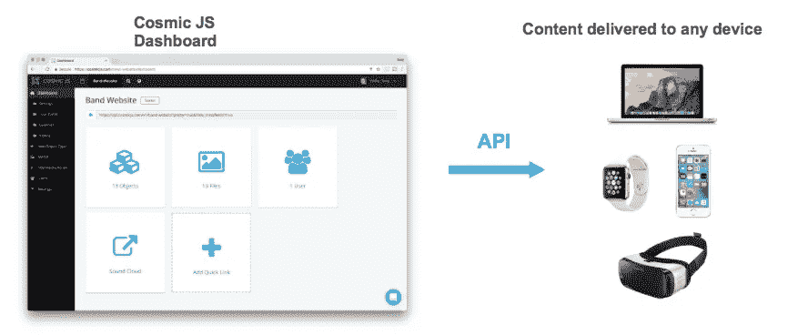
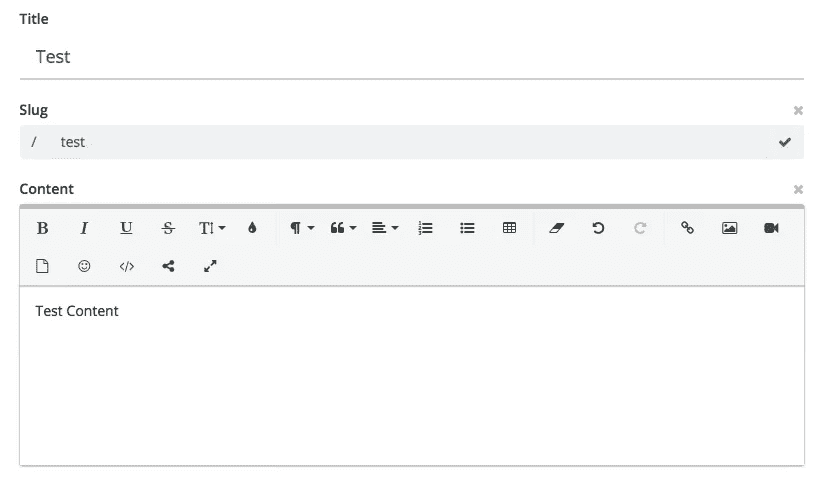

# 使用内容建模应用编程接口

> 原文：<https://medium.com/hackernoon/using-a-content-modeling-api-c9334c900652>


[内容建模应用编程接口](https://cosmicjs.com/cms-api)不仅有助于内容发布的速度和便利性，还能保持整个应用程序的完整性。在我的 Hackernoon 文章 [*解耦 CMS 架构的好处*](https://hackernoon.com/benefits-of-a-decoupled-cms-architecture-6bc77b06961e) 中，我写道，“早期的解耦系统仍然假设开发人员在 PHP 中工作，这仅仅解决了一半的问题，因为新的现代框架和语言进一步在应用程序中推广了轻量级的交互式触摸点。”

[宇宙 JS](https://cosmicjs.com) 是一个无头内容管理系统，它将内容与代码分离开来。 [CMS API](https://cosmicjs.com/cms-api) 可以插入任何互联网连接的应用程序，无论编程语言如何，所以你可以使用你喜欢的工具更快地构建应用程序。


## 宇宙 JS 内容建模 API:

[Cosmic JS](https://cosmicjs.com) 是一个包含 web Dashboard 和 API 的托管服务。它不依赖于你的应用层，也不依赖于你安装和维护的任何编程语言，比如 CMS。只需连接到内容应用编程接口，并以您选择的语言构建您的应用程序。通过阅读[文档](https://cosmicjs.com/docs)开始。



## 思考宇宙 JS 结构的一个基本方法是:

```
Bucket: Your website
Object Type: The blog posts on your website
Object: A blog post
Metafield: A picture on your blog post
Metafield: The author of your blog post
```

## 桶:

桶是宇宙 JS 内容结构中的主要部分。它非常灵活，可以为整个网站或网站的一部分提供内容。由于您的 Bucket 内容是通过 API 端点提供的，因此您的 Bucket 还可以为任何应用程序提供内容，包括 iOS、Android、tvOS、Apple Watch、IOT、AR/VR 或您希望分发内容的任何其他方式。

## 对象:

一个对象可以是一个页面，一篇博客文章，或者任何你想要的东西。宇宙 JS 让您可以自由地公开创建和管理内容，并创建您自己的数据结构。每个对象允许创建标题、段、内容和元字段。

## 对象标题:

```
{ 
  "title": "My Page Title"
}
```

## 对象段塞:

```
{ 
  "title": "My Page Title",
  "slug": "my-page-title"
}
```

## 对象内容:

向对象添加内容。您可以上传媒体，添加格式化文本和编辑器中的其他富文本选项。这将作为 HTML 从您的 API 端点在`content`属性中获得。

```
{ 
  "title": "My Page Title",
  "slug": "my-page-title",
  "content": "My object content with **HTML** sprinkled in."
}
```

## 图元字段:

元字段是非常强大的自定义数据，可以添加到可以递归嵌套的对象中。您创建的元字段在 API 端点中被转换为键/值元数据。

元字段选项包括文本、文本区域、HTML 文本区域、文件/图像、重复项等等。您的对象的元字段将在您的 API 端点中作为键/值从`metadata`属性中获得。

```
{ 
  "title": "My Page Title",
  "slug": "my-page-title",
  "content": "My object content with HTML sprinkled in.",
  "metadata": {
    "headline": "Welcome to My Website!"
  }
}
```

当然，所有这些都可以通过 Cosmic JS 仪表板轻松导航。

## 宇宙 JS 仪表板:

一个无缝且熟悉的云 WYSIWYG 编辑器让非技术编辑人员可以使用与编程语言无关的 API 来管理和部署内容。



```
{
  "object": {
    "_id": "5a673d6e7ce26a7a749769df",
    "slug": "test",
    "title": "Test",
    "content": "<p>Test Content&nbsp;</p>",
    "bucket": "571e7832e4ff45700e000023",
    "type_slug": "tests",
    "created_at": "2018-01-23T13:49:34.306Z",
    "created_by": "5716b504e9c686d006000073",
    "created": "2018-01-23T13:49:34.306Z",
    "status": "draft",
    "object_id": "5a673d6e7ce26a7a749769df",
    "metadata": null
  }
}
```

## 结论🚀：

[Cosmic JS](https://cosmicjs.com) 提供了一个直观的 API，可以向任何网站或应用程序提供内容。这使您可以自由地使用任何编程语言来构建应用程序，并允许在您的开发团队中更容易地扩展。 [Cosmic JS](https://cosmicjs.com) 内容建模 API 使得管理内容、拖放媒体和建立内容关系变得容易。提供灵活的用户角色和权限，因此团队成员只能看到他们完成工作所需的内容。

如果您有任何问题或意见，请随时联系我:[carson@cosmicjs.com](mailto:carson@cosmicjs.com)